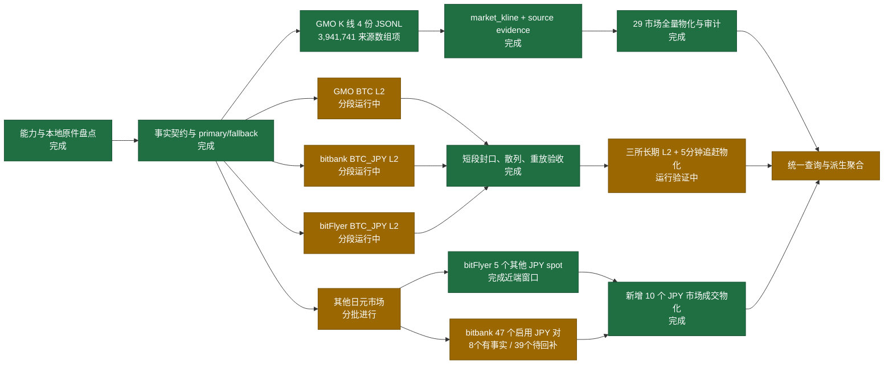

# 三所实时 L2、GMO K 线与日元市场扩展实施册

> 状态时点：2026-08-11（Asia/Tokyo）。本册是当前实施状态、验收口径与来源职责的唯一进度图；代码完成、短样本通过、历史物化完成和长期连续运行是四种不同状态。

## 1. 当前结论

- 不设“唯一最佳交易所”。主数据按 `market_id + domain` 选择：同所原生事实为 primary，其他交易所只能是 validator 或派生参考，不能替填本所缺口。
- GMO 是日元现货覆盖主轴：已有 27 个现货市场官方逐日成交，且公开 K 线覆盖 29 个当前现货/杠杆符号；实时盘口是无序号快照。
- bitbank 是可验证实时 L2 主轴：`depth_whole` 与 `depth_diff` 共享单调但不连续的 sequence，官方还明确给出本地簿重建顺序；长期逐日成交目前只闭环 BTC/ETH/XRP。
- bitFlyer 不是整体更优：它有 snapshot + diff 的公开盘口和 BTC/JPY、Crypto CFD 等独立市场票，但公开成交 `before` 只能回扫近 31 天，且官方明确断连期间数据不可追溯。
- 跨所聚合只在各自市场先完成 PIT、安全性与健康过滤后生成派生指标；不把不同撮合池的价位动作、成交 ID 或 K 线混成一张原生事实表。
- 2026-08-11 17:24 JST 起，GMO BTC、bitbank btc_jpy、bitFlyer BTC_JPY 三条 5 分钟分段 L2 正在长期运行；独立物化窗口每 300 秒追赶 sealed segment。当前是 `running_validation`，尚未达到 24 小时/7 天的 `continuous` 声明门槛。
- GMO K 线已全量物化；bitFlyer 六个 JPY spot 与一个 JPY leverage 市场均已有近端成交，bitbank 已有 3 个长历史 JPY 对和 5 个近 30 日 JPY 对。其余 39 个 bitbank JPY 对只有维度/精度证据，尚无成交事实。

## 2. 实施进度图



每次实现状态变化必须同时更新本图和第 9 节验收表；不能只改文字中的“已完成”。

## 3. 主数据、校验票与 fallback

| 数据域 | Primary | Validator | Fallback 的严格含义 | 禁止替代 |
|---|---|---|---|---|
| GMO 某现货逐笔 | GMO 官方逐日成交归档 | 同时窗 bitbank/bitFlyer 价格、量级与异常方向 | 重下同一 GMO 日文件或保留 `missing` | 用其他交易所成交补成 GMO 成交 |
| bitbank 某市场逐笔 | bitbank `transactions/{YYYYMMDD}` | 同币种 GMO/bitFlyer 同时窗 | 重取同一 bitbank 日端点；404 明示缺失 | 跨所填洞、把 K 线拆成逐笔 |
| bitFlyer 某市场逐笔 | bitFlyer `/v1/executions` | GMO/bitbank 同时窗 | 31 日内续游标；边界外标记不可回补 | 把第三方成交伪装成 bitFlyer |
| GMO K 线 | GMO `/v1/klines` 原生根 | 同 GMO 逐笔派生 OHLCV | 原生根缺失时可另产 `derived_kline`，但不能写回原生 origin | 跨所 K 线、未收束根冒充完成根 |
| bitbank L2 | whole 为锚、diff 为变更 | REST depth 仅作当前重锚/抽查 | 断连后等下一 whole 重建可信状态 | 用 REST 快照填造断连期间 diff |
| bitFlyer L2 | board_snapshot 为锚、board 为变更 | REST board 仅作当前抽查 | 重连后重订阅 snapshot；断连窗标记不可信 | 伪造序号或补写断连事件 |
| GMO L2 | 每帧 30 档 snapshot | REST orderbooks 抽查 | 新快照恢复“当前可用”，不恢复过去 | 宣称订单级 L3、增量序列或历史回补 |
| 跨所稳健参考 | 健康市场各自先算 mid/VWAP，再取中位数 | 覆盖率、离散度与 stale 标记 | 仅在派生数据集中降级到剩余健康票 | 合并原始订单簿或共享 venue_trade_id |

“更专业”的来源不是品牌排序，而是满足：官方原件、来源自然键、事件/可用时间、可重放边界、完整性证据、可回补范围与本地闭环。bitbank 在实时簿完整性证明上最强；GMO 在日元现货历史覆盖和原生 K 线上最强；bitFlyer 是重要独立验证票和 CFD 市场来源，不是总主库。

## 4. 实时分段事实契约

原文路径固定为：

```text
data/raw/realtime/book_l2/
  venue_id=<venue>/venue_symbol=<symbol>/run_id=<run>/
    segment-000001.jsonl
    segment-000001.manifest.json
    run.manifest.json
```

`.open` 文件只代表运行中片段；只有完成 fsync、重命名并生成逐文件 SHA-256 manifest 后才是 sealed artifact。一个 run 可含多个 segment，一个 segment 只含一个 `venue_id + venue_symbol + domain`，因此不会用路径猜市场身份。

| 归一数据集 | 粒度与主键 | 必需语义 |
|---|---|---|
| `book_l2_frame` | 一个来源盘口帧；`frame_id` 由 venue、market、artifact、source row 确定 | snapshot/delta、event/available/ingest time、sequence/checksum、完整性方式、健康窗口 |
| `book_l2_level` | 帧内一侧一个价格动作；`frame_id + side + source_level_index` | price、size、`set/delete`；snapshot 不是订单级事件 |
| `stream_health_window` | run/segment/market 的连续窗口 | frames、control frames、reconnects、sequence regressions、是否已有锚快照、可信起止 |

三所保真差异必须保留：GMO=`snapshot_no_sequence`；bitbank=`snapshot_plus_monotonic_delta`；bitFlyer=`snapshot_plus_unsequenced_delta`。统一列不等于统一完整性等级。

## 5. GMO K 线构造

本地四份封口 `klines.jsonl` 共 15,098 个请求行、3,941,741 个成功数组项。自然键去重后为 3,781,423 根；其中 159,957 个是完全相同的重复观察，361 个是同一自然根的不同 OHLCV 状态。因此不能直接复制旧 SQLite 当前值，也不能简单 `INSERT OR IGNORE`。

| 数据集 | 粒度 | 用途 |
|---|---|---|
| `market_kline` | `market_id + interval + open_time + origin + value_revision + normalization_version` | 保存每种不同 OHLCV 状态；`value_revision` 为内容散列，避免以后补入旧证据导致整数 revision 重排 |
| `fact_source_evidence` | `artifact_id + source_line_index + source_item_index` | 把全部重复观察映射到对应 K 线事实，保证来源数组项逐项可追溯 |
| `market_kline_current` | 查询视图，不复制原件 | 每自然根选择最新已收束修订；决策时再加 `closed_available_time <= decision_time` |

`available_time` 表示该观察首次落盘可见时间；`close_time` 是周期理论收束时刻；`closed_available_time` 是第一次在收束后观察到该值的时间。尚未收束的值可以作为 provisional observation 保留，但绝不能进入默认完成根查询。

全量结果是 29 个 market、3,781,784 个不同值状态、3,941,741 条逐项 evidence；361 个同自然根真实修订和 460 个 provisional 状态均保留。全量运行耗时 94.6 秒；审计确认 evidence 一项不漏、事实键/PIT/版本绑定无错误。

## 6. API 来源身份与目的

| 来源身份 | 原始格式 | 本地身份边界 | 主要目的 | 当前限制 |
|---|---|---|---|---|
| GMO `trades/archive` | 每日 gzip CSV | 文件 SHA + CSV 行 | 27 个日元现货逐笔历史 primary | 官方无历史盘口 |
| GMO `/v1/klines` | REST JSON；`data[]` | JSONL 文件 SHA + 请求行 + 数组项 | 29 个现货/杠杆市场原生 K 线 | 当前根可能未收束；同根会修订 |
| GMO `orderbooks` WS | JSON snapshot | run + sealed segment SHA + 帧行 | 当前 30 档快照研究 | 无 sequence/checksum，不是订单级事件 |
| GMO `/v1/orderbooks` | REST JSON snapshot | 请求包络制品 | WS 当前簿抽查/重锚 | 不能补历史窗口 |
| bitbank `transactions/{day}` | REST JSON，gzip 原样封装 | 日文件 SHA + transaction id | 可回补逐笔 primary | 目前仅 3 对完成；个别日期 404 |
| bitbank `depth_whole` | Socket.IO JSON whole | run/segment/frame + sequenceId | 本地 L2 锚快照 | 约 200 档，板寄时可跨价 |
| bitbank `depth_diff` | Socket.IO JSON diff | run/segment/frame + s | 绝对数量 set/delete，按官方规则重放 | sequence 单调但不要求连续；需 whole 刷新 |
| bitFlyer `/v1/executions` | REST JSON array | 日 gzip member + execution id | 现货/CFD 近端逐笔 primary | `before` 近 31 天边界 |
| bitFlyer board snapshot | JSON-RPC `channelMessage` | run/segment/frame | 无序号 L2 锚 | 频率受限、数组不保证排序 |
| bitFlyer board diff | JSON-RPC `channelMessage` | run/segment/frame | 价格级 set/delete | 无 sequence；断连窗口不可追溯 |
| bitbank `/spot/pairs` | REST JSON dimension | 文件 SHA + pair 项 | 47 个启用 JPY 对的精度、状态和接入计划 | 上市起点需逐对实测 |
| bitFlyer `/v1/markets` | REST JSON dimension | 文件 SHA + market 项 | 当前产品枚举与 spot/FX 身份 | JP 实测仅 9 产品、5 个额外 JPY spot 候选 |
| Binance 官方公共归档 | ZIP + CHECKSUM | ZIP SHA/官方 checksum + CSV 行 | 全球 BTC/USDT 校验票 | 当前仅一天 aggTrades，非逐笔 |
| Coincheck 公共 WS | JSON frames | run/原始帧 | 日元旁路探针 | 样本极小、无序号，未形成历史闭环 |
| Kraken 官方 REST/WS | JSON/增量簿 | 尚无本地 artifact | 全球现货成交游标与 CRC32 L2 候选 | `documented`；OHLC 近端根限制，未接入 |
| Coinbase Exchange REST/WS | JSON、L2/L3 channel | 尚无本地 artifact | 全球现货独立验证与 L3 候选 | `documented`；maker-side 语义需显式转换 |
| OKX 公共/历史行情 | JSON/下载文件 | 尚无本地 artifact | 全球现货/衍生 L2 历史候选 | `documented`；历史文件保真和权限待实测 |
| Bybit 公共/历史行情 | JSON/下载文件 | 尚无本地 artifact | 多产品成交、K线、深度候选 | `documented`；覆盖和深度尚未本地验证 |
| Hyperliquid 公共 WS | JSON L2/candle/funding | 尚无本地 artifact | 链上永续与资金费率候选 | `documented`；不是 JPY spot fallback |

官方依据：GMO 公共 API 与 snapshot 定义见 <https://api.coin.z.com/docs/en/>；bitbank whole/diff 与本地簿算法见 <https://github.com/bitbankinc/bitbank-api-docs/blob/master/public-stream.md>；bitFlyer 实时端点与断连限制见 <https://bf-lightning-api.readme.io/docs/realtime-api>，snapshot/diff 频道分别见 <https://bf-lightning-api.readme.io/docs/realtime-board-snapshot> 与 <https://bf-lightning-api.readme.io/docs/realtime-board>；31 日执行历史边界见 <https://lightning.bitflyer.com/docs?lang=en>。

## 7. 其他日元市场接入顺序

1. bitFlyer：先 ETH_JPY、XRP_JPY 各做一个短 L2 段和 31 日逐笔窗口，再扩 XLM_JPY、MONA_JPY、ELF_JPY。BTC_JPY 与 FX_BTC_JPY 保持不同 `instrument.kind`，不混成一条价格史。
2. bitbank：从本地 `/spot/pairs` 原件登记 47 个启用 JPY 对；先复用三所交集的 SOL、DOT、DOGE、LTC、XLM，再逐对二分探测最早日。`BCC/BCH`、`MATIC/POL`、`RNDR/RENDER` 先保留来源资产身份，只有单独的资产迁移/别名证据才能跨符号串联。
3. GMO：现货 27 市场成交已经物化；本批优先把 29 个 K 线 market 物化，不扩大杠杆逐笔声明。
4. Coincheck：先保留为日元实时验证票；在成交分页、序号与回补边界实测前不升级为 primary。

截至本次实施，步骤 1 已完成全部五个其他 JPY spot 的近端成交；步骤 2 已完成 SOL/DOT/DOGE/LTC/XLM 最近 30 日，因而 bitbank 的 47 个 JPY 对中 8 个有事实、39 个仍待按上市起点分批回补。不能把“映射已登记”写成“数据已覆盖”。

## 8. 物化后的归一构造

| 层/数据集 | 归一粒度与身份 | 来源身份如何保留 | 目的 | 当前规模 |
|---|---|---|---|---:|
| `venue/instrument/market/instrument_map` | 供应方、经济品种、来源市场、映射修订 | `market_id` 永远含 venue namespace；spot/leverage 分离 | 串联所有事实但允许事实正确留空 | 10 venue、67 instrument、97 market/map |
| `artifact/artifact_location` | 内容 SHA-256 与物理位置分离 | `artifact_id=sha256-*`；同内容可有多个 location | 去路径歧义、散列重放、去重 | 56,715 内容、56,849 位置（本次结束时点） |
| `trade_observation` | 一次来源 match/aggregate observation | market + artifact + source row + normalization version | 原生成交研究 | 43 market、1,796 月、258,488,895 行 |
| `market_kline` | market + interval + open time + origin + value revision + version | 值散列修订，不丢重复/冲突来源观察 | 原生完成根与修订研究 | 29 market、3,781,784 状态 |
| `fact_source_evidence` | artifact + JSONL line + `data[]` item | 每个请求数组项绑定一个 K 线事实 | 逐项可证明、可重放 | 3,941,741 行 |
| `book_l2_frame` | 一个来源快照/差分帧 | run + segment artifact + source row；完整性模式不抹平 | PIT 帧、锚、序号、重连分析 | 21 segment、10,396 帧 |
| `book_l2_level` | frame + side + source level index | 保留 set/delete、价格、数量与来源档序 | 本地簿重放/深度特征 | 352,423 档位动作 |
| coverage/attempt/input/binding/output/reject/ignore | 一次覆盖或物化尝试及其证据 | 能力修订、输入集散列、输出 artifact、异常原因 | 断点、审计、活动 head 切换 | 事实不直接塞进 SQLite |
| 派生聚合（下一步） | method version + source market IDs + source attempts +共同窗口 | 单列覆盖率/stale/degraded/FX conversion artifact | 中位价、跨所 VWAP、NBBO-like 参考 | 不覆盖任何原生事实 |

SQLite 继续作为小型控制面与活动目录；大事实全部是 Parquet，DuckDB 只做单次构建/只读分析。`market_id` 解决“哪一个撮合池”，`artifact_id` 解决“哪份原件”，`normalization_version` 解决“按哪套规则解释”，三者缺一不可。

## 9. 验收状态

| 工作项 | 代码 | 短段/小分区 | 全量或长期 | 当前判定 |
|---|---|---|---|---|
| 三所 run-scoped L2 分段 | 已完成 | 21 个 segment 精准审计通过 | 三条 run + 单写物化器运行中 | `running_validation`；10,396 帧/352,423 档/0 reject |
| GMO `market_kline` | 已完成 | 冲突/重复/provisional 精准测试通过 | 29 市场全量完成 | `materialized`；3,781,784 事实 + 3,941,741 evidence |
| bitFlyer 其他 JPY 市场 | 已完成 | ETH/XRP/XLM/MONA/ELF 均通过 | 172,427 来源项、172,396 事实、31 reject | `materialized`；空 side 只进 reject |
| bitbank 其他 44 个 JPY 对 | 通用采集与映射完成 | 5 个交集币最近 30 日通过 | 5 完成、39 待起点/回补 | `partial`；不能外推为 47 对全量 |
| 逐笔 P2 全活动集 | 已完成 | 全库审计通过 | 1,796 活动月、258,488,895 行 | `materialized`；另有 3 个官方 404 阻断月 |

验收至少检查：逐文件 SHA、source=fact evidence+reject、键唯一、market/map/capability 外键、`available_time >= event_time`、snapshot 锚存在、序号回退、重连窗口、活动 head 唯一与 Parquet 可读。只增加与契约直接相关的精准测试。

最终全库成交审计检查 56,813 个位置、1,804 个完成输出、259,842,469 行，0 warning、0 error；随后新增的长期 L2 segment 由独立 L2 审计覆盖。C 盘结束检查剩余 124.71 GiB；三所 15 秒样本折算 raw 约 1.4 GiB/日，实际容量规划按 raw + Parquet 约 2–3 GiB/日并设置 30 日热层预算更稳妥。

L2 数字冻结于 2026-08-11 17:49 JST；三条 run 当时各 sealed 4 个长期段、session 1、reconnect 0，checkpoint 均在一分钟内。任务未停止，因此目录实时值会继续大于本表。
