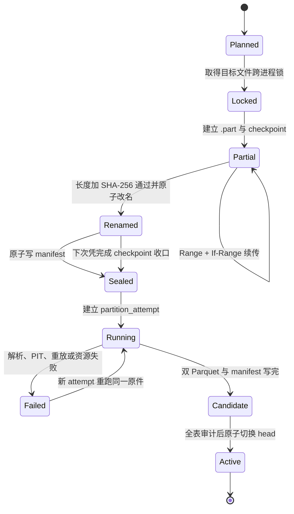
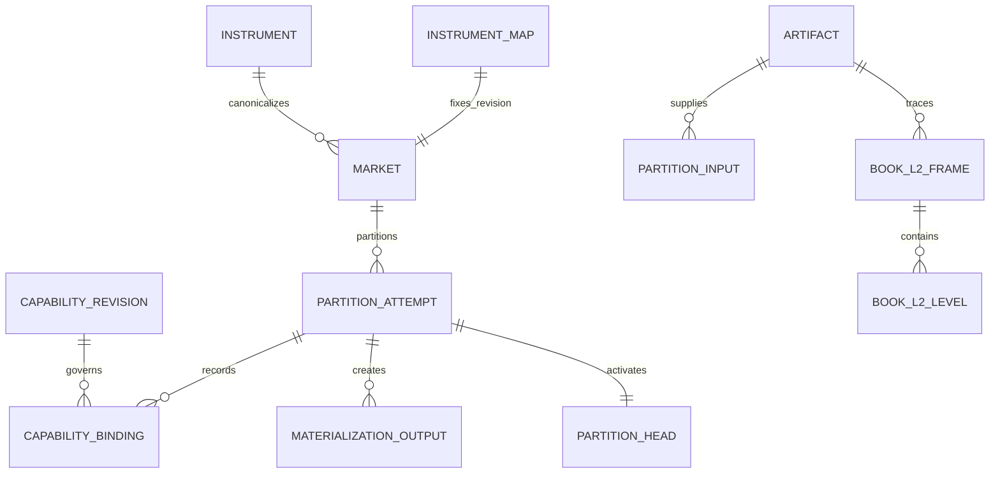
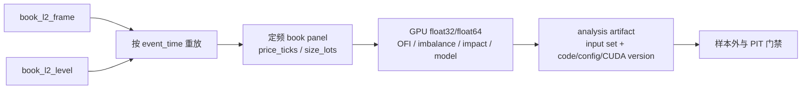

# OKX 历史 L2 小样本闭环验证

> 文档类别：时效快照，验证时刻 2026-08-11。长期契约见
> [materialization-design.md](materialization-design.md)，现行能力结论见
> [venue-capability-matrix.md](venue-capability-matrix.md)。

## 1. 结论

OKX `BTC-USDT` 现货 2026-08-07 的官方 400 档日档已完成计划、断点下载、
原件封口、全量重放、双表 Parquet 物化和活动头审计。本次样本可确定性重放，
但原件不含 `seqId`、`prevSeqId` 或逐帧 checksum，故完整性只能表述为
“归档 SHA-256 加严格时间递增加十五分钟周期快照”，不能表述为逐增量无缺口。

Bybit 历史 L2 的旧声明同期降为 `unverified/blocked`。当前官方公开目录未见
orderbook 根目录，得到真实文件 URL 和样本前不得安排其盘口回补。

## 2. 数据集与粒度

| 层 | 粒度 | 本次身份 |
|---|---|---|
| 原件 | 一个市场的一个 UTC 日 400 档归档 | `sha256-1181ddbe...10b013` |
| `book_l2_frame` | 原件一行，即一个 snapshot 或 update | 3,684,422 行 |
| `book_l2_level` | 帧内一个发生变化的价位 | 20,138,604 行 |
| 活动分区 | `market_id + domain + UTC day` | `mkt__okx__btc_usdt__r0 / book_l2 / 2026-08-07` |

物理位置均在项目数据根 `data/` 下：

```text
raw/archive/okx/book_l2/venue_symbol=BTC-USDT/day=2026-08-07/
  BTC-USDT-L2orderbook-400lv-2026-08-07.tar.gz
  BTC-USDT-L2orderbook-400lv-2026-08-07.tar.gz.manifest.json
  evidence/download-plan-9e1d9a44f431b9a5.json
  evidence/instrument-322fbe759fa034ea.json

materialized/book_l2/schema_version=2/
  normalization_version=book-l2-normalization-v2/
  venue_id=okx/market_id=mkt__okx__btc_usdt__r0/
  event_day=2026-08-07/
    part-21d37076f66c.parquet
    part-f076e4795a76.parquet
    manifest-okx-l2-ad4227c745b349a6a3e470b3805eb804.json
```

## 3. 返回格式与归一映射

归档为一个 `.tar.gz`，内部只有一个 799,328,865 字节的 `.data` 成员；成员
每行是 JSON。首行和之后每十五分钟左右的重锚行为：

```json
{"instId":"BTC-USDT","action":"snapshot","ts":"1786060800000","asks":[["64326.7","1.87854175","12"]],"bids":[["64325.1","0.5","3"]]}
```

其他行为绝对数量更新：

```json
{"instId":"BTC-USDT","action":"update","ts":"1786060800010","asks":[["64331.8","0","0"]],"bids":[["64313.7","0.33769851","3"]]}
```

| 原字段 | 事实字段或动作 | 规则 |
|---|---|---|
| `instId` | `venue_symbol`、`market_id` | 必须与 manifest 和映射修订一致 |
| `action=snapshot` | `message_kind=snapshot` | 清空当前簿后装入，双侧都必须为声明的 400 档 |
| `action=update` | `message_kind=delta` | 不是数量增量；按绝对数量更新当前价位 |
| `ts` | `event_time`、`source_publish_time` | 明确按毫秒解释，UTC 存储，不按数量级猜测 |
| `[0]` | `price` | 十进制文本，必须大于零 |
| `[1]` | `size` | 十进制文本；零表示删除 |
| `[2]` | `order_count` | 非负整数；必须与 `size == 0` 同时为零 |
| 文件 `Last-Modified` | `available_time` | 作为日档最早公开可得时刻的保守代理 |
| 本机封口时刻 | `ingest_time` | 只表示本机取得原件，不代替可得时刻 |

端点语义由 `BookSourceDescriptor` 固化，键是来源加端点加 payload schema，
不是只按 `venue_id` 分派。历史归档与实时 `books` 因序列和可得时刻语义不同，
必须使用不同 descriptor。

## 4. 全量检查结果

| 检查 | 结果 | 解释 |
|---|---:|---|
| 原件压缩字节 | 111,062,744 | Content-Length 与封口文件一致 |
| 原件 SHA-256 | `1181ddbe18ef745c210c8ee5540687edb87920b93b9e09f5e471936d2510b013` | 重跑前重新计算 |
| snapshot / update | 96 / 3,684,326 | 首帧为 snapshot，约每十五分钟重锚 |
| set / delete 档位 | 13,085,663 / 7,052,941 | 合计等于 20,138,604 |
| 时间倒退 / 重复 | 0 / 0 | `ts` 严格递增 |
| 最大相邻帧间隔 | 860 ms | 无序号，不能据此证明期间未漏记录 |
| 最大相邻 snapshot 间隔 | 900,009 ms | 在 15 分钟加 1 秒容差内 |
| 畸形行 / 拒绝 / 忽略 | 0 / 0 / 0 | 任一畸形更新本应使整日失败 |
| 交叉盘口 / 单侧空簿 | 0 / 0 | 每帧应用后检查 |
| 帧主键重复 / 档位组合键重复 | 0 / 0 | 全 Parquet 复核 |
| PIT 违规 / SQLite 外键错误 | 0 / 0 | `available_time >= event_time` |
| UTC 覆盖 | 00:00:00.000 至 23:59:59.990 | 完整覆盖日边界 |
| 幂等重跑 | `REUSED` | 未重新解压或生成第二份活动事实 |

`available_time` 固定为官方对象 `Last-Modified` 的
2026-08-08 00:00:47 UTC。本日各帧从事件到可得的时差为 47.010 秒至
86,447 秒；`ingest_time` 为 2026-08-11 10:13:46.920233 UTC。历史研究可按
事件时间重放市场，但 point-in-time 决策必须继续使用可得时刻门禁。

## 5. 持久化与增量安全



下载按正式目标文件取得跨进程锁，只写 `.part`，每 16 MiB 及流结束时 `fsync`
并原子更新 checkpoint；已记录 ETag 时 Range 续传同时发送 `If-Range`。响应必须
是 `206` 且 `Content-Range` 起点等于本地长度。封口前核对长度和 SHA-256，原件
正式路径不允许覆盖。如果进程恰好在原子改名后、manifest 写入前退出，下次只在
checkpoint 身份与完成长度都匹配且不存在 `.part` 时补写 manifest；其他孤立文件
拒绝自动采纳。物化以日档为恢复单位：CSV 与 Parquet 临时文件不进入活动查询；
失败追加新 attempt，旧活动头保持不动；完成后在短 SQLite 写锁内同时登记输入、
输出、能力修订、覆盖和新 head。

本次持久化体积为：

| 制品 | 字节 | 约 MiB |
|---|---:|---:|
| `.tar.gz` 原件 | 111,062,744 | 105.92 |
| frame Parquet | 155,620,604 | 148.41 |
| level Parquet | 312,277,142 | 297.81 |
| 三项长期主体合计 | 578,960,490 | 552.14 |

本次临时 CSV 合计 7,213,750,978 字节，完成后已删除；内存 DuckDB 峰值约
10 至 11 GiB，墙钟约 8 分钟。该实现适合单日闭环，不应直接并发扩成大规模
回补。批量前先把日任务保持串行，并设置“预计临时空间加输出空间加 20%”门禁；
随后再评估 DuckDB 直接读临时 JSONL或分块 Parquet，不能以删除 raw 换空间。

## 6. 事实绑定



每帧直接保存 `market_id`、`mapping_revision`、`capability_revision`、`endpoint`、
`payload_schema_version`、`source_artifact_id`、`source_row_index`、
`normalization_version` 和 `schema_version`。档位通过 `frame_id` 继承帧语义，
不重复保存端点和时间。SQLite 的批级外键仍是能力证据的事务真相；Parquet
重复的修订号用于脱离 SQLite 的只读研究和 GPU 面板构建。v2 的 frame 按
`event_time, frame_id`、level 按 `frame_id, side, source_level_index` 排序；未来
改变物理布局也必须升级 normalization 版本，不能让同版本静默产生不同制品。

## 7. GPU 研究边界

下载、gzip/tar 解压、JSON 解析、SHA-256、Decimal 校验、SQLite 提交和
Parquet 编码主要受 CPU、内存和磁盘约束，不迁入 GPU。GPU 只消费审计通过的
活动 Parquet，并生成新的可重建研究制品：



金额事实继续保存十进制文本。进入研究面板时先按市场修订的 `tick_size` 和
`size_step` 转成缩放整数，或在明确的数值研究域转 `float32/float64`；GPU
结果不得回写事实层。面板必须绑定活动 attempt 的输入集合、转换版本、
`available_time` 规则、代码与 CUDA 环境。

## 8. 限制与下一步

本次只证明一个现货市场、一天、400 档归档。尚未证明 2023-03 至今所有日期、
其他品种、5000 档产品、文件 schema 长期不漂移或与实时 `books` 完全一致。
下一步按以下顺序进行：

1. 保持 UI 后置；先把当前下载、物化和审计命令写入回补计划器的白名单任务。
2. 取同日短时实时 `books` 加 trades 原文，使用 `seqId/prevSeqId`，只做共同
   时窗价格和深度一致性比较，不按逐帧时间猜测一一对齐。
3. 再抽查一个早期日和一个低流动性现货市场；只有 schema、周期快照和容量
   比例保持稳定，才按月规划回补。
4. 批量回补前降低临时 CSV 与内存峰值；按日串行、磁盘门禁、失败重试和活动
   头原子提交不变。

## 9. 外部依据

- [OKX 历史市场数据](https://www.okx.com/historical-data)
- [OKX API 指南](https://www.okx.com/docs-v5/)
- [OKX checksum 弃用说明](https://www.okx.com/en-us/help/okx-order-book-channels-checksum-field-deprecation)
- [Bybit 当前公开数据目录](https://public.bybit.com/)
