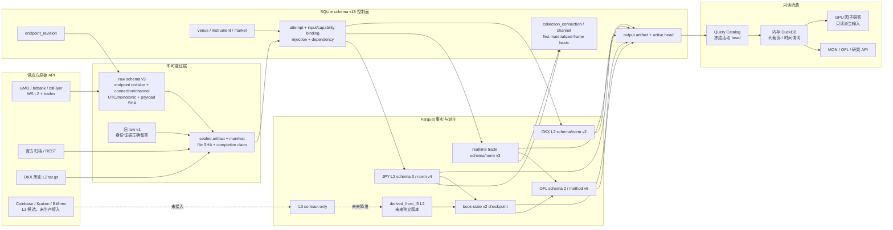

# L2 质量审计、L3 契约与生产迁移快照

> 文档类别：时效快照。现场计数最后复核时间见第 2.2 节。
> 项目根：`C:\Users\wu_zh\dev\guvolu`；数据根：
> `C:\Users\wu_zh\dev\guvolu\data`（`.env` 为 `GUVOLU_DATA_ROOT=data`）。
> 长期判据见 [materialization-design.md](materialization-design.md)、
> [order-flow-data-contract.md](order-flow-data-contract.md) 和
> [runtime-ops.md](runtime-ops.md)。本文集中保存会随运行变化的计数、容量与部署状态。

## 1. 结论

SQLite schema v18、raw schema v3、实时逐笔 schema/normalization v3，以及三家
日元市场 L2 的物理 schema v3 / `book-l2-normalization-v4` 已进入生产数据链。
审计时 GMO、bitbank、bitFlyer 的全部活动 L2 分区均已切到 normalization v4；
v4 的来源拒绝数为零。OKX 二十九个历史 UTC 日继续保持 schema/normalization
v2，不伪造实时 connection/channel 字段。

这次 v4 不是字段扩展，而是纠正 bitbank 的重放前提。初版 v3 把 whole 与 diff
跨 room 的同序关系误约束成固定方向的一对；生产 raw 显示合法顺序会出现
`diff -> whole`，whole 还可能因网络到达延迟而低于已收到的 diff。官方规则本来
就是分别订阅、持续缓存 diff、whole 到达后重置，再只回放 `s > sequenceId` 的
缓存 diff。v4 改为每个 room 独立验证严格递增，跨 room 同序不拒绝，并保留迟到
whole；旧 v3 attempt、拒绝证据和 Parquet 均保留，没有静默改写历史。

已部署数据仍有明确上限：bitbank 无 checksum，bitFlyer 与 GMO 无来源序号和
checksum，OKX 当前历史日档也没有可用的逐帧序号/checksum。内容散列完整、可确定
重放和供应方传输期间绝对无漏包是三种不同结论。三家日元所也都不是公开 L3。
L3 当前只有合同和接入顺序，没有生产 connector、raw、活动 Parquet head 或页面。

## 2. 证据身份与现场状态

### 2.1 L3 注册工作簿

调查底稿为
`C:\Users\wu_zh\Downloads\crypto_api_l3_registry_2026-08-12.xlsx`：

| 属性 | 值 |
|---|---|
| 文件大小 | 214,395 bytes |
| SHA-256 | `B1E03A9D7C4DFCA08788237676E2971FA0FA964F1F4CF8127962702AEE471A08` |
| 工作表 | 10 |
| 标准端点数据行 | 74 |
| 重复 `Endpoint ID` / 自然键 | 0 / 0 |
| 公式错误 | 0 |

仓库只登记外部工作簿的路径、大小和散列，未复制该二进制。端点注册表已使用稳定
ID；日元三所 L2/逐笔生产端点为 bitFlyer `EP-0002`、bitbank L2 `EP-0005`、
GMO `EP-0007`，本地扩展的 bitbank transactions 为 `EP-0075`，当前 revision
均为 0。

### 2.2 SQLite 活动头快照

下表以 SQLite `materialization_partition_head` 指向的 Parquet 为准，不把旧版本、
失败尝试或未激活文件混入。最终现场复核窗口为
**2026-08-12 22:41–22:42 JST**；实时采集继续运行，所以这些数字是带时间戳的
快照，不是固定配置。

| 来源 | 活动 L2 头 | frame | level | 活动契约 |
|---|---:|---:|---:|---|
| bitbank | 353 | 301,206 | 5,137,951 | schema 3 / normalization v4 |
| bitFlyer | 353 | 523,350 | 13,873,890 | schema 3 / normalization v4 |
| GMO | 353 | 202,290 | 12,137,400 | schema 3 / normalization v4 |
| OKX | 29 | 120,467,376 | 684,985,457 | schema 2 / normalization v2 |
| 合计 | 1,088 | 121,494,222 | 716,134,698 | 按 market 隔离，不跨所混写 |

前三所 v4 共 1,059 个活动完成 attempt：bitbank 来源帧 305,412、事实帧 301,206、
协议忽略 4,206、拒绝 0；bitFlyer 来源帧 523,358、事实帧 523,350、协议忽略 8、
拒绝 0；GMO 来源帧与事实帧均为 202,290、拒绝 0。忽略行是已定义的控制/无效
业务载荷，不是解析失败；每个 attempt 都满足
`source_rows = normalized_frames + ignored_rows + rejected_rows`。

实时逐笔活动头为 `trade-realtime-normalization-v3`：bitbank 340、bitFlyer 278、
GMO 300 个分区头，对应 4,947、8,020、15,815 条 `trade_observation`。bitbank 与
GMO 拒绝为 0；bitFlyer 的 1 条拒绝来自旧 raw v2 段中缺失 `side` 的原始证据，
当前 raw v3 输入拒绝为 0。这些只是当时 sealed segment 的计数，不等于三所全部
历史逐笔覆盖。

SQLite `PRAGMA user_version=18`、`quick_check=ok`、`foreign_key_check` 为零行，
现场没有 `running` 物化尝试。控制面已登记 7 个 connection 与 9 个 channel；GMO
逐笔重连增加了新的真实会话身份，全部 observation basis 都是
`first_successfully_materialized_raw_v3_frame`。数据库主文件约 1.76 GiB。

运行面有 1 条查询服务逻辑链、3 条 L2 与 3 条逐笔采集链，以及 L2、trade、
book-state、OFL 各 1 条物化链；实际逻辑键无重复。查询服务重启后重新 adopt 六个
collector，没有中断或失败，四所 L2 API 现场查询成功。`guvolu-marketdata-guard`
于 **22:40:40 JST** 恢复为 `Enabled=True`、`Ready`、`LastTaskResult=0`、
`MissedRuns=0`。

> 注：分来源数字和合计均来自同一最终 SQL 窗口或确定性加总；所有计数都不是长期
> 常量。C 盘余量和 raw 运行态见后文各自的采样时刻。

### 2.3 raw v3 现场证据

22:34:34 JST 的现场审计观察到恰好 6 个 open run，对应三所 L2 与三所逐笔六条
流，全部使用 raw schema v3；checkpoint 年龄为 18.6–40.6 秒，失败数为 0。raw v3
每行含 endpoint revision、connection、channel、UTC/单调接收时钟、严格记录序号
和 payload SHA-256；segment manifest 再绑定正文 SHA-256、字节数、记录数与
completion claim。只有 `sealed + completion_claim=true` 的段能进入物化。

旧 raw v1 仍可重投影到现行物理列，但当时没有记录 endpoint revision、
connection/channel 或单调时钟；这些列必须保持 NULL，并由 `data_quality` 明示
“未记录/由物化侧推导散列”。不能从目录、当前注册表或邻帧倒填历史身份。raw v2
作为过渡格式仍可读，但不会获得 raw v3 的完整观察结论。

## 3. L2 来源能力、互补与质量边界

| 来源 | 原始 API 形态与身份 | 已证明能力 | 无法证明 / 硬限制 | 主力角色 |
|---|---|---|---|---|
| bitbank | Socket.IO 4.x；`depth_whole_{pair}` + `depth_diff_{pair}`；`EP-0005 r0` | whole 重锚、绝对数量 diff、每个 room 内 sequence 严格递增；官方缓冲算法可确定重放 | sequence 不要求连续；无 checksum、order ID；约 200 档发布边界 | 三所实时 L2 连续性证据最强的主轴 |
| bitFlyer | JSON-RPC；board snapshot + board diff；`EP-0002 r0` | snapshot 重锚、价格级 set/delete、connection/channel 血缘 | 无 sequence/checksum/order ID；接收时刻不等于交易所发布时刻；断线窗不可补 | 独立 JPY spot/CFD primary 与跨所验证票 |
| GMO | JSON WS snapshot；`EP-0007 r0` | 每帧独立重锚、固定深度状态采样；重放不依赖前帧 | 无 sequence/checksum/order ID；快照间生命周期不可见 | 日元历史成交/K 线主轴的实时状态补充 |
| OKX 历史 | tar.gz 内 JSONL；周期 snapshot + 绝对 update | 400 档、按 UTC 日可回补、原档和双 Parquet 散列可复核 | 本地日档无可用逐帧 seq/checksum；不能证明归档生成期间无缺口 | 全球深度历史对照，不代填 JPY 市场 |

三所相互验证成立的范围是共同时间窗的 mid、spread、VWAP、收益率、成交额、
方向 Delta、陈旧度和异常方向；不成立的范围是逐笔 ID、订单身份、FIFO、撤单主体
和各自成交量的一一对账。它们是不同撮合池。`instrument_id` 允许对齐研究口径，
但所有原生事实仍以不同 `market_id` 隔离。

### 3.1 bitbank 发现、修复与下游重放

bitbank [官方 public stream 文档](https://github.com/bitbankinc/bitbank-api-docs/blob/master/public-stream.md)
明确：`depth_diff.s` 与 `depth_whole.sequenceId` 共用序号域、序号单调但
不保证连续；应持续缓存 diff。收到 whole `S` 时，用 whole 替换本地簿，再按
升序应用所有 `s > S` 的缓存 diff，忽略 `s <= S`；whole 有时会晚于 diff 到达。

生产 raw 的逐行审计验证了这种延迟：可观察到 delta 后跟相同序号 whole，也可
看到 whole 小于已经收到的 diff。旧 v3 的跨 room 同序固定配对规则因此产生过
拒绝。v4 的事实层只在同 connection、同 room 内拒绝重复/回退，跨 room 保留
wire order；全量重投影后日元三所活动头全部切 v4，bitbank v4 rejection 为 0。

状态层不能简单逐帧“见到就应用”。当前代码使用统一 bitbank replay helper：首个
whole 前 diff 仅缓存；whole 到达后重置并选择性回放。为恢复状态而延后应用的 diff
不在 whole 时刻产生订单流归因。`book-state-checkpoint-v2` 与
`orderflow-tile-sparse-v6` 使用这套规则。生产 book-state 四市场已切 v2，现有
bitbank OFL 热小时头已全部切 v6；逐项状态见第 6 节。

## 4. 事实、主键、留空与聚合

完整血缘链不是把三个 ID 拼成一个字符串，而是各自承担不同职责：

```text
endpoint revision -> connection -> channel
                                  |
venue + symbol + mapping revision -> market_id
raw bytes -> artifact_id ---------+-> partition attempt
normalization_version ------------+-> normalized fact -> active head
```

- `market_id`：哪个交易所、产品类型、原生交易对和 mapping revision。
- `artifact_id`：哪一份不可变输入字节；内容任一字节变化即产生新 ID。
- `normalization_version`：用哪一套语义解释输入；规则变化写新制品并切 head。
- 事实逻辑唯一键：`(market_id, source_event_key, normalization_version)`。
- `endpoint_id + endpoint_revision`、`connection_id`、`channel_id` 是采集观察血缘，
  不替代事实主键。
- `materialization_dependency` 再绑定 book-state/OFL 等派生事实究竟消费了哪些
  活动 attempt。

正确留空是当前设计的必要组成。来源没有 event time、sequence、checksum、order
ID、握手 ACK 或关闭事件时保持 NULL，并用 basis/quality 解释；不能合成看似真实
的字段。`opened_at`/`subscribed_at` 当前都表示首个成功物化 raw v3 数据帧的观察
时刻，不是 socket open 或 subscribe ACK。`connection_ordinal` 是 run 内一基连接
序号，不是重连次数。

跨来源只允许生成新派生数据集：健康票中位参考价、CNBBO、共同时间窗成交量或
价差比较。禁止把另一所数据写进缺失市场、合并订单队列、共享 trade/order ID，
或把 L2 减量精确拆成成交与撤单。同一来源的重合 API 由规范视图选择 primary 和
同源 fallback；两份原件及血缘都保留，不在 raw 层覆盖。

## 5. 畸形 JSON、未完成文件与散列证据

JSONL 的一行是一个独立 envelope。raw v3 先保存 wire payload 字符串及其 SHA-256，
再解释业务 payload；所以供应方返回错误对象或 payload 本身不可解析，不会破坏
前后行，也不会被清洗成“正常数据”。业务物化可按帧原子 ignore/reject，并在
SQLite 保存 artifact、零基行号、原路径和原因。封口正文散列与逐 payload 散列
分别证明文件和消息身份。

运行中的 `.open`、checkpoint 或没有 `completion_claim=true` 的 terminal manifest
是正常未完成状态，不是已封口 artifact。正常停机会封当前段；崩溃尾段由
`reconcile-raw` 重算现存有效行并标 `recovered_incomplete`，仍不得进入事实头。
清理只允许删除未登记的 `.tmp.parquet`、`.stage.csv` 等本次 attempt 临时文件；
raw、archive、完成 Parquet、失败 attempt、rejection 和 manifest 都是审计证据，
不能因“不好看”而删除或重写。无效尾字节应隔离或保留原件并登记状态，不通过
补括号把畸形 JSON 变成另一个散列身份。

GMO 实时逐笔的 `ERR-5003` 暴露了另一种“JSON 合法但业务错误”的情况。当前采集器
先持久化 `error`/`errors` 帧，再触发退避重连；无限期模式也使用九十秒静默超时。
只有正常 `trades` 帧成功持久化才清零连续失败计数。重启后的封口段已经产生正常
GMO trade 数据并进入 normalization v3，不再把错误控制帧当成健康静默。

## 6. 派生状态、物化与运行韧性

物化的作用是把不可变但昂贵的 raw 确定性转换为带 schema、语义版本、主键、PIT、
散列和活动头的 Parquet；book-state 进一步保存可丢弃的最新簿 checkpoint，OFL
保存按小时分区的列头与稀疏价格格。它们减少 UI 每次重扫 raw 的成本，但不能成为
第二份来源真相。删除派生物应只损失性能，不应改变从活动 L2 重建的结果。

| 层 | 当前代码版本 | 生产活动状态 | 结论 |
|---|---|---|---|
| 日元实时 L2 | schema 3 / norm v4 | 三所全量切头，v4 reject 0 | 已部署 |
| OKX 历史 L2 | schema 2 / norm v2 | 29 个 UTC 日头 | 已部署，保持来源边界 |
| 实时逐笔 | schema/norm v3 | 三所均有活动头 | 已部署 |
| book-state | `book-state-checkpoint-v2` | bitbank、bitFlyer、GMO、OKX 共 4 个 v2 latest 头 | 已部署；全轮 audit 0 error |
| OFL | schema 2 / `orderflow-tile-sparse-v6` | 日元三所现有 08 至 13 UTC 各 6 个头，共 18 个，全部 v6；OKX 样本 1 个 v4 | JPY 受影响热范围已重建；OKX 不受 bitbank 语义修订影响 |

OFL watcher 的最外层 SQLite writer lock 过去可能在 L2 全量迁移长时间占锁后超时
退出。当前代码把外层 TimeoutError、可恢复 IO/SQL/DuckDB 错误收束为
`orderflow_tile_cycle_error`，本轮不推进 head，等待 poll interval 后继续；单市场
失败则记 task error 并继续其他市场。测试已覆盖“首轮锁超时、下一轮继续、连接
最终关闭”。重启后的首轮处理三家日元市场各两个小时，共创建 6 个 v6 head、
失败 0；随后为保持同一热窗口方法一致，又把三所 08 至 11 UTC 的十二个旧 v4/v5
活动小时全部重建为 v6。现在三所各有 6 个、共 18 个 v6 小时头，旧版本仍作为
非活动 attempt/制品保存。OKX 历史样本不受 bitbank 重放修订影响，唯一活动 tile
保持 v4。

## 7. 存储分工、规模与长期日增

当前 SQLite + Parquet + 内存 DuckDB 的分工合适：SQLite v18 只保存维度、端点/
能力修订、connection/channel、artifact/location、覆盖、attempt、输入/依赖、
rejection、输出和活动 head；大规模逐笔、K 线、L2 与派生事实放 Parquet；DuckDB
只读冻结的明确活动路径或构建暂存输出，不保存长期 `.duckdb` 真相库。所有控制
面写入由文件锁与 SQLite 短事务串行，采集和只读查询可并行。

22:42 JST 复核时数据根共约 37.27 GiB，目录构成如下；表中分项已包含根级
SQLite/WAL 等文件，四舍五入后的显示值相加可能与总数有微小差异。

| 构成 | 约 GiB | 说明 |
|---|---:|---|
| `materialized/` | 23.07 | 活动与旧版本 Parquet/manifest；活动集由 SQLite head 决定 |
| `raw/` | 6.43 | 旧 raw 与持续增长的 raw v3；不可回补实时证据 |
| `backups/` | 3.46 | 两份迁移前控制库备份；最终验收前保留 |
| `archive/` | 2.48 | 官方归档，不含其物化放大 |
| `derived/` | 0.06 | 旧派生/兼容制品 |
| 根级主库等 | 约 1.77 | SQLite 主库约 1.76 GiB，另有 WAL/SHM 与小文件 |

`raw/` 同时含旧格式与持续增长的 raw v3，不能把整个目录误报成 raw v3 新增量。
C 盘在 22:42 JST 可用 87.074 GiB / 18.730%。OKX 400 档历史单日持久增量的既有
实测约 552 MiB，热层二十九日是主要占用。旧版本 Parquet 和迁移前备份属于可回退
证据，不能在最终审计前清除。

C 盘空闲比例 18.730%，已经低于长期运行设定的 20% 历史扩量门槛。因此当前
应暂停新的 OKX/其他来源历史扩量和非必要全量派生重建，优先保持不可回补的六条
实时流；本轮为了纠正事实语义而必须完成的 book-state/OFL 小范围重建不等同于
扩大历史覆盖。不得为越过阈值而删除 raw 或未完成验收的回退证据。

五分钟 raw 段适合断点和可见进度，不适合作为长期分析文件粒度。后续 compaction
应把同 market/domain/hour 的小 Parquet 合并为小时制品，保留全部输入 artifact
binding，产生新 attempt/head；raw 不因 compaction 删除。容量计划以至少七日的
raw、Parquet、manifest、控制面和暂存峰值 P50/P95 校准。附属冷盘到位前，历史
回补保持日级串行和 20%/10% 空间门禁；GPU 只用于物化后的数值研究，不加速网络、
JSON、SHA、SQLite 事务或 Parquet 编码。

## 8. L3 能力、接入顺序与兼容边界

现有控制面与键链可以承载 L3，但不代表 L3 已接入。L3 使用独立
`book_l3_order_event`、`book_l3_match_link` 和 state checkpoint；同一 order ID
会经历多次事件，所以事实键仍是
`market_id + source_event_key + normalization_version`，不是 order ID 单列。
L3 降维得到的 L2 必须写 `derived_from_l3` 新数据集，不能覆盖交易所原生 L2。

接入顺序：

1. [Coinbase Exchange REST order book](https://docs.cdp.coinbase.com/api-reference/exchange-api/rest-api/products/get-product-book)
   与 [WebSocket channels](https://docs.cdp.coinbase.com/exchange/websocket-feed/channels)：
   REST level 3 快照加 WebSocket full/level3 缓冲闭环；先
   建 WS 缓冲，再取快照、丢弃不晚于快照序号的消息并按序回放。
2. [Kraken WebSocket v2 level3](https://docs.kraken.com/exchange/api-reference/spot-websocket-v2/level3)：
   认证、10/100/1000 档有界可见订单和 CRC32；必须
   保留深度截断语义，范围外淘汰不能伪造成取消。
3. [Bitfinex R0 raw book](https://docs.bitfinex.com/reference/ws-public-raw-books)：
   订单 ID 可见但 `len` 最多 250，只做单市场截断 L3 小样本。

每家都必须先通过 raw 封口、快照+缓冲恢复、顺序/校验、订单剩余量守恒、断线
重建、L3 降维 L2 对照和许可审查，再扩市场。当前三家均未达到生产 connector。

## 9. 全链路



## 10. 已完成门禁与剩余计划

最终切换已经完成以下门禁：日元 L2 活动头全为 v4 且拒绝为 0；OKX 保持 v2；
实时逐笔为 v3；book-state 四所全为 v2，日元三所 checkpoint event time 已追平
当时最新 L2；日元 OFL 08–13 UTC 全为 v6；SQLite quick/FK/running 检查通过；
六个采集器与四个 watcher 的逻辑键无重复；guard 已恢复并成功重新 adopt 采集器。

剩余工作按以下顺序推进：

1. 连续运行收集 P50/P95 字节率、sealed/materialization lag、reconnect、gap、
   reject 与磁盘余量；UI 后续只消费 Query Catalog 和版本化成品，不解释 raw。
2. 在磁盘恢复到 20% 门槛以上或附属冷盘就绪后，再排小时 compaction、其他币种
   L2 和新的历史回补；当前不以删除审计证据换空间。
3. L3 继续按 Coinbase、Kraken、Bitfinex 顺序做单市场闭环；任何生产状态必须另发
   新快照，不能回写本报告把合同阶段改成已接入。

切换完成不能只看行数增长。必须同时满足：SQLite quick check 与外键、artifact 和
manifest SHA/bytes、事实主键唯一、PIT、来源序列规则、行守恒、独立重放、派生
dependency、输出状态一致、活动头可回退。L3 则另需快照缓冲闭环和订单守恒；在
这些门禁前，它仍是合同而不是生产能力。
