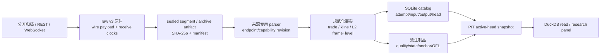
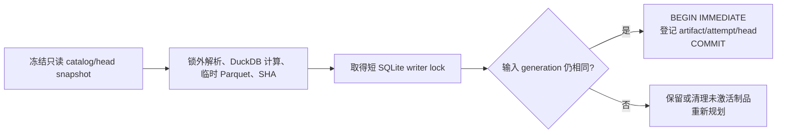
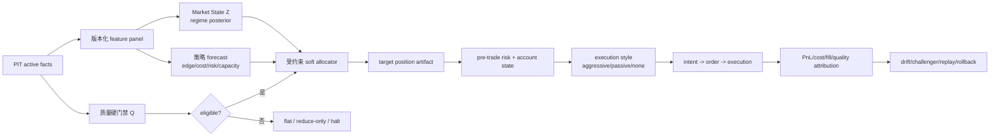

# 多场所数据平台与策略研究复核审计

> 审计时点：2026-08-13 02:27 至 03:10 JST。范围仅含本地源码、配置、SQLite、
> Parquet、raw、日志、进程与已登记来源证据；不审查 UI，不把设计文档或适配器存在等同于
> 已持续投产。本快照复核并取代同日较早的
> [数据策略执行路线审计](2026-08-13-data-strategy-execution-roadmap.md) 中的动态状态结论；
> 较早快照按 W-02 保持冻结。

## 1. 技术结论

当前数据平台的正确定位是：**历史成交与 K 线接近研究闭环，日元三所和 OKX 已达到
研究级 L2，但整体尚未达到可持续、可复现的决策级数据平台，也没有 L3 或套利执行级
事实闭环。**

工程主干已经成立：不可变原件、内容散列、端点与能力修订、规范化市场身份、四时钟语义、
Decimal 文本、输入集合散列、拒绝与忽略台账、活动分区头、PIT DuckDB 查询、质量窗口和
派生制品均不是样板代码，而有实际数据和测试覆盖。该设计明显优于直接把多所数据拼成一张
宽表。

当前最高优先级不应是 HMM、GPU 搜索或 L3 扩所，而应是修复数据生产面本身：

1. 四个常驻物化器共用一把进程级 SQLite 写锁，并把 DuckDB 扫描、Parquet 生成和审计放在
   长临界区内；本次审计实际观测到启动锁等待 120 秒后退出及四个物化子进程同时缺席。
2. 9,628 个物化 attempt 全部登记为 `working-tree`，且仓库尚无首个 Git commit，违反
   D-09 的真实代码版本要求；现有数据可回放但不能严格复现代码。
3. raw v3 每帧 `flush + fsync` 在 WebSocket 消费路径上同步执行，耐断电设计可能反向增加
   event-loop 堵塞和接收缺口风险，尚无峰值压测证据证明该权衡合理。
4. 日元 L2 REST anchor 要求五秒内的 WS 状态，却使用约五分钟刷新一次的 book-state
   checkpoint；最新三所 anchor 均为 `unknown`，对比时差约 600 秒，当前交叉验证没有形成
   有效闭环。
5. canonical Parquet 的语义和压缩正确，但五分钟分区在低流量市场产生大量 10 至 150 KiB
   小文件，Decimal 文本又令研究查询重复转换；缺少与审计层分离的紧凑物理研究层。

按数据用途分级，当前成熟度为：

| 能力域 | 当前级别 | 可用边界 |
|---|---|---|
| GMO/bitbank 历史成交、GMO K 线 | L4 物化研究级 | 可做中低频 PIT 研究；真实代码版本仍阻断 L5 |
| 三所实时成交 | L3 连续 raw、L4 分段物化 | 可做监控和短窗研究；物化常驻性未达 SLA |
| bitbank L2 | L4 研究级，日元来源中最强 | whole 可重锚，diff 序号只证明单调，不证明连续 |
| bitFlyer L2 | L4 snapshot-bounded | 周期 snapshot 可定界；断线到下个 snapshot 前不可信 |
| GMO L2 | L4 snapshot-bounded | 30 档全量快照采样；不是连续增量簿 |
| OKX 历史 L2 | L4 研究级 | 本地 2026-07-12 至 2026-08-09 共 29 日、400 档 |
| OKX live L2 | L2 隔离样本 | 有 connector 与样本，没有常驻活动头或 SLA |
| 跨所价格聚合 | L3/L4 只读 shadow | 可做同 quote 币价差监测，不是可执行套利事实 |
| funding/basis/OI/mark/index | L0/L1 登记或接口级 | 尚无规范化、物化和 PIT panel |
| L3/MBO | L1 数据合同级 | 只有合同和验证器，无任何本地 L3 事件事实 |
| 私有订单、成交、仓位、余额对账 | 不在本次公开数据闭环内 | 所有执行型策略均不可据现状宣称已就绪 |

本文使用的级别定义如下：L0 为文档/登记，L1 为适配器或数据合同，L2 为 raw sample，L3
为连续 raw，L4 为版本化物化与查询，L5 为带运行 SLA、可复现代码、决策质量门禁和执行
对账的闭环。按该定义，当前没有数据域达到 L5。

## 2. 实际实现链路



采集层由 `l2_capture.py`、`trade_capture.py` 及来源 adapter 驱动。raw v3 在业务解析前保留
payload、payload hash、UTC receive time、monotonic receive clock、connection/channel、
run、record sequence；五分钟或容量阈值封口。该顺序正确，因为 parser 错误不会污染或
替代原始证据。

规范化层按来源分别处理，随后才映射到 `instrument_id` 和 `market_id`。成交事实保留
`match_granularity`、`source_side_basis`、`id_origin` 和原生或合成 trade id；L2 把 frame
与 level 分开，并显式保留 snapshot/delta、set/delete、sequence/prev-sequence/checksum
是否存在。这避免了以下错误归一：

- 不把 Binance `aggTrades` 冒充逐撮合成交；
- 不把 GMO 成对打印、bitFlyer execution 和 bitbank transaction 当成完全相同的方向口径；
- 不为没有 sequence/checksum 的来源伪造完整性证明；
- 不把 L2 档位数量变化解释成具体订单新增、撤销或排队；
- 不用某一交易所事实覆盖另一交易所事实。

物化层采用 ZSTD Parquet、122,880 行 row group、临时文件、文件 `fsync`、内容散列和短事务
登记。`partition_attempt`、`partition_input_binding`、`materialization_output`、
`materialization_partition_head` 与 dependency 表能证明某个活动输出来自哪些确切输入。
失败、拒绝和协议控制帧分别记录，不以静默 drop 提高表面成功率。查询层冻结活动头集合，
再以 `available_time <= decision_time` 做 PIT 读取；这是正确的防未来函数主线。

派生层的职责划分也基本合理：book-state 是可重建加速 checkpoint，quality 是控制面事实，
REST anchor 只生成 observation/reconciliation，不回写 WS 真相，order-flow tile 是带
source generation 的新制品。跨所聚合保持贡献来源、质量与活动 attempt 血缘，不反写
单所表。

## 3. 来源与公开 API 能力覆盖

以下表同时表达公开来源能力和本地落地程度；完整端点证据仍以
[来源能力对照册](venue-capability-matrix.md) 为唯一长期登记。

| 来源 | 成交/K 线公开能力与本地状态 | 盘口能力与本地状态 | 本地上限与主要缺口 |
|---|---|---|---|
| GMO Coin | 官方成交归档、K 线与实时成交均已落地；历史覆盖较适合日元中低频研究 | WS 为 30 档全量 snapshot，REST 可取更深当前簿；BTC/JPY raw 与 L4 物化 | snapshot 采样不证明逐增量连续；无 L3；成交成对打印与 side 口径必须分层 |
| bitbank | 多个 JPY 市场的日成交归档已物化，BTC/JPY 实时成交已连续采集 | whole + diff；同 room sequence 单调，whole 是重锚点；market status 已落地 | 日元三所中回放证据最强，但 sequence 不保证无跳号且无 checksum |
| bitFlyer | REST executions 仅近端历史，实时 executions 已采集；无原生 K 线主干 | REST 全簿，WS snapshot + diff，约五秒 snapshot 定界 | 断线缺口不可回补；无 sequence/checksum；历史长度较短 |
| Coincheck | adapter 与少量 raw sample | 无 sequence 的 orderbook diff | L2；仅旁路样本，不可作为决策来源 |
| Binance | 本地有官方归档 `aggTrades` 样本和规范化入口 | 尚无本地历史/实时 sequence L2 主干 | 聚合成交不是每笔 match；当前更适合作全球低频参考 |
| OKX | 成交/衍生品接口有登记，尚非本地主干 | 官方 400 档历史 L2 已物化 29 日；live books 有隔离样本和 sequence | 历史 L4；live L2；2026-06-23 后不能依赖旧 checksum 语义；无本地 L3 |
| Kraken | 已登记公开 L2/checksum 与 L3 候选证据 | 尚未接入本地事实 | L0；适合作第二个 L3 试点但存在深度限制 |
| Coinbase | 已登记完整 MBO 候选证据 | 尚无 connector/raw/materializer | L0/L1；最适合作第一个 L3 单市场试点 |
| Bybit | 接口与历史来源有调查记录 | 历史可得性仍有阻断 | L0；不可列入当前研究覆盖 |
| Hyperliquid | 浅 L2、funding 等能力有候选价值 | 尚未接入 | L0；适合未来衍生品状态补充，不是现状 |
| Bitfinex/Bitstamp | L3 候选登记 | 无本地事实 | Bitfinex raw book 约 250 订单截断；Bitstamp 仍需重新验证 |

来源覆盖的核心问题不是交易所数量，而是数据域不对称：现货成交较宽，持续 L2 只覆盖三所
日元 BTC，深历史 L2 只有 OKX BTC-USDT，衍生品状态、统一 FX/参考价、私有执行与链上事实
基本为空。因此“多所”不等于可直接做横截面、basis、funding 或多腿套利。

## 4. 规范化与富化合理性

### 4.1 正确设计

1. **身份未过度归并。** `instrument_id` 表达经济标的，`market_id` 保留 venue、symbol、
   mapping revision 和 market kind。来源端点与能力 revision 绑定到 attempt，后续来源规则
   变化不会无痕覆盖历史。
2. **数值真相保持精确。** 金额、价格和数量用 Decimal 文本，不经过 binary float；排序、
   聚合时显式转换为 Decimal。该选择在 canonical/audit 层正确。
3. **时间语义适合 PIT。** event、available、ingest 和 decision 分离；来源时间可信时仍以
   接收/摄取形成可得上界。来源时钟偏移被记录，不把负 offset 直接改写成零。
4. **成交语义保真。** 原生 side、taker 方向依据、撮合粒度、合成标识来源均有字段，允许
   下游对 GMO paired print、Binance aggregation 等作不同权重。
5. **L2 不冒充 L3。** frame/level、snapshot/delta、source depth 和 integrity mode 分开；
   v5 对 predecessor 不确定性采取显式 untrusted，而不是局部猜测。
6. **富化不覆盖事实。** quality、anchor、state、tile、cross-venue 均产生新身份和血缘，
   能够删除重建。

### 4.2 仍不充分或不够高效的部分

1. Decimal 文本适合审计，不适合作所有研究扫描。当前 DuckDB 频繁执行
   `CAST(... AS DECIMAL(38,12))`。应新增只读 research-physical 投影：
   `price_ticks:int64`、`size_lots:int64`、`notional_atoms:decimal128/int128`，每行绑定
   tick/lot/scale revision；原始 Decimal 文本继续保留为审计真相。
2. 统一 market 身份已完成，但统一研究 universe 尚未完成。缺 listing/delisting 生命周期、
   共同 quote、显式 FX artifact、交易时段/维护窗、统一 fee tier 与合约规格，因此不能直接
   把多资产表当作无幸存者偏差的横截面 panel。
3. quality 把 integrity、freshness、clock 和 coverage 汇总成单个 `status`，下游容易把
   时钟不可测误判成簿损坏。应输出四维质量向量，并只由策略声明自己依赖哪些维度。
4. `latest_l2_quality` 查询契约没有返回数据库已有的 `window_complete`。未封口当前窗可能
   因活动 head 尚新而显示 `ok`；跨所读取另有 12 分钟状态年龄检查，尚未造成直接绕过，
   但其他消费者无法可靠区分“封口通过”和“当前未完成”。
5. 12 分钟 `materialized freshness` 适合五分钟分段物化的运维容忍，不适合执行报价。
   必须区分 pipeline SLA 和 strategy decision SLA；后者对 L2/套利通常应为秒级并由策略
   参数明确，而不是复用 720 秒常数。
6. connection/channel 控制表目前只在首次成功物化时登记 open/subscribe，没有 close/
   unsubscribe 写入路径。本次只读快照中 EP-0002、EP-0005、EP-0007、EP-0075 共 39 条
   connection 全部 `closed_at IS NULL`，不能据该表计算真实连接时长、断线率或并发数。

## 5. 空间、读写与物理布局

审计时点 `data/` 共 83,093 个文件、44,575,948,454 字节。主要物理类型为 Parquet
25.18 GB、SQLite 及备份 9.44 GB、gzip 6.33 GB、JSONL 3.57 GB。主要目录为：

| 数据组 | 文件数或形态 | 物理量级 | 判断 |
|---|---:|---:|---|
| `materialized/book_l2` | 13,092 个文件 | 16.22 GB | OKX 大日档合理；日元五分钟分片过碎 |
| `materialized/trade_observation` | 8,298 个文件 | 8.03 GB | 历史主干可用，来源间 bytes/row 差异需画像 |
| `raw/archive` | 144 个大归档 | 3.62 GB | gzip/zip 原件保留合理 |
| `raw/realtime` | 4,525 个 run/segment 文件 | 2.07 GB | JSON 内嵌 payload 与逐帧同步耐久，空间/写放大较高 |
| SQLite 主库 | 单库 | 1.92 GB | 控制面规模可接受，写并发设计不可接受 |
| 四份 SQLite 全量备份 | 四个约 1.85 至 1.92 GB 文件 | 约 7.5 GB | 占数据目录约 17%，需有保留与恢复策略 |

OKX 29 个活动日的历史 L2 有 805,452,833 行、15,438,105,544 字节；大文件、ZSTD 和
122,880 row group 的 bytes/row 表现良好。相反，三所日元五分钟 L2 的单文件常见几十至
一百多 KiB，实时成交文件中位数约 9 至 14 KiB。row group 目标并不能挽救只有数百行的
文件，文件系统元数据、catalog、打开文件和 DuckDB planning 成本会占主导。

建议保留两种物理层，而不是改写 canonical：

```text
raw/audit plane
  不可变 wire/archive -> 语义忠实的五分钟 canonical -> 精确 active head

research physical plane
  以活动 canonical 为输入 -> market/date/hour 紧凑文件
  -> available_time/frame 排序 -> 128–512 MiB 目标
  -> tick/lot 整数列 + Decimal 审计列 -> 新 artifact/head/lineage
```

compaction 必须是新数据域，输入活动 generation 固定，不能删除原件或原 canonical。小文件
达到目标大小前可按小时或日合并；OKX 大日档无需为了形式一致再次切碎。研究扫描按时间、
市场、字段做 projection/predicate pushdown，不在热查询中 glob 全目录。

raw 写入应采用单生产者 writer 线程/进程和有界内存队列：网络协程只做 receive timestamp、
record sequence 与 enqueue；writer 按 20 至 100 ms 或字节阈值 group commit，manifest
记录 durable watermark、未耐久帧上界、queue high-watermark 和 event-loop lag。是否从
`fsync-per-record-v1` 迁移必须先用真实峰值压测，不应凭经验直接降低耐久性。

SQLite 备份应在 WAL checkpoint 和一致性验证后生成，登记 SHA、恢复演练和保留期；可采用
日/周/月分层和文件系统压缩/去重，但在没有恢复证明前不删除现有备份。

## 6. 交叉验证、自检与运行态问题

### 6.1 已有检查是合理的

- SQLite `quick_check` 通过，外键违规为零；活动输出未发现缺 artifact/location。
- 每个 attempt 有输入集合散列、明确 input binding、输出行数和完成状态；活动 head 只指向
  complete 或 complete-with-rejections。
- 本次快照中累计 rejection 469 行、ignore 约 28.8k 行，协议控制帧、市场状态和坏记录
  没有被静默吞掉。
- L2 quality 检查 observed silence、sequence duplicate/regression、snapshot anchor、
  checksum、untrusted flags、来源时钟偏移和物化新鲜度。
- materializer audit 检查主键、时间逆序、Decimal、side/action、状态守恒、artifact hash 和
  checkpoint 血缘；全量测试套件在本次审计中通过。
- 跨所读取只比较相同 base、quote 和 market kind，保留贡献者和失败理由；中位价是新聚合
  结果，不覆盖来源事实。

### 6.2 实测暴露的运行缺陷

02:14 左右四个 materializer 同时启动。trade-realtime 和 orderflow-tile 在
`store.connect()` 等待 `data/.locks/sqlite-writer.lock` 120 秒后退出；book-state 三个周期
分别耗时约 122 至 124 秒；L2 和 trade 随后记录“管道已被停止”。02:34 的进程快照只剩
collector 与 query service 的 Python 子进程，四个 materializer 的 Python 子进程均不在，
但 `PowerShell -NoExit -File run_*materializer.ps1` 外壳仍在。

这证明两个不同问题：

1. `l2_materialize`、`trade_realtime_materialize`、`book_state_materialize` 和
   `orderflow_tile_materialize` 的 watch 循环把整次读取、DuckDB 计算、Parquet 写入、hash
   与 audit 包在同一个 advisory writer lock 中；锁从“SQLite 短事务互斥”退化成“全平台
   串行调度器”。
2. 人工启动脚本在 Normal 模式加入 `-NoExit`。虽然 Python process manager 只扫描
   `python.exe`，但 Windows 进程表和人工巡检会看到已退出 worker 的残留 shell，易形成
   假存活；外部守护若匹配 wrapper 也会误判。

另一代理可能在本审计后重新运行验证或物化，因此“当前无 worker”只代表该观测时点；
**锁超时、退出日志和残留 shell 则是可重复的架构故障证据，不因后来重启而消失。**
后续 02:41 至 03:07 的验证再次复现：book-state 单轮约 94 至 129 秒，trade watcher 既有
启动锁等待 120 秒，也有运行中锁超时。03:10 再次观测到四个 materializer Python worker
为零。外部验证可能有意停止整条管线，因此 worker 停止不单独作为 supervisor 故障证据；
两轮独立日志中的锁超时则足以确认临界区争用问题。

合理修复是两阶段物化：



写锁只覆盖 compare-and-swap 与 catalog 事务，不能覆盖文件扫描或深审计。四个 watcher 应加
启动抖动、不同优先级与可观测 queue；失败后由真正的 supervisor 退避重启，并以子进程
PID、最后成功 head、raw-to-head lag 三者共同判活。

REST anchor 还存在独立设计错位：`MAX_WS_CHECKPOINT_AGE_SECONDS=5`，但比较输入是五分钟
book-state 周期 checkpoint。最新 GMO、bitbank、bitFlyer anchor 均为 `unknown`，lag 约
599.9 至 600.1 秒，理由是“没有同序或足够近的先验时点绑定”。应在 anchor 的
`available_time` 上从活动 L2 frame 找最近且不晚于它的状态，或维护秒级内存/checkpoint；
不能把五分钟 checkpoint 的陈旧当成来源不一致。

### 6.3 应补充的交叉验证

1. 成交对官方 K 线仅在同一 market、trading-day、撮合/双侧计量口径下比对；GMO paired
   prints 和 Binance aggregate 需单独 reconciliation rule。
2. 同币同 quote 的跨所 top 以 `available_time` 对齐，输出时间偏差、费用后可执行价差和
   contributor quality；不同 quote 必须经过独立 FX artifact，不直接比较。
3. L2 REST 对 WS 使用 nearest-prior PIT 状态、严格五秒窗和可比深度；比较 best bid/ask、
   depth、book hash，结果只作为 shadow evidence。
4. 每个 canonical 分区加入来源行数守恒：source = normalized + rejected + ignored，并按
   source-specific message kind 再分解。
5. 采用三层审计节奏：每分区轻量 invariant、每小时 catalog/hash/freshness、夜间抽样深
   replay；周级全量审计不阻塞热路径。
6. 采集质量加入 event-loop lag、writer queue、socket receive backlog、raw durable lag、
   reconnect cause 和 segment seal latency；仅凭 WS frame count 不能证明没有本地漏收。

## 7. 问题清单与优先级

| 优先级 | 问题 | 影响 | 验收条件 |
|---|---|---|---|
| P0 | 物化长临界区与单 writer lock convoy | 物化器超时退出，raw 与 active head 静默脱节 | 计算全在锁外；catalog 锁 P99 有预算；并发四 worker 24 小时无超时；raw-to-head lag 有告警 |
| P0 | 所有 attempt 为 `working-tree`，仓库无 commit | 回测、特征和信号不能按 D-09 复现 | 初始化受控 commit；自动注入 Git hash、dirty tree digest、config hash；拒绝空泛版本进入 decision grade |
| P0 | 每帧同步 `fsync` 无吞吐/延迟证据 | 可能在高峰阻塞网络消费并造成原件缺口 | 真实峰值 benchmark；event-loop/write/fsync P50/P99；durable loss bound；故障注入恢复 |
| P0 | supervisor/外壳假存活风险 | worker 已死但运维仍误判连续 | 服务判活绑定 Python PID、head heartbeat 和 lag；worker 退出后 wrapper 非零退出或自动关闭 |
| P1 | REST anchor 与五分钟 checkpoint 错位 | 三所 anchor 全为 unknown，无法形成旁路验证 | nearest-prior 五秒内状态；连续 24 小时 fresh/mismatch/unknown 分布和原因可解释 |
| P1 | quality 维度混合且缺 `window_complete` | 策略可能错误 gate 或消费未封口质量窗 | integrity/freshness/clock/coverage 分维；API 返回 complete；策略声明依赖 |
| P1 | pipeline 12 分钟 freshness 被复用于报价 | 对微结构和套利过于宽松 | pipeline SLA 与 strategy SLA 分离；执行读取秒级 age gate |
| P1 | L2/实时成交小文件 | planning/open/catalog 开销和备份膨胀 | 新 research compact artifact 128–512 MiB；按小时/日扫描 benchmark 明显改善 |
| P1 | connection/channel 无 close/unsubscribe | 连接 SLA、断线和并发统计失真 | collector 结束/重连写 close reason；旧开放行以明确 legacy basis 修复，不猜时间 |
| P1 | Decimal 文本是唯一研究物理表示 | 转换 CPU 与扫描体积偏高 | 绑定 scale revision 的 tick/lot/atom 列；CPU/IO benchmark；与 Decimal 真相逐行一致 |
| P1 | 四份全量 SQLite 备份约 7.5 GB | 本地容量增速较高 | 恢复演练、保留矩阵、压缩/去重方案；删除须另行授权 |
| P2 | 来源/市场 SLA 使用共享常数 | 活跃度差异导致误报或漏报 | capability/channel 级期望间隔、heartbeat、seal lag 分位数 |
| P2 | order-flow/feature 物理版本推进快 | 旧 active head 与新代码可能短时并存 | promotion 原子化、version coverage 审计、旧版本可明确回放 |

## 8. L3 现状与缺口

本地 `book_l3_contract.py` 已定义 order event、不可变 event evidence、match link 和 state
checkpoint，并对 stable key、数量和动作语义做验证。这是 L3 事实合同，不是 L3 数据能力。
当前缺少：

1. 任一交易所的 L3 connector 和 raw producer；
2. snapshot 前 WS 缓冲、snapshot REST 获取、sequence 重排、重连后重建状态机；
3. order id scope、add/modify/delete/match、数量是剩余量还是增量、modify 是否丢失队列优先级
   的来源专用语义；
4. sequence gap、checksum、订单数量守恒、负数量/孤儿 modify/delete、重复事件的质量门禁；
5. event/evidence/match/checkpoint Parquet materializer、active head、PIT replay 与质量窗；
6. L3 降维为 L2 的独立 `derived_from_l3` artifact 及与来源 L2 的对照；
7. 容量、许可、保留期、断线注入与随机断点可重复回放验收；
8. 私有 order/fill/position 事实和 queue/fill simulator 的校准闭环。

没有这些能力时，L2 imbalance、microprice 和 OFI 可以研究，但以下主张不成立：订单级撤单
率、订单年龄、精确 queue position、maker fill probability、queue-reactive 做市和 spoofing
订单生命周期判断。L2 档位差分中的“撤减”同时混有撤单、成交、移价、源截断和丢包。

接入顺序建议为 Coinbase BTC-USD 完整 MBO 单市场试点，其次 Kraken 接受限深约束，再做
Bitfinex 截断 raw-book 实验。每一步需通过 24/7 连续采集、重连注入、随机断点重放、订单
数量守恒、L3-to-L2 对照和容量预算后才扩市场。日元三所没有公开 L3 证据，不能通过本地
富化“升级”为 L3。

## 9. 策略研究价值排序

策略价值按四项共同决定：历史样本、PIT/语义可信度、成本/成交可模拟度、未来执行闭环。

| 等级 | 策略 | 现状可行性 | 决定性理由或缺口 |
|---|---|---|---|
| A1 | 5m–4h 趋势跟随、breakout、波动率目标 | 最高 | 历史成交/K 线最强，低于物化节拍敏感度；可先用 taker 成本和保守滑点 |
| A1 | 成交量/足迹确认的趋势与 breakout | 高 | 已有 trade side/volume；必须按来源 side 与 paired-print 语义分层 |
| A2 | 单市场均值回归 | 高 | 在低趋势、良好流动性、非 jump 环境可做；需避免把陈旧 spread 当机会 |
| A2 | L2 microprice、spread、depth imbalance、OFI | 高，作为条件/执行 overlay | 可提高入场和执行时机；只在 quality 合格的 snapshot-bounded 窗口，不宣称 queue alpha |
| B1 | 三所 BTC/JPY price discovery、lead-lag、dislocation shadow | 研究价值高 | 同 quote 且已有三所 L2/trade；缺 fee tier、账户库存、双腿执行和持久化可执行价差事实 |
| B2 | LOB 短时预测 | 可研究，不宜先实盘 | 有 L2 样本但来源异质、标签易泄漏；需 compact panel、毫秒/秒级 PIT 和真实成本 |
| B2 | 低频 JPY 横截面动量/波动/流动性 | 条件可行 | GMO/bitbank 有多资产历史成交；先补共同 universe、上市生命周期、共同日历和流动性过滤 |
| C | 多因子横截面 | 尚早 | 没有稳定 panel、共同 quote/FX、暴露中性化、完整 universe 和真实版本 registry |
| C | 网格 | 仅 paper | 本质是库存约束均值回归；L2 可做保守上下界，但被动成交、逆向选择和库存尾部不可校准 |
| D | 做市/queue 策略 | 当前不可 | 缺 L3、私有订单生命周期、maker fee/rebate、queue/fill 和库存风险闭环 |
| D | 跨所套利 | 只做 shadow | 缺双所私有余额、费用、下单/撤单/成交对账、leg risk 和转移/预置库存模型 |
| D | 三角套利 | 当前不可 | 缺同所三腿同步可执行报价、三腿费用/精度/最小量、原子性与残余仓位处理 |
| D | 期现基差、funding arb | 当前不可 | 缺 mark/index/funding/OI/borrow、合约乘数、保证金和强平规则事实 |
| D | CEX-DEX arbitrage | 当前不可 | 缺 block/mempool、池状态、gas、slippage、MEV、确认/重组、桥与两端库存 |
| D | liquidation 策略 | 当前不可 | 缺原生 liquidation feed、衍生品簿/成交、OI/mark 与事件反应标签 |

最有实现价值的第一组合不是“单独做订单簿策略”，而是：

1. 中频趋势/breakout 作为主要 alpha；
2. 成交量、footprint、L2 liquidity/flow 作为确认、仓位缩放和 execution urgency；
3. 低趋势且流动性良好时启用小比例均值回归；
4. 三所 price-discovery/dislocation 保持 shadow，作为数据交叉验证和未来执行准备；
5. 做市、网格实盘、套利、衍生品和 L3 策略当前 live 权重固定为零。

初始 paper 风险上限可设为方向趋势/breakout 家族不超过总风险 60%，均值回归不超过 25%，
剩余至少 15% 为风险余量；L2 不分配独立本金，而对上述目标仓位和执行急迫度作最多正负
30% 调节。此处是架构起点，不是未经回测的收益承诺。

## 10. Market State、硬门禁与 soft-gating

市场状态与数据/账户安全应分开。建议定义：

```text
Z_t = [T, V, L, F, C, X, R, J]
Q_t = [integrity, freshness, clock, coverage, PIT, lineage]
A_t = [venue, account, limits, inventory, execution-health]
```

`Z` 用于连续概率和比例分配，`Q/A` 先执行不可绕过的 eligibility/hard gate。每个分量不是
裸数，而是：

```text
FeatureValue = (value, valid, as_of, lineage, uncertainty, method_version)
```

缺失的 C 或 R 必须 `valid=false`，不能填零，因为零代表“carry/dislocation 恰为中性”。

建议的可解释定义为：

```text
T = sum_h w_h * winsorize(log(P_t/P_t-h) / RV_h)
V = z(log(RV)) + a*z(vol_of_vol) + b*z(jump_variation / RV)
L = -z(spread_bp) - z(impact_at_notional) + z(depth_at_notional) - z(state_age)
F = z(signed_trade_imbalance) + z(OFI) + z(microprice_mid_displacement)
C = z(net_funding + annualized_basis - borrow - fees)             [当前 invalid]
X = z(max fee/latency/inventory-adjusted executable dislocation)  [当前 shadow]
R = z(cross-asset dispersion) + z(residual/common-factor return)  [当前低置信]
J = z(BNS jump ratio) + z(gap) + z(market-status/event hazard)
```

所有 z-score 应按 market、时段和冻结训练窗做 robust median/MAD 或分位数标准化，避免把
不同时区、活跃度和深度的来源直接混合。`X` 只能使用同 quote 或 PIT FX 转换后的可执行
bid/ask，并扣 taker/maker fee、预置库存成本和延迟风险；mid spread 不是套利收益。

第一阶段用可解释 rule/logistic gate 输出 regime posterior：

```text
p_t(r) = softmax(alpha_r + beta_r' * Z_t)
```

每个策略独立估计各 regime 的样本外净 edge、风险、容量和不确定性：

```text
mu_i,t = sum_r p_t(r) * edge_i,r - expected_cost_i,t
score_i,t = eligible_i,t * confidence_i,t * capacity_i,t
            * max(mu_i,t - lambda_u*uncertainty_i,t, 0)
```

最终权重不应采用 `edge/cost` 后直接 softmax，因为 cost 接近零会产生不稳定比率，也没有
处理策略相关性和换手。应求解受约束组合：

```text
maximize_w  mu' w - lambda_r*w' Sigma w
            - lambda_t*|w-w_prev|_1 - lambda_u*u'|w|
subject to  gross/net/strategy/venue/inventory/turnover/capacity limits
            w_i = 0 when eligible_i = false
```

再加权重 EMA、no-trade band、最短停留期、hysteresis 和 cooldown，避免状态边界来回切换。
示例状态分配仅用于 paper baseline：

| 状态 | 趋势/breakout | 均值回归 | 其他 live | 风险余量 |
|---|---:|---:|---:|---:|
| 强趋势、流动性好、jump 低 | 60% | 10% | 0% | 30% |
| 低趋势、波动受控、流动性好 | 15% | 55% | 0% | 30% |
| breakout 候选、量与 F 确认 | 50% | 5% | 0% | 45% |
| jump 高、簿陈旧或 integrity 失败 | 0% | 0% | 0% | 100% |

hard gate 至少包括：PIT/lineage 不完整、活动头过旧、来源或簿 untrusted、市场维护、账户/
仓位对账失败、限额、价格保护、连续执行异常和 kill-switch。soft-gating 只能在 hard gate
允许的集合内改变比例，不能恢复被安全门禁关闭的策略。

## 11. 研究与执行管线



策略选择节拍与执行节拍必须分开。第一版可每五分钟生成冻结 `decision_snapshot`、state、
forecast 和 target；执行器在该目标有效期内按事件更新报价/急迫度，但不能读取 decision
time 之后才完成的 feature。live 与 backtest 消费相同 feature/strategy/risk 纯函数；区别
只在 source adapter 与 broker simulator/executor。

回测最低要求：

- 以 `available_time` 构造 feature 和 label，保存 decision snapshot；
- walk-forward，必要时 purged/embargo；参数、阈值、标准化窗只在训练段拟合；
- taker/maker fee、spread、impact、延迟、部分成交、撤单失败和 capacity 进入成本；
- snapshot-bounded L2 的被动 fill 采用悲观/乐观上下界，不把触价等同成交；
- 输出 PnL、Sharpe 之外的 turnover、drawdown、capacity、slippage、quality-regime attribution；
- 与固定仓位、单策略、无 L2 overlay、无 regime 的基线做消融；
- 每个 run 记录真实 Git hash、dirty digest、config/data/feature/label/cost hash。

clustering/HMM 可在稳定 panel 和足够跨 regime 样本后作为 challenger，用来平滑或发现潜在
状态，不应直接获得下单权。change-point detection 更适合触发降风险、缩短/重置估计窗和
进入 cooldown，而不是当方向信号。River 一类在线库适合增量校准、延迟/误差监控、ADWIN
等 concept-drift 告警；模型更新必须有 prequential 评估、版本化 checkpoint、champion/
challenger、最大权重变化和一键回退。

## 12. GPU、遗传搜索、多因子与自动生成

仓内 `gpu-factor-mining-v1.1` 在研究/执行隔离、PIT panel、CPU reference、SearchFast 与
ValidationExact、walk-forward、multiple-testing、trial ledger 和 holdout 管理方面方向
正确，但当前是规格资料，不是已实现 runtime。

合理顺序为：

1. 先完成 compact integer/Decimal research panel、真实 code version、feature registry、
   cost/fill simulator 和 CPU 精确基线；
2. 用普通 CPU/向量化完成第一批趋势、breakout、MR、L2 overlay 网格，确认瓶颈确实在计算；
3. GPU 用于大规模 feature/parameter grid、bootstrap、cross-sectional ranking、组合求解和
   类型化表达式批量评估，不用于解析 JSON、修补缺失事实或替代 L3；
4. 遗传/MAP-Elites 只搜索有类型、单位和 PIT 约束的 DSL。fitness 同时惩罚成本、换手、
   capacity、复杂度、相关冗余和不稳定性；完整保留失败候选，防止只看幸存者；
5. 统计门禁采用 deflated Sharpe、FDR/多重检验、bootstrap/Reality Check、跨时期/市场稳定性
   和一次性 holdout；搜索器不得反复查看 holdout；
6. 自动生成只能走：hypothesis/DSL artifact -> static type/unit/PIT tests -> CPU reference ->
   GPU search -> walk-forward -> paper/shadow -> 人工 promotion。LLM 或搜索器永不直接连接
   TRADE key、放宽风险或写 live registry。

网格策略本身不需要遗传算法；先用少量可解释参数做穷举/贝叶斯优化，并使用 inventory、
fee、fill bounds 和 crash scenario。只有稳定基线与外样本证据后，才扩大到遗传搜索。
多因子则需先补统一 universe、共同收益日历、FX/quote、流动性、暴露中性化和 listing 生命周期。

## 13. 实施顺序与验收

### 0 至 2 周：恢复可持续数据面

1. 拆除长 writer-lock 临界区，实施两阶段 CAS 物化和 staggered watcher；
2. 建真实 supervisor、worker heartbeat、raw/head lag 与退出告警；
3. 建首个受控 Git 基线并自动记录 code/dirty/config hash；
4. 压测 raw fsync，决定是否 group commit；
5. 修复 anchor nearest-prior、connection close 和 quality contract。

门禁：四 collector 与四 materializer 并发 24 小时无锁超时；P99 catalog lock、raw seal、
raw-to-head lag 达预算；任何 worker 退出在一个监控周期内可见并自动退避恢复。

### 第 3 至 5 周：紧凑研究层与第一策略闭环

1. 建小时/日 compact research artifact 和 tick/lot/atom 列；
2. 建 PIT feature/label/cost panel；
3. 完成趋势、breakout、MR 与 L2 overlay 的 CPU baseline；
4. 实现 `Z/Q/A`、rule-based regime、hard gate 与受约束 soft allocator；
5. paper replay 输出质量、成本和 regime attribution。

门禁：同输入重复运行 hash 相同；Decimal 与整数投影一致；walk-forward 无未来函数；优化器
在缺失 C/R、quality fail 和 jump 场景满足零权重/降风险不变量。

### 第 6 至 8 周：扩展而不交易套利

1. 持久化三所 executable-dislocation shadow artifact；
2. 补 fee schedule、账户/库存只读事实与私有 execution reconciliation；
3. 选一个永续来源接入 mark/index/funding/OI/contract spec；
4. 构建显式 FX/reference artifact 和低频横截面 panel。

门禁：所有多所/衍生品事实 PIT 对齐、费用和合约单位可审计；跨所与 funding 策略仍为
shadow，直到双腿/保证金故障注入和对账闭环完成。

### 第 9 至 12 周：L3 单市场试点与 GPU 资格评估

1. Coinbase BTC-USD L3 单市场；
2. L3 replay、quality、L3-to-L2 reconciliation 和容量验收；
3. CPU baseline 与目标机器 benchmark 后决定 GPU runtime；
4. typed DSL 和 trial ledger 小规模试点。

门禁：L3 连续/重连/随机断点状态守恒；GPU ValidationExact 与 CPU reference 在容差内一致；
任何自动候选仍只允许 paper/shadow。

## 14. 方法、证据与限制

本报告读取了 `src/guvolu/data`、来源 adapters、查询 catalog、启动/守护脚本、长期数据设计、
来源能力矩阵、L2/L3 验收快照、SQLite schema/活动头/attempt/rejection/quality/anchor、代表性
Parquet metadata、目录容量、运行日志和 Windows 子进程。SQLite 使用只读连接；未修改或
停止任何数据进程。全量 `pytest -q` 在审计期间通过，仅有 FastAPI TestClient 的上游弃用
警告。

动态计数会随另一代理的数据验证和采集继续变化。本文对容量、head、进程和 lag 的数字是
明确时点快照；对代码锁范围、`working-tree`、逐帧 fsync、anchor 五秒契约、quality 720 秒
常数和连接关闭缺失的判断来自静态实现及日志，可重复核验。

未进行真实下单、网络端点重新探测、长时间峰值 benchmark、策略回测或 L3 容量实测。因此
本文给出的策略排序和权重是工程优先级与 paper baseline，不是业绩结论；来源 API 的最新
长期证据以登记册的 `valid_until` 和后续复核为准。
