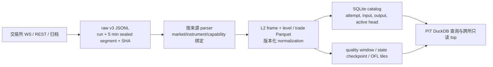
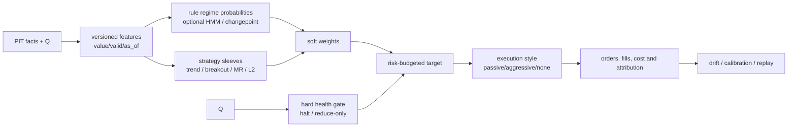

# 多场所数据、L2/L3 与策略执行路线审计

> 审计时点：2026-08-13 01:59 JST。范围仅含本地数据、代码与已登记证据；不审查 UI，
> 不把文档计划当作已投产能力。

## 1. 结论先行

当前项目不是“只有行情采集器”：它已具有可审计的 `raw -> canonical
Parquet -> active head -> DuckDB read` 数据主干。对日元 BTC 现货而言，GMO、bitbank、
bitFlyer 的实时逐笔与 L2 已有生产闭环；OKX 有 BTC-USDT 历史 L2 主干和隔离 live
样本。原件封口、SHA-256、端点/能力修订、可得时间（PIT）、拒绝记录、活动 head 和
L2 质量窗是非常正确的方向。

它目前是**研究级 L2（有来源上限）**，不是 L3，亦不是多市场衍生品/跨所套利级数据
平台。日元三所没有可证明的逐增量无缺口完整性，且 L3 只有 schema/validator，尚无
connector、raw、回放或活动事实。因此近期最有价值的工作不是立刻引入复杂 HMM、GPU
遗传搜索或做市，而是先把 L2 健康、低损耗采集、紧凑研究表、衍生品状态和可复现研究
面板补齐。

本地只读快照：`data/` 为 42.60 GB，SQLite 为约 1.92 GB；活动 head 中 `book_l2`
为 1,208、`trade_realtime` 为 1,025、`trade` 为 1,796、`book_state` 为 4。最近的
质量窗显示 bitbank/GMO 因来源钟相对接收钟为负而 `degraded`，bitFlyer/OKX 为 `ok`；
这不应被解释为 bitbank/GMO 簿错误，而是“网络延迟不可可靠测量”的时钟健康信号。

## 2. 已实现数据链与来源能力



| 来源 | 本地事实状态 | 主要能力 | 可用于 | 不能声称 |
|---|---|---|---|---|
| GMO | 历史逐笔/K线、BTC/JPY realtime trade + L2 已物化 | 30 档全量 WS snapshot、深 REST snapshot、官方成交归档 | 日元趋势、成交量/足迹、L2 状态采样 | L2 连续增量或 L3 |
| bitbank | 多市场历史逐笔、BTC/JPY realtime trade + L2、market status | whole + diff；同 room 单调序，仅能由 whole 重锚 | 三所中最强的 L2 重放证据 | sequence 连续或 checksum 证明 |
| bitFlyer | 近端历史/实时逐笔、BTC/JPY realtime L2 | snapshot + diff，约 5 秒快照定界；全簿 REST | 交叉验证、短周期 order-flow | 断线窗口回补、L3 |
| Coincheck | 小样本/adapter 级 | 无序号 diff | 旁路观察 | 完整历史或决策级 L2 |
| Binance | 归档成交和 adapter 入口 | 长历史 aggregate trade/K线 | 全球参考、低频研究 | 每笔 match 或历史逐档 L2 |
| OKX | BTC-USDT 历史 L2 已物化；live 仅隔离样本 | 400 档官方历史 L2；live sequence | 深度形态与 L2 研究 | live 长期 SLA、L3 |
| Kraken/Bybit/Coinbase/Hyperliquid | documented 或候选 | 各有未来价值 | 探测与设计 | 已接入生产 |
| Coinbase/Kraken/Bitfinex/Bitstamp L3 | L3 合同与证据登记 | Coinbase 完整 MBO 候选；Kraken 限深；Bitfinex 250 订单截断 | 单市场接入验证顺序 | 任何本地 L3 事实 |

规范化的核心判断是正确的：`instrument_id` 只表达经济标的，`market_id`、来源 artifact、
capability revision 和 endpoint revision 仍保留事实所有权；跨所结果只能是新 artifact，
不能覆盖某一交易所事实。`available_time=max(event, receive/ingest)` 也避免了未来数据
泄漏。

## 3. L2 评估：强项、问题与最高水准目标

### 已做得很好的部分

- raw v3 在业务解析前写入 wire payload、payload hash、UTC/monotonic receive clock、
  connection/channel、record sequence；片段封口后有 bytes/records/hash manifest。
- L2 frame 与 level 分表；帧保留 native sequence/checksum 的缺失事实，level 保留
  `snapshot/delta`、`upsert/delete` 语义。v5 不再把局部推断的 predecessor 冒充来源事实。
- 物化以输入集合 hash 幂等，失败/reject/ignore 可审计，SQLite 只做控制面，事实放
  ZSTD Parquet，active head 避免 glob 混入历史版本。
- L2 quality 同时检查 receive silence、重复/回退、锚定、untrusted flag、checksum、
  clock offset 和 materialized freshness；book-state checkpoint 是可丢弃加速层而非真相。
- 已验证的关键合同测试（L2 materialize/quality、segmented L2、realtime trade、L3
  contract）43 项通过。

### 应优先修正或增强的项目

| 优先级 | 缺口或风险 | 为什么影响 L2 水准 | 建议验收 |
|---|---|---|---|
| P0 | `SegmentedRawWriter.write_frame` 每一帧 `fsync` | 高峰会阻塞 WS 消费协程；“更耐断电”可能换来更高的接收漏帧概率 | 先用真实峰值压测记录 write/fsync P50/P99、event-loop lag、socket backlog 与断线率；若超过预算，改为单 writer + 顺序 WAL + 20–100ms/字节阈值 group commit，并把 durable watermark 写入 manifest。未 durable 帧要可数、可告警、不可伪称已提交。 |
| P0 | 时钟质量与簿完整性混成一个 `status` | 来源时间领先本机只说明 offset/同步不可靠，并不说明簿已坏；策略会不必要关停 | 分出 `integrity_status`、`freshness_status`、`clock_status`、`coverage_status`；以 host NTP/PTP offset 为先决健康项，网络延迟只在同步可信时计算。策略按所需维度 gate。 |
| P0 | 日元 L2 无逐增量可证明连续性 | 这属于来源上限，不能通过本地推断消除 | 每个策略输入明确 `snapshot_bounded` 置信上界。bitFlyer 重连至下一 snapshot 前，bitbank whole 未重新锚定前，一律禁止微结构交易信号。 |
| P1 | 五分钟 L2 Parquet heads 过多，snapshot level 行重复 | 1,208 个活动 L2 head 增加 catalog/小文件/全量审计成本；GMO 的全量 snapshot 重复特别大 | 保留 raw 与原始 canonical 语义；另做可重建 compaction artifact：按 `venue/market/date/hour`、按 available/receive time 排序，目标 128–512MB row group。状态层存 periodic checkpoint + delta，不为每个 full snapshot 复制完整研究状态。 |
| P1 | 数值主要是 Decimal 文本 | 精确且安全，但 DuckDB 每次转换文本会放大 CPU、存储和扫描成本 | 原文与 Decimal-text 继续作审计表示；新增 research physical columns：`price_ticks:int64`、`qty_lots:int64`、`notional_atoms:int128/decimal`，并绑定 tick/lot/scale revision。不能只靠 float。 |
| P1 | 30 秒 silence、90 秒 freshness 是全来源常数 | 不同频道与市场活跃度差别巨大，固定阈值误报/漏报 | capability registry 增加每频道 heartbeat、期望更新分位数、最大陈旧度；用历史分位数和连接状态定义告警。 |
| P1 | REST anchor 合同存在而 worker 未生产部署 | 没有独立旁路时，snapshot-bounded 来源的漂移诊断较弱 | 低频、有界队列、限速预算的 shadow worker 先上；仅产出 observation/reconciliation，不回写 WS head。 |
| P2 | 全量 L2 审计在 60 秒命令窗口内未完成 | 深审计是对的，但不应作为实时守护 | materialize 时增量校验；每小时 catalog/hash/row-count；夜间分区深回放；每日全量抽样 + 周期全量审计。 |

“最高水准 L2”在本项目的现实定义应是：**每个状态可追溯到 wire 原件；每次重建可重复；
对缺口有显式、来源能力约束的置信标签；研究表扫描高效；绝不把 L2 的价格档变化解释成
订单、撤单或排队。** 这比追求未经证明的“无漏包 L2”更严谨。

## 4. L3：必要性、缺口与升级路径

L3 不是所有策略的前提。趋势、breakout、低频均值回归、交易驱动 order-flow、L2
imbalance、跨所价差监测都可以先在现有数据上研究。L3 的必要理由是下列问题：排队位置、
订单生命周期、撤单/成交拆分、maker adverse selection、fill probability、真实做市和
queue-reactive execution。没有它，任何“排队优先级/挂单成交概率”回测都只能是模型假设。

现有 `book_l3_contract.py` 的四表设计是正确起点：order event、不可变 evidence、可证明
match link、state checkpoint 分离，且 L3 降维 L2 必须进入 `derived_from_l3` 新数据集。
但还缺：

1. 单来源 connector 与 raw v3 producer；
2. snapshot 前 WS 缓冲、snapshot 获取、按 sequence 重放和断线重建状态机；
3. order-id scope、数量语义、modify 的优先级影响的来源特定 parser；
4. 订单状态守恒、可见深度边界、CRC/checksum、sequence gap 的可执行验收；
5. event/evidence/match/checkpoint 的 Parquet materializer、catalog head、质量窗与 replay；
6. 许可、速率、保留期和容量预算；以及 L3-to-L2 对照测试。

建议顺序是 Coinbase BTC-USD 单市场 → Kraken BTC/USD（接受其深度限制）→ Bitfinex R0
250-order 实验。每一步只在连续运行、重连注入、随机断点重放、订单数量守恒、L3 降维与
源 L2 对照都通过后才扩市场。不要把 Bitstamp 候选或日元三所 L2 强行“升级”成 L3。

## 5. 按现有数据能力的策略优先级

| 优先级 | 研究主题 | 现有数据是否足够 | 说明 |
|---|---|---|---|
| A | 5m–4h 趋势跟随、breakout、波动率目标仓位 | 是 | GMO/bitbank 历史 trade/Kline、三所实时 trade 足够；先用费用/滑点保守模型。 |
| A | 成交量/足迹确认的突破与均值回归 | 是，需按来源分层 | 已有 taker side/footprint；GMO WS 成对打印和未知 side 必须进入质量权重。 |
| A | L2 microprice、spread、深度不平衡、短期 order-flow 条件信号 | 是，限健康窗口 | 只做 taker/短持有的预测与执行 style 选择；不能推广为 queue alpha。 |
| A | 三所 BTC/JPY 价格发现、lead-lag、可交易价差监控 | 部分 | 同 quote 币且已有只读 quorum top；先研究，待费用、私有账户、下单/对账与 legs 风险闭环后才交易。 |
| B | 单市场统计套利/均值回归、波动率状态切换 | 是 | 需先构建 PIT feature/label panel 和 walk-forward 成本验证。 |
| B | L2 LOB 预测 | 研究可行 | 标签必须扣除可得时间、刷新延迟和成本；仅在 quality-ok/bounded 窗口训练。 |
| C | 横截面/多因子 | 尚不充分 | 缺共同报价币、多资产连续 L2/参考价、统一 universe 和 FX artifact。 |
| C | 期现基差、funding arb | 尚不充分 | 缺 funding、mark/index、OI、借贷、合约规格、可执行费率与账户保证金事实。 |
| C | 三角套利/CEX-DEX arb/liquidation | 尚不充分 | 缺三腿同步 quotes/fees/余额、链上 gas/confirmation/MEV、liquidation feed。 |
| D | 做市、网格、queue-based execution | 不应现在做 | 需要 L3 或严格校准的 fill model、私有订单生命周期、库存/风险系统；网格不是低风险替代。 |

推荐先做一个组合而非押注单一信号：**中频趋势/突破为主 alpha，成交量与 L2 作为确认、
仓位/执行调节；跨所只做 shadow dislocation monitor。** 这是现有数据可验证、也最容易
发现数据问题的方向。

## 6. Market State Vector 与 soft-gating 执行管线

建议用可解释的状态向量而不是直接让聚类/HMM 决定交易：

```text
S_t = [T, V, L, F, C, X, R, J, Q]
T = robust multi-horizon return / realized-vol
V = realized vol、range、vol-of-vol
L = spread、可见深度、深度斜率、更新/陈旧度
F = signed trade delta、OFI、microprice displacement
C = funding/basis/borrow（未有数据时 invalid，不填零）
X = 同 quote 币 cross-venue mid/fee-adjusted dislocation
R = cross-asset correlation/dispersion（当前仅低维）
J = jump、gap、交易所状态/事件风险
Q = data-quality vector（integrity, freshness, clock, coverage）
```

每个分量输出 `(value, valid, as_of, provenance, uncertainty)`。缺 `C/R` 不是 0，而是
不可用于依赖它的策略。先用 robust z-score/分位数并按训练窗口冻结；避免把跨来源不同
币种、不同可得时刻的指标混在一起。



建议权重公式为：

```text
raw_i,t = expected_edge_i,t / expected_cost_i,t
confidence_i,t = model_confidence × data_quality_i,t × capacity_i,t
w_i,t = softmax(temperature × clip(raw_i,t)) × confidence_i,t
portfolio_target = risk_budget × normalize(w) × volatility_target
```

另设不可被 soft-gate 覆盖的 hard gate：簿断流/不可信、PIT 不可得、最大陈旧、风险预算、
价格带、交易所或账户异常、连续亏损。状态模型只影响**比例、方向置信和执行急迫度**，不
拥有下单权限。

实施顺序：

1. rule-based baseline：T/V/L/F/Q，冻结阈值、输出 state artifact；
2. 逐策略 walk-forward 校准 soft weights，与“固定 100% 配置”做消融；
3. 加 change-point detection 用作降杠杆和重置窗口，而非预测标签；
4. 数据与样本足够后比较 HMM/cluster；状态数、再训练频率和失败回退必须版本化；
5. River 适合对延迟、漂移、校准做在线监控或小模型实验，但不应在无离线基线和回放
   一致性前成为主决策器。

## 7. GPU、遗传搜索与自动生成的正确位置

仓内 GPU factor-mining 规范在研究隔离、PIT panel、CPU reference、walk-forward、
multiple-testing、artifact promotion 和 SearchFast/ValidationExact 的边界上设计正确，
但仍是规范而非生产研究运行时。应在数据面板先稳定后再启用。

- GPU 适合：多市场、多时间窗因子扫描、参数网格、bootstrap、组合优化、受约束的
  expression search。先建立 CPU 精确参考和目标机微基准，不能用 GPU 弥补数据缺口。
- 遗传/MAP-Elites 适合：在类型化 feature/operator DSL 和固定数据、成本、walk-forward
  门禁内探索；fitness 必须含换手、容量、成本、复杂度和多重检验惩罚。
- LLM 只生成带 hash 的 hypothesis/DSL artifact，不能调用交易所、看 holdout、改风险或
  直接进入 live。生成候选至少经历 static test → PIT backtest → paper/shadow → 人工审批。

## 8. 90 天实现顺序

1. **0–2 周：L2 可靠性与紧凑层。** 对逐帧 fsync 做压测后决定 group-commit；拆分质量
   状态；按来源部署 REST anchor shadow；建立小时 compact L2 research artifact 与整数
   tick/lot 列；加 per-channel SLA。
2. **第 3–5 周：研究最小闭环。** 版本化 feature/label panel、费用和 conservative fill
   model、walk-forward/purged validation、趋势/突破/L2 confirmation 的 paper replay；输出
   PnL、turnover、slippage、data-quality attribution。
3. **第 6–8 周：扩衍生品与 cross-venue。** 单一永续市场接入 funding、mark/index、OI、
   合约规则和可执行 fee；构建显式 FX artifact、持久化 cross-venue aggregate；继续 shadow
   arb，不上真实多腿。
4. **第 9–12 周：L3 单市场试点。** Coinbase 首选，按本报告第 4 节门禁；并行补私有订单
   / fill / position reconciliation。只有 L3 与 execution cost/fill model 同时闭环后，才评估
   做市或 queue 策略。

参考架构文件 `C:\Users\wu_zh\Downloads\crypto_strategy_terminal_final.mmd` 的模块边界可
作为目标蓝图；本项目此阶段应保持“模块化单体、共享数据合同、研究与实盘隔离”，不要在
数据闭环之前拆分微服务或实现完整策略工厂。
