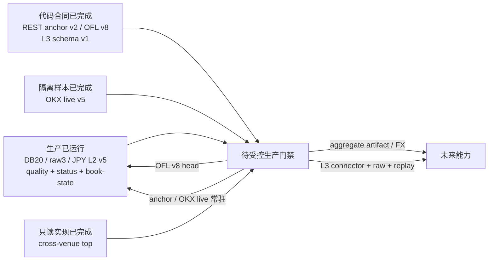

# 2026-08-13 L2 质量与 L3 就绪度验收

> 文档类别：时效快照，登记于
> [docs/00-rules-registry.md](00-rules-registry.md)。
> 冻结时点：2026-08-13 约 01:25 JST；生产数据只读核验。
> 项目根：`C:\Users\wu_zh\dev\guvolu`；数据根：
> `C:\Users\wu_zh\dev\guvolu\data`。
> 本文件发布后冻结；后续变化另发新日期快照，不回写本文。

## 1. 结论

生产主干已稳定在 SQLite schema v20、raw v3、三所日元 L2 物理 schema v3 /
`book-l2-normalization-v5`、实时逐笔 v3、L2 quality v1、bitbank market status v1
和 book-state v2。REST L2 anchor 已完成独立事实、端点、PIT 与比较合同，但生产
`l2_anchor_status` 仍为零行，worker 未部署。OKX live books 已完成三十秒真实隔离
小样本，但生产 live head 为零，也未加入常驻任务。

跨所顶档读取聚合已经实现并在三所 BTC/JPY 上只读返回三名 contributors、
`quorum=true`；它保留 crossed，不做隐式 FX。OFL 当前代码合同为 v8，但生产活动
head 仍全部为 v7，必须经受控重建才能切换。L3 schema v1 已完成四表合同、稳定键
与校验器，仍没有 connector、raw、活动 Parquet head 或 UI。

| 能力 | 代码/合同 | 冻结时点生产状态 | 裁定 |
|---|---|---|---|
| SQLite 控制面 | schema v20，追加迁移 | `user_version=20` | 已部署且结构冻结 |
| 三所日元 L2 | schema v3 / normalization v5 | GMO、bitbank、bitFlyer 均有活动 head | 生产主干 |
| L2 quality | `l2-quality-v1` | 三所各有十八个窗口 | 生产可读 |
| market status | schema v1 / normalization v1 | 仅 bitbank，十一项活动 head | 生产可读 |
| REST anchor | raw schema v1；事实/reconciliation v2 | `l2_anchor_status=0` | 合同完成，未部署 worker |
| OKX archive L2 | schema/norm v2 | 有活动历史事实 | 生产历史主干 |
| OKX live L2 | raw v3；schema v3 / norm v5 | 三十秒隔离样本通过；生产 head 为零 | 样本完成，未生产常驻 |
| 跨所顶档 | PIT/quorum synthetic top | 三所 BTC/JPY 只读实测通过 | 读取期实现，无持久化 aggregate head |
| OFL | schema v2 / method v8 | 生产仍为 v7 | 等待受控重建 |
| L3 | schema v1 四表合同 | 无 connector/raw/head/UI | 仅合同 |

## 2. SQLite 与活动制品只读证据

`meta_schema_history` 的 v20 `applied_at` 为
`2026-08-12T15:33:17.138901+00:00`，即 2026-08-13
00:33:17.138901 JST。生产只读检查结果：

| 检查 | 结果 |
|---|---:|
| `PRAGMA user_version` | 20 |
| `PRAGMA quick_check` | `ok` |
| `PRAGMA foreign_key_check` | 0 行 |
| 活动输出 | 5,167 |
| 登记输出字节 | 24.331 GB |
| 活动输出路径缺失 | 0 |
| 登记大小不符 | 0 |
| artifact 缺 canonical location | 0 |

v20 DDL 在生产落地后冻结；若将来必须改表、列或约束，只能升 v21。离线迁移演练
覆盖 v18 到 v20 和显式 v19 到 v20，迁移保持追加式；旧事实仍按活动 head 和版本
读取，不因迁移原地改写。SQLite 只承载低基数控制与 latest 摘要，大事实仍在
Parquet，DuckDB 只对冻结路径作内存查询。

## 3. 日元 L2、质量、状态与派生

三所 L2 v5 活动 head 数如下。v5 不把 segment 内推断的前驱序号写成来源事实；
来源未提供时 `prev_sequence_id` 保持 NULL。

| 来源 | L2 v5 活动 head | quality 窗口 | 最新 quality 状态 |
|---|---:|---:|---|
| bitbank | 387 | 18 | `degraded` |
| bitFlyer | 387 | 18 | `ok` |
| GMO | 386 | 18 | `degraded` |

最新 quality 窗口结束于 `2026-08-12T16:20:00Z`，计算时刻为
`2026-08-12T16:22:54Z`。`degraded` 是窗口合同输出，不等于可以用 REST 或另一所
补写事实；原因必须从对应窗口的 gap、sequence、reject、深度与延迟字段下钻。

`market_status_observation` v1 只有 bitbank，共十一项活动 head。状态流与 L2 帧
分域；watcher 旁路失败不回滚 L2。book-state v2 在 GMO、bitbank、bitFlyer 与
OKX 各有一个 latest head，它是可丢弃加速制品，不替代 L2 真相。

生产 OFL 活动 head 全为 v7：bitbank、bitFlyer、GMO 各九项，OKX 一项；没有 v8
head。v8 新增同一 OKX 市场内 live 覆盖优先、live 覆盖外 archive gap fallback，
所以不能把代码常量升级误报为生产已切换。切换须生成新 attempt、验证 dependency
与输出散列，再原子推进 head；旧 v7 制品保留可回退。

## 4. REST L2 anchor 的正确性边界

三所 REST 锚点使用精确端点修订，而非仅用本地路由名：

| 来源 | 端点身份 | 可裁决范围 |
|---|---|---|
| bitFlyer | `EP-0001@r0` | 无同序身份，只能 approximate/unknown |
| bitbank | `EP-0003@r0` | REST/WS 序列相等且深度范围一致时可 match/mismatch |
| GMO | `EP-0006@r0` | 无同序身份，只能 approximate/unknown |

每次观察保存独立不可变 REST request/response artifact、请求与响应 SHA-256、
`endpoint_id + revision`、触发原因、`connection_id`、逐档 Decimal、best/depth/hash
及 event/available/ingest time。GMO 保留来源时钟与 signed receive-source offset，
并固定：

```text
available_time = max(event_time, response_receive_time, ingest_time)
```

因此来源时钟领先本机也不会产生提前可见。只有同一来源状态身份且比较深度一致
才能裁决完整簿；GMO/bitFlyer 的零到五秒近邻不能因市场自然变化报 mismatch，
不同深度也只能保留共同范围诊断。

connection-open、reconnect 和 periodic 触发进入后台有界队列；超时、限频、来源
不可用或队列满只形成 `unavailable/unknown`。REST 观察绝不伪装成 WS frame、补写
断流、推进 L2 head 或静默修正 WS。bitFlyer 断线窗口仍不可回补。冻结时生产
`l2_anchor_status` 为零行，证明 worker 尚未部署；合同完成不能写成生产已运行。

## 5. OKX live 隔离小样本

三十秒真实网络样本写入隔离数据根，不触碰生产数据：

| 项 | 结果 |
|---|---:|
| wire / data / control | 278 / 277 / 1 |
| sealed segment | 3 |
| L2 frame / level | 277 / 6,761 |
| rejection | 0 |
| raw 大小 | 约 488,369 B |
| 成品大小 | 约 183,152 B |
| predecessor / duplicate / regression / unanchored | 0 / 0 / 0 / 0 |

checksum 按 OKX 当前协议标 `unsupported`，不能伪报通过；样本 latency 标
`clock_skewed`，PIT 仍以 available time 守门。该结果证明 raw v3 封段、L2 v5
顺序状态机、物化与质量字段在该样本闭合，不证明长期连续、重连恢复或生产 SLA。
生产 OKX live head 仍为零，book-state 生产终态接入也未因此自动成立。

## 6. 跨所顶档读取聚合

`GET /api/v2/aggregates/book/top` 在同一 decision time 冻结明确市场集合，逐市场
应用 PIT、最大陈旧度与质量门禁，再返回 contributors、quorum、synthetic best
bid/ask、中间价中位数和 `crossed`。

三所 BTC/JPY 生产只读小样本返回 HTTP 200、`Cache-Control: no-store`、三名
contributors 与 `quorum=true`。若最高 bid 高于最低 ask，响应显式保留
`crossed=true`，不裁平为零 spread。GMO BTC/JPY 与 OKX BTC-USDT 混合请求返回
HTTP 400；没有显式、PIT 可审计的 FX 制品时，项目不做隐式换汇。

该端点是读取期 synthetic view，不反写来源事实，也没有活动 aggregate Parquet
head。回测级复现仍需把 source set、输入 head generation、decision time、覆盖与
方法版本物化为新 artifact。成交量份额、跨所 VWAP、跨所蜡烛和 FX 制品仍待实现。

## 7. L3 合同就绪度

L3 schema v1 的 canonical dataset 为：

| 数据集 | 作用 |
|---|---|
| `book_l3_order_event` | 一次逻辑订单生命周期事件 |
| `book_l3_event_evidence` | 同一逻辑事件的一份不可变原件观察 |
| `book_l3_match_link` | 可证明的订单与成交关联 |
| `book_l3_state_checkpoint` | 通过某逻辑事件的公开订单态检查点 |

合同显式冻结 native symbol、mapping/capability revision、sequence domain、source
schema revision、order ID scope、数量单位/基准/语义和 priority policy/effect。
order event、evidence、match 与 checkpoint 都使用带 normalization version 的复合
主键；稳定 SHA-256 键构造器避免路径或到达顺序成为身份。一个逻辑事件可关联多份
evidence，但选中 evidence 在版本内冻结，后到观察不得覆盖既有事实。

合同测试五项通过，strict mypy 通过。来源工作簿不入仓，其身份与登记完整性见
[L3 workbook evidence manifest](evidence/crypto_api_l3_registry_2026-08-12.json)：
214,395 字节，SHA-256
`b1e03a9d7c4dfca08788237676e2971fa0fa964f1f4cf8127962702aee471a08`，十个工作表、
七十四个端点，重复 ID、重复自然键与公式错误均为零。manifest 和合同都不是接入
证据；冻结时仍无 L3 connector、raw、活动 head 或 UI。

## 8. 容量与下一步门禁

C 盘可用 90.48 GB，占 18.126%，低于 20% 历史扩量门禁。继续保不可回补三所
实时流，暂停非必要历史扩量和全量派生重建；不得删除 raw、未完成验收的回退制品
或迁移证据来跨过阈值。

后续按以下顺序推进：

1. 在单写窗口受控重建 OFL v8，验证 live/archive 选择、dependency、散列、行数与
   活动 head 后再切换生产；v7 保留回退。
2. 对 OKX live 做受控生产候选运行，补重连、静默、长期 sequence 与 book-state
   checkpoint 验收；通过前不登记常驻任务。
3. REST anchor 先以非阻塞有界 worker 做受控部署，确认频率预算、队列溢出、PIT
   和零 WS 回写；生产状态必须从零行事实变为可审计观察后才算运行。
4. 跨所顶档保持读取期最小实现；只有研究确需复现时再物化 aggregate artifact，
   FX、VWAP 与成交量份额分别建合同，不扩张现有端点语义。
5. L3 依 manifest 选择单来源小样本，完成 connector、快照缓冲、顺序/checksum、
   订单守恒、raw 封口和 L3 降维 L2 对照前，继续只标合同。


