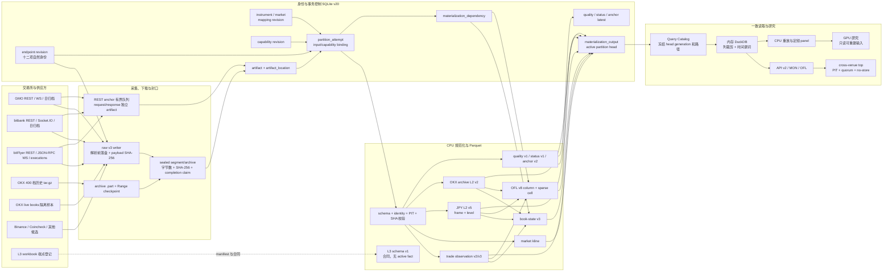

# 2026-08-13 数据平台生产推进与完整审计

> 文档类别：时效快照。项目根为 `C:\Users\wu_zh\dev\guvolu`，数据根为
> 项目内 `data/`。本文只汇总截至 2026-08-13 已保存的代码、冻结合同和审计证据，
> 不把计划、隔离样本或结构合同写成生产能力。本文发布后冻结；后续状态变化另发
> 新日期快照。文档清单登记由 root 在最终交付前完成。

## 1. 技术结论

当前主干已经形成可重复的
`不可变原件 -> 规范化 Parquet -> 派生 Parquet -> 活动 head -> PIT 查询` 闭环。
SQLite schema v20 只承担事务控制、血缘、覆盖与活动指针；大事实在内容寻址
Parquet；DuckDB 只用内存连接读取控制面冻结的明确路径，不形成第二真相库。

GMO、bitbank、bitFlyer 的 BTC/JPY 实时 L2 与逐笔是必须长期保留的生产主轴。
三所事实可做同品种、同报价币、同时间窗的独立交叉验证，但不能逐笔互相对账，
也不能用一所补写另一所。OKX 400 档 BTC-USDT 历史 L2 是独立历史主干；OKX live
v5 仍是隔离样本，不是生产常驻。L3 只有 schema v1 四表合同，没有 connector、
封口 raw、活动 Parquet head 或 UI。

最终全量物化审计的启动冻结集合已经通过：`81,665` 份制品、`4,348` 份物化输出、
`259,919,124` 行，错误为零且 `ok=true`。审计期间另有 `161` 份制品完成登记，
审计器按 closing watermark 记录为警告而非误报；因此 PASS 证明本轮启动冻结集合，
不能把这 `161` 份并发新增登记说成已被同一轮逐文件复核。该轮已经正常结束，
不是仍在运行的中间值。

## 2. 版本与运行身份

| 层或数据域 | 当前版本 | 身份与边界 |
|---|---|---|
| SQLite 控制面 | schema v20 | 追加迁移；维度、端点/能力修订、artifact、attempt、依赖、输出、活动 head 与低基数摘要 |
| 实时 raw | raw v3 | 端点修订、连接/频道、UTC/单调接收时钟、payload SHA-256、封口 segment manifest |
| 日元三所实时 L2 | physical schema v3 / `book-l2-normalization-v5` | frame 与 level 分表；来源没有的 sequence、predecessor 与 checksum 正确留空 |
| OKX 历史 L2 | physical schema v2 / `book-l2-normalization-v2` | 400 档 UTC 日归档；无实时 connection/channel 语义 |
| 实时逐笔 | physical schema v3 / `trade-realtime-normalization-v3` | 保留来源撮合粒度、taker side 口径、端点/连接证据与 raw 行身份 |
| REST L2 anchor | fact/reconciliation schema v2 / `book-l2-anchor-normalization-v2` | 独立请求/响应原件与 PIT；只旁路核验，不补写 WS |
| L2 质量 | `l2-quality-v1` | 五分钟窗口；质量摘要不替代逐帧证据 |
| 市场状态 | schema v1 / `market-status-normalization-v1` | bitbank 独立状态域，不混入 L2 |
| book-state | schema v1 / `book-state-checkpoint-v3` | 可丢弃加速制品；依赖确切 L2 attempt |
| OFL | schema v2 / `orderflow-tile-sparse-v8` | 稀疏列/格；同一 OKX 市场 live 覆盖优先、覆盖外 archive fallback |
| L3 | schema v1 合同 | 四个 canonical dataset；未形成生产事实 |

版本语义变化只生成新 attempt、制品和活动 head，不原地覆盖旧制品。旧 raw
没有记录的端点、连接、频道和单调时钟保持 NULL，并带质量降级；不得按当前注册表
倒填历史。

## 3. 完整数据与控制链



图中的 REST anchor、质量与市场状态是旁路观察，不在 L2 来源事实之前；
cross-venue top 是读取期合成，不产生来源事实。GPU 位于 CPU 完成 JSON、散列、
Decimal、盘口重放和缩放整数转换之后，不能参与原件身份或金额事实生成。

## 4. 主键、血缘与 PIT

核心串联不是单个数据库主键，而是一条可验证复合链：

```text
instrument_id
  -> market_id = venue + native symbol + mapping_revision
  -> artifact_id = SHA-256(immutable bytes)
  -> artifact_location
  -> source_row_index + source_item_index
  -> schema_version + normalization_version
  -> partition_attempt + input_set_hash
  -> endpoint_revision + capability_revision
  -> materialization_dependency(upstream_attempt_id)
  -> output_artifact_id + active_head_generation
  -> available_time <= decision_time
```

`market_id + artifact_id + normalization_version` 是事实所有权、输入字节和转换语义的
核心三元组，但不足以单独证明完整血缘。端点与能力修订说明当时调用的 API 语义，
`materialization_dependency` 说明派生制品消费的确切上游世代，活动 head generation
说明查询读取的版本。派生 attempt 不复制根级能力绑定来冒充再次调用 API。

四个时间字段保持分离：

| 时间 | 含义 | 使用规则 |
|---|---|---|
| `event_time` | 来源经济事件时刻 | 不等于本地得知时刻 |
| `available_time` | 最早可合法使用时刻 | 查询和回测必须满足 `available_time <= decision_time` |
| `ingest_time` | 本地耐久写入时刻 | 回补时是下载时刻，不承担防未来函数职责 |
| `decision_time` | 策略或查询实际冻结输入的时刻 | 与活动 head generation 一起记录 |

REST anchor 对可能领先本机的来源时钟固定使用
`max(event_time, response_receive_time, ingest_time)`。OKX 历史日档以对象
`Last-Modified` 作为最早公开可得时刻的保守代理；旧原件缺失的时钟证据不补造。

## 5. 来源能力、主力与限制

| 来源 | 当前已闭合能力 | 主力用途 | fallback 或互补 | 明确限制 |
|---|---|---|---|---|
| GMO | 官方逐笔日归档、K 线、BTC 实时逐笔、L2 v5、REST anchor v2 | 日元历史成交/K 线主轴；独立 L2 状态采样 | 同所官方归档在完成日作为规范逐笔视图 | L2 无历史 replay、sequence 或 checksum；不等于 L3 |
| bitbank | 多日逐笔、BTC 实时逐笔、whole+diff L2 v5、market status、REST anchor v2 | 三所中序列证据最强的 L2 重放 | whole 按官方算法重锚；同所逐笔按成交 ID 去重 | sequence 只要求同 room 单调，不证明连续；无 checksum/L3 |
| bitFlyer | 近端 executions、BTC 实时逐笔、snapshot+diff L2 v5、全簿 REST anchor | 自有市场事实与跨所独立验证票 | 同所 executions 在有限窗口内回扫 | board 无 sequence；断线窗口不可回补；无官方 K 线主源 |
| OKX archive | BTC-USDT 400 档历史 L2 v2 | 全球深度历史研究与独立形态对照 | 同市场 live 覆盖外可作为 OFL v8 gap fallback | 日档无逐帧 sequence/checksum；不代填 JPY 市场 |
| OKX live | raw v3 / L2 v5 隔离样本 | 验证 parser、顺序、PIT、物化与质量合同 | 未授权生产 fallback | 无常驻任务、长期重连/连续性 SLA 或生产 head |
| Binance | 聚合成交归档契约样本 | 全球参考价与聚合成交研究 | 只在 aggregate 口径下使用 | 不能与 match 级足迹混算；非 JPY 主数据 |
| Coincheck | adapter 与极小实时样本 | 旁路验证 | 不进入主订单流 | 无历史闭环或可证明 L2 replay |
| Kraken / Bybit / Coinbase / Hyperliquid | 能力登记或文档候选 | 后续小分区验证 | 无生产 fallback | 尚无同等本地 raw、物化、覆盖与长期健康闭环 |

同一来源的归档和实时观察可以在规范视图内按确定规则选择；跨来源则始终保留不同
`market_id`。允许跨所聚合的只有同 base、quote、instrument kind、market kind 且
PIT 对齐的参考价、中间价、VWAP、收益率、成交量或质量指标。不同所逐笔、L2 档位
动作、成交 ID、sequence 和私有执行事实不可合并。没有显式、可审计 FX 制品时，
BTC/JPY 与 BTC-USDT/USD 不可混合。

## 6. 回补与缺口边界

| 来源 | 可回补 | 不可回补或禁止 | 正确处理 |
|---|---|---|---|
| GMO | 官方逐笔日归档、官方 K 线 | 历史 L2 | L2 缺口留空；新 snapshot/REST 只重锚当前状态 |
| bitbank | `transactions/{day}` 逐日；后续可按需求接 candlestick | 历史 L2 replay | 来源 404 日保持 blocked，不填零；whole 只重锚 |
| bitFlyer | executions 约三十一日滚动窗口 | 超窗逐笔与全部断线 L2 | 增量游标必须在窗口内推进；L2 缺口永久留空 |
| OKX | 400 档 BTC-USDT 按 UTC 日历史 L2 | JPY 市场与未核 5000 档 | 只回补同一 OKX market；missing/pending 明示 |
| Binance | 当前聚合成交归档 | JPY 三所事实、match 级成交与历史 L2 | 只作为 aggregate 全球参考 |
| L3 | 无 | 任何 L3 历史或生产事实 | 合同保持空；完成 connector/raw/replay 门禁后再写 |

2026-08-13 约 04:02 至 17:56 JST 的三所实时 L2 停机窗口不能由另一交易所、REST
锚点或后验推断补写。逐笔可以按各自同所官方窗口另行回补，但这不会恢复原实时
wire 身份。bar、OFL、质量窗口和研究 panel 必须把缺口标为 incomplete/gap，不能
插值为零成交或连续盘口。

## 7. 存储与日增策略

| 存储 | 正确职责 | 不承担的职责 |
|---|---|---|
| raw/archive 文件 | 不可变来源真相、重放输入、逐文件散列证据 | 不作低延迟查询表，不因空间删除或改写 |
| SQLite schema v20 | 低基数维度、端点/能力、artifact location、attempt、依赖、覆盖、活动 head、摘要 | 不存大规模逐笔、K 线或 L2 重复副本 |
| Parquet | 可重建 canonical facts、质量和派生；ZSTD、列裁剪、时间谓词 | 不是无血缘的目录 glob 数据湖 |
| DuckDB in-memory | 按 Query Catalog 冻结路径构建和读取；小时/日研究扫描 | 不持久化 `.duckdb` 第二真相库 |

实时 raw 以五分钟或容量封段是恢复边界，不是事实语义。长期可增加小时 compaction
artifact 减少小文件，但必须保留所有输入 artifact 和 dependency，生成新 attempt/head，
不能覆盖原段。价格与数量继续保留 Decimal 审计表示；研究物理层可新增绑定 tick/lot
修订的缩放整数，GPU 只接收经 CPU/PIT 门禁后的研究数组。

C 盘最终可用空间与比例由 root 在交付前重新读取并回填。本轮已保存的冻结证据已低于
20% 历史扩量门禁，因此结论不依赖最终小数：暂停 OKX 冷历史、其他币种 L2 和非必要
全量派生扩量，优先保不可回补实时流；低于 10% 时只保不可回补实时流。不得删除 raw、
隔离证据、未验收回退制品或迁移证据来跨过阈值。

## 8. 审计与隔离证据

最终全量审计 PASS 证据为
`logs/materialization-full-audit-closure-20260813.log`：

| 指标 | 值 | 解释 |
|---|---:|---|
| `artifacts_checked` | 81,665 | 启动时冻结的制品与位置证据集合 |
| `outputs_checked` | 4,348 | 被审计的物化输出，不等同活动 head 数 |
| `rows_checked` | 259,919,124 | 各输出行计数之和；不同数据集粒度不可相加解释为市场事件数 |
| `warnings` | 161 | 审计期间新增制品登记；closing watermark 警告 |
| `errors` | 0 | 冻结集合没有散列、契约、路径或关系错误 |
| `ok` | `true` | 本轮冻结集合 PASS |

同轮审计已包含 `raw/rest/book_l2_anchor/**/*.json` 的反向登记检查。此前发现的
`218` 份 REST anchor raw 已逐文件执行恢复入口：`22` 份完成新恢复，`196` 份判定为
`already_recovered`，失败为 `0`；原始字节未被改写。证据日志为
`logs/rest-anchor-recovery-20260813.log`。恢复只追加独立 anchor/reconciliation 事实，
不会改写 WS L2、book-state 或另一交易所事实，也不会让旧或等时观察回退活动 head。

该 PASS 形成前保留了两份 2026-08-13 可恢复隔离证据，不删除、不进入活动查询：

1. `data/quarantine/materialized-orphans/2026-08-13/sha256-fe10b7497e127ba9769439548b7a6b81ff9655855a2c3bd6fca765715c5f1be0-part-fe10b7497e12.parquet`
2. `data/quarantine/materialized-orphans/2026-08-13/sha256-30471c89fdb8f0b5831f17c2d1dfd08105114e3d9f30c6bcc71ce08307c465b9-part-30471c89fdb8.parquet`

文件名保留完整 SHA-256 身份；隔离是从可发现生产路径移出并保留证据，不是修正
Parquet 内容。若将来恢复，必须重新验证散列、attempt、input、output、dependency、
manifest 与活动 head，不能按文件名直接注册。既有 raw
`data/raw/2026-08-08/ws_public.jsonl:42288` 的 65-byte 畸形尾片段继续保持原样，
另有 `data/quarantine/raw-corruption/2026-08-08-ws-public-line-42288.json` 证据；
它不因本轮物化 PASS 变成合法 JSON。

## 9. 局限与当前质量裁定

- 全量审计 PASS 是血缘、路径、散列、结构和计数的完整性证据，不证明实时来源没有
  交易所侧漏包、网络断流或不可测延迟。
- 当前聚合读取可达到三所 contributors 与 quorum，但整体质量仍可能因来源时钟、
  陈旧度或质量窗口标为 `degraded`；不能只凭 quorum 写成健康。
- GMO 与 bitFlyer 没有可比较原生 L2 sequence，REST anchor 只能
  `approximate/unknown`；只有 bitbank 同序、同深度范围时可裁决 full-book
  `match/mismatch`。
- OKX live 只证明有界样本。生产常驻、重连、静默检测、长期 sequence、book-state
  终态和容量验收仍未完成。
- L3 只有合同。没有 L3 时，queue position、订单生命周期、撤单与成交拆分、maker
  adverse selection 和 fill probability 只能是模型假设，不应进入做市回测事实。
- 精确的最终磁盘余量、运行进程唯一性、checkpoint 新鲜度和最终测试总数仍是动态
  运行态，待 root 在交付门禁时回填；本文不猜测这些终值。

为避免把仍在变化的运行数字冻结进本文，root 最终只需定位并替换以下标记：

| 占位标记 | 回填内容 |
|---|---|
| `ROOT_FILL_FINAL_AUDIT_SUMMARY` | 最新全量复核结束态、冻结水位与精确计数 |
| `ROOT_FILL_REST_RAW_REPAIR_SUMMARY` | REST raw 扫描、recovered、idempotent 与失败数 |
| `ROOT_FILL_DISK_CAPACITY` | C 盘最终 FreeGiB、FreePct 与容量门禁裁定 |
| `ROOT_FILL_RUNTIME_PROCESS_UNIQUENESS` | collector、watcher、API 的唯一性和 PID 证据 |
| `ROOT_FILL_CHECKPOINT_FRESHNESS` | 各不可回补流与 watcher 的最新 checkpoint 年龄 |
| `ROOT_FILL_FINAL_TEST_TOTAL` | 最终精准测试通过、失败与跳过总数 |

## 10. 后续顺序与验收

1. root 回填最终磁盘余量、进程唯一性、checkpoint 新鲜度和测试总数，并把本文登记
   到 `docs/00-rules-registry.md`。
2. 对审计期间新增的 161 份制品再做下一轮增量或全量审计；只有新冻结集合 PASS
   后才能说结束时集合同样被覆盖。
3. 保持六条三所 BTC/JPY 实时流和四个单写物化 watcher；先恢复不可回补数据连续性，
   后安排同所逐笔回补。
4. 在磁盘回到 20% 门禁以上前暂停 OKX 历史扩量、其他币种 L2 和大规模 compaction。
5. OKX live 依次通过生产候选、重连注入、长期 sequence/静默、book-state、OFL 与容量
   验收后，才允许活动 production head 和守护任务。
6. L3 先选单来源单市场，完成 connector、snapshot 前缓冲、sequence/checksum、订单
   守恒、raw 封口、Parquet、质量窗、断点重放与 L3-to-L2 对照后再扩展。
7. 前端继续只消费 Query Catalog/API 成品：显示 source、market、version、as-of、
   freshness、quality、coverage/gap、head generation 与 fallback 原因；UI 不自行 glob、
   聚合、补洞或选择来源。

## 11. 进一步问题

- 审计期间新增的 161 份制品在下一冻结集合中是否全部通过？
- C 盘恢复到 20% 以上需要迁移多少已封口冷历史，且迁移后如何保留 artifact location
  与 canonical location 的原子切换？
- OKX live 的生产候选要运行多久，才能覆盖重连、低活跃和峰值三类状态？
- 首个 L3 来源是否具备许可、保留期、稳定 order ID、可重放 sequence 和容量预算？
- 小时 compaction 的目标文件与 row group 是否应由连续 P50/P95 实测决定，而不是
  预设固定大小？

## 12. 证据范围

本报告的稳定设计依据为
[架构与台账](architecture.md)、[分析物化与血缘设计](materialization-design.md)、
[订单流事实契约](order-flow-data-contract.md)、[来源能力对照册](venue-capability-matrix.md)
与 [L2/L3 冻结验收](2026-08-13-l2-quality-and-l3-readiness.md)。易变 PASS 数字只来自
`logs/materialization-full-audit-closure-20260813.log`；后续日志不能回写本文。
