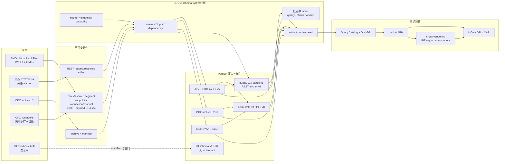

# guvolu 架构与未决项台账

> 本文档区分两类内容：
> - **【已锁定】** —— 由 [SKILLS.md](../SKILLS.md) 铁律推导，不经讨论不得变更。
> - **【TBD-nn】** —— 尚未确定，讨论后回填。**任何人不得擅自实现 TBD 项**（A-05）。
>
> 更新日期：2026-08-13
>
> 当前项目根为 `C:\Users\wu_zh\dev\guvolu`；`GUVOLU_DATA_ROOT=data`
> 解析为 `C:\Users\wu_zh\dev\guvolu\data`。路径是部署位置，不进入
> `market_id`、`artifact_id` 或事实主键。

## 1. 系统全景

```text
┌────────────────────────────────────────────────────────────┐
│  Public API / Public WS   （行情，无需密钥，不消耗私有额度）    │
└───────────────────────────┬────────────────────────────────┘
                            │
        ┌───────────────────┴───────────────────┐
        │                                       │
┌───────▼─────────┐                   ┌─────────▼────────┐
│  READ_ONLY 密钥  │                   │   TRADE 密钥      │
│  REST × 13      │                   │  order           │
│  Private WS × 4 │                   │  changeOrder     │
│  ── 唯一真相源 ── │                   │  cancelOrder(s)  │
│      (T-03)     │                   │  cancelBulkOrder │
└───────┬─────────┘                   └─────────┬────────┘
        │                                       │
        └── intent_id（本地先落盘）↔ orderId ───┘
                  （关联键为交易所 orderId，T-05）

进程隔离：
  [研究进程] 无 TRADE 密钥 (T-13)   [执行进程] 持有两把   [控制面 UI] 见 §4
```

### 语言基线（提案 2026-08-06）

服务端一律 Python（C-01）；UI 为 TypeScript（TBD-12 已锁定）；自定义 GPU 核为 CUDA C++。Rust 不作为并行语言，仅当同时满足以下五条时以 PyO3 单 crate 扩展进入：Python 实现已被测试锁定、实测证据表明性能不足且 Python 侧优化用尽、边界为纯函数且仅过数值域（金额域 Decimal 不过 FFI，G-05 闸门留在 Python 侧）、CI 与合规脚本同步扩展、C-01 完成修订。向量化优先经 Polars 等 Rust 内核库获得性能，不自持 Rust 代码。候选入口限于：事件驱动回测热循环、高频数据录制器、延迟敏感执行核心（当前交易所限速下不成立）。

**【已锁定】** 三类进程的密钥持有关系：

| 进程 | READ_ONLY | TRADE | 说明 |
|---|---|---|---|
| 研究 / 回测 / GPU 因子 | 只读历史数据即可 | **绝不持有** | T-13 |
| 执行 | 持有 | 持有 | 两个 client 类隔离（T-02） |
| 控制面 UI | 经执行进程代理 | 经执行进程代理 | UI 不直接持密钥 |
| kill-switch | 不涉及 | 持有，独立入口 | T-07，不依赖上述任何进程 |

## 2. 数据血缘（D-01）

**【已锁定】** 单向流动，禁止跨层依赖与回写上游：

| 层 | 内容 | 可变性 | 关键约束 |
|---|---|---|---|
| `raw` | 原始 API 响应原样存档 | **不可变** append-only | D-02；含 `ingest_time` |
| `normalized` | 结构化、类型化、Decimal 化 | 可重建 | D-07 金额不落浮点 |
| `feature` | 因子（GPU 产物） | 可重建 | D-04 point-in-time；D-09 带 code_version |
| `signal` | 策略判断 | 可重建 | 纯函数产物（C-02） |
| `intent` | 待执行下单意图 | append-only | 含 `intent_id`（T-05） |
| `order` | 交易所受理的委托 | 由 READ_ONLY 确认 | T-03 |
| `execution` | 实际成交 | 由 READ_ONLY 确认 | U-01 与 order 不混用 |
| `pnl` | 盈亏与绩效 | 可重建 | 可回溯至 raw（X-08） |

**【已锁定】时间四元组分列存储**（D-03）：`event_time` / `available_time` / `ingest_time` / `decision_time`，修订以 `revision_id` 表达。

**【已锁定】** 除 `raw` 与 `intent` 外，所有层**必须可从上游完整重建**。重建结果与原值不一致即视为缺陷。

**【已锁定，2026-08-13 版本边界】** SQLite schema v20 只承载维度、端点/能力
修订、连接/频道观察、artifact、覆盖、attempt、依赖与活动 head 等事务控制；大规模
逐笔、K 线、L2 与派生事实承载于内容寻址 Parquet。DuckDB 只以临时内存连接
构建或查询控制面冻结的明确 Parquet 路径，不形成 `.duckdb` 真相库。实时采集使用
raw v3；三所日元市场 L2 为物理 schema v3 / `book-l2-normalization-v5`，实时
逐笔为 schema v3 / `trade-realtime-normalization-v4`；OKX 历史 L2 保持物理
schema v2 / `book-l2-normalization-v2`。OFL 当前代码契约为 schema v2 /
`orderflow-tile-sparse-v8`；book-state 当前代码契约为 schema v1 /
`book-state-checkpoint-v3`。版本切换只通过新 attempt 与活动 head，不原地覆盖。
旧 raw v1 不补造当时未记录的端点修订、连接/频道与单调时钟，重投影时相应列为
NULL 并带质量降级。

质量与旁路观察各自保持独立域：`l2-quality-v1` 生成五分钟质量窗口，bitbank
市场状态使用 `market-status-normalization-v1`，三所 REST 盘口锚点使用独立不可变
raw artifact 与 schema v2 / `book-l2-anchor-normalization-v2` 事实。REST 锚点只做
状态旁路核验，不伪装成 WS L2 事件、不补写断流，也不静默修正 WS 事实。SQLite
schema v20 的低基数 latest 摘要只服务运维读取，大事实仍在 Parquet。REST anchor
worker 嵌入三所 L2 采集进程，按连接打开、重连与 300 秒周期触发，不另设常驻
进程。

能力证据只在没有上游依赖的完成 attempt 上直接绑定。book-state、
OFL 和 reconciliation 等派生 attempt 不复制上游的
`partition_capability_binding`，而是通过 `materialization_dependency`
的精确递归闭包追溯到血缘根。通用审计要求每个血缘根都直接绑定
当时已实现且可用的能力修订，依赖无环、上游已完成，且每份由其他
attempt 产生的输入制品都有对应的直接生产依赖。因此派生事实不伪装成
再次调用 API，仍能完整证明所有根级来源能力。

**【已锁定，多源不变量】** 执行事实只认对应执行所的 READ_ONLY 结果；只读来源
适配器不得触达执行写路径；每个市场的原始事实始终以 `market_id` 隔离；来源没有
提供的序号、校验和、订单 ID 或历史窗口必须正确留空。跨所比较只能生成带
`source_set`、覆盖率、方法版本和 PIT 的新派生制品，不能回写或代填来源事实。



图中 REST anchor、quality 和 market status 都是旁路观察，不在 L2 箭头之前；
跨所顶档聚合是读取期合成，不形成来源事实。OKX live 隔离样本与生产活动 head
也必须分别表述。L3 的结构仅由
[workbook evidence manifest](evidence/crypto_api_l3_registry_2026-08-12.json) 登记，
没有连接器、raw 或活动事实。

### 待定项

| 编号 | 未决问题 | 备注 |
|---|---|---|
| **TBD-01** | 存储引擎选型（SQLite / DuckDB / Parquet + 文件 / 时序库） | 【已锁定 2026-08-11，2026-08-13 对齐】原件文件为不可变真相，SQLite schema v20 为事务控制面，Parquet 为可重建事实与分析面，DuckDB 只构建和查询活动头指定的 Parquet，不另设 `.duckdb` 真相库。旧 SQLite 热事实仅为迁移兼容，不是新主线。契约见 [materialization-design.md](materialization-design.md) |
| **TBD-02** | `raw` 层落盘格式与分区策略（按日 / 按品种 / 按端点） | 【已锁定 2026-08-12 实时主线】raw v3 按 domain/venue/symbol/run 分目录、按五分钟或容量封段；逐行绑定 endpoint revision、connection/channel、双接收时钟和 payload SHA-256，封口段另有 artifact SHA-256 manifest。历史归档仍按来源日期/游标分区。见 [materialization-design.md](materialization-design.md) |
| **TBD-03** | 行情采集粒度（逐笔 trades / 盘口快照频率 / klines 周期集合） | 最小长期集合与扩市场门禁见 [order-flow-data-contract.md](order-flow-data-contract.md) 第 5 节和 [runtime-ops.md](runtime-ops.md) 第 8 节 |
| **TBD-04** | 历史数据回补方案与冷启动流程 | GMO 边界与多源边界分开；OKX 400 档已具日期范围求缺、磁盘门禁、日级下载/物化、回补台账与全分区审计，热/冷范围由容量策略决定。Bybit 历史盘口未核阻断，Binance 衍生品只有聚合深度。易变覆盖见 [2026-08-13 L2 质量与 L3 就绪度快照](2026-08-13-l2-quality-and-l3-readiness.md)，流程见 [materialization-design.md](materialization-design.md) 第 11 节 |
| **TBD-05** | 数据保留策略（raw 永久保留？归档压缩？） | raw 不可变保留、Parquet 可重建且旧活动头可回退；空间门禁与冷盘迁移见 [runtime-ops.md](runtime-ops.md) 第 8 节 |
| **TBD-06** | `schema_version` 的具体版本管理与迁移机制（D-06） | 【已锁定 2026-08-11】SQLite 用单调 `PRAGMA user_version` 与 `meta_schema_history`；Parquet 的 schema 与 normalization 分别版本化，语义变化新版本重建，不覆盖旧制品。见 [materialization-design.md](materialization-design.md) |

### 多源扩展待定项

多源事实依据见 [2026-08-07 多交易所 API 调查](2026-08-07-multi-venue-api-survey.md)，
现行能力与路由分别见 [来源能力对照册](venue-capability-matrix.md) 和
[物化设计](materialization-design.md)。执行域不多源（T-03）不属未决项。

| 编号 | 未决问题 | 备注 |
|---|---|---|
| **TBD-23** | 多源接入范围与优先级 | 三家日元所、Binance 聚合成交和 OKX BTC-USDT 历史 L2 已进入分层物化；OKX live books 已通过真实隔离小样本，但尚未进入生产常驻与连续性验收。Coincheck 旁路和其余全球来源尚未达到同等闭环。L3 当前只有数据合同与 workbook 清单，没有生产 connector 或活动 L3 事实。易变覆盖与计数只见 [2026-08-13 L2 质量与 L3 就绪度快照](2026-08-13-l2-quality-and-l3-readiness.md)，契约见 [materialization-design.md](materialization-design.md) |
| **TBD-24** | 跨源标识与品种映射规范 | 【已锁定 2026-08-11】`instrument_id` 表示跨源品种；`market_id` 固化来源品种及映射修订；`artifact_id` 固化原件字节；`normalization_version` 固化转换语义。非重合数据以 `market_id` 隔离，不以时间价格猜测合并。见 [materialization-design.md](materialization-design.md) |
| **TBD-25** | 跨源一致性裁决与参考价合成 | 【已实现读取层基础面】`GET /api/v2/aggregates/book/top` 对同 base/quote/instrument/market kind 的活动顶档做 PIT synthetic consolidated top，返回 contributors、quorum、NBBO/mid median、质量与 crossed，且 `no-store`。无隐式 FX；不兼容市场返回 400。该读取结果不反写来源事实，也不等于持久化聚合制品；可重复研究仍需另建版本化 artifact。见 [来源能力对照册](venue-capability-matrix.md) 第 9、10 节 |
| **TBD-26** | 商业数据供应商引入判定 | 当前不成立；只有订单队列级回测要求超过 OKX 已核 400 档历史产品保真度，且其他来源无官方回放、自录样本不足时触发；Bybit 未核能力不计入可用供给 |
| **TBD-27** | 只读来源的密钥与进程边界是否上升为铁律 | 2026-08-11 已为账户资产接入 bitFlyer `GET /v1/me/getbalance`：仅接受 `READ_ONLY` 凭据、客户端不暴露交易/出金/划转方法、缺省凭据在 UI 明示为“未配置”。提案见同文档第 2 节不变量二；是否上升为全局铁律仍待确认 |
| **TBD-28** | 足迹图实现范围与形态 | 提案 2026-08-07 见 [footprint-design.md](footprint-design.md) 第 1 至 5 节；阶段一（数据层与派生层）2026-08-08 已实施：聚合服务（`data/footprint.py`）、`/api/footprint`、第六型三级细节度、Delta 与 CVD 窗格、POC 与价值区线、当期 bar live 标注、归档后验两断言入采集器；双基准供给（第 4 节）2026-08-09 已实施：格与 bar 金额基准字段、前端足迹接入基准开关 |
| **TBD-29** | 盘口判读标注与 book_feature 派生事件表 | 2026-08-10 增补 `analysis_run` 全判定台账、逐条件子分、基线与源码身份；`book_feature` 仅保留成立事件并引用 run。同日续补（库 v6）：台账加数值基准与窗列数两列、检索端点 `GET /api/analysis-runs`；区域分析与档带追踪响应加视界截断旗标（footprint-design 6.9 节）。自动扫描仍未实现 |
| **TBD-30** | 判读层阈值标定方法 | 提案见同文档第 8 节序二，方法细则待开题时补 |
| **TBD-31** | 保活链与进程操作端点 | 公共市场数据采用登录启动加五分钟幂等守护；包含三所 L2、逐笔、L2/逐笔物化、book-state 与 OFL 四类物化任务，不含交易进程。进程管理器仍按命令行收编，拉起幂等。见 [runtime-ops.md](runtime-ops.md) |
| **TBD-32** | 法币汇率来源（美元系对照的汇率腿） | 仍未实现；任何 USD/USDT 与 JPY 比较必须使用独立、PIT 可审计的 FX 制品，缺 FX 时保持不同 instrument，不直接换算 |
| **TBD-33** | 报警规则实例与 alert_event 派生表 | 提案 2026-08-08 见 [footprint-design.md](footprint-design.md) 第 6.8 节；随 OFL 页实施；提案实施中（2026-08-09）后端半场：`alert_event` 表（schema v3）、规则实例配置 `config/alert_rules.json`、报警清单与确认端点、区域判读落库即流上匹配；2026-08-10 规则实例增带几何维度（band_bp 标准带或显式价带，匹配器按规则带评估，缺省沿用请求带并记录来源），缺省规则带几何按复核快照 4.4 节再现几何取值；自动检测器属 TBD-30 未做 |
| **TBD-34** | LLM 决策管线的输入输出构造与台账 | 提案 2026-08-09 见 [llm-pipeline-design.md](llm-pipeline-design.md)；研究进程内、无下单通路、输入内容寻址、输出 schema 校验 |

## 3. 执行架构

**【已锁定】下单状态机**（由 T-03 / T-05 / T-06 推导）：

```text
  生成 intent（含 intent_id，先落盘）
        │
        ├─ 风控闸门（T-11 限额 + R-03 服务状态 + T-09 品种白名单）
        │
        ▼
  TRADE 发送请求 ──┬─ 明确成功 ─┐
                  ├─ 明确失败 ─┤
                  └─ 超时/网络错 ┤
                                ▼
                     READ_ONLY 查询实际状态（T-06，绝不盲重发）
                                │
                                ▼
                     以 READ_ONLY 结果为准更新状态（T-03）
```

**【已锁定】双通道对账**（R-08）：WS 实时回报驱动状态更新，定时 REST 全量快照校验；不一致时以 REST 为准并计入熔断计数。

**【已锁定】** 重连后必须拉全量快照对账，不得假设增量连续（C-10）。

### 待定项

| 编号 | 未决问题 | 备注 |
|---|---|---|
| **TBD-07** | 定时全量对账的周期 | 需权衡 20 req/s 限速（R-04） |
| **TBD-08** | 多策略并存时的委托归属与资金分配机制 | 【提案 2026-08-14，paper 分配已实现】研究层已实现质量硬门禁、状态家族上限、风险/换手/不确定性惩罚和风险余量；执行层委托归属、账户库存与资金锁定仍未决，paper 权重不得解释为实盘授权。见 [策略研究管线](strategy-research.md) |
| **TBD-09** | 状态持久化方式与进程重启恢复流程 | 与 TBD-01 关联；现行断点、恢复与单写边界见 [runtime-ops.md](runtime-ops.md) 第 7、8 节 |
| **TBD-10** | 熔断阈值具体数值（R-02 的 N 次、断流秒数、余额异动比例） | |
| **TBD-11** | 是否使用 `changeOrder`，还是统一 cancel + replace | 报告第 7 节倾向后者 |

## 4. 控制面 / UI-UX 架构

**【已锁定】** 由 X 章推导的不可变约束：

1. **UI 关掉，交易与风控照常运行**（X-01）——UI 是观察与干预窗口，不是运行时依赖。
2. **模式三态全局可见**：`查看` / `dry-run` / `live`，`live` 需二次确认并明示将触碰的端点（X-02、T-04）。
3. **Kill-switch 全局常驻**，视觉最高优先级，不经策略进程（X-03、T-07）。
4. **金额必标语义**：`amount` 与 `available` 分别显示，禁止「余额」（X-04、U-03）。
5. **限额只能调低**，同屏显示「当前值 / 硬顶」（X-05、T-11）。
6. **陈旧数据显式标记**，断流显示「陈旧」，绝不静默显示旧值（X-06）。
7. **研究视图与实盘操作按钮不同屏**（X-09）。
8. **可下钻血缘**：持仓/挂单 → intent → signal → factor → raw（X-08、D-01）。
9. **文案严格使用术语表中文列**（X-07、第 7 章）。

**【已锁定】视图分区**（三类，互不混同）：

| 分区 | 用途 | 是否含写操作 |
|---|---|---|
| 监控 | 实时持仓、挂单、成交、余力、连接健康度 | 否（kill-switch 除外） |
| 操作 | 模式切换、限额调整、策略启停、手动干预 | **是**，全部需二次确认 |
| 研究 | 因子探索、回测结果、绩效归因 | **否**（X-09） |

### 待定项

| 编号 | 未决问题 | 备注 |
|---|---|---|
| **TBD-12** | 技术栈 | 【已锁定 2026-08-05，2026-08-06 修订】FastAPI + React + TypeScript + Vite；Lightweight Charts 为时间轴交易图唯一引擎，ECharts 只在统计分析图确有需求时引入。依据 [ui-design.md](ui-design.md) 第 3 节 |
| **TBD-13** | UI 与执行进程的通信协议 | 【已锁定 2026-08-05】查询服务独立进程，HTTP JSON + WebSocket 推送，依据 docs/ui-design.md 第 2 节 |
| **TBD-14** | 认证与访问控制 | 【已锁定 2026-08-05】仅绑定 127.0.0.1 + 本地令牌文件，依据 docs/ui-design.md 第 2 节 |
| **TBD-15** | 图表与可视化方案、刷新频率 | 现行信息架构与视觉正确性见 [ui-design.md](ui-design.md) 第 4、6 节；MON 盘口见 [mon-orderbook-design.md](mon-orderbook-design.md) |
| **TBD-16** | 告警通道（桌面通知 / 邮件 / 其他） | 告警页面与交互见 [ui-design.md](ui-design.md) 第 7 节；外部通道仍待定 |
| **TBD-17** | 多策略并存时的界面组织方式 | 与 TBD-08 关联 |

## 5. 研究 / GPU 因子管线

**【已锁定】**：

1. 独立进程，**永不持有 TRADE 密钥**（T-13、G-01）。
2. 只读 `raw` / `normalized`，**不回写**（G-02、D-01）。
3. 结果可复现：固定种子 + 记录 CUDA/驱动/库版本 + `code_version`（G-03）。
4. 因子准入须通过 point-in-time 检验与样本外验证（G-04、D-04）。
5. **float / Decimal 闸门**（G-05）——全项目**唯一**允许两域相接的位置，必须单测覆盖：

```text
  [数值研究域]  float32/float64        ← 因子计算、统计、模型
        │
        ▼  唯一转换函数（按 tickSize / sizeStep 取整）
  [金额域]      Decimal                ← 下单参数、余额、盈亏
```

研究进程可以只读原件做审计，但 GPU 核的输入边界固定在活动 Parquet 事实经内存
DuckDB 列裁剪、CPU 完成 schema/PIT/散列验证、盘口重放与 Decimal/缩放整数转换
之后。GPU 不接触网络、JSON、压缩、SQLite 写入或 Parquet 编码，也不把研究结果
回写事实层；其输出是带输入 artifact/head generation、方法与代码版本的可重建制品。

### 待定项

| 编号 | 未决问题 | 备注 |
|---|---|---|
| **TBD-18** | GPU 技术栈（CuPy / PyTorch / RAPIDS / 原生 CUDA） | 【目标机基准 2026-08-14】RTX 5070 12 GB / compute 12.0 已用 PyTorch 2.11 cu128 跑通 SearchFast f32 与 CPU f64 数值对照；首阶段采用隔离 PyTorch worker，后续以全管线 profile 决定是否下沉原生 CUDA。CuPy/RAPIDS 暂无引入证据。见 [策略研究管线](strategy-research.md) |
| **TBD-19** | 因子库的组织方式与注册机制 | 【提案 2026-08-14，typed CPU reference 已实现】六个流派使用带 shape/unit/frequency/availability/missing policy/numeric domain 的规范 AST；expression identity 绑定公式，candidate identity 绑定表达式与规范参数。公共子表达式 DAG 与 typed mutation/crossover 已实现，长期 promotion registry 仍未决。见 [策略研究管线](strategy-research.md) |
| **TBD-20** | 回测引擎形态（事件驱动 / 向量化 / 两者） | 【提案 2026-08-14】中频系列已用向量化 CPU walk-forward；被动网格已用 L2 事件重放实现 snapshot 成交上下界、库存、gap 与逆向选择 shadow。私有 fill、queue、撤单失败仍未闭合，因而权重固定为零。见 [策略研究管线](strategy-research.md) |
| **TBD-21** | 因子存储格式与版本管理 | 【已锁定 2026-08-11 基础面，2026-08-14 扩展】规范化事实先以内容寻址 Parquet 物化；研究层已新增内容寻址紧凑面板、特征、label/cost/replay、全候选 trial ledger、目标位置与 manifest，并以 SQLite 原子注册表实施 adaptive exposure、一次性 holdout vintage、开始前冻结计划和逐决策不可变前向预测。完整因子生命周期/promotion registry 仍随 GPU 阶段定义。见 [materialization-design.md](materialization-design.md) 与 [策略研究管线](strategy-research.md) |
| **TBD-22** | 硬件环境（GPU 型号、显存、是否本机） | 【已测 2026-08-14】本机 Windows、RTX 5070 12,227 MiB、compute 12.0、驱动 580.88；Windows TDR 约束要求 GPU 计算分块并保持独立进程。 |

### 外部参考评估

`gpu-factor-mining-v1.1/` 为仓库内外部引入资料（合规扫描排除，完整性由其 MANIFEST.json 逐文件 SHA-256 保全）。采纳、改制与拒绝的完整结论见 [docs/2026-08-05-gpu-factor-mining-adoption.md](2026-08-05-gpu-factor-mining-adoption.md)；其三项修订提案已于 2026-08-05 确认采纳，落地为 D-03/D-04 修订与 G-06 至 G-08 新增。受影响项：TBD-01/02/03、TBD-09、TBD-15、TBD-17、TBD-18 至 TBD-22。

## 6. 实施顺序建议

不构成锁定，供讨论：

| 阶段 | 内容 | 依赖 |
|---|---|---|
| 0 | 规则与文档基线 | 已完成 |
| 1 | API 边界层（签名、两个 client、public、WS）+ 录制回放测试 | 无 TBD 阻塞 |
| 2 | kill-switch 独立入口（T-07） | 阶段 1 |
| 3 | raw 层采集与落盘 | **TBD-01/02/03** |
| 4 | normalized 层 + 对账状态机 | 阶段 3、TBD-07/09 |
| 5 | 风控闸门 + dry-run 执行器 | 阶段 4、TBD-10 |
| 6 | 控制面 UI 最小版（监控 + kill-switch） | **TBD-12/13/14** |
| 7 | 回测框架 | **TBD-20** |
| 8 | 首个策略（建议网格，链路验证最快） | 阶段 5、7 |
| 9 | GPU 因子管线 | **TBD-18~22** |

**阶段 1、2 不被任何 TBD 阻塞，可立即实施。**

## 7. TBD 台账汇总

| 编号 | 主题 | 阻塞阶段 |
|---|---|---|
| TBD-01 | 存储引擎选型 | 3 |
| TBD-02 | raw 落盘格式与分区 | 3 |
| TBD-03 | 行情采集粒度 | 3 |
| TBD-04 | 历史回补与冷启动 | 3 |
| TBD-05 | 数据保留策略 | — |
| TBD-06 | schema 迁移机制 | — |
| TBD-07 | 对账周期 | 4 |
| TBD-08 | 多策略资金分配 | 8 |
| TBD-09 | 状态持久化与恢复 | 4 |
| TBD-10 | 熔断阈值数值 | 5 |
| TBD-11 | changeOrder vs cancel+replace | 5 |
| TBD-12 | UI 技术栈 | 6 |
| TBD-13 | UI 通信协议 | 6 |
| TBD-14 | UI 认证与访问控制 | 6 |
| TBD-15 | 可视化方案 | 6 |
| TBD-16 | 告警通道 | 6 |
| TBD-17 | 多策略界面组织 | 6 |
| TBD-18 | GPU 技术栈 | 9 |
| TBD-19 | 因子库组织 | 9 |
| TBD-20 | 回测引擎形态 | 7 |
| TBD-21 | 因子存储与版本 | 9 |
| TBD-22 | 硬件环境 | 9 |
| TBD-23 | 多源接入范围与优先级 | — |
| TBD-24 | 跨源标识与品种映射 | 3 |
| TBD-25 | 跨源裁决与参考价 | — |
| TBD-26 | 商业数据供应商 | — |
| TBD-27 | 只读来源密钥边界 | — |
| TBD-28 | 足迹图实现 | 5 |
| TBD-29 | 盘口判读标注 | 7 |
| TBD-30 | 判读阈值标定 | 9 |
| TBD-31 | 保活与进程操作 | 5 |
| TBD-32 | 法币汇率来源 | 9 |
| TBD-33 | 报警规则与事件表 | 7 |
| TBD-34 | LLM 管线接入 | 9 |

*讨论确定后，将 TBD 条目改写为【已锁定】并说明理由；若上升为不可协商约束，同时补入 SKILLS.md 对应章节，并同步 0 号文档登记（W-01）。*
