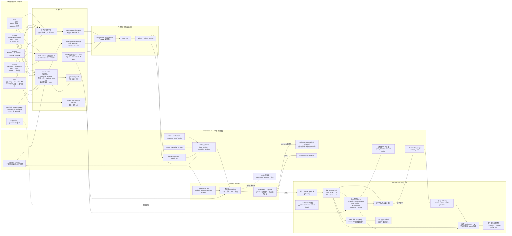

# 分析物化与血缘设计

> 文档类别：长期维护，登记于 [docs/00-rules-registry.md](00-rules-registry.md)。
> 本文锁定 P2 分析物化的存储边界、标识符、控制台账与文件契约。
> 数据根目录由 `GUVOLU_DATA_ROOT` 唯一解析；当前项目根为
> `C:\Users\wu_zh\dev\guvolu`，`GUVOLU_DATA_ROOT=data` 的绝对结果为
> `C:\Users\wu_zh\dev\guvolu\data`。
> 当前控制面契约为 SQLite schema v20；实时主线为 raw v3、三所日元市场
> L2 物理 schema v3 / `book-l2-normalization-v5` 与实时逐笔 schema v3 /
> `trade-realtime-normalization-v4`，OKX 历史盘口继续使用物理 schema v2 /
> `book-l2-normalization-v2`；book-state 当前代码契约为 schema v1 /
> `book-state-checkpoint-v3`，OFL 当前代码契约为 schema v2 /
> `orderflow-tile-sparse-v8`。

## 1. 决策

采用原件、控制面、分析面三层，三者职责不得互换。

| 层 | 介质 | 职责 | 是否真相源 |
|---|---|---|---|
| 原件层 | JSONL、CSV、gzip、zip | 保存 API 与官方归档原件 | 是，不可变 |
| 控制面 | SQLite | 维度、能力、回补、散列、尝试、输出与修正台账 | 是，事务性元数据 |
| 分析面 | Parquet | 规范化事实与后续特征的列式物化 | 否，可由原件与版本重建 |
| 查询引擎 | DuckDB | 构建和直接查询 Parquet | 否，不保存另一份权威事实 |

不创建长期写入的 `.duckdb` 真相库。SQLite 继续承担多进程环境下的短事务控制面，DuckDB 连接使用内存数据库并直接读取 Parquet。该边界符合 SQLite 对本机低并发事务存储的定位，也避开 DuckDB 单进程写入模型与跨进程写冲突。

## 2. 键链

事实的完整键链为：

```text
venue_id + venue_symbol + mapping_revision
                    |
                    v
                market_id
                    |
source bytes -> artifact_id + normalization_version
                    |
                    v
              normalized fact
                    |
                    v
partition_attempt -> output artifact_id
```

三个键的职责不可合并：

| 键 | 回答的问题 | 变化条件 |
|---|---|---|
| `market_id` | 这是哪个来源的哪个可交易市场 | 来源品种映射修订时变化 |
| `artifact_id` | 这行来自哪一份确切字节原件 | 文件内容任一字节变化时变化 |
| `normalization_version` | 原件按哪套语义转成事实 | 字段含义或归一规则变化时变化 |

`instrument_id` 表示跨来源的规范化品种，例如 `SPOT:BTC/JPY`。它不能替代 `market_id`，因为 GMO、bitbank 与 bitFlyer 的逐笔、时钟和完整性不能被当成同一事实流。

## 3. 标识符与命名

### 3.1 `market_id`

格式固定为：

```text
mkt__<venue_id>__<venue_symbol_slug>__r<mapping_revision>
```

示例：

```text
mkt__gmo__btc__r0
mkt__bitbank__btc_jpy__r0
mkt__bitflyer__btc_jpy__r0
```

`venue_symbol_slug` 将来源原始品种转小写，并将非 ASCII 字母数字连续段折叠为单个下划线。数据库以 `(venue_id, venue_symbol, mapping_revision)` 唯一约束防止误绑定；若两个原始品种产生同一 slug，登记时直接失败，不猜测合并。

### 3.2 `artifact_id`

格式固定为 `sha256-<六十四位小写十六进制>`，只由文件字节决定。路径不参与身份，`artifact_location` 保存相对数据根目录的正斜杠路径。同一空响应可能在多个日期产生完全相同字节，因而共享 `artifact_id`，但每个路径仍以独立输入绑定保留；内容变化必须产生新 `artifact_id`，不得覆盖旧散列证据。

### 3.3 版本与目录值

`normalization_version` 使用小写语义名加整数版本，例如 `trade-normalization-v1`。目录值只允许小写字母、数字、点、下划线和连字符。Windows 不允许的冒号只存在于数据库 `instrument_id`，不进入目录名。

## 4. 控制面表

P2 不重写旧事实表，控制面按内容、位置、尝试与活动分区分工。

| 表 | 作用 | 关键约束 |
|---|---|---|
| `market` | 把来源品种的指定映射修订固化为市场 | 外键绑定 `instrument_map` |
| `endpoint_revision` | 固化稳定端点及其协议修订 | 十二维自然身份、稳定 ID 与修订复合主键 |
| `collection_connection` | 登记 raw v3 已证明的连接观察 | 严格外键绑定端点修订；run 内一基 `connection_ordinal` 唯一 |
| `collection_channel` | 登记连接内已证明的数据频道观察 | 连接与频道复合主键；绑定市场和物化时能力修订 |
| `artifact` | 登记原件与输出文件的内容散列 | `artifact_id` 为内容身份 |
| `artifact_location` | 登记同一内容的一个或多个实际路径 | 路径唯一，不改变内容身份 |
| `partition_attempt` | 记录一次物化状态机 | 同输入集与版本的完成态唯一 |
| `partition_input` | 按内容汇总一次尝试的输入计数 | 相同内容合并计数 |
| `partition_input_binding` | 保存输入内容、路径与出现次数 | 相同空文件不会丢失日期分区 |
| `materialization_output` | 记录尝试生成的 Parquet 制品 | 输出仍登记为 `artifact` |
| `materialization_partition_head` | 指向每个市场月份当前活动尝试 | 重物化不让旧输出进入默认查询 |
| `materialization_rejection` | 定位未进入事实的原件行 | 保存制品、零基索引、原路径与原因 |
| `market_status_input_scan` | 保存市场状态 watcher 的低基数扫描断点 | 只推进已完成状态事实，不与 L2 帧混写 |
| `l2_quality_window` | 保存五分钟 L2 质量摘要 | 可从活动 L2 事实重算，不替代逐帧事实 |
| `l2_anchor_status` | 保存每市场最新 REST 锚定结果 | schema v20 低基数 latest；原始响应与逐档事实仍在文件层 |

尝试状态只允许：

```text
planned -> running -> complete
                   -> complete_with_rejections
                   -> failed
```

完成态不可回退。重跑失败任务产生新 `attempt_id`；同一输入集合、市场、逻辑分区和规范化版本若已有完成态，命令返回既有结果，不重复写文件。

实时控制面只从 `sealed + completion_claim=true` 的 raw v3 输入登记，而且必须
在对应事实、输出制品、完成 attempt 和活动 head 的同一最终事务内提交。旧 raw
v1/v2 不补造端点修订、连接或频道。当前 wire envelope 没有独立的 socket-open
或 subscribe-ack 控制事件，所以 `opened_at` 与 `subscribed_at` 都只能表示首个
成功物化数据帧的接收时刻；两表分别用 `opened_at_basis` 与
`subscribed_at_basis=first_successfully_materialized_raw_v3_frame` 明示该限制。
`connection_ordinal` 是采集 run 内一基的成功连接序号，不是重连次数。

空归档是已经确认的零行输入，必须以 `artifact_location` 和 `partition_input_binding` 保留。`archive_coverage` 中的 `missing` 不是空值事实，而是来源缺口；任何含已知缺失日的月份都不得进入完成态。物化器还会要求当月覆盖台账的 `ok`、`empty` 日期集合与实际文件日期集合完全相等，不补零、不猜测、不静默跳过。

日归档可能在 UTC 边界重复返回同一来源成交。若稳定 `observation_id` 和规范化经济语义完全一致，只保留按路径及行序最先出现的事实，后续出现位置进入 `materialization_rejection`，使来源总行数仍等于事实行数加拒绝行数；若同一身份的价格、数量、方向、事件时刻或其他契约字段冲突，整月失败，不自动选择。

## 5. 事实契约

首个数据集名为 `trade_observation`，不用 `trade` 或 `tick` 这类容易混淆来源聚合粒度的名称。每行至少包含：

| 字段 | 类型 | 说明 |
|---|---|---|
| `observation_id` | VARCHAR | 来源成交身份与修订的稳定组合 |
| `venue_id` | VARCHAR | 来源 |
| `market_id` | VARCHAR | 来源市场与映射修订 |
| `instrument_id` | VARCHAR | 跨来源规范化品种 |
| `venue_trade_id` | VARCHAR | 来源原生或合成成交标识 |
| `revision_id` | INTEGER | 同一成交的修订号 |
| `event_time` | TIMESTAMPTZ | 经济事件时刻 |
| `available_time` | TIMESTAMPTZ | 最早合法可见时刻 |
| `ingest_time` | TIMESTAMPTZ | 本地获得时刻 |
| `side` | VARCHAR | 主动方向口径，值为 `buy` 或 `sell` |
| `price` | VARCHAR | 金额文本，禁止浮点 |
| `size` | VARCHAR | 数量文本，禁止浮点 |
| `source_artifact_id` | VARCHAR | 原件内容身份 |
| `source_row_index` | BIGINT | 原件内零基条目索引；一基行号仍保留在 raw_source 台账 |
| `normalization_version` | VARCHAR | 规范化语义版本 |
| `schema_version` | INTEGER | Parquet 行结构版本 |

必须满足 `available_time >= event_time`。未知而非必需的来源字段使用 NULL；不能确定 `market_id`、`source_artifact_id`、时间三元或价格数量的行不得写入完成分区，应进入拒绝计数并保留原件。

`observation_id` 不以 `artifact_id` 组成，因为同一成交可能由重复归档出现。其格式为 `<venue_id>|<market_id>|<venue_trade_id>|r<revision_id>`。跨来源相似成交永不合并，只能在参考价或一致性分析层比较。

事实契约采用可执行的组合绑定，不额外制造一个含义不透明的随机 `contract_id`：`dataset + schema_version` 固化列结构，`market_id` 固化来源市场和映射修订，`normalization_version` 固化转换语义，`match_granularity + source_side_basis` 固化成交解释，`source_artifact_id + source_row_index` 回到确切原件。审计逐输出核对前三组值，并按 `source_artifact_id` 比较 Parquet 事实行数与 `partition_input` 台账；任一不一致均不合格。

### 5.1 撮合与聚合成交

`trade_observation` 允许共享主干字段，但禁止忽略 `match_granularity` 混用不同粒度。

| 粒度 | 来源示例 | 一行含义 | 可安全聚合 | 不可直接解释 |
|---|---|---|---|---|
| `match` | GMO、bitbank、bitFlyer | 一次来源撮合打印 | 成交量、金额、主动方向 Delta、逐笔间隔 | 跨来源同一成交 |
| `aggregate` | Binance `aggTrades` | 同一 taker 委托在同一价格与时刻的一组撮合 | 成交量、金额、主动方向 Delta | 单笔撮合数、单笔尺寸分布、真实逐笔间隔 |

Binance `m` 的官方语义是“买方是否为 maker”。因此 `m=true` 时主动方为 sell，`m=false` 时主动方为 buy。v2 使用 `source_side_basis=taker_from_buyer_maker`、`revision_id=1`，并保留 aggregate trade ID、first trade ID 与 last trade ID；不按 `last-first+1` 擅自构造撮合笔数。旧 v1 的方向数值正确，但 `source_side_basis=maker` 表述含糊，保留为非活动历史制品。

## 6. 文件布局

所有物化文件位于当前数据根目录下：

```text
data/materialized/trade_observation/
  schema_version=1/
    normalization_version=trade-normalization-v1/
      venue_id=bitbank/
        market_id=mkt__bitbank__btc_jpy__r0/
          event_year=2026/
            event_month=08/
              part-<输出散列前十二位>.parquet
              manifest-<attempt_id>.json
```

`artifact_id` 是列和清单字段，不作为目录分区键，避免逐原件小文件。逻辑分区按来源市场与来源会话月组织；为保持首版路径兼容，目录仍使用 `event_year/event_month`。bitbank 与 bitFlyer 的当前归档边界等同 UTC 月；GMO 日归档按 JST 06:00 切日，因此 GMO 月的 UTC 边界为月初和次月初各减 3 小时。事实行的 `event_time` 始终保存交易所给出的真实 UTC 时刻，不做平移；查询严格 UTC 自然月时须对 `event_time` 加谓词，边界最多读取相邻一个来源月分区。物理文件目标为约 128 至 512 MB。月内不足 128 MB 时允许一个小文件，不为了凑大小跨市场混写。超过 512 MB 时按稳定时间范围拆分。

写入流程为暂存事实、校验身份和原件契约、写临时 Parquet、关闭并计算 SHA-256、原子改名、写清单，最后在一个 SQLite 事务内登记输出、拒绝行并推进活动分区指针。提交前必须核对行数、`observation_id` 唯一性、PIT、市场、结构版本、规范化版本、成交粒度和逐原件行数。崩溃遗留的临时文件不算完成输出，可以清理；已经登记完成的制品不得原地覆盖。默认查询必须从 `materialization_partition_head` 取得文件列表，禁止用目录 glob 把旧版本和现行版本同时读入。

官方归档可能以无表头的空 gzip 表示当日零成交。只有覆盖台账同时满足 `status=empty`、`rows=0` 时，物化器才跳过内容解析，并继续登记该原件的散列和零行输入绑定；非空文件仍必须通过严格表头和行数校验。

若整月全部是已确认的 `empty/0`，仍提交一个保留完整列结构的零行 Parquet、清单、输入绑定与活动头，作为可恢复覆盖断点。不同空月的 Parquet 字节相同，因此共享同一 `artifact_id`；SQLite schema v20 允许一个内容身份拥有多个 `artifact_location`，但以唯一 partial index 保证恰有一个 canonical location。查询活动头可复用 canonical 字节，不能因零行而把已确认空月反复排入待办。

## 7. 延迟与调度

| 数据 | 物化触发 | 目标延迟 | 原因 |
|---|---|---|---|
| 已封口实时段 | 终态 manifest 后 | 十分钟内 | 先封口再散列，避免读取增长文件 |
| 官方日归档 | 下载与校验后 | 一小时内 | 可批量归一并吸收下载抖动 |
| 历史回补 | 每个受控批次后 | 无实时承诺 | 优先正确、可恢复与磁盘预算 |
| 特征面板 | 基础事实完成后 | 按研究任务 | 不阻塞采集和执行 |

DuckDB 构建任务是单进程写文件任务。查询服务只读已登记完成的 Parquet，不扫描 `.tmp`，也不读取状态为 `running` 的尝试。

`archive-market` 在终端逐月即时输出总月份序号、来源行数、完成或复用状态、事实行数、拒绝数、单月耗时与累计行数；处理新月份时还会在每个日归档完成后输出当日来源行数、规范化行数、拒绝数和月内累计行数。它在首个失败月停止，已经完成的月份保持可复用；修复缺口后重跑不会重复生成先前完成制品。

全局命令 `archive-plan` 从覆盖台账、实际文件集合、活动分区输入绑定现场推导每个“市场乘月份”的 `complete`、`pending`、`blocked_missing`、`blocked_files` 或 `blocked_coverage`，不依赖另存的脆弱进度文件。`archive-backfill` 跳过阻断月并持续执行其他待办；单月失败会记入失败尝试和最终摘要，但不阻断后续市场。进程中断时，只有已经完成 SQLite 原子提交的月份算断点，未提交月份下次重做。

## 8. 扩展与迁移

### 8.1 热冷存储根

数据根 `C:\Users\wu_zh\dev\guvolu\data` 继续承担 SQLite、锁、开放段、
checkpoint、近期实时事实与查询热集。E 盘同时承担冷层和受控温层，但不成为
第二个控制面，也不复制 `partition_head`。冷层保存长期不可变事实；温层只在
C 盘容量门禁触发时接收已封口、有 SHA-256、可独立重放的近期段或小时压实制品。
SQLite/WAL、锁、当前 `.open`、信号、intent、订单、成交回报和风险账本永不进入
温层或冷层。

`artifact_id` 仍只由文件字节决定，`artifact_location.storage_path` 仍是数据根相对的
逻辑路径。物理位置由版本化存储根与最长逻辑前缀路由解析，不把 `E:`、绝对路径或
卷序列号写入事实身份。控制面下一追加版本应登记：

| 对象 | 必需身份 | 约束 |
|---|---|---|
| `storage_root` | `storage_root_id`、tier、卷 GUID、分区 GUID、卷标、文件系统、base path、marker SHA-256 | 根身份追加式；身份冲突拒绝覆盖 |
| `storage_route` | 逻辑前缀、`storage_root_id`、根内物理前缀、状态、启用时刻 | 最长前缀唯一命中；重叠或循环拒绝 |
| `storage_migration` | migration ID、来源/目标根、逻辑前缀、计划散列、状态和各阶段时刻 | 状态只前进；失败可回滚到原热位置 |

Windows 当前冷根为 `storage-root__cold__2be00220-add2-4bf3-ab68-479c9e66cf66__v1`；
卷 GUID 为 `\\?\Volume{2be00220-add2-4bf3-ab68-479c9e66cf66}\`，当前盘符 `E:`
只用于挂载发现。根目录 `guvolu-cold/v1` 的 `.guvolu-storage-root.json` 必须与
登记的卷标 `GUVOLU_COLD`、文件系统 `NTFS` 和 marker SHA-256 同时一致。
USB 桥接器未提供可信硬盘序列号，因此序列号不参与身份判定。

现有 L2 raw 热批量根为
`storage-root__hot_bulk__1000af7b-e404-4482-938f-5cc9f555ac80__v1`；卷 GUID
为 `\\?\Volume{1000af7b-e404-4482-938f-5cc9f555ac80}\`，当前盘符 `D:`。C
盘的 `raw/realtime/book_l2` 联接只作兼容入口，解析器以 D 盘项目 marker、分区
GUID、卷 GUID、卷标和 NTFS 身份为准，不把 reparse target 本身当事实身份。

路径解析必须 fail-closed：热路径只能位于数据根；冷路径只能位于已登记根并命中
启用路由。盘符被其他介质占用、冷盘离线、哨兵缺失、卷 GUID 不符、路径逃逸或
reparse target 不符时均拒绝读取和写入，不能静默回退到同名目录。

### 8.2 迁移状态机

迁移不直接执行移动或覆盖，固定顺序为：

```text
planned
-> copied
-> byte_verified
-> catalog_registered
-> route_activated
-> observed
-> hot_copy_released
```

`copied` 使用目标根内专属临时名，完成 flush/fsync 后才原子改为内容寻址终名。
`byte_verified` 对计划冻结的每个 artifact 复算来源和目标 SHA-256、字节数及 Parquet
行数/schema。`catalog_registered` 只增目标 location 和迁移台账，不切换活动 head。
`route_activated` 在短写锁窗口内切换逻辑前缀；热副本继续保留作为回滚来源。
至少一个完整物化、查询和 full audit 周期通过后才能进入 `observed`。释放热副本是
独立显式阶段，只允许删除已经证明有冷盘等字节副本的可重建 Parquet；raw、archive、
SQLite、manifest、拒绝证据和 quarantine 不在本阶段删除范围。释放后可用
`restore-hot` 按同一计划由已验证冷副本逐项恢复热 Parquet（临时名独占创建、fsync、
散列复核后原子替换，幂等），路由状态不变；`restore-hot --from-raw` 不读冷盘，由热层
raw 归档按 `materialization_output` 反查的完成态尝试与 `partition_input` 输入重算
Parquet，并以登记 SHA-256 与字节数相等为门禁恢复，不等项只列为 `mismatched` 绝不
写入，输入缺失或散列不符的项计入 `failures` 后跳过；恢复后 `rollback` 重新可用。研究面板或
冻结前向仍在读取的逻辑前缀（如历史 `trade-normalization-v1`）不得长期只存冷层：冷盘
离线即中断研究，须保留或恢复热副本后再释放。

首批只迁静态大制品：OKX 历史 L2 schema v2 和历史
`trade-normalization-v1`。日元三所实时 L2、实时逐笔、book-state、OFL、质量摘要、
REST anchor 与当前研究预测保持热层。未来小时压实制品可直接生成到冷层，但开放
段与最终清单提交前的 stage 始终位于热层或同一目标卷的专属 staging，不能跨卷
假装原子 rename。

温层路由按年龄与可重建性逐级启用：先迁非活动历史成品，再迁已完成小时压实和
较老活动分区，最后才缩短 C 盘实时事实保留窗口。温层断开时，实时采集继续写 C
盘；依赖缺失冷输入的新信号 fail-closed，已有仓位只允许风险收敛。盘恢复后必须
先核卷身份与 marker，再核活动输入散列，不能按同一盘符自动恢复交易决策。

新来源接入不需要改 Parquet 目录或事实主键，只需完成以下边界：

1. 登记 `venue`、`instrument_map` 与固定 `market_id`。
2. 原件封口并登记 `artifact_id`。
3. 实现该来源到公共事实契约的规范化器。
4. 为不同语义使用新的 `normalization_version`。
5. 通过一个小分区的逐行重算、散列和 PIT 校验后再扩量。

不要求先把所有交易所接完再物化。某个 `market_id + domain` 只要映射、能力证据、
封口原件、归一契约和小分区审计闭环，就可独立推进活动头；其他来源尚未接入不
构成阻塞。Coincheck 和短时流样本只用于旁路能力验证，在完整性证据补齐前不与
已闭环的历史归档标成同等级。当前市场、分区和行数只登记在日期快照，不固化在
长期设计中。

旧 `trade_tick`、`book_top` 与 `kline` 暂时保留，作为迁移输入与热查询兼容层。新数据集稳定后再逐域停写旧表，不做原地改主键。K 线已迁移到含 `market_id`、来源逐项 evidence 和版本的新版事实契约；旧表本身仍不得纳入新版完成声明。

## 9. 规模与性能边界

当前字节数、磁盘余量、活动覆盖、实测日增和构建耗时只登记在
[2026-08-13 L2 质量与 L3 就绪度快照](2026-08-13-l2-quality-and-l3-readiness.md)，避免长期设计在
采集继续运行后变成伪现状。容量计划按来源分别测量封口原件、frame Parquet、
level Parquet、manifest/控制面增量和最大暂存峰值，再用观测日的 P50/P95 外推；
不能只以活动事实大小估算，也不能把一次低活跃日直接乘成年容量。

历史批次必须在下载前同时满足永久增量与临时工作空间门禁。临时文件在成功和
失败路径均清理，只有已封口原件和已登记输出属于持久占用；活动头切换不自动删除
旧版本制品。大批量回补保持逐日或逐分区串行，直到 P95 暂存、内存和墙钟均有
现场证据支持更高并发。

GPU 不参与解压、JSON/CSV 解析、散列、SQLite 台账或 Parquet 编码。这些环节主要受 CPU、磁盘和压缩影响。GPU 仅用于完成物化后的批量因子、矩阵和模型计算，且金额字段进入数值研究域前必须显式转换。

## 10. 外部依据

- [SQLite Appropriate Uses](https://www.sqlite.org/whentouse.html) 说明 SQLite 适合本机应用数据与低写并发场景。
- [DuckDB Concurrency](https://duckdb.org/docs/current/connect/concurrency) 说明一个进程可并行写，跨进程主要采用只读访问。
- [DuckDB Parquet Overview](https://duckdb.org/docs/stable/data/parquet/overview) 说明 DuckDB 可直接读写 Parquet 并进行列裁剪和谓词下推。
- [DuckDB Partitioned Writes](https://duckdb.org/docs/stable/data/partitioning/partitioned_writes) 提醒过多小分区开销明显，并建议避免小于约 100 MB 的分区。
- [DuckDB Performance Guide](https://duckdb.org/docs/current/guides/performance/how_to_tune_workloads) 说明并行度、内存与溢写目录的配置边界。
- [GMO Coin API Documentation](https://api.coin.z.com/docs/en/) 说明日数据在 JST 06:00 更新；本地历史原件逐日验证为对应 UTC 前一日 21:00 的会话边界。

## 11. 当前实现与操作

现行主干已完成 SQLite schema v20、`trade_observation`、`market_kline`、
`book_l2_*`、`book_state_checkpoint`、L2 质量、市场状态与 REST anchor 的契约和
存储入口，以及活动分区、端点/能力修订绑定、连接/频道观察、派生依赖、内容多
位置约束与直接归档入口。OKX live books 已通过真实有界隔离小样本的 raw v3、
v5 物化、PIT、顺序与质量验收，但尚未进入生产常驻、长期连续性或生产活动 head。

```text
python -m guvolu.data.materialize --data-root data trades \
  --venue bitbank --symbol btc_jpy --event-month 2026-08
python -m guvolu.data.materialize --data-root data archive-trades \
  --venue bitflyer --symbol BTC_JPY --event-month 2026-08
python -m guvolu.data.materialize --data-root data archive-market \
  --venue bitflyer --symbol BTC_JPY
python -m guvolu.data.materialize --data-root data archive-plan
python -m guvolu.data.materialize --data-root data archive-backfill
python -m guvolu.data.materialize --data-root data audit
python -m guvolu.data.materialize --data-root data repair-control-ledger
python -m guvolu.data.materialize --data-root data repair-control-ledger --apply
python -m guvolu.data.materialize --data-root data recover-stale \
  --older-minutes 60
python -m guvolu.data.okx_l2_archive --data-root data \
  --symbol BTC-USDT --day 2026-08-07 --depth 400
python -m guvolu.data.okx_l2_materialize --data-root data all
python -m guvolu.data.okx_l2_materialize --data-root data audit \
  --from-day 2026-08-07 --to-day 2026-08-07
python -m guvolu.data.okx_l2_backfill --data-root data plan \
  --symbol BTC-USDT --from-day 2023-03-01 --to-day 2026-08-10
python -m guvolu.data.okx_l2_backfill --data-root data run \
  --symbol BTC-USDT --from-day 2026-08-07 --to-day 2026-08-07
```

`audit` 逐文件复算 SHA-256，并核对完成 Parquet 的行数、PIT、重复观察与时间边界。
审计启动时冻结已登记路径，结束前再读一次 `artifact_location`；审计
期间正常完成登记的新制品只产生警告，不误报为未登记终态文件。
`recover-stale` 只把超过阈值的 `running` 尝试收束为 `failed`，并删除
文件名含该 `attempt_id` 的 `.stage.csv` 与 `.tmp.parquet`；不会修改或
删除 raw、archive、完成制品或失败台账。

book-state v3 与 OFL v8 现在和其他主干写者一样，在输出、输入绑定、
attempt 终态和活动 head 的同一最终事务中，把终态 manifest 以
SHA-256 内容制品登记。`repair-control-ledger` 缺省使用只读连接规划；
只有显式 `--apply` 才会在 SQLite 写锁下执行一次原子、只增修复。
它校验 manifest JSON、文件名与 `attempt_id`、schema 目录和已登记
attempt，再复算字节数与 SHA-256；数据库中已失败的 attempt 不因
manifest 内文而升格，只登记为 `failed_materialization_manifest` 证据。
旧 `partition_input` 只在存在唯一主位置且文件字节数和散列都重验
通过时补登 `partition_input_binding`。重复执行幂等，不修改任何原件；
修复后仍必须再运行 `audit` 验证完整关系。

活动市场、分区、来源行、事实行、拒绝数和逐文件审计结果均属于易变现场数据，
统一见 [2026-08-13 L2 质量与 L3 就绪度快照](2026-08-13-l2-quality-and-l3-readiness.md)。长期门禁
固定为：来源行必须守恒到事实、忽略和拒绝三类；父子事实计数、PIT、枚举、原件
身份、能力修订、输出 SHA-256、依赖与活动头必须同时通过。成交表与盘口表不可
相加冒充同一事实数。

OKX 400 档日级编排现已闭环：`plan` 从 sealed manifest、活动头和归一版本
现场求缺；`run` 串行执行下载、封口和物化，并在 `backfill_run` 追加终态；
每个待下载日先按来源标称大小和实测放大率执行磁盘门禁。全分区 `audit` 会逐日
复算双输出 SHA-256，而不再只检查首个活动日。5000 档尚未核证，且将来必须把
depth 纳入分区身份后再开放，当前命令明确拒绝。

“批处理闭环”不等于“供应方全部历史字节已经落盘”。热层只按授权日期范围推进；
范围外仍是未下载，不得以流程可重跑冒充覆盖完成。已确认 HTTP 404 的来源日保持
`blocked_missing`，确认空归档以带 schema 的零行输出保存断点，跨日完全重复成交
保留首个稳定事实并登记后续拒绝位置；这些判据不随现场计数变化。

## 12. 长期采集与物化主干

长期运行只允许封口制品进入物化。实时文件仍在增长时只写 `status=open`
checkpoint；L2 每 5 分钟或 128 MiB、逐笔每 5 分钟或 32 MiB 轮转，随后计算
SHA-256 和 segment manifest，正常停机再写唯一 run terminal manifest。raw v3
逐行保存 `endpoint_id + endpoint_revision + connection_id + channel_id`、UTC/单调
接收时钟与 payload SHA-256；`l2-materializer watch` 与实时逐笔物化器每 300 秒
追赶新封口片段。共享日文件不再是实时订单流主线。

实时段路径为：

```text
data/raw/realtime/<domain>/
  venue_id=<venue_id>/venue_symbol=<venue_symbol>/run_id=<run_id>/
    segment-<sequence>.jsonl
    segment-<sequence>.manifest.json
    checkpoint.json
    manifest.json
```

五分钟与容量阈值都只是耐久和恢复边界，不是事实语义；后续可在不改变 raw
schema、输入散列或事实主键的前提下调整。每个市场的单一逻辑流只允许一个写者；
同一交易所的网络连接可以复用，但落盘、计数、封口与健康状态必须按市场和域拆分。

长期调度分四条互不阻塞的队列：

| 队列 | 输入 | 断点 | 完成判据 | 失败处理 |
|---|---|---|---|---|
| 实时采集 | REST、WS 原始响应 | open checkpoint | 终态 manifest 加正文散列 | 重连并开启新段，旧段不改写 |
| 历史回补 | 日期、游标或官方归档 | `archive_coverage`、来源游标 | 预期分区均为 `ok/empty` 或明确 `missing` | 指数退避；missing 保留，不补零 |
| 基础物化 | 已封口制品集合 | SQLite 完成尝试与活动头 | 行数、PIT、唯一性、绑定及 SHA 全通过 | 新失败尝试；不移动活动头 |
| 审计与派生 | 活动 Parquet | 输出 artifact 与任务散列 | 全制品散列、契约和覆盖一致 | 隔离派生输出，不反写原件 |

运行策略是“实时优先、回补限速、物化串行写、查询只读”。盘口不可回补，实时写入与磁盘余量报警优先级最高；逐笔和 K 线可回补，网络或物化拥塞时可以暂停。历史物化无需等待其他交易所接入：一个市场只要自己的映射、能力证据、原件和契约闭环，即可独立推进活动头。

### 12.1 能力证据绑定

`market_id + artifact_id + normalization_version` 已能证明市场、输入字节与转换
语义，但不能单独证明采集当时使用的端点修订、网络连接和订阅频道。schema v20
以 `endpoint_revision` 固化端点自然身份与修订，以 raw v3 逐行绑定端点、连接、
频道和接收证据，并在成功物化事务中登记 `collection_connection` 与
`collection_channel`。能力语义仍由批级 `partition_capability_binding` 约束：

| 绑定 | 粒度 | 作用 |
|---|---|---|
| `endpoint_revision` | 一个端点在一个修订期 | 自然身份由 legal entity、brand、product、environment、region、transport、protocol、auth、host、port、base path/channel、data level 十二项组成；scope 与来源 schema 修订是修订属性 |
| raw v3 行与 segment manifest | 一条 wire 帧 / 一个封口段 | 固化 `endpoint_id + endpoint_revision`、run、connection、channel、双接收时钟、payload 散列和原件散列 |
| `collection_connection` / `collection_channel` | 一个成功物化的数据连接 / 频道观察 | 把 raw v3 身份连接到 market 与能力修订；时间口径见下文，不伪造握手事件 |
| `partition_capability_binding` | 一次 `partition_attempt` 加所用端点 | 固化物化时认可的能力修订；旧迁移记录继续显式标记推断来源 |

事实契约因此成为：

```text
dataset + schema_version
+ market_id + mapping_revision
+ source_artifact_id + source_row_index
+ normalization_version
+ endpoint revision = (endpoint_id, revision_id)
+ connection_id + channel_id（raw v3；旧 raw 正确留空）
+ capability revision = (venue_id, domain, endpoint, revision_id)（经批级外键）
+ domain-specific semantics
```

连接序号和观察时间严格沿用第 4 节口径。raw v1 没有端点、连接、频道和单调时钟
证据，由新事实 schema 读取时这些列保持 NULL，并以 `data_quality` 明示质量降级；
禁止根据目录、当前注册表或本地时间倒填。

能力修订只描述“该端点按当时证据如何工作”，不能代替事实字段。成交仍必须保存
`match_granularity` 与 `source_side_basis`；盘口仍必须保存快照或差分、完整性方式
和序号；K 线仍必须保存区间、完结状态、成交量单位与来源或派生口径。

### 12.2 全链路



图中的 SQLite 是控制面终点，不是大事实的重复存储终点。新主线从已登记原件
流式规范化到 Parquet；DuckDB 不保存长期数据库，只构建或查询 SQLite 活动头
冻结的明确 Parquet 路径。GPU 位于 CPU 完成解析、散列、Decimal 校验、盘口重放
和数值域转换之后，只读可重建输入；旧 SQLite 事实表仅保留兼容查询，按消费者
迁移情况逐域停写。

### 12.3 Query Catalog 与成品查询

查询服务不得以目录 glob 发现事实。`QueryCatalog.active_outputs()` 在 SQLite
读事务内把 `market_id + domain + dataset + 查询时间窗` 解析为活动 attempt、
artifact 和绝对 Parquet 路径，并验证路径仍位于数据根目录、后缀为 Parquet 且
文件存在。DuckDB 只读取这份冻结清单；head 在查询期间推进不影响本次响应，
下一请求通过新的 `head_generation/ETag` 观察到版本变化。

`GET /api/v2/aggregates/book/top` 是读取期 synthetic consolidated top，不新增
基础事实或活动 aggregate head。请求先在同一 decision time 冻结多个市场的活动
L2/book-state，逐市场应用 PIT、新鲜度和质量门禁，再计算 contributors、quorum、
最高 bid、最低 ask、中间价中位数及 `crossed`。它只接受相同 base、quote、
instrument kind 与 market kind；没有显式 FX 制品时，JPY 与 USDT/USD 混合请求
直接失败。响应 `no-store`，保留每个 contributor 和来源时刻；如需回测级复现，
必须把输入 head generation、source set、decision time 与方法版本另行物化。

K线和成交依靠 Parquet 时间谓词与列裁剪；Footprint 先在请求窗口内去重成交再
聚合，不生成第二份权威事实。L2 先利用输出 `min/max_event_time` 选择最新输出，
只在必要时向前扩展到最近 snapshot，并只加载同一 attempt 的 level 文件。
实时三所的冷查询为短 segment；OKX 400 档日文件的冷重放和 checkpoint 延迟实测
属于易变性能快照，不在长期契约固化。当前查询优先读取活动
`book_state_checkpoint`，只有 checkpoint 缺失、陈旧或其
来源 attempt 已退出活动 head 时才回退 snapshot+delta 重放。OKX 实测 checkpoint
能显著降低冷查询，但该优化不改变响应 ETag 或事实代际，因为 checkpoint 是同一 L2
head 的可丢弃加速制品，不是第二份盘口真相。

### 12.4 `book_state_checkpoint` 与派生依赖

SQLite schema v20 的 `materialization_dependency` 以外键登记
`attempt_id -> upstream_attempt_id`，并记录 `active-head` 或显式 replay 的绑定口径。
它补足 `market_id + artifact_id + normalization_version`：前三者分别证明市场、
输入字节和转换语义，dependency 进一步证明本次派生究竟消费了哪些活动事实批次。
不得只凭目录名、文件时间或 `latest` 字符串反推血缘。

能力绑定和派生依赖不是两套重复台账。没有上游依赖的完成 attempt
必须直接绑定其实际调用的已实现能力修订；派生 attempt 不复制这些
行，而以其精确依赖的递归闭包获得根级能力证据。审计会拒绝没有根级
能力绑定、依赖成环、完成派生指向非完成上游，或一份已有生产者的输入
制品没有对应直接生产依赖的情形。book-state v3 和 OFL v8 因此
可追溯到确切 L2/trade attempt，但不伪装成自己调用了交易所 API。

checkpoint 按 `market_id / partition_key=latest` 物化。每次最多冻结最近 12 个成对的
`book_l2_frame`/`book_l2_level` attempt，从其中最近可用 snapshot 重放至末帧，输出
当前 ask/bid 价位、末帧和锚点 frame、event/available time、完整性口径及来源
attempt。12 是重放窗口上限，不是盘口深度，也不截断最终簿；若窗口内没有合法
snapshot，任务必须失败并保留旧活动 checkpoint。

当前代码契约为 schema v1 / `book-state-checkpoint-v3`。bitbank 必须按官方
wire-order 算法
重放：首个 whole 前缓存 diff；收到 whole `S` 后先用 whole 替换本地簿，再按
`s` 升序只应用 `s > S` 的缓存 diff，`s <= S` 的缓存 diff 已被 whole 覆盖，不能
重复应用。连接变化清空 whole 锚与缓冲。其他来源继续使用各自 snapshot/delta
契约。OKX live 可使用通过身份、PIT、状态 SHA-256 与活动来源 attempt 校验的
`book_l2_terminal_checkpoint` 作为重放基座；只读取该 checkpoint 同 run 的后续
segment，其他 run 还须晚于 checkpoint 摄取时刻。连接或 run 切换后必须从新的
snapshot 重锚，不能跨连接继承终态。终态损坏、不可信或依赖退出活动 head 时回退
原始 snapshot/delta 重放，不得以加速制品替代来源事实。活动 checkpoint 的版本、
市场数、上游 attempt 数和审计计数只写入质量快照。
旧 checkpoint/试验 attempt 与制品保留，只有活动指针推进；已退役 head 不得因
兼容迁移再次复活。

`book_state_materialize watch --poll-seconds 300` 已进入总管线。每轮输出四市场的
`DONE/REUSED`、真实 replay frame 数、耗时和审计结论；写锁超时或可恢复 IO/SQL
错误只记录一轮 error，五分钟后继续。UTF-8 进度日志位于
`logs/book-state-materializer-progress.log`，旧 Transcript 原样保留为历史证据。

### 12.5 盘口版本并存结构

`book_l2_frame` 的自然粒度是一条来源消息，保存市场与映射/能力修订、端点、
payload schema、snapshot/delta、重放与完整性口径、时间、序号族、变更档数、
重放后档数、深度限制、原件和来源行。`book_l2_level` 的自然粒度是该消息内
一个价位动作，保存 side、price、size、order_count、set/delete 与 frame 外键。
三所日元实时事实使用 schema v3 / `book-l2-normalization-v5`，在 frame 增加
端点修订、连接/频道、单调接收时钟、payload SHA-256、`data_quality` 与
`raw_schema_version`。raw v3 必须完整验证这些字段；旧 raw v1 重投影时相应身份列
保持 NULL，并以质量旗标明确“未记录/散列由物化侧推导”，不能借当前端点注册表
追填历史。来源没有的 `sequence_id`、
`prev_sequence_id`、`checksum` 也正确留空，不能用本地合成值伪造完整性。

OKX 历史事实继续使用 schema v2 / `book-l2-normalization-v2`，并直接保存
`mapping_revision=0`、`capability_revision=1`、
`payload_schema_version=okx-history-l2-jsonl-v1`、原件 SHA 身份和
`normalization_version=book-l2-normalization-v2`。它没有实时 connection/channel
语义，不因三所实时升级而伪造这些字段。批级 `partition_capability_binding` 仍以
外键约束能力证据；查询使用 `union_by_name`/统一视图适配 v2 与 v3 schema，事实文件不
原地升级。Parquet 重复必要修订号，使脱离 SQLite 的只读研究仍可判断输入语义。

`book-l2-normalization-v5` 保留 v4 对 bitbank 两个 room 独立序列流的修正，物理列
仍为 schema v3。旧 v3 把跨 room 同序限制成固定方向的一对，实包却会先收到 diff、再
收到相同或更低序号的延迟 whole，导致合法 whole 被拒绝。v4 按官方文档把
`depth_diff` 与 `depth_whole` 作为两个独立到达流：同一已知 connection 和 sealed
segment 内分别要求各 room 严格递增，同 room 重复或回退才拒绝；跨 room 同序不是
重复，迟到 whole 也必须保留。

事实归一只保存 wire order 和两 room 的独立序列证据；状态重放另按官方算法缓存
diff。whole `S` 到达时权威替换本地簿，再按 `s` 升序应用所有 `s > S` 的缓存 diff，
忽略已被 whole 覆盖的 `s <= S`。因此“跨 room 序号相同可以同时存在”和“同一
状态不能重复应用”并不矛盾。旧 `book-l2-normalization-v3` attempt 与 Parquet
保持不可变，v4 以新 attempt 逐分区推进 head；v5 进一步禁止把 segment 内推导的
前驱序号写成来源事实。来源未提供前驱时 `prev_sequence_id` 保持 NULL；状态重放
可以使用本地上下文，但不得污染来源身份。跨 segment 同样不猜测前驱状态。

历史归档的 `available_time` 不是事件时刻或本机下载时刻。OKX 日档使用对象
`Last-Modified` 作为最早公开可得时刻的保守代理；`ingest_time` 保存本机封口
时刻。实时端点仍按自己的发布与摄取语义计算，两者不可共用 parser context。

### 12.6 质量、市场状态与 REST 重锚

三类观察都不改变 L2 来源事实，且各有独立主键、版本与输出：

| 域 | 事实或摘要 | 作用 | 禁止事项 |
|---|---|---|---|
| L2 质量 | `l2-quality-v1` 五分钟窗口与 `l2_quality_window` 摘要 | 汇总 fresh/stale、gap、sequence、reject、深度与延迟 | 不把摘要当逐帧证据，不据此补帧 |
| 市场状态 | `market_status_observation` schema v1 / `market-status-normalization-v1` | 保存 bitbank circuit-break/status 原文语义及扫描断点 | 不混入 L2 frame，不把推断写成来源声明 |
| REST 锚点 | 独立 REST raw artifact、`book_l2_anchor_observation` 与 reconciliation schema v2 | 在连接打开、重连或周期触发时旁路比较最新可信 WS book-state | 不伪装成 WS 事件，不补写断流，不静默修 WS |

三所 REST 锚点分别绑定 bitFlyer `EP-0001@r0`、bitbank `EP-0003@r0` 与 GMO
`EP-0006@r0` 的完整十二维端点身份；原生路由名 `endpoint_key` 只作路由辅助，
不能替代 `endpoint_id + revision`。请求和响应 SHA-256、触发原因、`connection_id`、
事件/摄取/可得时刻、逐档 Decimal 数量、最优价、深度与状态散列均随事实保存。
GMO 来源时钟可能领先本机，故保留原 `event_time` 与带符号 clock offset，且固定
`available_time=max(event_time,response_receive_time,ingest_time)`，保证 PIT。

reconciliation 只有在具有同一原生状态身份且可比深度范围一致时才能给出
`match` 或 `mismatch`。当前三所中仅 bitbank 的 REST 与 WS 序列相等时满足该条件；
GMO 与 bitFlyer 的近邻时刻比较一律为 `approximate/unknown`，即使保留 best/depth/
hash 差异诊断也不能据此报警为 full-book mismatch。不同深度范围同样只能按共同
范围诊断，不能称完整簿不一致。REST 请求由连接路径投递到后台有界队列，超时、
限频或队列饱和只形成 `unavailable/unknown` 摘要，不阻塞 WS 订阅接收。bitFlyer
断线窗口仍不可回补。该有界 worker 已嵌入三条 L2 采集命令，在连接打开、重连
及每 300 秒周期触发，不另设常驻进程。

REST anchor 先把规范 JSON raw 原件按内容 SHA-256 落盘，再提交观察、
逐档、reconciliation、manifest 和活动 head；因此崩溃可能留下“raw 已耐久、
控制面未完成”的孤立原件。`guvolu.data.book_l2_anchor recover-raw`
只恢复这一类窗口：它验证内容散列与文件名、分区路径、端点修订、
请求 URL/散列、响应 Base64/散列、HTTP/错误字段和三时刻，再按原件内已记录
的请求身份幂等重建完整事实闭环。`--check-only` 只报告待恢复或已恢复；
真正恢复受单原件锁保护，不改写 raw、不使用未来 WS checkpoint，也不会
用旧 anchor 替换较新活动 head。恢复时无法证明 PIT 对齐的 WS 状态保持
`unknown`，不因事后存在的较新 checkpoint 而伪造一致。

OKX live books 使用独立 raw v3、连接/频道身份和 L2 v5 状态机；同市场查询和
OFL v8 的选择规则是 live 覆盖优先、archive 仅在 live 覆盖外 fallback。当前实现
已通过真实有界隔离小样本的顺序、散列、PIT、物化与质量检查；它只证明该样本，
尚未证明重连和长期连续性，也未进入生产任务或生产活动 head。历史 archive v2
不因 live 实现存在而升级或改写。

### 12.7 OFL tile 的活动物化契约

旧 `heatmap_tiles/gmo/BTC` 是来源专用 JSONL.gz，可继续服务旧 GMO 页面，但不能
改名后冒充统一成品。新版 tile 必须从 Query Catalog 冻结的活动 L2 与逐笔事实
构造，按 `market_id + UTC hour + bucket + method_version` 分区，并通过
`materialization_dependency` 绑定确切上游 attempt。活动输出拆成列头和稀疏 cell：

| 数据集 | 自然粒度 | 关键字段 |
|---|---|---|
| `orderflow_tile_column` | 市场某时间桶 | bucket start/end、state anchor、coverage/gap/reset、来源帧/成交数、generation |
| `orderflow_tile_cell` | 时间桶内一个 side/价格格 | 整数 price key、末态、net increase、`net_decrease_unknown`、同价 taker buy/sell、basis/method version |

当前代码契约为 schema v2 / `orderflow-tile-sparse-v8`，使用 128 列周期全量锚点，
其间只写档位变化、reset 差异和成交。gap 后首次 snapshot 强制全量重锚；普通
高频 snapshot 只写新旧状态差异且变化量为零，防止把重锚误算成订单流。v8 复用
bitbank 官方 whole/diff 缓冲重放：whole 前 diff 不直接改变可见状态，whole 到达
后只回放 `s > sequenceId` 的 diff；为恢复状态而延后应用的缓存 diff 不归因成
whole 到达时刻的新增或净减挂。对同一 OKX 市场与时间窗，v8 只在 live v5 有覆盖
的位置选择 live；live 覆盖外才使用 archive v2。两套来源身份与重放口径保持可审计，
不能逐帧混合或用 archive 掩盖 live 缺口。

连续性同时检查相邻帧的 `event_time`、`available_time` 和来源 `run/session`：当前帧
不是 snapshot 且任一时间差超过 30 秒，或来源会话改变时，必须在应用 delta 前
撤销可信状态；后续各桶保持 gap，只有 snapshot 能恢复。若同一桶先收到断流 delta
再收到 snapshot，该桶仍保守标 gap、成交 cell 仍保留，下一干净桶输出全量 anchor，
避免把不可证明的簿变化伪装为连续数据。

watcher 的外层 SQLite writer lock 也属于可恢复边界：取得锁超时、短暂 IO/SQL 或
DuckDB 错误只记录一次 `orderflow_tile_cycle_error`，本轮不推进任何 head，等待
下一轮重试。内层单市场失败继续记 `orderflow_tile_task_error` 并处理其他市场。
两层异常都不能让常驻 watcher 退出，也不能绕过单写事务。

价格主键使用按 market tick 或显式 row tier 缩放后的整数，不用二进制浮点。
bitFlyer [官方当前规格页](https://bitflyer.com/en-jp/faq/4-27)公开最小下单量但未提供价格 tick，本地映射因此继续留空；
tile 只按来源价格字段的最细十进制量子分箱并标
`price_quantum_basis=observed_decimal_quantum`，不伪称交易规则。其余市场使用
`instrument_map_tick_size`。L2 只证明净增加与未归因净减少，逐笔成交独立保存，
不得把净减少直接命名为撤单或成交消耗。

`GET /api/v2/markets/{market_id}/orderflow/tiles` 已开放 ETag/head-generation 查询。
任意中途窗口会附带此前最近的 `is_anchor` 列并标 `context_only`，请求范围仍在
meta 保留；没有锚点的稀疏片段不得交给 UI 重建。
样本 rows、bytes、冷查询和活动 head 数量均属于现场快照，统一见日期质量报告；
长期验收只要求列/格输出逐文件 SHA、行数、上游 dependency、方法版本和活动头
一致。没有同市场活动逐笔时 taker 成交格必须为零并显式保留能力缺口，不从其他
市场代填。容量只可依据连续观测的 P50/P95 修订。
UI 缓存身份含 `market_id + bucket/tier + hour/window`，缓存记录同时保存
`method_version + head_generation + ETag`；条件请求为 304 时只刷新新鲜度，活动头
变化则原子替换同一窗口。OFL 已先应用服务端附带的 context anchor，再依序重放
稀疏变化，最后才转换为现有画布完整列；gap 会清空可信状态，直到下一 anchor 才
恢复。当前持续发布并在 UI 开放的是 5 秒档，100ms/1s/1min 在对应活动头持续落地前
明确禁用。旧 GMO JSONL 只保留特征、档带追踪和两日导航兼容，不再作为主热图事实。
小时开端若只有 delta、尚未出现可重锚 snapshot，column 合法写为 gap，cell 数据集
则是带完整 schema 的 0 行 Parquet；不得沿用上一小时未显式绑定的内存簿。DuckDB
bulk loader 对 0 行数据直接保留已声明空表，避免空 CSV 嗅探失败。

## 13. 当前来源能力并未全部充分发挥

“接口已实现”只表示存在可调用代码；“有 raw”表示保存过原文；“已物化”表示进入事实；“闭环”还要求覆盖、散列、契约、重放与长期健康均通过。必须按这四层判断，不能用一个 `implemented` 值代替完成度。

| 来源 | 本地已证明能力 | 当前 P2 活动事实 | 尚未充分发挥的能力 | 结论 |
|---|---|---|---|---|
| GMO | 官方逐日成交归档、K 线、固定深度 WS 快照与 REST 深簿 | 已有历史成交/K 线与 BTC 实时 L2 活动事实；易变覆盖见质量快照 | 官方不供历史盘口；实时簿无 sequence/checksum | 成交/K 线是日元主轴；L2 是可独立重锚的状态采样，不是全 API 或 L3 闭环 |
| bitbank | JPY 市场维度、按日逐笔、whole+diff L2 | 已有多市场历史成交与 BTC 实时 L2 活动事实；易变覆盖见质量快照 | 来源缺日保持 blocked；其余 JPY 市场与 K 线按消费需求扩展 | BTC L2 采用官方缓冲重放，是三所中序列证据最强者，但没有 checksum/L3 |
| bitFlyer | 近端 executions、全簿 REST、snapshot+diff WS | 已有 JPY spot/CFD 近端成交与 BTC 实时 L2 活动事实；易变覆盖见质量快照 | 无官方 K 线端点；L2 无 sequence，断连窗不可重放 | 是自有市场 primary 与跨所独立验证票，不是所有日元市场总主源 |
| Binance | 官方归档、CHECKSUM 与聚合成交语义 | 已物化 `aggTrades` 契约样本；易变覆盖见质量快照 | 当前是 aggregate；普通 `trades`、K 线和序号盘口未形成同等闭环 | 全球参考样本，不是日元来源闭环 |
| Coincheck | trades 与 orderbook WS 录制器和极短原文样本 | 无活动 P2 | 无历史闭环；盘口无序号且不补发；样本不足以证明长期健康 | 备用旁路，不得与三家归档同等级 |
| Kraken | 官方文档支持游标成交、有限 K 线和 CRC32 L2 | 无 | 未实现采集、原件、映射和小分区验证 | 文档计划 |
| OKX | 官方历史 L2；实时 REST/WS 盘口与逐笔 | BTC-USDT 400 档按 UTC 日有界回补；live books raw v3/v5 隔离小样本已闭合 | 冷历史、其他品种、5000 档、live 生产常驻/连续性与实时成交尚未闭环 | 缺日保持 pending，不跨所代填；历史事实保持 v2，live v5 样本不冒充生产 head |
| Bybit | 多产品实时行情与序号盘口；历史成交等下载 | 无 | 当前公开目录无历史 L2 文件证据；实时 parser 尚未接入 | 历史 L2 保持 blocked |
| Coinbase | 官方文档支持分页成交、K 线、L2/L3 与 heartbeat | 仅有 L3 合同和接入候选，无生产 connector/活动 L3 事实 | 成交 `side` 是 maker 侧，接入必须反转到 taker 口径；L3 还需快照加缓冲闭环 | 文档计划，不得把合同存在写成已接入 |
| Hyperliquid | 官方文档支持近期 candle、L2 快照与 WS | 无 | 成交映射仍未核；永续与现货不能共用 instrument | 继续阻断成交物化 |

三家日元所可以相互验证价格、成交额、主动方向 Delta 和停机窗口，但不能逐笔一一对账：它们是不同撮合场所，成交 ID 命名空间、交易流量和盘口流完整性不同。相互验证必须先按 `instrument_id + market_kind` 对齐，再在共同时间窗做 VWAP、中间价、收益率或总量比较；来源事实永不去重合并。BTC/USDT 与 BTC/JPY 也不能直接视为同一 instrument，必须显式引入 USDT/JPY 或 USD/JPY 转换制品及其可得时刻。

## 14. 其他币种与数据域的扩展顺序

先物化已经在本地且可散列重放的数据，再扩大网络采集，收益最高且风险最低。

1. **不可回补实时段优先**：GMO、bitbank、bitFlyer 的 WS 正文按
   `market_id/domain/run/segment` 封口并由定时 watcher 追赶；扩市场前先通过持续
   重连、静默恢复、日增与磁盘门禁验收。
2. **可回补日元事实其次**：GMO K 线、三所官方逐笔按来源覆盖台账求缺；
   provisional 不进入默认完成根，来源 404/超出窗口保持 blocked。
3. **其他日元市场按消费场景扩展**：优先三所交集和前端确有用途的市场；每个
   market 独立测量覆盖、序列质量与日增，不用一个市场的结论外推全所。
4. **全球参考按已核能力推进**：OKX BTC-USDT 400 档保持有界历史回补；live
   `books` 小样本完成后，下一门禁是受控生产常驻、重连与连续性，再接同市场
   `trades`；随后做 Binance 普通 `trades`、Kraken BTC/USD 和
   Coinbase BTC-USD。Bybit 历史 L2 在取得文件证据前不排入回补。
5. **最后扩衍生状态、L3 与私有域**：资金费率、OI、标记价、市场状态、L3 和
   账户数据复用控制面链，但各有独立事实主键与权限边界。L3 当前仅完成合同，
   没有生产 connector、raw 或活动事实，必须逐来源完成快照/缓冲/重放验收。
   工作簿本身不入仓，端点范围与文件身份以
   [L3 workbook evidence manifest](evidence/crypto_api_l3_registry_2026-08-12.json)
   为审计入口；manifest 存在不表示任一端点已接入。

后续契约最小集合为：

| 数据集 | 自然粒度 | 必须额外绑定的语义 |
|---|---|---|
| `trade_observation` | 来源成交或来源聚合成交 | `match_granularity`、`source_side_basis`、来源成交 ID |
| `book_l2_frame` | 一个快照或差分帧 | `message_kind`、完整性方式、序号或 checksum、健康窗口 |
| `book_l2_level` | 帧内一个价位动作 | side、price、size、level/action；外键到 frame |
| `book_l3_order_event` | 公开订单的一次逻辑生命周期事件 | native symbol/mapping/capability、sequence domain、source schema、order ID scope、qty unit/basis、priority policy/effect |
| `book_l3_event_evidence` | 同一逻辑事件的一份不可变原件观察 | evidence key、artifact row/item、payload SHA、endpoint/connection/channel 与三时刻 |
| `book_l3_match_link` | 一次可证明撮合关联 | 复合主键、maker/taker/resting order scope、trade observation、qty basis |
| `book_l3_state_checkpoint` | 通过某逻辑事件的订单态检查点 | 复合主键、sequence domain、state SHA、完整性、输入集和 priority policy |
| `market_kline` | 市场、周期、开盘时刻、修订 | 完结状态、base/quote volume 单位、来源或 derived、gap policy |
| `market_state` | 市场状态变更 | 交易所状态、熔断、板状态及有效区间 |
| `funding_observation` | 衍生市场一次费率观察或结算 | 合约类型、结算区间、预测或已结算口径 |

Ticker 通常是成交、顶档和 24 小时滚动统计的便捷快照，不应冒充可重建事实；原文保留后，只有明确研究需求才单独物化。私有账户、订单和成交回报属于执行与对账域，使用账户及 intent/order 主键，不能混入公开 `market_*` 数据集。
