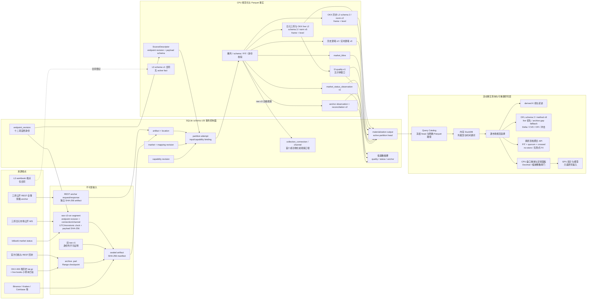
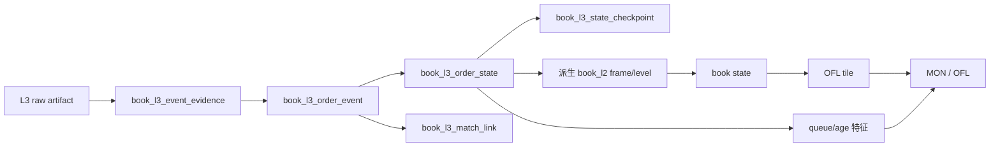

# 订单流数据事实契约与长期运行范围

> 文档类别：长期维护，登记于
> [docs/00-rules-registry.md](00-rules-registry.md)。
> 本文只定义订单流事实、选择规则、实时运行和前端反馈；制品台账与
> SQLite、Parquet、DuckDB 的通用契约见
> [materialization-design.md](materialization-design.md)。
> 当前项目根为 `C:\Users\wu_zh\dev\guvolu`，数据根为
> `C:\Users\wu_zh\dev\guvolu\data`。
> 当前版本边界：SQLite schema v20；实时 raw v3；三所日元市场 L2 物理
> schema v3 / `book-l2-normalization-v5`；实时逐笔 schema v3 /
> `trade-realtime-normalization-v4`；OKX 历史 L2 schema v2 /
> `book-l2-normalization-v2`；book-state 当前代码契约为 schema v1 /
> `book-state-checkpoint-v3`，OFL 当前代码契约为 schema v2 /
> `orderflow-tile-sparse-v8`。

## 1. 结论

订单流的不可替代输入是同一 `market_id` 的完整逐笔成交与实时 L2
盘口。K 线、主动买卖量、Delta、累计 Delta、足迹、盘口不平衡和冲击
均为派生数据，不得反向补写为来源事实。当前最小长期范围固定为 GMO
`BTC`、bitbank `btc_jpy`、bitFlyer `BTC_JPY` 的六条实时流，以及 L2、实时
逐笔、book-state 和 OFL 四类单写物化 watcher。三所事实可相互校验，但不可
相互代填。

## 2. 完整数据构成

| 层 | 数据 | 必需字段或状态 | 用途 |
|---|---|---|---|
| 市场维度 | 来源、规范化品种、市场、规则、能力修订 | `venue_id`、`instrument_id`、`market_id`、tick、size step、mapping revision、capability revision | 防止跨所同名品种混为同一事实 |
| 逐笔事实 | 每次来源撮合或来源聚合成交 | 来源成交 ID、事件/可得/摄取时刻、价格、数量、taker side、撮合粒度、原件与 row/item | 足迹、成交量、Delta、累计 Delta、VWAP、冲击 |
| L2 帧 | snapshot 或 delta 的消息级事实 | 帧种类、接收/事件时刻、sequence/checksum、完整性模式、run、connection/channel、原件与 row | 重建可见盘口状态和缺口边界 |
| L2 档位 | 每帧的 bid/ask 档位动作 | side、price、size、set/delete、level kind、frame FK | 热力图、盘口不平衡、OFI、墙和流动性真空 |
| 运行健康 | 采集、封口、物化与覆盖状态 | checkpoint age、sealed lag、materialization lag、reconnect、gap、reject | 判断数据是否仍可用于实时与研究 |
| L2 质量窗口 | 活动 L2 的五分钟可重建摘要 | fresh/stale、帧数、gap、sequence、reject、深度、延迟、质量版本 | 给 API/UI 统一健康语义，不替代逐帧事实 |
| 市场状态 | bitbank 独立 status/circuit-break 观察 | 来源状态、事件/可得/摄取时刻、原件与扫描断点 | 解释停牌或熔断，不混入 L2 帧 |
| REST 锚点 | 三所独立 REST 全簿观察与 reconciliation | endpoint revision、connection/trigger、请求响应散列、逐档与摘要、比较范围 | 旁路诊断 WS 状态，不补写或修正 WS |
| 派生 bar | 逐笔按稳定时间桶聚合 | OHLCV、buy/sell volume、buy/sell notional、unknown side、coverage | K 线、stacked area、footprint |
| 派生订单流 | bar 或事件窗口特征 | Delta、累计 Delta、POC、价值区、失衡、OFI、深度带和冲击 | 研究、报警和前端解释 |

L3 委托级排队位置不在三所公开能力内；私有委托与自身成交属于执行域，
不得混入公共订单流。ticker 的最新价、最优价和普通成交量可由逐笔与 L2
重建；交易所特有的二十四小时滚动统计若使用，必须保留独立端点身份。

## 3. 事实身份与绑定

### 3.1 主键链

```text
instrument_id
  -> market_id = venue + venue_symbol + mapping_revision
  -> source_artifact_id = SHA-256(raw bytes)
  -> source_row_index + source_item_index
  -> normalization_version + schema_version
  -> observation_id 或 frame_id
```

`market_id` 表示一个来源上的实际市场，不表示跨来源可互换的 BTC/JPY。
`artifact_id` 表示不可变字节身份；物理路径只是一处 location，不能作为
主键。`source_row_index + source_item_index` 解决 bitbank 和 bitFlyer 一帧
包含多次成交的问题。`normalization_version` 表示字段语义；语义修订生成
新尝试和新制品，不覆盖旧事实。

raw v3 的端点与会话链为
`endpoint_id + endpoint_revision -> connection_id -> channel_id -> market_id`。
`connection_id` 末尾的 `cNNNNNN` 是 run 内一基成功连接序号；控制面列名为
`connection_ordinal`，不能解释为重连次数。只有已封口 raw v3 中通过来源、
payload 与事实校验的数据帧，才会在物化完成事务内登记连接和频道。旧 raw
v1/v2 保持 NULL，不反推控制行。由于当前采集原件没有单独保存 socket-open 与
subscribe-ack 事件，`opened_at` 和 `subscribed_at` 均以
`first_successfully_materialized_raw_v3_frame` 明示为首个成功物化数据帧时刻，
不能用来计算握手或订阅延迟；没有独立控制事件时 `closed_at` 与
`unsubscribed_at` 正确留空。

归档逐笔 schema v2 保存 `mapping_revision`、`capability_revision`、
`source_endpoint` 和来源行身份；实时逐笔 schema v3 /
`trade-realtime-normalization-v4` 进一步保存端点修订、连接/频道、单调接收时钟、
payload SHA-256、`data_quality` 与 `raw_schema_version`。三所实时 L2 使用 schema v3 /
`book-l2-normalization-v5` 保存同一组采集身份与质量证据。bitbank 的
`depth_diff` 与 `depth_whole` 按 connection + room 分别验证严格递增；跨 room
同序不视为重复，迟到且序号较低的 whole 仍须保留，同 room 重复或回退才拒绝。
状态消费者按官方算法在 whole 前缓存 diff，whole `S` 到达时替换本地簿，并只
按 `s` 升序回放 `s > S` 的缓存 diff；`s <= S` 已被 whole 覆盖。旧 v3 曾把跨
room 同序误约束成固定方向的一对并拒绝实包中的合法 whole，故以 normalization
v4 全量重投影；v5 再禁止把 segment 内推断前驱写入来源列，来源未提供时
`prev_sequence_id` 正确留空。旧 attempt/制品保留而不原地改写。OKX 历史 L2 继续使用
schema v2 / `book-l2-normalization-v2`，把 `capability_revision`、端点、payload
schema、book mode 和 replay fidelity 下推至每个 frame；历史归档没有实时
connection/channel 语义，不为统一列形而伪造。

批级 `partition_capability_binding` 始终是可审计外键。查询层以统一视图读取
不同 schema，缺失字段正确留空，不需要改变 `market_id`、`artifact_id` 或
partition head。raw v3 的端点修订、连接/频道、UTC 与单调接收时钟和 payload
散列必须逐项验证；旧 raw v1 重投影到 v3 事实时这些不可证明的列保持 NULL，
并用 `data_quality` 标记端点修订/连接频道未记录、payload 散列由物化侧推导。
禁止从目录、当前注册表或邻近帧倒填历史身份。

能力修订只在没有上游依赖的完成 attempt 上直接绑定。book-state v3、
OFL v8 等派生事实依靠 `materialization_dependency` 的精确递归闭包
追溯到根级 L2/trade attempt，不复制能力绑定后冒充一次新 API 观察。
每份由上游 attempt 产生的输入 artifact 必须同时有直接生产依赖，完成
依赖只能指向完成上游且不得成环。这使 `market_id + artifact_id +
normalization_version` 能和确切上游世代一起串联所有订单流事实。

### 3.2 端点修订身份

SQLite schema v20 的 `endpoint_revision` 以十二项自然身份区分端点：legal
entity、venue brand、product、environment、region、transport、protocol、auth
mode、host、port、base path/channel 与 data level；scope、来源 schema revision、
文档证据和有效期属于修订属性。raw v3 的 `endpoint_id + endpoint_revision` 必须
命中该注册表，端点身份与来源能力修订是相互补充的两条证据，不能互相替代。

### 3.3 重合来源

同一来源归档与实时流均保留原观察，不在 raw 或基础 Parquet 层互相覆盖。
规范读取视图按以下规则选择：

1. bitbank 与 bitFlyer 用来源成交 ID 去重，官方归档或 REST 回补优先于
   实时 wire 副本；仍保留被选择前的两份制品和血缘。
2. GMO 公共逐笔无原生成交 ID。实时事实使用来源范围合成标识，不能与
   日归档逐条可靠对齐；归档日一旦完成，规范日视图整日选择官方归档，
   不做逐条猜测合并。
3. Binance `aggTrades` 的 `match_granularity=aggregate`，只能用于参考价、
   大盘量和聚合成交研究，不能与三所 `match` 口径混作足迹基线。

### 3.4 非重合来源

其他来源只能生成新的 `market_id` 或显式的跨来源派生制品。禁止把另一
来源的成交或盘口动作写到缺失市场之下。跨来源可做窗口级价格、VWAP、
收益率、成交量与陈旧度比较，并在派生记录中保存 `source_set`、方法版本、
覆盖率和降级状态。

跨所顶档读取聚合已由 `GET /api/v2/aggregates/book/top` 实现：在同一 decision
time 冻结各市场活动 head，逐 `market_id` 应用 PIT、新鲜度与质量门禁，再返回
contributors、quorum、synthetic best bid/ask、中间价中位数、覆盖与 `crossed`。
它要求相同 base/quote/instrument kind/market kind，无显式 FX 时混合 JPY 与
USDT/USD 直接拒绝。响应 `no-store`，不反写来源事实，也不把 crossed 静默裁平。
该读取结果没有活动聚合 Parquet head；回测级复现仍须把 source set、输入 head、
decision time 与方法版本物化为独立 dataset。禁止先混池逐笔或档位动作。

### 3.5 L2 质量、市场状态与 REST 锚点

`l2-quality-v1` 从活动 L2 事实确定性产生五分钟窗口；SQLite
`l2_quality_window` 只是低基数查询摘要。bitbank circuit-break/status 使用独立
`market_status_observation` schema v1 / `market-status-normalization-v1` 及扫描
断点，不把状态消息混入 `book_l2_frame`。两者失败均不回滚已经提交的 L2 事实。

三所 REST 锚点分别使用 bitFlyer `EP-0001@r0`、bitbank `EP-0003@r0` 与 GMO
`EP-0006@r0`，以独立不可变请求/响应 artifact 和
`book_l2_anchor_observation`/reconciliation schema v2 保存。每条事实带
`endpoint_id + revision`、请求/响应 SHA-256、触发原因、`connection_id`、逐档
Decimal、best/depth/hash 及三时刻。GMO 保留原来源时钟与 signed offset，并令
`available_time=max(event_time,response_receive_time,ingest_time)`；本机收到之前
绝不提前可见。

只有相同来源状态身份且深度范围一致才能裁决完整簿 `match/mismatch`。当前仅
bitbank REST/WS 序列相等时满足；GMO 与 bitFlyer 的时间近邻比较只能标
`approximate/unknown`，保留差异诊断但不产生 full-book mismatch。连接打开、重连
和周期触发只投递到后台有界队列，限频、超时或队列满形成
`unavailable/unknown`；不得阻塞 WS，也不得用 REST 重写 WS、填补断流或改变活动
L2 head。该 worker 嵌入每条 L2 采集进程，在连接打开、重连与每 300 秒触发，
不另设常驻进程。bitFlyer 断线窗口因此仍不可回补。

REST anchor raw 先按文件 SHA-256 耐久落盘，所以进程在 SQLite 最终事务前
退出时可能留下孤立但完整的原件。此类原件使用
`python -m guvolu.data.book_l2_anchor recover-raw --data-root data
--raw-path <path>` 幂等恢复；先加 `--check-only` 只检查。恢复会复算
文件名/内容、请求/响应与端点身份散列，不改写 raw、不用事后的 WS
checkpoint 伪造 PIT 对齐，也不用旧恢复结果覆盖较新 anchor head。

## 4. 回补边界

| 来源 | 逐笔成交 | L2 盘口 | K 线 | 结论 |
|---|---|---|---|---|
| GMO | 官方日归档可回补，最新日受发布时间限制 | 不可历史回放；REST/新 snapshot 只能重锚当前状态 | 官方 K 线可回补并保留 provisional/revision | L2 缺口永久保留；归档发布后整日替代实时逐笔规范视图 |
| bitbank | `transactions/{day}` 可按日回补；已确认的来源 404 日保持 blocked | 无官方历史 replay；whole snapshot 只能重锚；sequence 单调但不要求连续，必须按官方 whole/diff 缓冲算法重放 | API 有 candlestick，主干尚未作为来源事实物化 | L2 不补写；逐笔按成交 ID 去重 |
| bitFlyer | `/v1/executions` 只在约三十一日窗口内可回扫，超窗后不可恢复 | 无历史 replay，断线期间不能补发，且 board 无 sequence | 无当前官方 K 线主来源；由完整逐笔派生 | 实时逐笔游标须避免逼近窗口边界 |
| Binance | 公开归档可回补，但当前接入为 aggregate | 现货历史 L2 不在当前主干 | 归档可回补，当前不是 JPY 主数据 | 作为全球参考，不代填日元三所 |
| Coincheck | 已有极小实时样本，完整历史能力未闭环 | 已有极小快照样本，无可证明 replay | 无现行主来源 | 仅验证旁路，不进入主订单流 |
| OKX | 成交与实时流尚未闭环 | 400 档 `BTC-USDT` 已形成按 UTC 日、周期 snapshot 加绝对 update 的有界热回补；无逐帧 sequence/checksum，当前覆盖见质量快照 | K 线尚未物化 | 历史 L2 只补 OKX 自身市场，冷层继续受磁盘门禁约束 |
| Bybit | 实时成交端点已核，尚未本地闭环 | 当前公开目录无历史 L2 文件证据 | K 线尚未物化 | 历史 L2 保持 blocked；实时流可独立排期 |
| Kraken/Coinbase/Hyperliquid | 能力已登记，当前未完成本地闭环 | 无等价官方历史 L2；实时完整性能力各异 | 能力已登记，当前未物化 | 后续按完整性、产品种类与日元相关性排期 |

不补写日元三所事实是质量要求，不是覆盖缺陷。代填会伪造成交量、主动方向、
滑点、盘口撤挂、冲击和报警标签，使回测不可审计。允许的 fallback 只有同一
来源、同一市场、语义相容的官方接口；跨来源只能降级为参考视图。

## 5. 最小长期运行集合

| 任务 | 数量 | 常驻理由 | 断点 |
|---|---:|---|---|
| 三所 BTC/JPY L2 采集 | 3 | 历史不可补，是最高优先级原件 | 每条 fsync；60 秒 checkpoint；5 分钟或容量封口 |
| 三所 BTC/JPY 实时逐笔采集 | 3 | 支持当前足迹并覆盖归档发布前窗口 | 同上；逐笔独立 `trade_realtime` 域 |
| L2 sealed 物化追赶 | 1 | 生成 frame/level Parquet | 输入散列、attempt 与 partition head |
| 实时逐笔 sealed 物化追赶 | 1 | 生成 schema v3 `trade_observation`；归一 v3 按来源帧原子 reject，并验证 raw v3 采集身份 | 输入散列、attempt 与 partition head |
| book-state checkpoint v3 | 1 | 维护可丢弃的最新盘口加速制品；按来源契约重放；OKX 可从可信 segment 终态只重放尾部 | 上游活动 attempt dependency、终态 artifact 与输入散列 |
| OFL tile | 1 | 生成小时列头与稀疏格；订单流归因与成交分离 | 上游活动 head、method version、锁超时整轮重试 |
| 计划任务守护 | 2 | 登录启动和五分钟幂等判活 | Windows Task Scheduler，重复实例 IgnoreNew |

只需要为 BTC/JPY 订单流保持上述集合。其他币种优先回补可恢复逐笔，不应在
没有明确消费场景时把所有 L2 全量常驻。扩展顺序为 BTC 之后的 ETH、XRP，
每增加一个实时市场都先测每日字节率、sequence 质量和实际前端用途。

历史回补不作为“常驻进程”保活。它按覆盖台账求缺、失败可重跑，且不能与
不可回补实时写者争夺磁盘。bitFlyer 新成交的自动前扫需先完成增量游标，
不得把现有全窗口重扫命令直接放入每小时计划任务。

## 6. SQLite、Parquet 与日增

当前分工正确：SQLite schema v20 是事务控制面，保存维度、端点/能力修订、
连接/频道观察、artifact location、attempt、输入绑定、输出、活动 head、覆盖和
拒绝；大规模逐笔、K 线与 L2 事实只放 Parquet；DuckDB 以临时连接构建和查询
Parquet，不形成第二真相库。
这与 [架构锁定项 TBD-01](architecture.md) 一致。

各域虽各自只有一个物化写者，仍会写入同一 WAL 数据库；因此结构初始化和每个
物化提交周期都由
`data/.locks/sqlite-writer.lock` 跨进程串行化。采集、SHA-256 与 Parquet
读取仍可并行。升级运行库后仍保留这一约束，因为 SQLite 的基本模型就是
多读、单写。

原件每条先 `fsync`，`.open` 只表示运行中；封口后写 SHA-256 manifest，物化
只读 `sealed + completion_claim=true`。进程、数据库或 DuckDB 中断都不能
把未封口片段声明成完成，重启后按输入散列复用已完成制品。

OKX 历史 L2 使用独立归档状态机：`.part` 分块同步并写 checkpoint，
Range 起点必须与本地长度一致；日档核对 Content-Length 与 SHA-256 后才封口。
物化恢复单位是一份 UTC 日档，任一畸形 update 使整日失败，不允许跳过后继续
污染重放状态。永久增量、暂存峰值、内存和墙钟以日期质量快照的实测为准；在
P95 证据支持前不授权并发全历史扩量。

当前五分钟分段有利于低恢复点和可见进度，但长期会产生小文件。raw 继续保留
五分钟段，分析层应增加小时 compaction，将同一小时内的
frame/level 或 trade 文件合成小时制品，同时保留所有输入 artifact 绑定。
compaction 生成新 attempt/head，不能删除或覆盖原始段；在 compaction 上线前，
不得用“节省空间”为理由删除 raw。

DuckDB 官方建议分析型 Parquet 使用较大的 row group，并把单文件保持在约
100 MB 至 10 GB；当前五分钟事实远小于该量级，所以五分钟只作为耐久与恢复
边界，小时或日文件才是长期查询边界。compaction 必须保留全部输入 artifact
绑定，不能仅按路径拼接后丢失来源证据。

三所实时 raw、Parquet、manifest、控制库与历史 L2 的当前字节率、热层估算和
磁盘余量只在日期质量快照发布；长期容量按连续观测的 P50/P95 和临时峰值规划。
空间阈值沿用 [runtime-ops.md](runtime-ops.md)：低于 20% 暂停历史扩量，低于
10% 只保留不可回补实时流。Parquet 的 ZSTD、十进制文本列式压缩与只存档位
动作是合理的；不得把大规模事实复制回 SQLite。

## 7. 派生 K 线与 stacked area

OHLCV 由已选择的规范逐笔按 `[bar_start, bar_end)` 聚合，边界统一 UTC，
交易日另存 `trading_day`。bar 必须保存来源市场、撮合粒度、side basis、
总量、未知 side 数、覆盖状态和派生版本。输入存在缺口时 bar 可留空或标记
incomplete，不能插值为零成交。

TradingView stacked-area 插件适合表达同周期的非负组成。本项目只用它显示
主动卖/主动买数量或金额，两层之和与 bar 总量闭合；不用于 OHLC，也不直接
承载有正负号的 Delta。未知 side、时间缺口和覆盖裁剪均切断面积。该图是订单
流页面与主足迹共时间轴的诊断副窗格，不另建页面。

## 8. 前端反馈

订单流分析继续使用独立订单流页面；采集与数据质量应形成独立“数据健康”
页面或把现有能力页升级为该页面，避免把运维状态塞入交易图。至少显示：

| 反馈 | 显示内容 |
|---|---|
| 来源矩阵 | venue/market/domain 的 live、stale、gap、backfillable、blocked |
| 三类时延 | event 到 ingest、checkpoint age、sealed 到 materialized lag |
| 完整性 | snapshot anchor、sequence 模式与回退、reconnect、reject、unknown side |
| 覆盖日历 | confirmed empty、missing、not published、cannot backfill 分色 |
| 管线阶段 | raw open、sealed、materialized、compacted 的行数和最后时刻 |
| 存储 | 当前容量、日增估计、到 20%/10% 阈值的预计天数 |
| 任务 | 上次运行、下次运行、退出码、重试、是否被 IgnoreNew 阻止重复 |

任何实时数都带更新时间与陈旧状态。红色只用于不可回补缺口或失败，琥珀色
用于待回补或裁剪，健康状态不掩盖来源和覆盖范围。

## 9. 任务与废弃实现

现行计划任务只运行 `guvolu-marketdata-logon` 与
`guvolu-marketdata-guard`，均调用幂等的
`scripts/start_marketdata_pipeline.ps1`。旧 `guvolu-api-logon`、
`guvolu-api-guard`、硬编码系统 Python 的 `api_guard.ps1` 与旧登记脚本已
废弃；计划任务登记脚本会按精确名称清理旧任务。

旧 SQLite `trade_tick`、`book_top`、`stream_health`、`kline` 与旧式
`RawWriter` 暂时保留为兼容读取和历史回补入口，不属于可直接删除的无用实现。
待查询服务全部按 partition head 读取 Parquet、旧投影引用和回归测试归零后，
再以单独迁移删除，不能在事实消费者仍存在时提前移除。

## 10. 全链路



图中 SQLite 只保存控制与血缘，Parquet 保存大事实；DuckDB 仅对活动头冻结的
明确路径进行内存构建/查询，不持久化另一份真相。GPU 不参与网络、解压、JSON、
散列、Decimal 校验、SQLite 或 Parquet 编码。
`book_l2_frame/level` 先在 CPU 上按 `event_time` 重放成带输入集合和版本的定频
面板，再把缩放整数或研究域 `float32/float64` 送入 GPU；研究结果不回写事实层。

## 11. L3 升级兼容与派生边界

现有控制面可直接承载 L3：artifact、location、partition attempt、输入与能力
绑定、materialization output、活动 head 和 rejection 均不变。不能复用的是
L2 的自然粒度。L3 是订单生命周期事件，不得把 order ID 塞进
`book_l2_level` 后继续称 L2。

L3 合同拆成四表：

| 数据集 | 自然粒度 | 必需字段 |
|---|---|---|
| `book_l3_order_event` | 市场中一个公开订单的一次逻辑生命周期事件 | native symbol/mapping/capability、sequence domain、source schema、order ID scope、qty unit/basis/semantics、priority policy/effect、三时刻与选中 evidence |
| `book_l3_event_evidence` | 同一逻辑事件的一份原件观察 | evidence key、artifact row/item、payload SHA、endpoint/connection/channel、sequence domain 与三时刻；允许一事件多证据 |
| `book_l3_match_link` | 一次公开撮合对订单与逐笔成交的可证明联系 | 稳定 match key、maker/taker/resting order scope、trade observation、price/qty basis；来源不提供时整表留空 |
| `book_l3_state_checkpoint` | 通过某一逻辑事件的公开订单态 | 稳定 checkpoint key、连接/序列域、through event、state SHA、订单计数、完整性、输入集和 priority policy |

事实主键固定为：

```text
market_id
+ source_event_key
+ normalization_version
```

`source_event_key` 优先由端点修订、来源序列作用域、原生事件序号和帧内项号
构成；没有原生身份时才退回原件观察身份。订单 ID 不是事件主键，因为同一订单
会经历多次生命周期事件。两路采集观察到同一原生事件时，逻辑事件键保持相同，
但每一路 artifact 由 `book_l3_event_evidence` 的复合主键追加保存；
`selected_evidence_key` 在 normalization version 内冻结，后到观察不能原地改写。

四表各有显式复合主键：order event 为
`market_id + source_event_key + normalization_version`；evidence 再加
`evidence_key`；match 与 checkpoint 分别使用稳定 `match_link_key` 和
`checkpoint_key`。键构造器对 canonical JSON 做稳定 SHA-256，且把
`sequence_domain`、order ID scope、qty 单位/基准、priority policy/effect 等不能
跨来源猜测的语义冻结在事实内。

L3 先重放得到 `book_l3_order_state`，再确定性聚合为现有
`book_l2_frame/book_l2_level`，之后复用 book state、OFL tile、特征和前端。
这样 L2 是 L3 的可重建派生层，不需要让 MON/OFL 理解订单 ID；同时保留
queue position、order age、replace、partial fill 等只在 L3 存在的研究能力。



L3 只有在公开源提供稳定 order ID、顺序/重放锚点和许可允许持久化时才能标记
`replay_fidelity=l3_reconstructable`。仅有 MBP 增量或匿名档位更新的来源仍是
L2，不能凭本地推断升格。私有“自己的订单”继续属于执行域，也不能补成公共 L3。
当前只完成四个 canonical dataset、稳定哈希键和校验器的合同定义；
没有任何 L3 生产 connector、封口 raw、活动 Parquet head 或下游页面，不能把
“结构兼容”表述成“L3 已接入”。来源工作簿不入仓，其身份、工作表与端点登记
完整性见 [L3 workbook evidence manifest](evidence/crypto_api_l3_registry_2026-08-12.json)；
该 manifest 是合同证据，不是运行证据。

## 12. Query Catalog 与前端统一边界

`QueryCatalog` 只从 SQLite 活动 head 生成 `market_id`、instrument、最新能力、
数据集行数、覆盖和 `head_generation`；不扫描目录，也不暴露失败或未激活
attempt。`GET /api/v2/markets` 是 MON/OFL 的统一入口。前端只统一市场上下文、
显示单位、时区、颜色、窗口和 stale/gap/degraded 呈现；side、PIT、snapshot/
delta/L3 重放、修订、覆盖、跨所和 FX 转换必须在事实或派生层完成。

当前市场级成品端点固定为：

| 端点 | 输入事实 | 语义 |
|---|---|---|
| `GET /api/v2/markets/{market_id}/klines` | 活动 `market_kline` | 同 market/interval/open/origin 取合法可见的最新修订，不调用来源 API |
| `GET /api/v2/markets/{market_id}/trades` | 活动历史与实时 `trade_observation` | 半开时间窗，按 `observation_id` 去重，不把 aggregate 冒充 match |
| `GET /api/v2/markets/{market_id}/footprint` | 同上 | 后端按 taker side、Decimal 价格档和 UTC bar 确定性派生 |
| `GET /api/v2/markets/{market_id}/book/l2/latest` | 活动 `book_state_checkpoint`，必要时回退 `book_l2_frame/level` | checkpoint 来源仍是同一活动 L2 head；陈旧、依赖退出或缺失时重放，绝不把 delta 单帧冒充全簿 |
| `GET /api/v2/markets/{market_id}/book/l2/quality` | `l2_quality_window` 与活动 L2 绑定 | 返回五分钟质量窗口和新鲜度，不把 REST anchor 或 market status 暗并入 L2 |
| `GET /api/v2/markets/{market_id}/orderflow/tiles` | 活动 `orderflow_tile_column/cell` | 查询窗前最近 anchor 作为 context 返回；L2 净减量与同市场逐笔成交保持分离 |

跨市场只读端点 `GET /api/v2/aggregates/book/top` 接受明确的 `market_id` 集合、
`min_quorum` 和 `max_age_seconds`；服务端在请求内冻结统一 decision time，不暴露
客户端 time 参数。它返回每个 contributor 的
market/head/时刻/质量、quorum、NBBO 风格顶档、中间价中位数与 `crossed`，并固定
`Cache-Control: no-store`。不兼容 base/quote/instrument/market kind 返回 400；
项目不做隐式 FX。该端点是读取期合成，不列入单市场事实端点，也不产生来源帧。

market status 与 REST anchor 当前只有事实/控制摘要，没有稳定公开 UI/API 合同；
在工作流完全验收前保持后置。任何临时运维读取都必须显示 endpoint revision、
触发原因、可比范围与 `fresh/mismatch/unknown/unavailable`，不能只给一个绿色布尔值。

每次请求先在一个 SQLite 读事务中冻结 head 与明确 Parquet 路径，再由内存
DuckDB 查询。响应同时返回 `head_generation`、`ETag` 和
`X-Guvolu-Head-Generation`，缓存策略为 `private, no-cache`；浏览器可条件请求，
但未把 generation 放进 URL 的响应不得标 `immutable`。L2 查询同时兼容三所实时
schema v3 的端点/连接/频道证据、由旧 raw v1 重投影但身份列正确留空的降级行，
以及 OKX schema v2 的 `depth_limit/source_session_id`。适配只发生在查询层，
绝不改写历史事实；不同 schema 的合并采用按列名对齐，不用列序猜测。

`book_state_checkpoint` 是加速制品而非新事实：响应的 `market_id`、末帧、
event/available time、完整性口径和 head generation 均来自 L2 活动事实。schema v20
用 `materialization_dependency` 将每个 checkpoint attempt 绑定到确切的上游
attempt；查询同时核对末帧时刻和来源 attempt，任一不成立便忽略 checkpoint。
因此删除全部 checkpoint 只会降低性能，不会改变正确结果；L2 活动事实不可由
checkpoint 反向替代。

当前 checkpoint 代码契约为 schema v1 / `book-state-checkpoint-v3`。OKX 终态基座
必须通过市场、来源 attempt、artifact、状态 SHA-256 与 PIT 校验；同 run 只重放
终态 segment 之后的帧，其他 run 只接纳终态摄取时刻之后的帧。run 或连接切换后
必须出现新 snapshot 才能恢复可信状态，不能用终态跨会话延续盘口。

历史 API 的内容缓存键至少包含：

```text
market_id + dataset + bucket/interval + partition/window
+ schema_version + normalization/method_version + head_generation
```

只有 URL 含内容 generation 时才允许 `immutable`。实时最后一个 bar/tile 使用
增量 update；已封口范围读取版本化成品。五分钟实时逐笔物化器固定为 schema v3 /
`trade-realtime-normalization-v4`：先验证 raw v3 端点/连接/频道与 payload 散列，
再按来源帧原子归一；bitFlyer 含空 side 的来源帧整帧 reject，不会阻断
GMO/bitbank 后续 segment，也不会重复刷同配置失败 attempt。旧 raw v1 仍可重投影，
但端点修订和连接/频道列保持 NULL 并带质量降级，不能获得 raw v3 的完整性结论。

GMO 实时逐笔把服务端 `error`/`errors` 帧先按 raw v3 原样落盘，再触发退避重连；
无限期模式同样有九十秒静默超时。只有正常 `trades` 数据帧成功持久化才清零连续
失败计数，因此 `ERR-5003` 或无数据静默不能被误判成仍在健康采集。

GMO `EP-0007` r1 订阅固定携带 `option=TAKER_ONLY`，其成交方向才登记为 `taker`。
旧 r0 与未记录修订的原件保持可重投影，但方向降级为
`participant_side_unfiltered`；价格与总量仍保留，signed flow 不计入这些行。
这是 normalization v4 相对 v3 的语义修正，旧制品不原地改写。

MON 与 OFL 已完成市场身份迁移：市场选择来自 Query Catalog，K线、
Footprint、盘口与 OFL 主热图读取 v2 成品。来源 ticker、私有委托、成交、特征和
档带追踪仅在所选 GMO 市场启用，避免把别所 symbol 发给 GMO API。OFL 客户端按
context anchor 重放稀疏状态，块缓存记录 head generation/ETag；gap 后禁止延用旧簿。
UI 只在对应活动 head 持续发布时开放桶档；未发布的桶不会以空结果冒充能力。
GMO 旧一分钟瓦片暂只作两日导航兼容；非 GMO 导航在一分钟 v2 头落地前使用当前
细窗，主热图和五带不依赖该兼容来源。

OFL 新物化固定采用 `orderflow_tile_column` 与稀疏 `orderflow_tile_cell` 两层：
column 保存时间覆盖、锚点、break/gap 和同市场成交汇总，cell 保存整数价格格的
存量及可证明的变化量。二者是 L2/逐笔的派生输出，必须带 method version 与上游
dependency；跨币所仅可在展示或显式研究聚合层按共同时间轴比较，不能在 cell
生成阶段合并盘口或逐笔身份。

当前代码版本 `orderflow-tile-sparse-v8` 明确分开 `net_increase`、
`net_decrease_unknown` 与 taker buy/sell。净减少不得由 UI 改名为撤单，成交也不
反向扣进净减少。每 128 列提供全状态 anchor，中途 snapshot 保存 reset 差异；
查询窗口前的最近 anchor 作为 `context_only` 返回，渲染完成状态重建后再丢弃上下文
列。画布提示已改为“净减挂（归因未知）”和“主动成交（独立逐笔）”；OFI、spread、
imbalance 与 5/10/25bp 深度带从重建后的同市场簿确定性计算，有限发布深度一律标
partial。bitbank tile 复用官方 whole/diff 缓冲重放，缓存 diff 为恢复状态而延后
应用时不产生订单流归因。OKX 同市场同窗优先选择 live v5 覆盖，只有 live 覆盖外
才以 archive v2 fallback；无逐笔时成交字段为零并保留能力缺口，不跨所补写。

OFL 常驻 watcher 的最外层 writer lock 和可恢复 IO/SQL/DuckDB 错误只终止当前轮，
记录 `orderflow_tile_cycle_error` 后按 poll interval 重试；单市场错误记录 task error
并继续其他市场。任何异常轮都不推进活动 head，不能通过移除锁来换取表面存活。

## 13. 外部依据

- [SQLite WAL 官方说明](https://sqlite.org/wal.html)
- [DuckDB Parquet 读写与下推](https://duckdb.org/docs/current/data/parquet/overview)
- [DuckDB 文件与 row group 性能指南](https://duckdb.org/docs/current/guides/performance/file_formats)
- [TradingView stacked-area 官方示例](https://github.com/tradingview/lightweight-charts/tree/master/plugin-examples/src/plugins/stacked-area-series)
