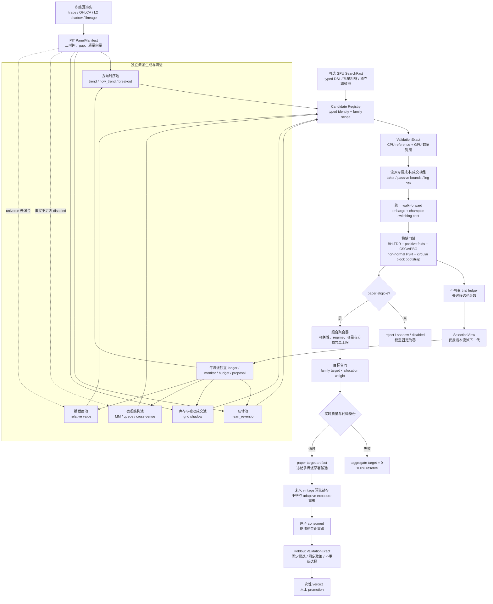

# 策略研究管线

> 本文是策略研究、样本外验证与 paper 目标位置的长期契约。
> 数据平台动态状态与策略优先级依据
> [多场所数据平台与策略研究复核审计](2026-08-13-data-platform-strategy-audit-review.md)。

## 1. 安全与用途边界

研究进程只读取活动物化事实，不读取密钥，不调用网络，也不持有任何委托能力（T-13、G-01）。
管线输出只允许用于研究、回测、paper 和 shadow。实盘仍须依次通过回测、模拟运行和最小手数
实盘三个阶段（T-12），且账户、限额和执行健康门禁不属于本管线的授权范围。

管线当前覆盖以下系列：

| 系列 | 模式 | 当前职责 |
|---|---|---|
| 趋势 | paper | 方向主策略候选 |
| 量价确认趋势 | paper | 仅在成交方向与交易额共同确认时进入趋势目标 |
| 突破 | paper | 价格突破与成交方向确认 |
| 均值回归 | paper | 低趋势环境的受限候选 |
| 网格 | shadow | 库存型均值回归压力测试，不分配本金 |
| L2 overlay | shadow | 只调节已准入方向策略，不单独分配本金 |
| 跨所错位 | shadow | 同 quote、费用后双腿错位证据，不形成套利委托 |
| 做市、queue、真实套利、衍生品、链上 | disabled | 缺少报告列明的 L3、私有执行或衍生品事实，权重固定为零 |

## 2. 单向研究链路

```text
活动成交 head
  -> 冻结 attempt、artifact 与 normalization version
  -> PIT 紧凑小时面板
  -> 特征面板
  -> 候选纯函数
  -> embargo walk-forward
  -> 成本后样本外指标与 FDR
  -> 市场状态和质量硬门禁
  -> 受约束 soft allocator
  -> paper 目标位置
```

紧凑面板只扫描 SQLite 活动 head 登记的 Parquet，不使用目录 glob。成交必须满足
`available_time <= bar decision_time`；同一 `observation_id` 只保留按摄取证据排序的首项。
Decimal 价格和数量继续作为审计真相，同时生成 `price_ticks`、`base_volume_lots` 和
`notional_atoms` 整数投影，分别绑定 mapping revision、tick、lot 与名义金额 scale。

特征制品不含未来标签。下一期收益、费用、换手和 gap 平仓另存 label/cost/replay 制品，
其 `label_available_time` 不早于下一根柱的决策时点。回测目标由策略纯函数产生，收益使用
前一决策目标，不能使用同柱结束后才生成的目标（C-02、D-04、D-10）。

## 3. 空窗与成本

GMO 历史成交可观察到周期性短空窗。第一版配置把最多四根柱登记为结构性闭市空窗假设；
超过该上限即令滚动特征失效，直到完整回看窗重新形成。回放不获取跨超限缺口收益，而按
入场换手加断流平仓的双边成本处理。该阈值属于版本化配置，不是来源事实（G-06）。

成本模型至少包含 taker fee、半边 spread、slippage 和 impact。被动成交、撤单失败与部分成交
尚无足够事实校准，因此当前 paper 系列统一使用主动成交保守成本；网格保持 shadow。

## 4. 验证与准入

候选按扩展训练窗、embargo 和固定测试窗评估。每折只能用该折训练段选择家族冠军，家族
样本外路径按实际冠军切换后的目标重新计算换手与成本。所有候选、所有训练折、所有测试折、
固定候选聚合结果和家族 walk-forward 结果共同进入多重检验计数；全部事实均进入内容寻址
trial ledger，不删除失败候选（G-07）。准入同时要求：

- 样本外柱数达到配置下限；
- 成本后净收益与 Sharpe 为正；
- 最大回撤不超过配置上限；
- 全候选 Benjamini-Hochberg FDR 校正值不超过配置上限；
- 成本后净收益为正的独立测试折比例达到配置下限；
- CSCV 折块选择过拟合概率（PBO）不超过配置上限；
- 168 小时循环折块 bootstrap 的 Sharpe 非正概率不超过 0.05；
- 模式为 paper，shadow 不可因收益通过而获得本金。

结果同时输出固定多头、单策略、无 L2 overlay 和无 regime 消融。Sharpe 只是一项指标；
报告还保留 turnover、drawdown、capacity、cost、hit rate、exposure 与质量归因。
家族摘要另记录正收益折比例、训练冠军最大占比和被选测试折 Sharpe 中位数，以区分“长期由
少数时期撑起”和“跨时期可重复”的候选。单侧 p 值使用偏度、峰度修正的非正态
Probabilistic Sharpe 近似。CSCV 将 walk-forward 测试折尽量平分为训练/验证折块；奇数折使用
`floor(n/2)` 对 `ceil(n/2)` 并在摘要记录两侧折数。全部组合过多时按配置种子固定抽取 512
个分割；每个分割选择折内冠军并以平均并列秩观察其折外相对排名。
`PBO` 是选择稳定性诊断，不是盈利性指标：一个稳定亏损的流派也可能有很低 PBO，仍会被净
收益、Sharpe、回撤或正收益折比例门禁拒绝。另以 1,024 次固定种子循环折块重采样保留一周
以内的短程依赖，输出单侧 5% Sharpe 下界与 Sharpe 不大于零的经验概率；后者进入准入门禁。
该实现是可审计的 percentile 诊断，不冒充 Ledoit-Wolf 的完整 studentized bootstrap。

## 5. 质量、状态与分配

质量向量为 `integrity/freshness/clock/coverage/PIT/lineage`。任一依赖维度失败，分配器必须
返回全系列零权重和百分之百风险余量。市场状态只在硬门禁通过后收紧家族上限，不能恢复
被关闭的策略。

paper 分配遵守以下长期边界：趋势、量价确认趋势和突破合计不超过总风险六成，均值回归
不超过两成五，风险余量不低于一成五，L2 overlay 的调节幅度不超过正负三成。方向家族清单
与具体值均来自
[策略研究配置](../config/strategy_research.json)，不在代码中另设隐藏阈值。

## 6. 制品与运行

运行命令：

```powershell
.\.venv\Scripts\python.exe scripts\run_strategy_research.py
```

独立生成候选、运行一个流派、监视方向并生成下一代预登记提案：

```powershell
.\.venv\Scripts\python.exe scripts\generate_strategy_candidates.py --family trend
.\.venv\Scripts\python.exe scripts\run_strategy_family.py trend
.\.venv\Scripts\python.exe scripts\monitor_strategy_family.py trend
.\.venv\Scripts\python.exe scripts\propose_strategy_evolution.py --monitor <monitor.json>
```

两条命令的 `--output` 都表示输出目录；制品文件名由内容散列生成，不能把
`--output` 直接指定成 `.json` 文件。

派生配置是新制品，不覆盖基准配置。使用派生配置再次运行时仍属于开发回放；只有明确登记的
一次性封存段才允许形成最终 promotion 证据（G-08）。

`cpu-v8` 把这条纪律落实为 SQLite 原子状态机。普通管线在打开面板前登记
`DEV_ADAPTIVE` 暴露区间；封存段必须在区间开始前创建，且不得与任何历史暴露或其他 vintage
重叠。专用 holdout runner 先把 vintage 永久改为 `consumed`，然后才打开市场数据；即使进程
崩溃也不能重跑。候选必须来自 clean commit 的多流派组合运行，候选集、源码、配置、输入 head
和结果散列全部绑定。结论只能登记一次且不能改写：

```powershell
# 示例时间必须是尚未开始的未来区间；不可对既有历史事后封存。
.\.venv\Scripts\python.exe scripts\manage_holdout_vintage.py seal `
  mkt__gmo__btc__r0 2026-10-01T00:00:00Z 2027-01-01T00:00:00Z

# 等到封存区间完整到达后，冻结候选并只运行一次。
.\.venv\Scripts\python.exe scripts\run_holdout_validation.py <vintage_id> `
  --source-summary <clean-combined-summary.json>

.\.venv\Scripts\python.exe scripts\manage_holdout_vintage.py list
```

当前 2019 年以来的数据已进入 adaptive 开发历史，不能倒签为 holdout。因而状态机与专用
评估路径已经可用，但现有策略仍没有 G-08 通过结论；必须等待一个事先封存的新数据段，这一
时间约束不能由代码、回填或重复回测绕过。

只读复核最近一次发布运行：

```powershell
.\.venv\Scripts\python.exe scripts\verify_strategy_research.py
```

主要输出为：

| 制品 | 位置 | 用途 |
|---|---|---|
| 紧凑面板 | `data/research/physical/<market_id>/` | Decimal 与整数双表示 |
| candidate registry | `reports/strategy-research/<run_id>/artifacts/` | 流派范围、生成方法和全部候选身份 |
| 特征面板 | `reports/strategy-research/<run_id>/artifacts/` | PIT 特征与输入血缘 |
| label/cost/replay | 同上 | 标签可得时点、成本和策略净收益 |
| trial ledger | 同上 | 全候选、全折、全结果台账 |
| target position | 同上 | 研究回放与运行快照目标位置 |
| manifest | `reports/strategy-research/<run_id>/manifest.json` | 代码、配置、输入和输出散列 |
| 活动指针 | `reports/strategy-research/latest.json` | 原子更新的最近完成运行位置 |

`run_id` 绑定输入 head、attempt、artifact、配置散列、研究源码、脚本和测试树散列。
有 Git commit 时另记 Git hash 和 dirty digest；仓库没有首个 commit 时仍可复现文件内容，
但 `decision_grade=false`，目标不得进入决策级使用（D-09）。

## 7. 当前策略生成方式

当前版本是可解释的 CPU 小网格，不是自动发现系统。版本化 JSON 展开趋势、量价确认趋势、
突破、均值回归和网格候选；候选身份由家族、模式和完整参数确定。所有候选共享同一 PIT
特征纯函数、完整主动成交成本和 walk-forward 验证，再由质量门禁和受约束分配器生成目标。

这种方式适合当前阶段：候选少、每条规则可解释、失败原因可以审计，也能为未来 CPU/GPU
实现提供数值参考。其边界同样明确：当前只有单市场小时面板；参数网格是人工提出的；非正态
Sharpe 概率本身不处理收益自相关，另由循环折块 bootstrap 诊断；折块 PBO 也复用了开发期
walk-forward 折；开发段已被反复
用于工程迭代，不是尚未查看的
一次性封存段。因此 `paper eligible` 只表示通过本配置的开发回放门禁，不表示可直接实盘，
也不表示完成 G-08 的最终封存验证。

同一实现支持组合运行与单流派运行。单流派 `run_id` 绑定 `family_scope`、生成器版本和候选
身份，输出独立的候选注册表、试验台账、目标仓位与活动指针。监视器只读取完整候选网格的
聚合样本外事实：对每个数值轴给出关联方向，并跨运行标记 improving、stable 或 decaying。
自动提案最多扩展一个已配置边界轴，同时同步特征依赖、候选预算和 parent config hash；
均值回归等在成本后净收益为负的流派返回“修订假设或成本模型”，不继续盲目扩大参数网格。

单流派运行的 FDR 只回答该流派内部的试验范围，不能直接作为多流派组合 promotion 证据。
组合运行必须重新包含所有拟分配流派及其候选，形成全局试验计数和共享方向风险上限。独立
流派运行用于生成、诊断和演进；组合运行用于比较相关性、竞争风险预算和最终 paper 准入。

2026-08-14 的 `cpu-v7` 独立运行均通过九类制品复核。基准配置下，突破、量价趋势和趋势
通过开发回放门禁；均值回归与网格在完整主动成交成本下被拒绝。所有运行的实时质量均因
特征快照过期而失败，所以运行仓位和组合目标保持为零：

| 流派 | OOS Sharpe | 净收益 | 最大回撤 | FDR q | PBO | 折块 p | 结论 |
|---|---:|---:|---:|---:|---:|---:|---|
| 突破 | 1.114 | 1.672 | 0.276 | 0.006 | 0.066 | 0.004 | development paper eligible |
| 量价趋势 | 0.741 | 1.234 | 0.353 | 0.033 | 0.330 | 0.043 | development paper eligible |
| 趋势 | 0.772 | 1.274 | 0.432 | 0.036 | 0.320 | 0.034 | development paper eligible |
| 均值回归 | -0.523 | -0.697 | 0.548 | 1.000 | 0.002 | 0.928 | rejected；修订假设或成本逻辑 |
| 网格 shadow | -1.495 | -1.953 | 0.865 | 1.000 | 0.000 | 1.000 | rejected；先补被动成交模型 |

监视器只允许突破与趋势各扩展一个预登记边界轴到 264 小时。趋势派生候选把拼接 OOS
Sharpe 从 0.772 提高到 0.866、PBO 从 0.320 降到 0.121；突破则把 Sharpe 从 1.114 降到
1.081、PBO 从 0.066 升到 0.188。两者部署冠军都仍是原 168 小时候选，因此这些结果只进入
adaptive 历史，不自动改写基准配置。每个流派当前只有两个独立研究身份，低于三个历史运行
的方向判定门槛，跨运行状态诚实保持 `insufficient_history`。

## 8. 下一版 CPU 生成方式

CPU 阶段应先于 GPU 完成以下收敛：

1. 把候选由家族专用循环升级为有类型、单位、有效性和 PIT 约束的表达式注册表；相同表达式
   规范化为同一候选身份，公共子表达式只计算一次。
2. 增加 5 分钟、1 小时和 4 小时多节拍，但每个候选只使用预先登记的决策节拍与成本模型；
   不把同一参数在所有节拍无边界复制。
3. 在现有非正态 Probabilistic Sharpe、循环折块 percentile bootstrap 和折块 CSCV/PBO 之上
   增加 studentized bootstrap、Deflated Sharpe、参数邻域稳定性和 regime attribution；开发
   回放与已经实现的一次性封存段状态机分开登记；积累未来 vintage 后再形成 G-08 结论。
4. 均值回归和网格在当前主动成交成本下失败时保持拒绝。只有建立 snapshot-bounded 被动成交
   上下界、库存路径、逆向选择和撤单失败模拟后，才重新评估网格，不以较低费用假设直接放行。
5. 建立多市场 PIT universe、共同 quote/FX、上市生命周期和流动性过滤后，再生成横截面与
   相对价值候选；缺失事实不能由策略生成器补零。

近期原始研究对下一版门禁的直接启示如下。它们提供方法证据，不构成本项目的收益承诺：

| 研究 | 可采纳结论 | 本项目动作 |
|---|---|---|
| [BTC 成本后 walk-forward（2026）](https://arxiv.org/abs/2606.00060) | 10bp 可令朴素小时策略失效，预测转交易的成本阈值比换模型更关键 | 增加 cost-aware no-trade/entry hurdle，不降低成本假设 |
| [GT-Score（2026）](https://arxiv.org/abs/2602.00080) | 目标函数应同时覆盖表现、显著性、一致性与下行风险 | 把单一 Sharpe 排序升级为配置化多目标，仍保留原始指标 |
| [强类型 Vectorial GP（2025）](https://arxiv.org/abs/2504.05418) | 强类型 GP 在该实验中优于普通 GP | GPU/进化搜索只接受 typed DSL，不允许无类型表达式 |
| [Warm-start GP（2024）](https://arxiv.org/abs/2412.00896) | 结构约束和有依据的初始化可减少随机搜索浪费 | 以已验证流派为 seed，每个流派独立预算和繁殖池 |
| [CPCV 比较研究（2024）](https://papers.ssrn.com/sol3/papers.cfm?abstract_id=4686376) | 合成控制实验中 CPCV 比普通 walk-forward 更能抑制过拟合 | 已加入折块 CSCV/PBO；完整 CPCV 作为进入封存段前的 challenger |
| [Deflated Sharpe Ratio](https://papers.ssrn.com/sol3/papers.cfm?abstract_id=2460551) | 选择偏差、非正态与试验次数会抬高 Sharpe | 试验台账已全计数；下一步加入 DSR，不只依赖 BH-FDR |
| [Ledoit-Wolf Sharpe 检验](https://www.ledoit.net/Robust_Sharpe_2008.pdf) | 肥尾或序列相关下应使用 time-series bootstrap | 已加入循环折块 percentile 门禁；studentized 区间列为下一步 |

## 9. GPU 策略生成方式

GPU 接入遵循 [GPU 因子挖掘规格](../gpu-factor-mining-v1.1/README.md)，并复用本管线已形成的
面板、候选身份、成本回放和试验台账：

```text
PIT PanelManifest
  -> typed DSL / canonical AST
  -> CPU Reference
  -> GPU SearchFast 批量生成与粗筛
  -> GPU/CPU ValidationExact 数值对照
  -> walk-forward + 多重检验 + 稳定性
  -> 一次性封存段
  -> paper/shadow 注册表
  -> 人工 promotion
```

GPU 的职责是并行计算大量表达式、参数、bootstrap 和截面排序，不负责解析原始 JSON、修补
数据缺口、决定统计阈值或写入交易路径。初期按 E0/E1 时序算子建立目标机微基准，再扩展
E2/E3 截面后端。SearchFast 可用 float32 和近似排序，但最终候选必须由 ValidationExact 与
CPU reference 在登记容差内复算。遗传搜索、NSGA-II 或 MAP-Elites 只在 typed DSL 上运行，
fitness 同时惩罚成本、换手、容量、复杂度、相关冗余和跨时期不稳定；所有失败候选仍计入
试验台账。GPU worker 独立进程、只读挂载上游制品、永不持有 `TRADE` 密钥（G-01、T-13）。

## 10. 多流派管线区分与聚合架构

“多流派”不是把不同规则塞进同一个参数网格。每个流派拥有独立的事实需求、生成预算、候选
身份、监视历史和演进提案；只有经过统一 Exact 验证后，才在组合层比较相关性并竞争风险预算。

| 管线 | 当前状态 | 专属逻辑与回测边界 | 演进动作 |
|---|---|---|---|
| 趋势 | paper eligible | 时序趋势分数、波动目标、主动成交成本 | 独立扩展 lookback/entry 轴 |
| 量价趋势 | paper eligible | 趋势加 signed flow/volume 确认，同一方向风险桶 | 独立演进 flow confirmation |
| 突破 | paper eligible | 区间突破加 flow 确认，最新信号允许空仓 | 监视冠军集中度与边界轴 |
| 均值回归 | rejected | range 假设、逆势入场、主动成本后评估 | 当前先修订假设，不扩大亏损网格 |
| 网格 | shadow rejected | 现有主动成交上界只用于否证，不能代表被动成交 | 待 fill/撤单/逆向选择模型后再演进 |
| 微观结构/做市/queue | disabled | 缺 L3、MBO、私有成交生命周期 | 不生成伪候选，先补事实合同 |
| 跨场所套利 | shadow | 需同步可交易 BBO、双腿费用与 reconciliation | 先闭合 leg-risk，再参与分配 |
| 横截面/相对价值 | disabled | 需 PIT universe、生命周期、共同报价与 FX | 多市场事实闭合后建立独立后端 |



当前 CPU 网格与未来 GPU 搜索共享 `Candidate Registry -> ValidationExact -> ledger` 之后的路径。
因此 GPU 只改变候选吞吐，不改变 PIT、成本、统计门禁、质量清仓和人工 promotion 的所有权。
