# 策略研究管线

> 本文是策略研究、样本外验证与 paper 目标位置的长期契约。
> 数据平台动态状态与策略优先级依据
> [多场所数据平台与策略研究复核审计](2026-08-13-data-platform-strategy-audit-review.md)。

## 1. 安全与用途边界

研究进程只读取活动物化事实，不读取密钥，不调用网络，也不持有任何委托能力（T-13、G-01）。
管线输出只允许用于研究、回测、paper 和 shadow。实盘仍须依次通过回测、模拟运行和最小手数
实盘三个阶段（T-12），且账户、限额和执行健康门禁不属于本管线的授权范围。

管线当前覆盖以下系列：

| 系列 | 模式 | 当前职责 |
|---|---|---|
| 趋势 | paper | 方向主策略候选 |
| 量价确认趋势 | paper | 仅在成交方向与交易额共同确认时进入趋势目标 |
| 突破 | paper | 价格突破与成交方向确认 |
| 均值回归 | paper | 低趋势环境的受限候选 |
| 网格 | shadow | 库存型均值回归压力测试，不分配本金 |
| L2 overlay | shadow | 只调节已准入方向策略，不单独分配本金 |
| 跨所错位 | shadow | 同 quote、费用后双腿错位证据，不形成套利委托 |
| 做市、queue、真实套利、衍生品、链上 | disabled | 缺少报告列明的 L3、私有执行或衍生品事实，权重固定为零 |

## 2. 单向研究链路

```text
活动成交 head
  -> 冻结 attempt、artifact 与 normalization version
  -> PIT 紧凑小时面板
  -> 特征面板
  -> 候选纯函数
  -> embargo walk-forward
  -> 成本后样本外指标与 FDR
  -> 市场状态和质量硬门禁
  -> 受约束 soft allocator
  -> paper 目标位置
```

紧凑面板只扫描 SQLite 活动 head 登记的 Parquet，不使用目录 glob。成交必须满足
`available_time <= bar decision_time`；同一 `observation_id` 只保留按摄取证据排序的首项。
Decimal 价格和数量继续作为审计真相，同时生成 `price_ticks`、`base_volume_lots` 和
`notional_atoms` 整数投影，分别绑定 mapping revision、tick、lot 与名义金额 scale。

特征制品不含未来标签。下一期收益、费用、换手和 gap 平仓另存 label/cost/replay 制品，
其 `label_available_time` 不早于下一根柱的决策时点。回测目标由策略纯函数产生，收益使用
前一决策目标，不能使用同柱结束后才生成的目标（C-02、D-04、D-10）。

## 3. 空窗与成本

GMO 历史成交可观察到周期性短空窗。第一版配置把最多四根柱登记为结构性闭市空窗假设；
超过该上限即令滚动特征失效，直到完整回看窗重新形成。回放不获取跨超限缺口收益，而按
入场换手加断流平仓的双边成本处理。该阈值属于版本化配置，不是来源事实（G-06）。

成本模型至少包含 taker fee、半边 spread、slippage 和 impact。当前 paper 系列统一使用主动
成交保守成本。网格另由第 8 节的 L2 事件 shadow 给出被动成交上下界；撤单失败、部分成交和
私有队列仍无足够事实校准，因此网格保持零权重。

## 4. 验证与准入

候选按扩展训练窗、embargo 和固定测试窗评估。每折只能用该折训练段选择家族冠军，家族
样本外路径按实际冠军切换后的目标重新计算换手与成本。所有候选、所有训练折、所有测试折、
固定候选聚合结果和家族 walk-forward 结果共同进入多重检验计数；全部事实均进入内容寻址
trial ledger，不删除失败候选（G-07）。准入同时要求：

当前 stitched 方法要求 `step_bars == test_bars`，保证测试窗连续且互不重叠。重叠测试窗需要
折级归属和重复样本统计合同，间隔测试窗需要显式退出成本合同；两者在另行版本化前都会被拒绝。
摘要中的 `validation_metrics` 表示逐折冠军拼接验证路径，`deployment_oos_metrics` 表示固定部署
候选在统一 OOS mask 上的证据。旧 `metrics` 仅是 v10 对 `validation_metrics` 的兼容别名，在下次
摘要 schema 升级时移除。v11 组合器只消费逐折冠军拼接路径的指标和收益序列，因为它复现了
“每折只在训练段选参数”的部署选择过程；固定部署候选的统一 OOS 指标只作诊断，不能作为事后
选中该候选后再估计组合权重的依据。

- 样本外柱数达到配置下限；
- 成本后净收益与 Sharpe 为正；
- 最大回撤不超过配置上限；
- 全候选 Benjamini-Hochberg FDR 校正值不超过配置上限；
- 成本后净收益为正的独立测试折比例达到配置下限；
- CSCV 折块选择过拟合概率（PBO）不超过配置上限；
- 168 小时循环折块 bootstrap 的 Sharpe 非正概率不超过 0.05；
- 模式为 paper，shadow 不可因收益通过而获得本金。

结果同时输出固定多头、单策略、无 L2 overlay 和无 regime 消融。Sharpe 只是一项指标；
报告还保留 turnover、drawdown、capacity、cost、hit rate、exposure 与质量归因。
家族摘要另记录正收益折比例、训练冠军最大占比和被选测试折 Sharpe 中位数，以区分“长期由
少数时期撑起”和“跨时期可重复”的候选。单侧 p 值使用偏度、峰度修正的非正态
Probabilistic Sharpe 近似。CSCV 使用最近的偶数个 walk-forward 测试折并将其对称平分为训练/
验证折块；测试折为奇数时只从 PBO 诊断中排除最旧一折，主 walk-forward 路径仍使用全部折，
避免数据自然增长一折就让整条研究管线失败。全部组合过多时按配置种子固定抽取 512 个分割；
每个分割把所有折内并列冠军的折外平均并列秩作为该分割结果，候选 ID 不参与统计选择。
`PBO` 是选择稳定性诊断，不是盈利性指标：一个稳定亏损的流派也可能有很低 PBO，仍会被净
收益、Sharpe、回撤或正收益折比例门禁拒绝。另以 1,024 次固定种子循环折块重采样保留一周
以内的短程依赖，输出单侧 5% Sharpe 下界与 Sharpe 不大于零的经验概率；后者进入准入门禁。
该实现是可审计的 percentile 诊断，不冒充 Ledoit-Wolf 的完整 studentized bootstrap。

## 5. 质量、状态与分配

质量向量为 `integrity/freshness/clock/coverage/PIT/lineage`。任一依赖维度失败，分配器必须
返回全系列零权重和百分之百风险余量。市场状态只在硬门禁通过后收紧家族上限，不能恢复
被关闭的策略。

paper 分配遵守以下长期边界：趋势、量价确认趋势和突破合计不超过总风险六成，均值回归
不超过两成五，风险余量不低于一成五，L2 overlay 的调节幅度不超过正负三成。方向家族清单
与具体值均来自
[策略研究配置](../config/strategy_research.json)，不在代码中另设隐藏阈值。

## 6. 制品与运行

运行命令：

```powershell
.\.venv\Scripts\python.exe scripts\run_strategy_research.py
```

独立生成候选、运行一个流派、监视方向并生成下一代预登记提案：

```powershell
.\.venv\Scripts\python.exe scripts\generate_strategy_candidates.py --family trend
.\.venv\Scripts\python.exe scripts\run_strategy_family.py trend
.\.venv\Scripts\python.exe scripts\monitor_strategy_family.py trend
.\.venv\Scripts\python.exe scripts\propose_strategy_evolution.py --monitor <monitor.json>
```

监视入口会自动发现组合运行目录及对应单流派目录中的全部 canonical 历史；
`--prior-summary` 只能追加项目内来源，不能通过省略参数隐藏已经发布的历史。

两条命令的 `--output` 都表示输出目录；制品文件名由内容散列生成，不能把
`--output` 直接指定成 `.json` 文件。
每个输出目录的 `latest.json` 是唯一活动指针；历史内容寻址文件仅供审计，不得通过 glob 选择
“最后一个”或混用旧版提案。
提案入口只接受名为 `family-monitor-sha256-<实际文件 SHA-256>.json` 的项目内制品；
它不会接受调用方直接传入的内存方向对象，并会从受保护的 summary、trial ledger 与父配置重算
提案实际消费的当前流派行动和参数方向。提案（包括拒绝提案）均记录 monitor 的项目内路径、实际
文件散列、来源 summary、trial ledger、父配置和证据范围。`insufficient_history` 时仍可把当前
冻结 vintage 内的候选轴关联登记成单轴 adaptive challenger，但不得称为跨时期 improving、stable
或 decaying，也不得自动替换基准配置。

派生配置是新制品，不覆盖基准配置。使用派生配置再次运行时仍属于开发回放；只有明确登记的
一次性封存段才允许形成最终 promotion 证据（G-08）。

治理 schema v2 把这条纪律落实为 SQLite 原子状态机。普通管线在打开面板前登记
`DEV_ADAPTIVE` 暴露区间；封存段必须在区间开始前创建，且不得与任何历史暴露或其他 vintage
重叠。区间开始前还必须建立唯一 `FROZEN_FORWARD` 计划，冻结来源 manifest、候选公式、参数、
资金权重、风险余量、配置和代码树。区间内每根新决策柱只允许按该计划追加一个内容寻址预测；
预测必须在配置的 3,900 秒窗口内产生，同一时点不能改写，质量或代码身份失败时目标必须为零。
该路径不运行候选选择、验证指标或演进监视器，也不登记为 `DEV_ADAPTIVE`。
`frozen-forward-v2` 还把逐次冻结面板的项目内路径、SHA-256、字节数、活动 head、attempt、
artifact 和 normalization 身份写入预测；登记及期末复核都会重新加载该面板，并按冻结公式现场
重算特征、六维质量、各候选目标和组合贡献，不能接受调用方自报目标。

封存、冻结计划、逐柱预测与开始消费的登记时间全部取自进程当前 UTC 壁钟，公共 Python API
不接受调用方时间覆盖；治理层还会拒绝区间开始后的封存/计划、决策前或过期预测，以及区间
完整结束前的消费。测试若需推进时间，只替换内部时钟模块，不能把历史时间作为治理参数提交。
手工 `consume` 入口已移除，holdout 只能由专用 runner 在打开市场标签前原子烧毁并登记尝试。

专用 holdout runner 在期末先复核前向计划与全部预测，再把 vintage 永久改为 `consumed`，然后才
打开市场标签。生产配置要求评价当时记录的逐候选目标，禁止在看到完整 vintage 后重新生成目标；
预测覆盖不足也会烧毁 vintage，而不能补算后重试。候选必须来自 clean commit 的多流派组合运行，
候选集、源码、配置、输入 head 和结果散列全部绑定。结论只能登记一次且不能改写：
`frozen-candidate-holdout-v4` 的终态登记会从受保护的来源 manifest、summary、candidate registry、
面板、评分日程、配置及冻结前向目标重算成本后指标、FDR、通过流派与 verdict，终态 JSON 仅是待
核对声明，不能作为自身证明。

```powershell
# 示例时间必须是尚未开始的未来区间；不可对既有历史事后封存。
.\.venv\Scripts\python.exe scripts\manage_holdout_vintage.py seal `
  mkt__gmo__btc__r0 2026-10-01T00:00:00Z 2027-01-01T00:00:00Z

# 区间开始前冻结计划。source summary 必须来自同一 clean code tree。
.\.venv\Scripts\python.exe scripts\manage_frozen_forward.py plan <vintage_id> `
  <clean-combined-summary.json>

# 区间内每个新决策柱调用一次；重复调用同一柱是幂等的。
.\.venv\Scripts\python.exe scripts\manage_frozen_forward.py predict <plan_id>
.\.venv\Scripts\python.exe scripts\manage_frozen_forward.py verify <plan_id>

# Windows 本机可在区间开始后第 10 分钟起每小时幂等运行。
.\scripts\register_frozen_forward_task.ps1 -PlanId <plan_id> `
  -StartUtc 2026-08-21T00:00:00Z -EndUtc 2026-11-29T00:00:00Z

# 区间完整到达后只消费一次，并评价已登记预测。
.\.venv\Scripts\python.exe scripts\run_holdout_validation.py <vintage_id> `
  --source-summary <clean-combined-summary.json>

.\.venv\Scripts\python.exe scripts\manage_holdout_vintage.py list
```

当冻结任务仍由旧治理 reader 执行、开发分支已经包含更高 schema 时，注册表可额外设置
`governance_meta.schema_write_ceiling`。高版本代码在物理表完全兼容时不会自动提高
`schema_version`；只读复核和与 schema v2 完全同构的 `research_exposure` 登记仍可执行，其他
高版本治理写入全部拒绝。暴露登记仍先原子检查 sealed vintage，不能用兼容模式读取或登记与
holdout 重叠的数据。旧冻结 reader 会忽略这个附加键并继续登记及时预测。移除写入上限和升级
schema 必须等冻结区间结束，并作为显式部署动作完成，不能由监视器、验证器或演进脚本触发。
当前已经启用的 2026-08-21 至 2026-11-29 窗口继续使用封存时的 v1 reader 与 clean main 代码；
本分支的 v2/v4 合同只用于后续计划和期末验证，不追溯重写活动计划或已登记预测。

隔离的后继研究注册表可由维护者在核对旧版本和旧上限后显式迁移。命令必须提供一个不存在的
备份路径；迁移先使用 SQLite backup API 生成一致性副本，再在单个写事务内创建新表、迁移旧
终态并同时提高 `schema_version` 与写入上限。它不得指向上述仍由旧 reader 使用的执行注册表：

```powershell
python scripts\upgrade_research_governance.py `
  --registry data\research\governance.sqlite3 `
  --backup data\research\governance-v2-before-v5.sqlite3.bak `
  --expected-version 2 --expected-write-ceiling 2
```

当前 2019 年以来的数据已进入 adaptive 开发历史，不能倒签为 holdout。评估路径与冻结前向
路径已经可用，但现有策略仍没有 G-08 通过结论；必须先产生与当前代码树一致的新组合运行，
再由负责人选择未来区间，依次 seal、plan、逐柱 predict 和期末 consume。这一时间约束不能由
代码、回填或重复回测绕过。

只读复核最近一次发布运行：

```powershell
.\.venv\Scripts\python.exe scripts\verify_strategy_research.py
```

在完整搜索前只读检查当前代码树、活动输入、连续特征成熟度和 holdout 状态：

```powershell
.\.venv\Scripts\python.exe scripts\check_strategy_readiness.py
```

readiness 命令不创建、不消费 vintage，也不登记自适应研究暴露。它只读取已验证 manifest、
活动 head、冻结面板和治理注册表。v3 要求来源、当前与请求配置的三个散列一致，配置不匹配与
代码树不匹配一样会阻止 operational readiness。2026-08-14 的当前结果为：研究来源与 clean
tree 完全匹配；
最长特征需要 169 根连续观测柱，最新结构性断点后只有 11 根，尚差 158 根。如果之后每根
小时柱均正常到达，最早成熟时点约为 2026-08-20 18:00（项目时区）；这只是条件估算，新的
超限断点会重新计数。治理库已经在 `2026-08-13T20:12:07Z` 封存
`2026-08-21T00:00:00Z` 至 `2026-11-29T00:00:00Z` 的 100 日 future vintage：
`holdout-vintage-b1ed13e18f28ea64b430bd9dbcff1f41eb473c6542bbf83ab139502b1eb38ae8`。
对应冻结计划为
`frozen-forward-plan-b1f4d9bdd9d68226f281b3a3613d3e0a35eb62e74936e76fd75e61c0c4cab6c5`，
计划制品 SHA-256 为
`2f90a2f05f96c1920a77c06ce4e211d633d123f3a2baf241642b7301efcd8822`。
Windows 计划任务 `guvolu-frozen-forward-61c0c4cab6c5` 已登记为从 2026-08-21 09:10 JST
开始每小时运行，重复实例采用 `IgnoreNew`，每次退出码和输出追加到
`logs/research/frozen-forward/task.jsonl`。当前 Windows 权限策略拒绝无密码 `S4U` 注册，任务只能
在用户登录期间运行；关机或注销超过两小时会造成不可补算的预测缺口，必须由每日健康巡检报警。
promotion 当前只等待封存段与预测历史完整到达；区间结束前不得运行新的重叠
`DEV_ADAPTIVE` 研究。

封存段评估开始时会在同一 SQLite 写事务内完成 `sealed → consumed` 与
`holdout_evaluation_attempt=incomplete/vintage_consumed`。后续面板构建、候选评分会更新持久化
阶段；只有结果 manifest 和最终 verdict 均写入后才转为 `completed`。进程异常仍永久烧毁
vintage，防止失败重跑窥视，但注册表会保留最后成功阶段，不再留下不可解释的 `verdict=NULL`
半终态。

主要输出为：

| 制品 | 位置 | 用途 |
|---|---|---|
| 紧凑面板 | `data/research/physical/<market_id>/` | Decimal 与整数双表示 |
| candidate registry | `reports/strategy-research/research-artifacts/<research_identity>/` | 流派范围、生成方法和全部候选身份 |
| 特征面板 | 同上 | PIT 特征与输入血缘 |
| label/cost/replay | 同上 | 标签可得时点、成本和策略净收益；stitched 路径显式限定 OOS 折 |
| trial ledger | 同上 | 全候选、全折、全结果台账及冠军角色 |
| target position | 同上 | 研究回放与运行快照目标位置 |
| manifest | `reports/strategy-research/<run_id>/manifest.json` | 代码、配置、输入和输出散列 |
| 活动指针 | `reports/strategy-research/latest.json` | 原子更新的最近完成运行位置 |
| 冻结前向计划 | `reports/strategy-research/frozen-forward/<vintage_id>/` | 固定候选、公式、权重和来源 |
| 冻结前向预测 | 同上 `predictions/` | 逐决策时点不可改写的候选与组合目标 |

`research_identity` 绑定输入 head、attempt、artifact、配置散列、研究源码、脚本、测试树、
流派范围和全部候选身份；相同内容重复执行只形成一个研究身份。`run_id` 是带
`execution_evaluated_at` 的运行实例身份，允许同一研究内容产生多个运营快照。两者都不直接
代表独立时间证据：演进监视器另以市场和冻结面板散列生成 `data_vintage_id`，并要求相邻历史
至少间隔一个 `walk_forward.step_bars`。有 Git commit 时另记 Git hash 和 dirty digest；仓库
没有首个 commit 时仍可复现文件内容，但 `decision_grade=false`，目标不得进入决策级使用
（D-09）。
`research-code-identity-v2` 的树身份覆盖 `src/`、`scripts/`、`tests/` 下的 Python、PowerShell、
Rust、CUDA 和 C/C++ 执行源码，以及存在的 Cargo、Python 与 uv 构建合同；未来 GPU 内核和本机
任务包装器因此不能脱离研究身份变化。

## 7. 当前策略生成方式

当前版本是可解释的 CPU 小网格，不是自动发现系统。版本化 JSON 展开趋势、量价确认趋势、
突破、均值回归和网格候选；每个流派的规则已表示为带 shape、unit、frequency、availability、
missing policy 与 numeric domain 的规范 AST。`expression_id` 绑定公式，`candidate_id` 再绑定
规范化完整参数；AND 子句和必要字段集合换序不会制造重复身份。所有候选共享同一 PIT
特征纯函数、完整主动成交成本和 walk-forward 验证，再由质量门禁和受约束分配器生成目标。

这种方式适合当前阶段：候选少、每条规则可解释、失败原因可以审计，也能为未来 CPU/GPU
实现提供数值参考。其边界同样明确：当前只有单市场小时面板；参数网格是人工提出的；非正态
Sharpe 概率本身不处理收益自相关，另由循环折块 bootstrap 诊断；折块 PBO 也复用了开发期
walk-forward 折；开发段已被反复
用于工程迭代，不是尚未查看的
一次性封存段。因此 `paper eligible` 只表示通过本配置的开发回放门禁，不表示可直接实盘，
也不表示完成 G-08 的最终封存验证。

同一实现支持组合运行与单流派运行。单流派 `research_identity` 绑定 `family_scope`、生成器版本和候选
身份，输出独立的候选注册表、试验台账、目标仓位与活动指针。监视器只读取完整候选网格的
聚合样本外事实：对每个数值轴给出关联方向，并只在至少三个时间分离的数据 vintage 上标记
improving、stable 或 decaying。重复面板、未早于当前决策时点和不足一个 walk-forward step 的
累计样本写入 `excluded_history`，不得凑足历史门槛。自动提案最多扩展一个已配置边界轴，同时
同步特征依赖、候选预算和 parent config hash；
均值回归等在成本后净收益为负的流派返回“修订假设或成本模型”，不继续盲目扩大参数网格。

单流派运行的 FDR 只回答该流派内部的试验范围，不能直接作为多流派组合 promotion 证据。
组合运行必须重新包含所有拟分配流派及其候选，形成全局试验计数和共享方向风险上限。独立
流派运行用于生成、诊断和演进；组合运行用于比较相关性、竞争风险预算和最终 paper 准入。

2026-08-14 的 `cpu-v9` 五流派组合运行通过九类制品复核。基准配置下，突破、量价趋势和
趋势通过开发回放门禁；均值回归与网格在完整主动成交成本下被拒绝。DSR 使用每个流派的
折级相关性有效试验数作准入，并同时披露 raw-count 最保守敏感性。实时质量仍因特征快照
过期而失败，所以运行仓位和组合目标保持为零：

| 流派 | OOS Sharpe | 净收益 | FDR q | PBO | 有效 DSR | Raw DSR | 邻域保留率 | 结论 |
|---|---:|---:|---:|---:|---:|---:|---:|---|
| 突破 | 1.114 | 1.672 | 0.026 | 0.066 | 0.997 | 0.942 | 0.798 | development paper eligible |
| 量价趋势 | 0.741 | 1.234 | 0.054 | 0.330 | 0.969 | 0.918 | 0.992 | development paper eligible |
| 趋势 | 0.772 | 1.274 | 0.049 | 0.320 | 0.968 | 0.698 | 0.964 | development paper eligible |
| 均值回归 | -0.523 | -0.697 | 1.000 | 0.002 | 0.029 | 0.001 | 0.000 | rejected；修订假设或成本逻辑 |
| 网格 shadow | -1.495 | -1.953 | 1.000 | 0.000 | 0.000 | 0.000 | 0.000 | rejected；先补被动成交模型 |

组合研究分配为量价趋势 `0.180456`、趋势 `0.219544`、风险储备 `0.60`；突破当期家族目标
为零，因此不占组合风险，研究聚合目标为 `0.40`。运行时 `feature_snapshot_stale` 门禁把
全部权重清零并将储备提高到 `1.00`。本次 decision-grade manifest 为
`research-run-9f96151cf7f82f7ba3a20480e99fa2fe6c397a288468cdbaaf7fd68aec705654`，
SHA-256 为 `599c3ca3bc92e8ebc215ceec7fe445223584667883ceb4319a1d9e4dbee69e1f`；
来源提交为 `90bad6bccadcab0f79feb717e6627423c6dec6eb`，研究代码树散列为
`4a7211661c151a841134b8be784181ce64210118dc35d154e65e0e9bb3be113f`。

监视器只允许突破与趋势各扩展一个预登记边界轴到 264 小时。随后在隔离开发分支实际运行
趋势、突破、量价趋势、均值回归与网格五条单流派管线；五次运行使用同一冻结面板
`e4da5823ed03ca43ba65472873e1705a54336a6e9df3a2be3e109b9c4dd7a23c`，并分别通过九类
manifest 制品复核。结果如下：

| 独立流派 | 配置 | OOS Sharpe | 净收益 | FDR q | PBO | 监视动作 |
|---|---|---:|---:|---:|---:|---|
| 趋势 | 预登记 264 challenger | 0.866 | 1.452 | 0.032 | 0.121 | eligible axis refinement |
| 突破 | 预登记 264 challenger | 1.081 | 1.614 | 0.006 | 0.188 | eligible axis refinement |
| 量价趋势 | 基准配置 | 0.741 | 1.234 | 0.033 | 0.330 | eligible axis refinement |
| 均值回归 | 基准配置 | -0.523 | -0.697 | 1.000 | 0.002 | revise hypothesis or cost model |
| 网格 shadow | 基准配置 | -1.495 | -1.953 | 1.000 | 0.000 | improve fill model before evolution |

派生配置没有替换部署冠军。在同一输入内，趋势 264 小时固定候选的最好 Sharpe 为 `0.650`，
低于 168 小时的 `0.971`；突破 264 小时最好为 `1.190`，也略低于 168 小时的 `1.214`。
因此趋势停止沿长周期边界外推，转为在 168 小时附近精炼；突破虽然候选中位数仍指向更长周期，
但本次 challenger 未胜出，只能形成下一次预登记方向，不能改写基准配置。量价趋势保留独立的
entry 与 flow confirmation 方向；均值回归和网格的失败动作分别是修订假设/成本逻辑和先补被动
成交模型，不以扩大参数网格掩盖结构性失败。

五个 `family-direction-monitor-v4` 制品均保持 `insufficient_history`。当前只有一个可比较的
时间 vintage；同面板重复运行、不同试验范围和不足一个 walk-forward step 的结果都不能凑足
improving、stable 或 decaying。该结论同时证明“独立运行”与“独立时间证据”是两件事：前者已
跑通，后者必须等待未来数据自然到达。

基于这五个监视制品生成的下一代提案全部返回 `no_parameter_proposal`：趋势没有新的边界方向；
突破与量价趋势已经到达当前配置允许的轴边界；均值回归要求修订假设或成本逻辑；网格要求先
改进成交模型。这是预期的停止条件，不应在同一数据 vintage 上继续扩轴来制造“进化”。

修复部署暴露与验证路径混用、stitched 窗口拓扑和 PBO 身份偏置后，`pipeline-v10` 在同一输入
上重新完成五流派组合运行。通过准入的流派仍为突破、量价趋势和趋势；当前样本没有局部并列，
所以 PBO 数值保持不变。组合器改用固定部署候选的 OOS 证据后，量价趋势权重从 `0.180456`
调整为 `0.221568`，趋势从 `0.219544` 调整为 `0.178432`；研究聚合目标仍为 `0.40`，运行时
过期门禁仍将实际目标清零。复核运行是
`research-run-1850b2768e6c250fbe7ebb73957c5c633ecf8f86f4cbd587e34883df7132fca1`，manifest
SHA-256 为 `d0360e6d06ea107596a4f5bccd19aebfaa8259aa9a18f852a646b7ada709c255`。

`pipeline-v11` 保留 v10 的部署候选与验证路径双合同，但组合器改用 stitched walk-forward
收益、风险和容量证据，避免用全历史事后选出的固定冠军反向估计资本权重。资本权重只由长期
验证证据决定，不再因当前家族信号恰好为零而移除；最终组合贡献仍严格等于权重乘当前目标。
PBO 改用最近偶数折窗口，奇数增长只排除最旧一折并显式报告排除数量；平均 OOS 排名恰好位于
中位数或全部候选完全并列时不计为低于中位数的过拟合事件。重复执行仍产生带墙钟的轻量快照身份，
特征、试验台账、候选注册表和成本回放则按稳定 `research_identity` 共用内容寻址目录，防止
同一数据、配置和代码反复复制大体积制品。v11 只在隔离研究分支验证，不改写已冻结的 v10
主树或 100 天前向计划。

隔离分支的首次干净 v11 五流派组合运行使用 34 个候选、66,091 个特征时点和 26 个
walk-forward 折，九类 manifest 制品全部通过独立 verifier。结果没有因合同升级改变流派准入：

| 流派 | OOS Sharpe | 净收益 | FDR q | PBO | 资本权重 | 当前家族目标 | 组合贡献 |
|---|---:|---:|---:|---:|---:|---:|---:|
| 突破 | 1.114 | 1.672 | 0.026 | 0.066 | 0.2242 | 0.0 | 0.0000 |
| 量价趋势 | 0.741 | 1.234 | 0.054 | 0.330 | 0.0817 | 1.0 | 0.0817 |
| 趋势 | 0.772 | 1.274 | 0.049 | 0.320 | 0.0942 | 1.0 | 0.0942 |
| 均值回归 | -0.523 | -0.697 | 1.000 | 0.002 | 0.0000 | 0.0 | 0.0000 |
| 网格 shadow | -1.495 | -1.953 | 1.000 | 0.000 | 0.0000 | 0.0 | 0.0000 |

这次结果直接验证了权重与信号的双合同：突破当前目标为零，但仍保留由长期 stitched 证据估计的
资本权重；其当期贡献严格为零。研究组合目标为 `0.175810`、风险储备为 `0.60`。最新有效决策
仍停在 `2026-08-07T21:00:00Z`，所以 `feature_snapshot_stale` 与 `strategy_data_stale` 把运行时
权重和实际组合目标全部清零。label/cost 制品共有 66,090 行，其中 56,160 行精确属于 26 个
OOS 折；stitched replay 非空行数也是 56,160，折外非空为零。trial ledger 显式记录 260 个
fold training champion 和 5 个 deployment champion。decision-grade 运行是
`research-run-4f063c8484635fb976014b4e0a36e9042c8ad81e23159424d61931dc3a97225f`，manifest
SHA-256 为 `ddd628821e2a2abf2edd2ccd541d9d8f5d3eb880e6eec14359c7de13f2a6cdda`。

v6 监视器对五个流派都保持 `insufficient_history`，因为方法版本升级后仍只有一个独立数据
vintage。单 vintage 的候选轴诊断再次指向突破和趋势的 264 小时 challenger；量价趋势的更低
entry 方向触及配置边界；均值回归要求修订假设或成本模型；网格要求先完善被动成交模型。
264 小时 challenger 已在同一面板的上一轮隔离试验中输给 168 小时冠军；v3 提案器自动扫描
内容寻址历史后，以 `duplicate_axis_value_proposal` 同时拒绝两个重复提案，因此本轮不重复运行
相同 challenger，也不把提案当成新时间证据或 promotion。只有未来时间分离的 v12 vintage
才能推动 improving、stable 或 decaying，并决定是否重新开启该轴。

隔离开发分支的 `family-direction-monitor-v6` 进一步要求在监视时实际复核 trial ledger 散列，
并把 summary 与 ledger 的项目内路径写入监视制品；它还登记每个历史 summary 的项目内路径、
内容 SHA-256 与 manifest SHA-256，验证器据此重放完整历史并重算方向，而不是信任制品中的
`cross_run_direction`。`family-evolution-proposal-v3` 只读取文件名与实际内容 SHA-256 一致的监视
制品，生成下一代提案前还会完整复核来源 manifest，并从来源事实重算实际消费的行动与参数方向，
同时证明 monitor、summary、ledger 与父配置散列一致。拒绝提案也保留同一证据链。跨运行比较另
绑定市场、流派试验范围、配置谱系根和全部验证方法版本；不同 cohort
写入 `incomparable_cohort`，不参与 improving/stable/decaying。派生配置必须保存项目内父配置路径、
父文件真实 SHA、谱系根和深度；研究运行与下一代提案都会递归验证整条父链，不能自行声明谱系根。
验证还会从父配置和 source monitor 现场重建允许的单轴变换，并要求完整子配置逐字段相等；结构上
自洽但包含额外手工改动的配置会被拒绝。该增强只收紧证据链，不改变上述
历史不足结论，也不进入已经冻结的前向执行器代码树。
公开提案 API 始终发现同流派 canonical 目录中的历史，命令行参数只能追加来源，不能用空列表或
自定义输出目录关闭门禁。它在 `proposal_history` 中记录全部 `proposed` 历史挑战的路径与散列；
既有拒绝结论不会改变下一次拒绝制品的身份。每个潜在阻断项还必须复核 monitor 来源，并从父配置
和 monitor 重新推导同一参数、方向和值；损坏、早期无版本或语义自声明不一致的制品记入
`excluded_proposal_history`，既不能阻断新搜索，也
不会被静默当成可信证据。同父配置、参数轴和值若来自相同
面板，或当前仍缺少新的时间分离历史，就返回 `duplicate_axis_value_proposal`。未来真正形成
stable、improving 或 decaying 的新 vintage 仍可重新提出同值 challenger，不会被永久封死。
历史提案读取限制为 1 MiB，并把无效或过深 JSON 作为单文件排除，避免损坏制品中断整条演进管线。
v7 在 v6 的内容去重和时间间隔合同上增加 canonical 历史自动发现；相同研究身份和相同数据
vintage 先按配置、代码树、summary 与 manifest 内容散列选择
唯一代表，再按时间排序和间隔过滤；因此颠倒 CLI 历史路径顺序不会改变监视方向或消费的证据。

`pipeline-v12` 已完成 `holdout-v4` 所需的研究来源合同。面板建立前会捕获完整活动 head 收据，
登记每个 partition 对应的 materialization output、artifact SHA、行数与事件区间；冻结预测和
holdout 也分别把同一类收据与消费者身份原子绑定。配置及完整父谱系按原始字节复制为内容寻址
快照，并与记录的 clean Git commit blob 逐字节比对。复核器会从受保护 panel、配置与公式重建
候选、walk-forward 选择路径、准入、部署候选、研究权重、目标合同、trial ledger 和成本回放，
而不是信任 summary 自报字段。冻结区间期末通过一个已登记 prediction row-set hash 批量绑定
全部及时预测；深度 panel/收据校验在每次登记时完成，holdout 不再为每个决策柱重复扫描多年输入。

开发分支的真实 v12 组合运行
`research-run-4492a7236542bd319d86d15b02532c8ee840357c316350e4c7a8981a3e6f6f21`
发布 12 类制品，manifest SHA-256 为
`95170d88f16b1fa4bba5e3d32e9ee68024b1d9244440cad1925c5f58358a9a22`；完整重建复核通过。
把 summary 的突破资金权重单独改为 `0.99` 并同步更新文件与 manifest 散列后，复核器仍在
`v12 research_position` 重建比较处拒绝该制品。该运行发生在未提交开发树，故
`decision_grade=false` 且 operational 权重按硬门禁归零；它证明证据闭环，不是 promotion 结论。
G-08 仍必须由开始前冻结、完整及时预测并一次性消费的未来 vintage 给出，不能由 v12 回测替代。

已经启动的 2026-08-21 至 2026-11-29 冻结窗口固定在主树的 v1 plan/v3 holdout 兼容合同上，
继续由原执行器完成，研究分支不得改写。该窗口可作为 legacy 前向证据，但缺少 v2/v4 所需的
完整 panel 输入收据，不能事后改名为最强 G-08 证据。promotion 级终局需要在其后另封存一个
不重叠的 v2/v4 vintage。此区分避免一边宽松接纳旧研究来源、一边又无法复验旧前向证据的
不对称兼容路径。

## 8. 被动网格与 L2 shadow

网格不再借用中频主动成交回放表示被动成交。独立入口
`scripts/run_passive_grid_shadow.py` 冻结 bitbank BTC/JPY 的 5 秒订单流 tile，并沿每个 tile 的
物化依赖闭包解析其实际使用的实时逐笔，而不是读取运行时最新 trade head。它按
一桶决策延迟重放一桶寿命的买卖报价，并同时发布两条不能互相替代的成交边界：

- `trade_through_pessimistic` 只有主动成交严格穿过报价才视为成交；
- `touch_queue_optimistic` 允许触价，但成交数量不超过该价观察量，并明确忽略队列优先级。

每个候选从中性库存开始，库存限制为 2、4 或 8 个下单单位。任何 L2 gap 都取消待生效报价、
切断损益路径，并按版本化压力成本将段末库存恢复到中性。输出同时记录 maker 费用、固定持有
基准、库存上下界、段末恢复成本、5/30/60 秒 markout 与逆向选择。它始终是 shadow，
`capital_weight=0`；没有私有委托与成交生命周期时，触价上界也不得解释为真实成交率。
冻结输入 manifest 逐文件记录外部数据根相对路径、字节数和 SHA-256；运行身份绑定完整输入
文件集合，verifier 同时重算 tile、逐笔、summary 与 fills 字节散列，因此原地损坏或替换任何
Parquet 都会使复核失败。
5 秒 tile 的价格行宽为 2 tick；tile 的价格点是行下界，不是未经分桶的逐 tick 报价。因此候选
偏移以 `quote_offset_rows` 表示，并同时披露精确的 tick 等价值；成交记录保留
`[price_row_lower, price_row_upper_exclusive)`，防止把一行误解释为一个 tick。

2026-08-14 的真实 bitbank 运行冻结了 17,482 个桶，其中 9,142 个通过质量门，共 12.697 小时，
被 437 个可信连续段分隔；tile 实际依赖闭包内的 4,778 条逐笔均为 taker 方向，镜像比例为零。
九个候选的严格穿价下界全部为负；最好的 2 行（4 tick）、8 库存步候选为 `-359.500` bp，
217 次成交事件，5 秒逆向中点移动为 `-2.717` bp。即使 bitbank 当前 maker 返还按 `2 bp`
建模，成交后的价格逆向移动和频繁缺口下的库存恢复仍使假设失败。该结论是“拒绝当前网格
方向”，不是继续扩大参数的理由。

```powershell
python scripts/run_passive_grid_shadow.py `
  --repository . `
  --data-root C:\Users\wu_zh\dev\guvolu\data

python scripts/run_passive_grid_shadow.py `
  --repository . `
  --data-root C:\Users\wu_zh\dev\guvolu\data `
  --verify <run_id>
```

方法选择与边界依据：GMO 官方成交 WS 支持 `TAKER_ONLY`，因此新采集显式启用该选项；历史
未过滤 r0 数据只保留为参与方方向，不进入 signed flow。bitbank 官方现物说明给出 maker
返还 `0.02%`。限价成交研究表明成交与不利价格移动并非独立，队列状态也是成交概率的重要
输入，所以没有私有生命周期或队列证据时不能校准 promotion：

- [GMO Coin Public WebSocket trades](https://api.coin.z.com/docs/)
- [bitbank 现物交易费用](https://bitbank.cc/about/trade/)
- [The Negative Drift of a Limit Order Fill](https://arxiv.org/abs/2407.16527)
- [Market Simulation under Adverse Selection](https://arxiv.org/abs/2409.12721)
- [Fill Probabilities in a Limit Order Book with State-Dependent Stochastic Order Flows](https://arxiv.org/abs/2403.02572)

## 9. 下一版 CPU 生成方式

CPU 阶段应先于 GPU 完成以下收敛：

1. 类型化表达式注册表、规范身份和 CPU reference 已完成；下一步是把当前模板展开器升级为
   公共子表达式 DAG 和有界 typed mutation/crossover，同时保持公式身份与参数身份分离。
2. 增加 5 分钟、1 小时和 4 小时多节拍，但每个候选只使用预先登记的决策节拍与成本模型；
   不把同一参数在所有节拍无边界复制。
3. 现有门禁已包括非正态 Probabilistic Sharpe、循环折块 percentile bootstrap、折块
   CSCV/PBO、Deflated Sharpe 和单轴最近参数邻域稳定性。DSR 同时发布全量候选原始试验数与
   基于折级得分相关矩阵参与率的有效试验数。DSR 的试验域是实际参与该流派冠军选择的候选；
   由于相邻参数候选高度相关，准入使用符合独立试验假设的 effective count，raw count 作为最
   保守敏感性同时披露。跨流派比较继续由全局 BH-FDR 约束。下一步增加
   studentized bootstrap 和 regime attribution；开发
   回放与已经实现的一次性封存段状态机分开登记；积累未来 vintage 后再形成 G-08 结论。
4. 均值回归和网格在当前主动成交成本下失败时保持拒绝。只有建立 snapshot-bounded 被动成交
   上下界、库存路径、逆向选择和撤单失败模拟后，才重新评估网格，不以较低费用假设直接放行。
5. 建立多市场 PIT universe、共同 quote/FX、上市生命周期和流动性过滤后，再生成横截面与
   相对价值候选；缺失事实不能由策略生成器补零。

近期原始研究对下一版门禁的直接启示如下。它们提供方法证据，不构成本项目的收益承诺：

| 研究 | 可采纳结论 | 本项目动作 |
|---|---|---|
| [BTC 成本后 walk-forward（2026）](https://arxiv.org/abs/2606.00060) | 10bp 可令朴素小时策略失效，预测转交易的成本阈值比换模型更关键 | 增加 cost-aware no-trade/entry hurdle，不降低成本假设 |
| [GT-Score（2026）](https://arxiv.org/abs/2602.00080) | 目标函数应同时覆盖表现、显著性、一致性与下行风险 | 把单一 Sharpe 排序升级为配置化多目标，仍保留原始指标 |
| [强类型 Vectorial GP（2025）](https://arxiv.org/abs/2504.05418) | 强类型 GP 在该实验中优于普通 GP | GPU/进化搜索只接受 typed DSL，不允许无类型表达式 |
| [Warm-start GP（2024）](https://arxiv.org/abs/2412.00896) | 结构约束和有依据的初始化可减少随机搜索浪费 | 以已验证流派为 seed，每个流派独立预算和繁殖池 |
| [CPCV 比较研究（2024）](https://papers.ssrn.com/sol3/papers.cfm?abstract_id=4686376) | 合成控制实验中 CPCV 比普通 walk-forward 更能抑制过拟合 | 已加入折块 CSCV/PBO；完整 CPCV 作为进入封存段前的 challenger |
| [Deflated Sharpe Ratio](https://papers.ssrn.com/sol3/papers.cfm?abstract_id=2460551) | 选择偏差、非正态与试验次数会抬高 Sharpe | 已加入 family-scoped raw/effective trial DSR；effective count 准入，raw count 作保守敏感性 |
| [Ledoit-Wolf Sharpe 检验](https://www.ledoit.net/Robust_Sharpe_2008.pdf) | 肥尾或序列相关下应使用 time-series bootstrap | 已加入循环折块 percentile 门禁；studentized 区间列为下一步 |

## 10. GPU 策略生成方式

GPU 接入遵循 [GPU 因子挖掘规格](../gpu-factor-mining-v1.1/README.md)，并复用本管线已形成的
面板、候选身份、成本回放和试验台账：

```text
PIT PanelManifest
  -> typed DSL / canonical AST
  -> CPU Reference
  -> GPU SearchFast 批量生成与粗筛
  -> GPU/CPU ValidationExact 数值对照
  -> walk-forward + 多重检验 + 稳定性
  -> 一次性封存段
  -> paper/shadow 注册表
  -> 人工 promotion
```

GPU 的职责是并行计算大量表达式、参数、bootstrap 和截面排序，不负责解析原始 JSON、修补
数据缺口、决定统计阈值或写入交易路径。初期按 E0/E1 时序算子建立目标机微基准，再扩展
E2/E3 截面后端。SearchFast 可用 float32 和近似排序，但最终候选必须由 ValidationExact 与
CPU reference 在登记容差内复算。遗传搜索、NSGA-II 或 MAP-Elites 只在 typed DSL 上运行，
fitness 同时惩罚成本、换手、容量、复杂度、相关冗余和跨时期不稳定；所有失败候选仍计入
试验台账。GPU worker 独立进程、只读挂载上游制品、永不持有 `TRADE` 密钥（G-01、T-13）。
对固定 shape、重复执行的候选批次和 bootstrap 批次，可在 E0/E1 基准证明 CPU launch overhead
占主导后再捕获 [CUDA Graph](https://docs.nvidia.com/cuda/cuda-programming-guide/04-special-topics/cuda-graphs.html)，
把依赖图实例化一次并重复提交；动态 AST 生成、数据质量判断和制品写入仍留在图外。CUDA Graph
只减少重复 kernel 的提交开销，不应被当成 GPU-bound 大 kernel 或全管线的普遍加速手段。

2026-08-14 已在 RTX 5070 12 GB（compute capability 12.0）、驱动 580.88、PyTorch 2.11.0
cu128 的隔离环境运行首个 `typed-searchfast-threshold-grid-v1` 微基准。4,096 个阈值候选乘
32,768 个时点，共 134,217,728 次比较/归约；CUDA f32 中位数 8.15 ms，Python 有序 f64
reference 中位数 7.80 s，微内核加速 956×，最大绝对差 `3.77e-8`，低于预登记容差
`3.44e-6`。该结果只覆盖信号判断与收益归约，不含 I/O、特征、walk-forward、成本、统计门禁
或制品写入，不能外推为全管线加速比。可重复脚本为
`scripts/benchmark_strategy_search.py`；GPU 依赖保留在隔离环境，生产研究环境仍为零额外数值依赖。

## 11. 多流派管线区分与聚合架构

“多流派”不是把不同规则塞进同一个参数网格。每个流派拥有独立的事实需求、生成预算、候选
身份、监视历史和演进提案；只有经过统一 Exact 验证后，才在组合层比较相关性并竞争风险预算。

| 管线 | 当前状态 | 专属逻辑与回测边界 | 演进动作 |
|---|---|---|---|
| 趋势 | paper eligible | 时序趋势分数、波动目标、主动成交成本 | 独立扩展 lookback/entry 轴 |
| 量价趋势 | paper eligible | 趋势加 signed flow/volume 确认，同一方向风险桶 | 独立演进 flow confirmation |
| 突破 | paper eligible | 区间突破加 flow 确认，最新信号允许空仓 | 监视冠军集中度与边界轴 |
| 均值回归 | rejected | range 假设、逆势入场、主动成本后评估 | 当前先修订假设，不扩大亏损网格 |
| 网格 | L2 shadow rejected | snapshot 成交上下界、库存与逆向选择只用于否证 | 待私有 fill/撤单生命周期校准后再演进 |
| 微观结构/做市/queue | disabled | 缺 L3、MBO、私有成交生命周期 | 不生成伪候选，先补事实合同 |
| 跨场所套利 | shadow | 需同步可交易 BBO、双腿费用与 reconciliation | 先闭合 leg-risk，再参与分配 |
| 横截面/相对价值 | disabled | 需 PIT universe、生命周期、共同报价与 FX | 多市场事实闭合后建立独立后端 |

```mermaid
flowchart TB
    raw["冻结源事实<br/>trade / OHLCV / L2 shadow / lineage"]
    pit["PIT PanelManifest<br/>三时间、gap、质量向量"]
    raw --> pit
    l2["L2 事件重放<br/>snapshot bounds / inventory / markout"]
    raw --> l2

    subgraph generation["独立流派生成与演进"]
        direction["方向时序池<br/>trend / flow_trend / breakout"]
        reversion["反转池<br/>mean_reversion"]
        grid["库存与被动成交池<br/>grid shadow"]
        micro["微观结构池<br/>MM / queue / cross-venue"]
        cross["横截面池<br/>relative value"]
        monitors["每流派独立 ledger / monitor / budget / proposal"]
        monitors --> direction
        monitors --> reversion
        monitors --> grid
        monitors --> micro
        monitors --> cross
    end

    pit --> direction
    pit --> reversion
    l2 --> grid
    pit -. "事实不足则 disabled" .-> micro
    pit -. "universe 未闭合" .-> cross

    registry["Candidate Registry<br/>typed identity + family scope"]
    direction --> registry
    reversion --> registry
    grid --> registry
    micro --> registry
    cross --> registry

    gpu["可选 GPU SearchFast<br/>typed DSL / 批量粗筛 / 独立繁殖池"]
    gpu --> registry

    exact["ValidationExact<br/>CPU reference + GPU 数值对照"]
    registry --> exact
    exact --> cost["流派专属成本/成交模型<br/>taker / passive bounds / leg risk"]
    cost --> wf["统一 walk-forward<br/>embargo + champion switching cost"]
    wf --> robust["稳健门禁<br/>BH-FDR + positive folds + CSCV/PBO<br/>PSR + block bootstrap + DSR + parameter neighbors"]
    robust --> ledger["不可变 trial ledger<br/>失败候选也计数"]
    ledger --> evolution["SelectionView<br/>仅反馈本流派下一代"]
    evolution --> monitors

    privateFill["未来私有委托/成交生命周期<br/>queue calibration"]
    privateFill -. "未闭合前权重为零" .-> grid

    robust --> eligible{"paper eligible?"}
    eligible -- "否" --> reject["reject / shadow / disabled<br/>权重固定为零"]
    eligible -- "是" --> aggregate["组合聚合器<br/>相关性、regime、容量与方向共享上限"]
    aggregate --> contract["目标合同<br/>family target × allocation weight"]
    contract --> quality{"实时质量与代码身份"}
    quality -- "失败" --> flat["aggregate target = 0<br/>100% reserve"]
    quality -- "通过" --> paper["paper target artifact<br/>冻结多流派部署候选"]
    paper --> sourceVerify["来源 manifest / config / code / AST<br/>完整散列复核"]
    sourceVerify --> sealed["未来 vintage 预先封存<br/>不得与 adaptive exposure 重叠"]
    sealed --> frozenPlan["开始前冻结计划<br/>候选 / 公式 / 参数 / 资金权重"]
    frozenPlan --> forward["区间内逐柱冻结前向预测<br/>及时追加 / 不可改写 / 不反馈演进"]
    forward --> verifyForward["期末复核预测覆盖与散列<br/>禁止事后重算目标"]
    verifyForward --> consume["原子 consumed<br/>崩溃也禁止重跑"]
    consume --> holdout["Holdout ValidationExact<br/>评价已记录目标 / 固定政策"]
    holdout --> promotion["一次性 verdict<br/>人工 promotion"]
```



当前 CPU 网格与未来 GPU 搜索共享 `Candidate Registry -> ValidationExact -> ledger` 之后的路径。
因此 GPU 只改变候选吞吐，不改变 PIT、成本、统计门禁、质量清仓和人工 promotion 的所有权。
