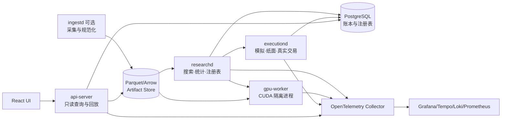
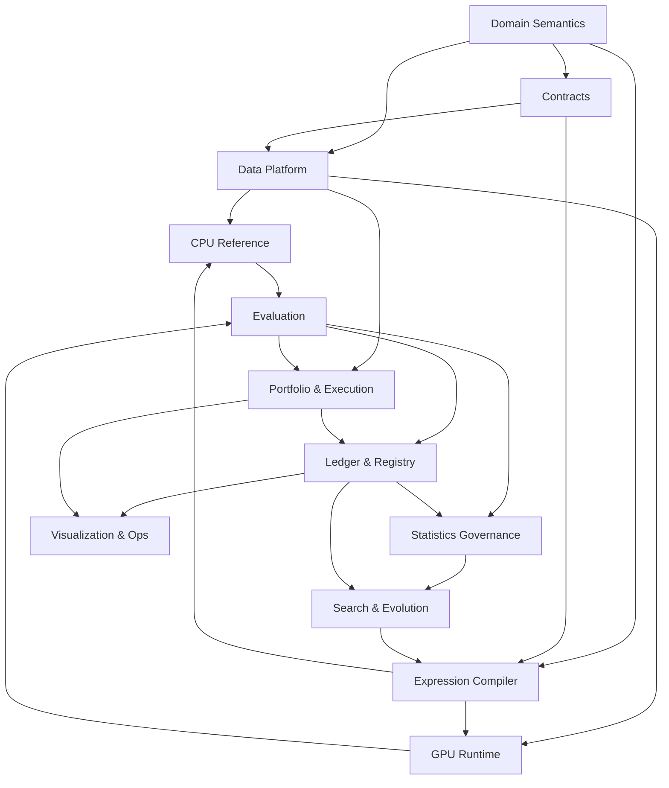
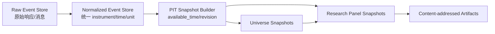
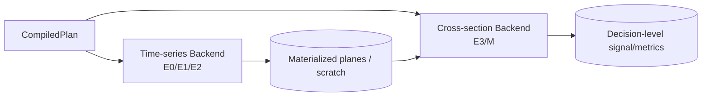
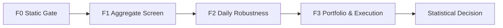
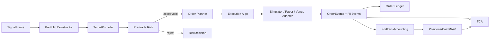
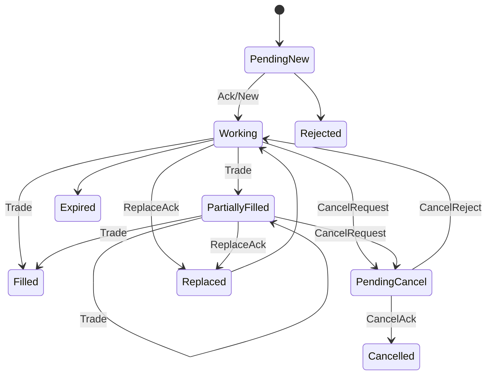
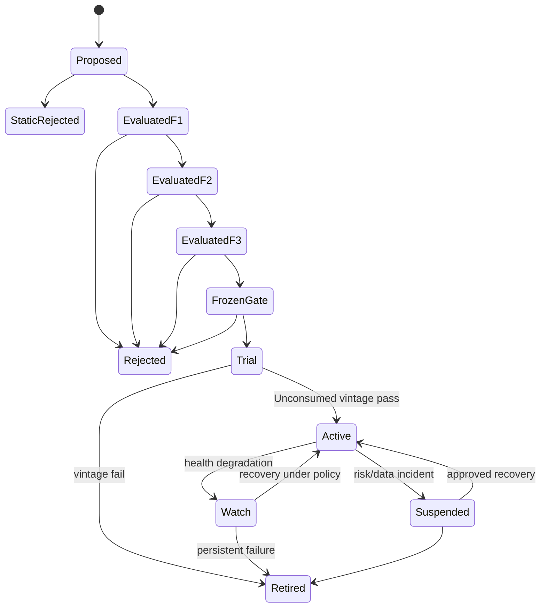
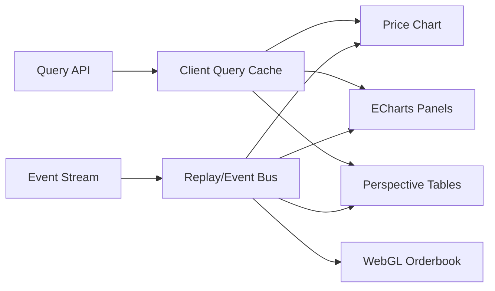
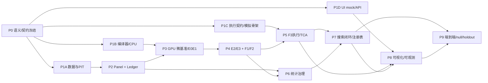

# GPU 加速因子挖掘系统 完整实现规格 v1.1

版本：1.1-draft  
日期：2026-08-05  
目标：单卡 RTX 5070 基准，模块化单体，研究与真实执行安全隔离。

本文件是拆分文档的合并视图。规范冲突时，以拆分文档、contracts 与 ADR 为准。


## 证据与决策状态

本文档集不把尚未实现或尚未实测的内容伪装成事实。关键结论使用以下状态：

| 标记 | 含义 | 可否直接作为实现事实 |
|---|---|---|
| `VERIFIED-SOURCE` | 已由官方文档、标准或原始论文核验 | 可以，但仍需固定引用版本 |
| `VERIFIED-CALC` | 可由确定性算术、组合数学或数据规模直接推导 | 可以 |
| `DECISION` | 本项目已经选择的架构语义 | 可以，变更须走 ADR |
| `POLICY` | 项目阈值或治理规则，不是普适真理 | 可以配置，不得宣称外部有效性 |
| `TO-BENCHMARK` | 只能在目标 RTX 5070、驱动、CUDA 与操作系统组合上测得 | 不可以预填性能结论 |
| `TO-RESEARCH` | 证据不足或依赖尚未选定的数据源、市场、券商或交易所 | 不可以进入生产默认值 |

出现冲突时，优先级为：正式契约与 ADR > 本文档正文 > 示例代码。外部资料只证明其明确支持的事实，不自动证明本项目的设计阈值。


## 新版执行摘要

- 架构由原 M1–M10 重构为 11 个高内聚领域；
- 时间基准冻结为非重叠日频决策；
- GPU 改为时序 E0–E2 与截面 E3/M 双后端；
- F1/F2/F3 分离聚合、日度序列和完整执行；
- 试验账本覆盖所有参与选择的 hypothesis；
- 封存数据按不重叠 vintage 一次消费；
- 交易域补齐 target、risk、order、fill、accounting、TCA、paper/live；
- 可视化拆为 Research Explorer、Execution Console、Operations；
- 所有未实测性能和项目阈值明确标记。

---


---


---

<!-- BEGIN 01_system_boundaries.md -->

# 01 系统边界、模块切分与依赖规则

版本：1.1-draft  
日期：2026-08-05  
文档性质：规范性  
主责：系统架构负责人  
前置文档：无  
主要消费者：所有工程负责人  

外部依据编号见 `16_references.md`。原始 v1.0 文档为本次重构的需求基线。


## 证据与决策状态

本文档集不把尚未实现或尚未实测的内容伪装成事实。关键结论使用以下状态：

| 标记 | 含义 | 可否直接作为实现事实 |
|---|---|---|
| `VERIFIED-SOURCE` | 已由官方文档、标准或原始论文核验 | 可以，但仍需固定引用版本 |
| `VERIFIED-CALC` | 可由确定性算术、组合数学或数据规模直接推导 | 可以 |
| `DECISION` | 本项目已经选择的架构语义 | 可以，变更须走 ADR |
| `POLICY` | 项目阈值或治理规则，不是普适真理 | 可以配置，不得宣称外部有效性 |
| `TO-BENCHMARK` | 只能在目标 RTX 5070、驱动、CUDA 与操作系统组合上测得 | 不可以预填性能结论 |
| `TO-RESEARCH` | 证据不足或依赖尚未选定的数据源、市场、券商或交易所 | 不可以进入生产默认值 |

出现冲突时，优先级为：正式契约与 ADR > 本文档正文 > 示例代码。外部资料只证明其明确支持的事实，不自动证明本项目的设计阈值。


## 1. 目标与非目标

### 1.1 目标

系统在单张 RTX 5070 上批量搜索类型化符号因子；以 point-in-time 数据、确定性求值、完整试验账本、分级回测、统计校正、组合与执行模拟为基础，形成可审计的因子注册表。

### 1.2 非目标

首版不做：高频做市、端到端深度学习预测、多卡调度、全市场统一实时 OMS、依赖微服务的分布式平台。真实交易接入是独立安全边界，研究系统无权直接绕过 `executiond` 下单。

## 2. 为什么采用模块化单体

`DECISION`：代码使用一个 Rust workspace 和少量受控进程。高内聚、低耦合来自领域所有权和契约，而不是网络数量。

独立进程仅在以下条件成立时设置：

1. 资源故障需要隔离：CUDA 崩溃或 WDDM TDR 不应拖垮研究协调器；
2. 安全权限需要隔离：真实交易密钥只存在于执行进程；
3. 生命周期明显不同：前端查询服务可独立重启；
4. 需要不同语言/运行时：CUDA C++、Rust、Web 前端。

建议进程：



`POLICY`：MVP 可将 `researchd`、`api-server` 与本地 PostgreSQL 部署在一台机器；模块契约不因此改变。

## 3. 一级领域模块

| 模块 | 拥有的核心不变量 | 对外主要输出 | 只允许依赖 | 推荐规模 |
|---|---|---|---|---|
| Domain Semantics | 时间、单位、市场、宇宙、有效性 | 类型与规则 | 无 | M |
| Data Platform | PIT 数据、快照、面板、质量 | `PanelManifest`、`ArtifactRef` | Domain、Contracts | L |
| Expression Compiler | AST、算子语义、身份、计划 | `ExpressionSpec`、`CompiledPlan` | Domain、Contracts | L |
| CPU Reference | 数学基准与测试向量 | Reference result | Data、Compiler | M |
| GPU Runtime | 资源、kernel、显存、确定性 | Stage result artifacts | Data、Compiler、Contracts | XL，内部再拆 |
| Evaluation | F0–F3 指标语义 | `EvaluationResult`、信号制品 | Data、Compiler、GPU、Execution | L |
| Statistics Governance | 选择偏差、稳健性和 OOS 治理 | `StatDecision` | Evaluation、Ledger | L |
| Portfolio & Execution | 目标仓位、订单、成交、会计、TCA | 执行事件与收益 | Domain、Data、Contracts | XL，安全边界 |
| Search & Evolution | 候选生成和选择 | 候选批次 | Compiler、Evaluation、Registry | L |
| Ledger & Registry | 不可变试验事实与因子状态 | 查询视图、血统、版本 | Contracts | M |
| Visualization & Ops | 研究、交易、回放、运行监控 | UI、告警 | Query APIs、Telemetry | L |

规模含义不是工期：`M` 适合一个小组独立拥有；`L` 需要内部组件切分；`XL` 必须有一个稳定外部契约和多个内部子模块，但不自动拆成多个服务。

## 4. XL 模块的内部切分

### 4.1 GPU Runtime

外部仍是一个 `GpuWorker` 契约，内部拆为：

- `planner-adapter`：把 `CompiledPlan` 映射到 kernel stages；
- `memory-manager`：面板、scratch、CSE、微批和 OOM 回退；
- `e0e1-kernels`：逐元素与 O(1) 状态；
- `e2-kernels`：有限窗口统计；
- `e3-kernels`：截面和顺序统计；
- `metric-kernels`：IC、排名、分组和压缩输出；
- `jit-cache`：NVRTC/CUBIN 缓存；
- `benchmark-agent`：资源报告和回归基准。

这些子模块不能直接持有注册表或统计阈值。

### 4.2 Portfolio & Execution

外部是事件化执行契约，内部拆为：

- `portfolio-constructor`：score 到目标权重；
- `pretrade-risk`：约束和否决；
- `order-planner`：目标差额到订单计划；
- `execution-simulator`：B0–B3 回放；
- `algo-engine`：Immediate/TWAP/VWAP/POV 等；
- `venue-adapter`：交易所或券商协议；
- `order-ledger`：事件折叠和幂等；
- `portfolio-accounting`：现金、持仓、费用、资金费率、公司行动；
- `tca`：实施差额和执行质量。

真实 `venue-adapter` 不可链接搜索模块，也不可读取模型私钥之外的研究配置。

## 5. 依赖方向



逻辑反馈环由持久化事实切断：Search 不直接调用 Statistics 内部对象；它读取已版本化的 `SelectionView`。Registry 不负责重新计算任何指标。

## 6. 合理模块大小的判断规则

一个一级模块应同时满足：

1. 只有一个主要领域词汇和一组不变量；
2. 只有一个主责团队；
3. 外部接口族不超过约五类；
4. 可用 fake/mock 在无其他模块进程时验收；
5. 数据模型可单独版本化；
6. 内部变化不会迫使所有消费者重编译或迁移；
7. 不持有另一个模块的数据库表写权限。

需要继续拆分的信号：

- 同一个模块存在两套完全不同的发布节奏；
- 一半测试不需要另一半依赖；
- 同一模块同时处理研究权限和真实下单权限；
- 接口出现双向调用或共享可变状态；
- 单个负责人无法说明该模块唯一不变量。

不应继续拆分的信号：

- 两个组件总在同一事务中变化；
- 分开后只能通过大量细粒度 RPC 完成一次计算；
- 数据搬运成本超过业务计算；
- 只是为了“每个类一个服务”。

## 7. 仓库建议

```text
workspace/
  crates/
    domain/
    contracts/
    data-platform/
    expression-compiler/
    cpu-reference/
    evaluation/
    statistics/
    search/
    registry/
    portfolio-execution/
  gpu/
    worker-host/
    kernels-e0e1/
    kernels-e2/
    kernels-e3/
    kernels-metrics/
  services/
    researchd/
    executiond/
    api-server/
    ingestd/
  web/
    app/
    chart-plugins/
    orderbook-renderer/
  schemas/
  fixtures/
  docs/
```

## 8. 跨模块禁止事项

- GPU kernel 不写数据库；
- 前端不直接读取 Parquet 内部路径，必须通过 `ArtifactRef` 和查询 API；
- 搜索模块不重新定义 Sharpe、IC、换手或统计门槛；
- 执行适配器不接收自由格式策略代码；
- 任何模块不得以 ticker 作为长期 instrument 主键；
- 大数组不得嵌入 Protobuf 控制消息；
- 指标名称、单位和年化时钟不得由 UI 临时推断。

## 9. 契约分层

```text
common.proto    基础值对象与长任务
domain.proto    时间、市场、标的、宇宙、指标定义
research.proto  数据面板、AST 计划、评估和试验
execution.proto 目标、风险、订单、成交、会计和 TCA
registry.proto  裁定、发布、生命周期和选择视图
services.proto  仅限真实进程边界的 RPC
```

一级模块内部使用 Rust trait；只有跨进程、跨团队持久化或长期兼容边界使用 Protobuf。这样避免“所有内部函数都 RPC 化”，同时保证 GPU、执行和前端团队可由 fixture 独立实现。

## 10. 待研究

- `TO-RESEARCH SB-01`：元数据数据库在单机开发使用 SQLite、团队环境使用 PostgreSQL，是否需要双实现；默认规范仍以 PostgreSQL 事务语义定义。
- `TO-RESEARCH SB-02`：GPU worker 与 researchd 最终采用本地 gRPC、Unix/Named Pipe 还是嵌入式调用；IDL 与制品引用不依赖该选择。
- `TO-RESEARCH SB-03`：实时事件总线是否需要 NATS JetStream。首版不引入；只有纸面/真实交易需要跨进程重放时再决策。

<!-- END 01_system_boundaries.md -->


---

<!-- BEGIN 02_domain_semantics.md -->

# 02 领域语义、时间、标签与市场契约

版本：1.1-draft  
日期：2026-08-05  
文档性质：规范性  
主责：量化研究负责人 + 数据负责人  
前置文档：01_system_boundaries.md  
主要消费者：Data、Compiler、Evaluation、Execution、Statistics  

外部依据编号见 `16_references.md`。原始 v1.0 文档为本次重构的需求基线。


## 证据与决策状态

本文档集不把尚未实现或尚未实测的内容伪装成事实。关键结论使用以下状态：

| 标记 | 含义 | 可否直接作为实现事实 |
|---|---|---|
| `VERIFIED-SOURCE` | 已由官方文档、标准或原始论文核验 | 可以，但仍需固定引用版本 |
| `VERIFIED-CALC` | 可由确定性算术、组合数学或数据规模直接推导 | 可以 |
| `DECISION` | 本项目已经选择的架构语义 | 可以，变更须走 ADR |
| `POLICY` | 项目阈值或治理规则，不是普适真理 | 可以配置，不得宣称外部有效性 |
| `TO-BENCHMARK` | 只能在目标 RTX 5070、驱动、CUDA 与操作系统组合上测得 | 不可以预填性能结论 |
| `TO-RESEARCH` | 证据不足或依赖尚未选定的数据源、市场、券商或交易所 | 不可以进入生产默认值 |

出现冲突时，优先级为：正式契约与 ADR > 本文档正文 > 示例代码。外部资料只证明其明确支持的事实，不自动证明本项目的设计阈值。


## 1. 唯一领域词汇

系统统一使用以下实体：

- `Instrument`：不可变内部标的；ticker、交易对和交易所代码只是带有效期的别名；
- `MarketProfile`：日历、执行时段、估值、费用、做空、资金费率和公司行动规则；
- `Observation`：具有事件时间和可用时间的数据；
- `DecisionPoint`：系统允许形成信号的离散时点；
- `SignalFrame`：某一决策点、共同有效集合上的分数；
- `TargetPortfolio`：约束后目标仓位；
- `OrderIntent`：从当前仓位到目标仓位所需的交易意图；
- `Evaluation`：固定候选、数据、语义、成本和代码版本的一次评估；
- `HypothesisTrial`：参与选择的独特候选假设；
- `Vintage`：只允许作为样本外门槛消费一次的新到数据段。

## 2. 时间四元组

`DECISION`：所有数据记录至少包含：

```text
event_time      经济事件实际发生时刻
available_time  研究或交易系统最早可合法得知该值的时刻
ingest_time     系统接收该值的时刻
revision_id     同一事件的修订版本
```

合法读取条件是：

```text
available_time <= decision_time
```

数组索引 `t` 不再承担前视防护。所有时间为 UTC epoch nanoseconds；UI 可按用户时区显示，但不可改变计算时区。

## 3. 基准决策语义

`DECISION`：首版采用**非重叠日频决策**。

```text
DecisionPoint[d]
  -> 使用截至 decision_time[d] 已可用的数据
  -> 生成 SignalFrame[d]
  -> 在 execution_window[d] 中成交
  -> 持有/盯市至下一 DecisionPoint
```

加密货币基准可定义每日固定 UTC 时点；ETF 必须使用交易所日历与明确的开盘/收盘/竞价窗口，禁止用 `t % 24` 推断交易日。

原文的“每小时产生 h=24 标签”与“日频调仓”被分离。若未来支持每小时形成 24 小时重叠持仓，必须新增 cohort 持仓模型，不能复用日频收益定义。

## 4. 标签定义

标签仅用于预测质量，不等于可交易组合收益。

```text
label_return[d, i]
= reference_exit_price[d, i]
/ reference_entry_price[d, i] - 1
```

`reference_entry_price`、`reference_exit_price` 和价格调整方式必须由 `LabelSpec` 明确。任何使用真实执行价的组合收益由 Execution 域计算。

标签方向、标准化、winsorization 等可拟合变换必须仅在训练段拟合，并随评估记录保存。

## 5. Spearman 共同有效集合

`DECISION`：每个候选、每个决策点重新构造：

```text
common_valid
= factor_valid
∩ label_valid
∩ universe_eligible
∩ evaluation_mask
```

标签不能只在全宇宙预计算固定 rank 后直接删掉无效标的。数据层预计算 `label_order` 和 tie group；评估层在 `common_valid` 子集内重分配 midrank。

排序语义：

- 无效值排除；
- 相同值使用 midrank；
- Top-K 平分时按 `instrument_id` 升序稳定决胜；
- 有效标的不足配置的 `min_cs_count` 时指标无效；
- 有效标的不足 K 时 Top-K 指标无效，不静默缩小 K。

## 6. Point-in-time 宇宙

```text
universe[d]
= listed_at(d)
∩ sufficient_history(d)
∩ liquidity_rule_using_data_available_before(d)
∩ tradable_at(d)
∩ product_scope
```

必须保留后来退市、清算、归零、改名或迁移的标的。宇宙规则输出版本化的 `UniverseSnapshot`，而不是动态 SQL 的隐含结果。

## 7. 单位与货币

每个字段声明：

```text
shape          Scalar / TimeSeries / CrossSection / EventSeries
unit           Price(CCY) / Return / Quantity / Notional(CCY) / Rate / Dimensionless
frequency      Hourly / DecisionOnly / EventDriven
availability   CloseAvailable / Delayed / PublishedEvent
missing_policy StrictInvalid / MinPeriods(n) / AsOfKnownValue / ExplicitFill
```

编译器静态拒绝不同单位的非法加减、未转换货币的金额比较和事件字段的无定义连续广播。

订单、成交、现金和数量使用定点十进制，不使用 f32/f64 作为事实存储。研究面板和 GPU 中间量可使用浮点。

## 8. 市场配置

### 8.1 加密货币

配置至少包含：

- venue、spot/linear perpetual/inverse perpetual；
- tick、step、min quantity、min notional；
- mark/index/last 的估值用途；
- funding event 的实际时刻、interval、cap/floor；
- 上线、迁移、下架与结算；
- 交易所维护和数据中断。

资金费率不能硬编码八小时；交易所可提供可变 `fundingIntervalHours`。[R-BINANCE-FUNDING]

### 8.2 ETF

配置至少包含：

- 交易所日历与竞价时段；
- raw/adjusted price 与公司行动；
- NAV、iNAV、PCF 的发布时间；
- 分红、拆分、合并、清盘；
- 做空可得性、借券费、交易单位和价格档位；
- 底层市场与 ETF 交易时段错位。

TSE 当前现货竞价为 09:00–11:30、12:30–15:30；该事实应来自版本化交易日历而不是代码常量。[R-JPX-HOURS]

## 9. 年化时钟

`AnnualizationClock` 由 MarketProfile 提供：

- 加密货币日频可按实际观测日数；
- ETF 按交易日数；
- 小时或事件级收益不可直接套用 252 或 365；
- 所有 Sharpe 输出必须同时保存未年化均值、标准差、观测数和年化因子。

## 10. 待研究

- `TO-RESEARCH DS-01`：加密货币基准决策时点采用 UTC 00:00、流动性更高时段还是多时点 ensemble；需避免数据供应商日界偏差。
- `TO-RESEARCH DS-02`：ETF 基准执行选择开盘竞价、开盘后窗口或收盘竞价；取决于数据许可与真实券商能力。
- `TO-RESEARCH DS-03`：复权价格与现金分红会计的唯一事实源；在数据供应商确定后冻结。
- `TO-RESEARCH DS-04`：跨币种组合的 FX 可用时间和估值源。

<!-- END 02_domain_semantics.md -->


---

<!-- BEGIN 03_data_platform.md -->

# 03 数据平台、PIT 宇宙与面板契约

版本：1.1-draft  
日期：2026-08-05  
文档性质：规范性  
主责：数据平台负责人  
前置文档：02_domain_semantics.md、contracts/research.proto  
主要消费者：CPU Reference、GPU Runtime、Evaluation、Execution  

外部依据编号见 `16_references.md`。原始 v1.0 文档为本次重构的需求基线。


## 证据与决策状态

本文档集不把尚未实现或尚未实测的内容伪装成事实。关键结论使用以下状态：

| 标记 | 含义 | 可否直接作为实现事实 |
|---|---|---|
| `VERIFIED-SOURCE` | 已由官方文档、标准或原始论文核验 | 可以，但仍需固定引用版本 |
| `VERIFIED-CALC` | 可由确定性算术、组合数学或数据规模直接推导 | 可以 |
| `DECISION` | 本项目已经选择的架构语义 | 可以，变更须走 ADR |
| `POLICY` | 项目阈值或治理规则，不是普适真理 | 可以配置，不得宣称外部有效性 |
| `TO-BENCHMARK` | 只能在目标 RTX 5070、驱动、CUDA 与操作系统组合上测得 | 不可以预填性能结论 |
| `TO-RESEARCH` | 证据不足或依赖尚未选定的数据源、市场、券商或交易所 | 不可以进入生产默认值 |

出现冲突时，优先级为：正式契约与 ADR > 本文档正文 > 示例代码。外部资料只证明其明确支持的事实，不自动证明本项目的设计阈值。


## 1. 数据分层



### Raw Event Store

保留供应商原始载荷、接收时间、请求/流序列号和校验和，不进行覆盖更新。

### Normalized Event Store

统一 instrument ID、单位、时区、事件类型和修订链。任何修订生成新记录。

### PIT Snapshot

按 `available_time` 重建研究者在某一时点实际可见的数据。

### Research Panel

固定面板版本、宇宙、字段、标签、有效位图和派生代码版本。面板创建后不可原地修改。

## 2. 存储格式与分区

`DECISION`：

- 长期列式存储：Parquet；
- 进程内/进程间批数据：Apache Arrow RecordBatch/IPC；
- 元数据与账本：PostgreSQL；
- 大制品：内容寻址文件目录或对象存储。

Arrow C Data Interface 提供稳定的列式内存交换接口；Arrow IPC 可在允许条件下实现零拷贝或内存映射读取。[R-ARROW-CDI][R-ARROW-IPC]

Parquet 推荐物理分区：

```text
venue/product_type/year/month/
```

文件内部按 `instrument_id, event_time` 排序。禁止按 `(日期, 标的)` 产生海量小文件。

## 3. 面板物理布局

GPU 基准使用字段分离的 SoA：

```text
field_buffers[field][time][asset_padded]
```

同一 warp 在同一时间读取同一字段时访问连续标的。默认只常驻时间主序；资产主序仅在目标机基准证明某专用 kernel 受益时派生。

```rust
pub struct PanelManifest {
    pub panel_id: Hash256,
    pub time_count: u32,
    pub decision_count: u32,
    pub asset_count: u32,
    pub padded_asset_count: u32,
    pub fields: Vec<FieldManifest>,
    pub field_artifacts: Vec<ArtifactRef>,
    pub validity_artifacts: Vec<ArtifactRef>,
    pub decision_index: ArtifactRef,
    pub universe_snapshot: ArtifactRef,
    pub label_values: ArtifactRef,
    pub label_order: ArtifactRef,
    pub source_manifest_hash: Hash256,
}
```

## 4. 有效性模型

位图分开保存：

- `observed_valid`：记录是否存在；
- `field_valid[field]`：字段本身是否合法；
- `universe_eligible[d]`；
- `tradable[d]`；
- `shortable[d]`；
- `evaluation_mask`：CPCV、封存或压力场景。

不得用单个 `valid` 位掩盖缺失来源。前向填充只有字段的 `MissingPolicy=AsOfKnownValue` 明确允许时才可发生，并保留原始观测时间。

## 5. 数据质量契约

每个面板发布前执行：

1. 主键唯一与时间单调；
2. `available_time >= event_time` 的异常审查；
3. ticker/instrument 映射区间无重叠；
4. OHLC 关系、负数量、非有限值检查；
5. corporate action、合约迁移和下架链闭合；
6. 交易日历覆盖；
7. 宇宙重建可复现；
8. label entry/exit 均位于合法执行窗口；
9. 文件、schema、代码和源数据校验和完整；
10. 抽样与原始供应商数据比对。

输出 `DataQualityReport`，未通过硬错误不得生成 PanelManifest。

## 6. 数据 API

控制面只传 `PanelManifest` 和 `ArtifactRef`。GPU worker 根据内容哈希本地缓存制品。

```text
BuildPanel(request) -> PanelManifest
GetPanel(panel_id) -> PanelManifest
VerifyPanel(panel_id) -> DataQualityReport
ResolveArtifact(sha256) -> local/mmap handle
```

批量传输不得通过 JSON。浏览器查询由 API server 下采样或返回 Arrow stream。

## 7. 显存基准算术

基准 `T=43,800, N=512, f32=4`：

```text
一个小时字段平面 = 43,800 × 512 × 4
                   = 89,702,400 bytes
8 个字段单布局   = 717,619,200 bytes
```

`VERIFIED-CALC`。标签和成本字段如果是日度，只按 `D≈1,825` 分配，不应扩成 43,800 行。真实显存预算由 `05_gpu_runtime.md` 的运行时 allocator 决定。

## 8. 数据安全与可追溯

- API key 不进入 Parquet 元数据；
- raw store 与研究制品只读挂载给 GPU worker；
- 每个 ArtifactRef 含 SHA-256、size、media type、schema version；
- 删除采用 tombstone 和保留策略，不覆盖审计记录；
- UI 下载必须记录访问者、制品和时间。

## 9. 待研究

- `TO-RESEARCH DP-01`：具体加密货币历史 L2 数据供应商、序列完整性和许可；决定是否可实现 B3。
- `TO-RESEARCH DP-02`：ETF 的退市历史、PCF、iNAV 和借券历史供应商。
- `TO-RESEARCH DP-03`：面板上传 GPU 使用 pageable、pinned、mmap + staging 还是 Arrow C Device Interface；需目标机实测。
- `TO-RESEARCH DP-04`：是否需要 DuckDB/Polars 作为开发查询层；不影响规范性存储。

<!-- END 03_data_platform.md -->


---

<!-- BEGIN 04_expression_compiler.md -->

# 04 表达式编译器、算子语义与 CPU 参考实现

版本：1.1-draft  
日期：2026-08-05  
文档性质：规范性  
主责：编译器负责人  
前置文档：02_domain_semantics.md、03_data_platform.md  
主要消费者：GPU Runtime、Evaluation、Search  

外部依据编号见 `16_references.md`。原始 v1.0 文档为本次重构的需求基线。


## 证据与决策状态

本文档集不把尚未实现或尚未实测的内容伪装成事实。关键结论使用以下状态：

| 标记 | 含义 | 可否直接作为实现事实 |
|---|---|---|
| `VERIFIED-SOURCE` | 已由官方文档、标准或原始论文核验 | 可以，但仍需固定引用版本 |
| `VERIFIED-CALC` | 可由确定性算术、组合数学或数据规模直接推导 | 可以 |
| `DECISION` | 本项目已经选择的架构语义 | 可以，变更须走 ADR |
| `POLICY` | 项目阈值或治理规则，不是普适真理 | 可以配置，不得宣称外部有效性 |
| `TO-BENCHMARK` | 只能在目标 RTX 5070、驱动、CUDA 与操作系统组合上测得 | 不可以预填性能结论 |
| `TO-RESEARCH` | 证据不足或依赖尚未选定的数据源、市场、券商或交易所 | 不可以进入生产默认值 |

出现冲突时，优先级为：正式契约与 ADR > 本文档正文 > 示例代码。外部资料只证明其明确支持的事实，不自动证明本项目的设计阈值。


## 1. 模块边界

编译器拥有 AST、类型检查、规范化、候选身份、静态成本、公共子表达式 DAG、字节码和阶段计划。它不拥有 GPU 分配、统计阈值、组合构建或候选选择。

CPU Reference 是独立 crate，但共享同一算子规范；它是数学基准，不复用 GPU 实现细节。

## 2. 类型系统

每个节点类型包含：

```text
ValueShape
Unit
Frequency
Availability
MissingPolicy
NumericDomain
```

示例：

```text
close: TimeSeries × Price(USDT) × Hourly × CloseAvailable × StrictInvalid
funding_rate: EventSeries × Rate × EventDriven × PublishedEvent × StrictInvalid
cs_rank(x): CrossSection × Dimensionless × x.frequency
```

条件节点的两个分支必须可统一类型；窗口参数为离散 `Window`，不是裸 f32。

## 3. 算子语义

严格与受保护算子必须是不同 opcode：

```text
DIV_STRICT(a,b): b==0 或任一输入非有限 -> invalid
DIV_PROTECTED(a,b,epsilon): 显式 epsilon 规则
LOG_STRICT(x): x<=0 -> invalid
LOG1P_STRICT(x): x<=-1 -> invalid
SQRT_STRICT(x): x<0 -> invalid
SIGNED_SQRT(x): sign(x)*sqrt(abs(x))
```

不能由编译器静默改变表达式数学含义。

滚动节点必须保存：

```text
window, min_periods, ddof, missing_policy, anchoring_policy
```

截面精确秩和近似秩是不同算子：

```text
CS_RANK_EXACT
CS_RANK_HISTOGRAM(bucket_count)
```

## 4. 候选身份

```text
expression_id = SHA-256(canonical AST bytes)
candidate_id  = SHA-256(expression_id + resolved parameter bytes)
evaluation_id = SHA-256(candidate_id + panel + universe + label + cost
                         + perturbation + numeric mode + binary hash)
factor_version_id = SHA-256(evaluation_id + admission batch + review version)
```

规范化只做语义保持变换，例如交换律节点的稳定排序、常数编码规范化。浮点代数重排默认禁止，因为可能改变有效性和数值结果。

哈希命中后仍比较 canonical bytes。

## 5. 字节码与参数表

原 8 字节指令的 `u8` 槽位和裸 `f32 imm` 被替换为：

```rust
#[repr(C, align(16))]
pub struct Instr {
    pub op: u16,
    pub dst: u16,
    pub a: u16,
    pub b: u16,
    pub imm_index: u32,
    pub flags: u32,
}
```

参数表为有类型值：

```rust
pub enum ParamValue {
    F32(f32),
    F64(f64),
    U32(u32),
    Window(u32),
    DurationNs(i64),
}
```

## 6. 阶段计划

编译结果不是单一程序，而是 DAG stages：

```text
E0 Elementwise/Lag
E1 O(1) Recursive State
E2 Finite Window Statistics
E3 Cross-sectional / Order Statistics
M  Metric / Reduction
```

```rust
pub struct CompiledPlan {
    pub plan_id: Hash256,
    pub stages: Vec<StagePlan>,
    pub state_layout: StateLayout,
    pub materializations: Vec<MaterializedNode>,
    pub estimated_resources: ResourceEstimate,
}
```

截面节点输出若继续进入时序节点，必须显式物化边界。编译器不得假设所有节点在一个 kernel 中完成。

## 7. 静态成本模型

输出：

```text
ast_nodes
instruction_count
state_bytes_per_asset
ring_bytes_per_asset
materialized_bytes
estimated_barriers
estimated_sort_stages
estimated_fp64_ops
candidate_complexity_score
```

复杂度目标不能只使用节点数。静态估计只用于早期拒绝和微批规划；实际资源报告由 GPU 编译后覆盖。

## 8. 公共子表达式

全批次构建公共 DAG，只有独立 materialization kernel 完成后，候选 stage 才能读取缓存。普通 CUDA 同一网格的不同 block 不得通过“首个候选写、后续候选读”建立依赖。

缓存收益估计：

```text
fanout × saved_compute
- write_cost
- read_cost
- memory_occupation_cost
```

缓存键使用完整候选子树语义、参数、面板、有效性、数值模式和编译版本。

## 9. CPU 参考实现

CPU Reference 使用 f64 和固定遍历顺序，输出：

- 值与有效位图；
- tie group 与选中 instrument IDs；
- 每个滚动节点的边界状态；
- 组合和成本前的标准化 score；
- 可序列化 golden fixture。

“与 NumPy 一致”不是规范；NumPy 仅可作为第三方交叉检查。规范来自本文档的算子定义。

## 10. 编译接口

```text
ParseExpression(text) -> ExpressionSpec
ValidateExpression(spec, market_schema) -> ValidationReport
Canonicalize(spec) -> canonical bytes + expression_id
Compile(spec, target_profile) -> CompiledPlan
EvaluateReference(plan, panel_slice) -> ReferenceArtifact
```

错误必须包含稳定 code、AST path、预期类型和实际类型。

## 11. 待研究

- `TO-RESEARCH EC-01`：rolling rank/min/max 的专用算法和最大允许窗口，须结合 GPU 基准。
- `TO-RESEARCH EC-02`：是否允许编译器进行严格受控的数值等价重写；默认禁用。
- `TO-RESEARCH EC-03`：NVRTC 精英通道的代码生成粒度、CUBIN 缓存淘汰与安全沙箱。
- `TO-RESEARCH EC-04`：表达式总槽位上限和 AST 深度；由目标机资源和搜索质量共同校准。

<!-- END 04_expression_compiler.md -->


---

<!-- BEGIN 05_gpu_runtime.md -->

# 05 GPU 运行时、数值规格、显存与目标机基准

版本：1.1-draft  
日期：2026-08-05  
文档性质：规范性  
主责：GPU/CUDA 负责人  
前置文档：03_data_platform.md、04_expression_compiler.md  
主要消费者：Evaluation、Testing、Operations  

外部依据编号见 `16_references.md`。原始 v1.0 文档为本次重构的需求基线。


## 证据与决策状态

本文档集不把尚未实现或尚未实测的内容伪装成事实。关键结论使用以下状态：

| 标记 | 含义 | 可否直接作为实现事实 |
|---|---|---|
| `VERIFIED-SOURCE` | 已由官方文档、标准或原始论文核验 | 可以，但仍需固定引用版本 |
| `VERIFIED-CALC` | 可由确定性算术、组合数学或数据规模直接推导 | 可以 |
| `DECISION` | 本项目已经选择的架构语义 | 可以，变更须走 ADR |
| `POLICY` | 项目阈值或治理规则，不是普适真理 | 可以配置，不得宣称外部有效性 |
| `TO-BENCHMARK` | 只能在目标 RTX 5070、驱动、CUDA 与操作系统组合上测得 | 不可以预填性能结论 |
| `TO-RESEARCH` | 证据不足或依赖尚未选定的数据源、市场、券商或交易所 | 不可以进入生产默认值 |

出现冲突时，优先级为：正式契约与 ADR > 本文档正文 > 示例代码。外部资料只证明其明确支持的事实，不自动证明本项目的设计阈值。


## 1. 已核验硬件边界

`VERIFIED-SOURCE`：RTX 5070 为 48 SM、12GB GDDR7、672 GB/s；Compute Capability 12.x 每 SM 64K 个 32 位寄存器、最多 1536 resident threads、约 100KB shared memory，非 Tensor FP32:FP64 吞吐比为 64:1。[R-NVIDIA-RTX][R-NVIDIA-CC12]

512 线程块下，仅按寄存器理论上限：

```text
3 blocks/SM -> floor(65536 / (512×3)) = 42 registers/thread
2 blocks/SM -> 64 registers/thread
1 block/SM  -> 128 registers/thread
```

`VERIFIED-CALC`。实际占用率还受分配粒度、shared memory、编译器临时量和 block 限制影响。因此 v1.0 的“128 寄存器且 3 块/SM”被删除。

## 2. 双后端执行架构



### Time-series backend

- block 以 128 或 256 资产线程为起点，目标机自动调优；
- grid 维度包含 candidate、asset tile、time chunk；
- E0/E1 优先融合；
- E2 使用显式 global scratch，不依赖编译器 spill。

### Cross-section backend

- 一个 block 处理一个候选、一个决策点的完整横截面；
- 512 线程基准；
- 精确 rank、midrank、Top-K 和截面归约在此完成；
- 标的超过 1024 时使用多阶段排序/选择，不采用普通块间隐式同步。

## 3. 窗口状态

长度 168 的单个 f32 环形值已经超过 512 线程块下每线程 128 寄存器的理论块上限。动态索引数组或溢出寄存器会落入 local memory，而 local memory 位于设备内存。[R-NVIDIA-CC12]

`DECISION`：

```text
[state_node][ring_slot][candidate_in_microbatch][asset]
```

`asset` 为最内层维度，保证 warp 合并访问。原字段 rolling sum 可读取 `x[t-w]`；EMA 只保留 O(1) 状态；未物化派生输入需要环形 scratch。

## 4. 编译后资源闸门

F0 包含两级检查：

### 静态估计

- state/scratch/materialized bytes；
- sort/barrier 数量；
- FP64 密度；
- 预计 kernel stages。

### 实际编译报告

记录：

```text
registers_per_thread
stack_frame_bytes
spill_loads/stores
local_bytes_per_thread
shared_bytes_per_block
active_blocks_per_sm
binary_hash
```

占用率使用 CUDA occupancy API 对实际 kernel 计算。[R-NVIDIA-OCCUPANCY]

规则：E0/E1 非故意 local memory 必须为 0；E2 状态只能来自显式 scratch；任何 spill 都进入账本并触发性能等级变化。

## 5. 数值模式

```rust
pub enum NumericMode {
    SearchFast,
    ValidationExact,
}
```

### SearchFast

- f32 面板；
- 补偿求和或稳定在线算法；
- 周期性整窗重算；
- 禁止未记录的 fast-math；
- 关键边界与 CPU fixture 比较。

### ValidationExact

- CPU f64 参考；
- GPU 关键累计量可使用 f64；
- 最终候选全部重放；
- 记录 abs、relative 和 ULP 误差。

不能统一使用“相对误差 <1e-5”。validity、tie、选中资产、订单计划要求完全一致；数值量按算子定义绝对/相对/ULP 容差。

## 6. 时间分块与 Windows TDR

Windows WDDM 默认 TDR 超时为 2 秒；Microsoft 明确说明 TDR 注册表项面向驱动开发测试，普通应用不应依赖修改它。[R-MS-TDR]

`DECISION`：长扫描按 time chunk 执行，状态通过显式 scratch 延续。内部可设置 `P99 kernel duration < configured safety limit`，但该值是 `POLICY`，必须由目标机测量确定。

## 7. CSE 与 JIT

- 公共节点先由独立 kernel 物化；
- 通过 kernel 边界或 stream event 建立依赖；
- NVRTC 用于精英专用代码生成；NVRTC 可从 CUDA C++ 字符串生成 PTX/CUBIN。[R-NVIDIA-NVRTC]
- JIT key 包含 plan、目标 compute capability、CUDA 版本、编译选项和 numeric mode；
- CUBIN 不跨不兼容驱动盲目复用。

## 8. 运行时显存预算

运行时启动调用 `cudaMemGetInfo()`，预算为：

```text
min(configured_cap, safety_fraction × free_memory_at_start)
```

`safety_fraction` 是 `POLICY`，建议初始 0.80–0.85 后实测。

基准常驻：

- 8 个小时字段单布局：717.6192 MB；
- 日度标签/成本/索引与位图：按 manifest 计算；
- 合成数据不默认复制完整双布局；
- F2 只保存日度小序列；
- F3 score 矩阵按微批生成；
- CSE cache 和 rolling scratch 由 allocator 竞争同一预算。

OOM 回退顺序：减微批 → 逐出 CSE → 减 time chunk → 禁止高成本候选；不得静默降精度或改变算子。

## 9. 目标机微基准

`TO-BENCHMARK`：发布任何候选/秒数字前必须测量：

1. 20 节点 E0；
2. E1 EMA；
3. window 24/168 的 mean/std/corr；
4. 512 元素 exact rank + ties；
5. Top-K 与指标归约；
6. Cross→Rolling 的分阶段表达式；
7. SearchFast 与 ValidationExact；
8. 不同 block size、time chunk 和微批。

记录 Nsight Compute 指标、P50/P95/P99、吞吐、spill、DRAM、L2、barrier stall 和功耗。v1.0 的 1000/300/30 候选每秒全部降级为待基准。

## 10. 正确性工具

CI 与发布候选运行 NVIDIA Compute Sanitizer：memcheck、racecheck、initcheck、synccheck。[R-NVIDIA-SANITIZER]

此外运行：

- device-side assert 的小 fixture；
- 随机 AST differential test；
- chunk boundary test；
- 重复运行位级一致性；
- CUDA error 后进程重启与作业恢复。

## 11. 待研究

- `TO-BENCHMARK GPU-01`：E0/E1 最优 block size；
- `TO-BENCHMARK GPU-02`：精确 rank 采用 bitonic、CUB block primitive 或 radix 路径；
- `TO-BENCHMARK GPU-03`：FP64 锚定频率与误差/吞吐折中；
- `TO-RESEARCH GPU-04`：Linux TCC/独立计算机是否作为长跑推荐环境；Windows 仍需支持开发；
- `TO-RESEARCH GPU-05`：Arrow C Device Interface/CUDA IPC 是否值得引入跨进程零拷贝。

<!-- END 05_gpu_runtime.md -->


---

<!-- BEGIN 06_evaluation_pipeline.md -->

# 06 F0–F3 评估流水线与指标契约

版本：1.1-draft  
日期：2026-08-05  
文档性质：规范性  
主责：评估流水线负责人  
前置文档：02–05 文档、08_portfolio_execution.md  
主要消费者：Statistics、Search、Registry、Visualization  

外部依据编号见 `16_references.md`。原始 v1.0 文档为本次重构的需求基线。


## 证据与决策状态

本文档集不把尚未实现或尚未实测的内容伪装成事实。关键结论使用以下状态：

| 标记 | 含义 | 可否直接作为实现事实 |
|---|---|---|
| `VERIFIED-SOURCE` | 已由官方文档、标准或原始论文核验 | 可以，但仍需固定引用版本 |
| `VERIFIED-CALC` | 可由确定性算术、组合数学或数据规模直接推导 | 可以 |
| `DECISION` | 本项目已经选择的架构语义 | 可以，变更须走 ADR |
| `POLICY` | 项目阈值或治理规则，不是普适真理 | 可以配置，不得宣称外部有效性 |
| `TO-BENCHMARK` | 只能在目标 RTX 5070、驱动、CUDA 与操作系统组合上测得 | 不可以预填性能结论 |
| `TO-RESEARCH` | 证据不足或依赖尚未选定的数据源、市场、券商或交易所 | 不可以进入生产默认值 |

出现冲突时，优先级为：正式契约与 ADR > 本文档正文 > 示例代码。外部资料只证明其明确支持的事实，不自动证明本项目的设计阈值。


## 1. 流水线原则

F1 只做低成本淘汰；F2 才保存完整日度序列；F3 才重建完整标准化 score、目标仓位和执行。任何代理指标必须带 `metric_tier`，不得被 UI 当作最终净收益。



## 2. F0 静态闸门

输入：`ExpressionSpec + CompiledPlan + PanelManifest`。

拒绝：

- 类型/单位/可用时间非法；
- 回看超数据范围；
- canonical duplicate；
- 静态 state/materialization 超预算；
- 编译后 kernel 无法启动或 spill 超政策；
- 未定义算子或不支持的市场字段。

所有候选先登记 `HypothesisTrial`，包括 F0 被拒者；静态重复可记录为 `reused_from`，不重复计新 hypothesis。

## 3. F1 聚合粗筛

默认输出聚合量，不保存 `[candidate][D]`：

```text
valid_count
sum_x, sum_y, sum_x2, sum_y2, sum_xy
Pearson IC summary
linear score-weighted gross return proxy
coverage summary
```

F1 不为所有候选额外计算精确 Spearman 和 Top-K。若表达式 AST 自身含截面秩，则仍执行该节点。

阈值均为 `POLICY`，必须在配置与试验账本中版本化。

## 4. F2 日度稳健性

仅对存活微批输出：

```rust
pub struct F2Series {
    pub ic: ArtifactRef,
    pub rank_ic: ArtifactRef,
    pub gross_signal_return: ArtifactRef,
    pub one_way_turnover: ArtifactRef,
    pub valid_count: ArtifactRef,
}
```

`D≈1,825` 时 256 候选、5 个 f32 序列约 9.344 MB，避免原文 1.8GB 小时级缓冲错误。

F2 可运行内部 CPCV、明确属于 adaptive 的数据扰动和训练期方向拟合。F2 不调用真实下单适配器。

## 5. F3 完整信号与执行

F3 微批重新生成：

```text
raw_score[D,N]
normalized_score[D,N]
target_weight[D,N]
order_intents
fills
positions
cash
cost_breakdown
net_returns
```

结果通过 ArtifactRef 保存。失败候选释放矩阵；入库候选可保存压缩 score 供相关性、半衰期和回放。

## 6. 指标定义

### Pearson IC

在 `common_valid` 上计算横截面 Pearson，保存有效标的数和 invalid reason。

### Spearman IC

对共同有效集合的双方 midrank 做 Pearson；tie 规则见领域语义。

### 换手

同时输出：

```text
gross_traded_notional_ratio = Σ|trade_notional| / NAV_before
one_way_turnover = 0.5 × gross_traded_notional_ratio
```

成本使用前者。

### 信号相关性

```text
signal_corr(a,b) = median_d corr_cs(z_a[d], z_b[d])
pnl_corr(a,b)    = corr(net_return_a, net_return_b)
```

二者分别保存。

### 信号持续性

```text
rho(lag) = median_d corr_cs(z[d], z[d-lag])
```

只有曲线稳定且大致单调时报告首次跌破 0.5 的 lag；否则展示完整曲线和面积。不能从 IC/PnL/turnover 反推。

## 7. 指标制品契约

每个指标包含：

- definition version；
- input evaluation ID；
- sample count；
- unit；
- annualization clock；
- gross/net 标识；
- invalid reason counts；
- exact/approx 算法；
- artifact hash。

## 8. 错误处理

候选失败分类：

```text
INVALID_EXPRESSION
INSUFFICIENT_HISTORY
INSUFFICIENT_CROSS_SECTION
NUMERIC_INVALID
RESOURCE_REJECTED
KERNEL_FAILURE
EXECUTION_INFEASIBLE
DATA_QUALITY_FAILURE
```

失败是账本事实，不得从试验数中无痕删除。

## 9. 待研究

- `TO-RESEARCH EV-01`：F1 线性收益代理与最终 F3 排名的一致性；需离线消融。
- `TO-RESEARCH EV-02`：F2 精确 rank 是否对全部日期计算，或先按固定子样本；不得改变统计定义而不改版本。
- `POLICY EV-03`：F1/F2 存活比例和 coverage 门槛。
- `TO-RESEARCH EV-04`：入库因子 score 压缩格式及其对相关性误差的影响。

<!-- END 06_evaluation_pipeline.md -->


---

<!-- BEGIN 07_statistics_governance.md -->

# 07 统计验证、试验计数与数据治理

版本：1.1-draft  
日期：2026-08-05  
文档性质：规范性  
主责：统计研究负责人  
前置文档：06_evaluation_pipeline.md、10_registry_lifecycle.md  
主要消费者：Search、Registry、Release Review  

外部依据编号见 `16_references.md`。原始 v1.0 文档为本次重构的需求基线。


## 证据与决策状态

本文档集不把尚未实现或尚未实测的内容伪装成事实。关键结论使用以下状态：

| 标记 | 含义 | 可否直接作为实现事实 |
|---|---|---|
| `VERIFIED-SOURCE` | 已由官方文档、标准或原始论文核验 | 可以，但仍需固定引用版本 |
| `VERIFIED-CALC` | 可由确定性算术、组合数学或数据规模直接推导 | 可以 |
| `DECISION` | 本项目已经选择的架构语义 | 可以，变更须走 ADR |
| `POLICY` | 项目阈值或治理规则，不是普适真理 | 可以配置，不得宣称外部有效性 |
| `TO-BENCHMARK` | 只能在目标 RTX 5070、驱动、CUDA 与操作系统组合上测得 | 不可以预填性能结论 |
| `TO-RESEARCH` | 证据不足或依赖尚未选定的数据源、市场、券商或交易所 | 不可以进入生产默认值 |

出现冲突时，优先级为：正式契约与 ADR > 本文档正文 > 示例代码。外部资料只证明其明确支持的事实，不自动证明本项目的设计阈值。


## 1. 数据使用等级

| Scope | 可反复使用 | 可进入适应度 | 失败后可继续针对性修改 |
|---|---:|---:|---:|
| `DEV_ADAPTIVE` | 是 | 是 | 是 |
| `INTERNAL_CV` | 是 | 是 | 是 |
| `FROZEN_GATE` | 候选族冻结后一次 | 否 | 只能生成新版本并等待新 gate |
| `HOLDOUT_VINTAGE` | 永久只消费一次 | 否 | 否 |
| `LIVE_FORWARD` | 前瞻产生 | 否 | 版本化处理 |

“只否决不奖励”不能消除自适应；只要 pass/fail 决定繁殖，数据就属于 adaptive。

## 2. 试验账本

区分：

- `HypothesisTrial`：独特 AST+参数参与选择；
- `EvaluationReplicate`：CPCV、bootstrap、噪声等重复评估；
- `Replay`：同 evaluation_id 的确定性重放；
- `CacheReuse`：结果复用；
- `InvalidatedRun`：代码/数据错误后作废但保留。

所有 LLM、随机注入、参数变体和未到 F3 的候选都计入完整选择过程。DSR 原论文要求考虑未选择试验、独立试验数、Sharpe 方差、样本长度、偏度与峰度。[R-DSR]

## 3. CPCV

`DECISION`：当前 12 块、留 2 块的 66 组合称为“组合净化时段稳定性评估”，不称为 PBO/CSCV。

每个样本显式拥有：

```text
feature_interval
label_interval
information_interval = union
```

训练样本的信息区间与测试区间重叠即 purge。Embargo 比例是 `POLICY`，需保存敏感度结果。

所有方向、标准化和参数选择只在训练部分拟合。

## 4. PBO/CSCV

若启用原始 CSCV/PBO：

- 输入为同步 `T×N` 候选收益矩阵；
- 时间切成偶数 S 段；
- 每次选 S/2 训练、互补 S/2 测试；
- S=12 时组合数 `C(12,6)=924`。

它与 66 个留二组合是独立统计模块。[R-PBO]

## 5. DSR

报告：

```text
raw_hypothesis_count
estimated_effective_count
DSR(raw_count)
DSR(effective_count)
effective-count sensitivity
```

相关性聚类只能估计有效试验数，不能删除原始计数。只有 F3 候选参与聚类会低估选择规模，因此禁止。

## 6. 参数敏感度

参数域按类型定义：Window、Decay、Threshold、Constant、Categorical。统一 ±30% 被删除。

流程：

1. Morris 用于排序与病态筛查；
2. Sobol 使用当前 SALib API；不含二阶时样本数 `N(D+2)`，含二阶时 `N(2D+2)`。[R-SALIB-SOBOL]
3. 高原检验按合法域和离散邻域；
4. 参数无效优先触发表达式简化，不自动拒绝因子；
5. 极小变化引起方向翻转、孤峰或边界异常才是拒绝证据。

敏感度若反复反馈搜索，必须标为 adaptive；若作为 frozen gate，则候选冻结后只测试一次。

## 7. 合成与 null 检验

### 路径重采样

Stationary bootstrap 使用随机几何块长，适用于依赖时间序列的重采样推断。[R-STATIONARY-BOOTSTRAP]

所有标的和字段同步使用同一时间块索引，保留同期截面结构。块长由依赖结构或自动选择方法决定，不能固定声称 20–60 最优。

### Null surrogate

逐标的独立 IAAFT 不足以保持多变量交叉结构。null 的推荐用途是运行完整搜索器，得到“纯 null 条件下最佳候选”的分布，而不是要求真实因子在被破坏机制的 surrogate 上继续盈利。

### 端到端 null replay

```text
for each null panel:
  使用同样种群、代数、F0–F3、参数选择和 LLM 配额
  记录搜索器最佳得分
empirical p = (1 + count(null_best >= real_best)) / (K + 1)
```

K 决定 p 值分辨率，是算术，不是性能保证。

## 8. 封存 vintage

封存按不重叠新数据段消费：

```text
vintage_id
start/end
sealed_at
consumed_at
candidate_version
verdict
```

已经解封的数据永久标记 consumed。若失败后修改因子，新版本不得继续使用同一 vintage 声称样本外。

## 9. 决策输出

`StatDecision` 包含：

- 输入 evaluation IDs；
- data scopes；
- CPCV 分布；
- DSR inputs/outputs；
- PBO（如启用）；
- sensitivity；
- null replay；
- holdout verdict；
- policy version；
- reviewer/automation identity。

## 10. 待研究

- `TO-RESEARCH ST-01`：有效试验数估计方法和相关性矩阵稳定性；需模拟校准。
- `POLICY ST-02`：DSR、PBO、coverage、holdout 的门槛。
- `TO-RESEARCH ST-03`：多变量 surrogate 算法与风格化事实验收。
- `TO-RESEARCH ST-04`：不同市场制度下 stationary bootstrap 分段方式。
- `TO-RESEARCH ST-05`：六个月还是多个季度 vintage；取决于非重叠观测数与交易频率。

<!-- END 07_statistics_governance.md -->


---

<!-- BEGIN 08_portfolio_execution.md -->

# 08 组合构建、交易执行、会计与 TCA

版本：1.1-draft  
日期：2026-08-05  
文档性质：规范性  
主责：交易系统负责人  
前置文档：02_domain_semantics.md、03_data_platform.md、contracts/execution.proto  
主要消费者：Evaluation、Registry、Visualization、真实交易适配器  

外部依据编号见 `16_references.md`。原始 v1.0 文档为本次重构的需求基线。


## 证据与决策状态

本文档集不把尚未实现或尚未实测的内容伪装成事实。关键结论使用以下状态：

| 标记 | 含义 | 可否直接作为实现事实 |
|---|---|---|
| `VERIFIED-SOURCE` | 已由官方文档、标准或原始论文核验 | 可以，但仍需固定引用版本 |
| `VERIFIED-CALC` | 可由确定性算术、组合数学或数据规模直接推导 | 可以 |
| `DECISION` | 本项目已经选择的架构语义 | 可以，变更须走 ADR |
| `POLICY` | 项目阈值或治理规则，不是普适真理 | 可以配置，不得宣称外部有效性 |
| `TO-BENCHMARK` | 只能在目标 RTX 5070、驱动、CUDA 与操作系统组合上测得 | 不可以预填性能结论 |
| `TO-RESEARCH` | 证据不足或依赖尚未选定的数据源、市场、券商或交易所 | 不可以进入生产默认值 |

出现冲突时，优先级为：正式契约与 ADR > 本文档正文 > 示例代码。外部资料只证明其明确支持的事实，不自动证明本项目的设计阈值。


## 1. 原文缺口结论

原 M8 只有成本公式和“L2 回放”标签，没有定义：目标权重、当前持仓、订单意图、订单状态、部分成交、撤改单、现金/保证金、资金费率、公司行动、成交会计、风险否决、执行算法、适配器、TCA 和纸面/真实边界。因此它不足以产生可验证的净收益，也不足以支持交易可视化。

本域将研究回测与真实执行使用同一事件契约，但实现不同 adapter。

## 2. 执行链



## 3. 组合构建

输入：标准化 score、eligible/shortable mask、当前持仓、NAV、市场 profile。

基准 constructor：

1. 共同有效集合；
2. winsorize/standardize（训练拟合参数版本化）；
3. top/bottom 或连续 score 权重；
4. gross/net、单标的、行业/币种、流动性、做空约束；
5. 目标权重到合法数量的定点量化；
6. 输出未满足约束和裁剪原因。

接口：

```text
ConstructPortfolio(SignalFrame, PortfolioPolicy, PositionSnapshot)
  -> TargetPortfolio + ConstraintReport
```

更复杂风险模型/优化器是插件，不改变目标仓位契约。

## 4. 预交易风险

至少检查：

- 数据新鲜度和市场状态；
- instrument 是否可交易/可做空；
- 最大 gross/net/单名/币种敞口；
- 可用现金、保证金和借券；
- tick、step、min notional；
- 最大参与率和订单名义金额；
- 价格偏离、涨跌停或交易所 band；
- 重复 client order ID；
- 日内亏损、错误率、延迟和 kill switch。

输出 `RiskDecision`，所有 clip/reject 均可审计。

## 5. 订单意图与状态

目标差额先生成 `OrderIntent`，之后才由 adapter 生成交易所命令。订单状态与事件类型分离，遵循 FIX 中 `OrdStatus` 表示当前状态、`ExecType` 表示本次事件的思想。[R-FIX-ORDER-STATE]



Order ledger 只追加事件，当前状态由确定性 fold 得出。`client_order_id`、`event_id` 和 venue sequence 支持幂等与去重。

## 6. 模拟等级

| 等级 | 输入 | 能力 | 不能声称 |
|---|---|---|---|
| B0 Deterministic Window | bar/auction reference price | 无部分成交，固定/规则成本 | 真实成交质量 |
| B1 Volume-limited Bar | OHLCV、spread proxy、lagged ADV/vol | 部分成交、参与率、延迟窗口 | 队列位置与真实 L2 |
| B2 Quote/Trade Replay | BBO/quotes/trades | spread crossing、top-of-book、机会成本 | 完整深度和精确排队 |
| B3 Incremental L2 Replay | 增量簿、成交、撤单、序列号 | 深度消耗、队列近似/重建、订单回放 | 若无自身延迟和 queue 数据，不声称精确实盘 |

“L2 回放”只有在数据包含增量 order book、trades、cancels、sequence 和恢复规则时成立。快照逐层吃单只能称为 snapshot walk-the-book。

## 7. 执行算法

分阶段：

- X0 `ImmediateWindow`：下一合法窗口执行；
- X1 `TWAP`：固定时间切片；
- X2 `VWAP`：使用只基于当时可知的历史/预测曲线；
- X3 `POV`：目标参与率；
- X4 `PassiveActive`：限价等待与超时主动化；
- X5 venue-specific smart routing：远期。

执行算法不得读取完整未来 bar 的成交量来决定当前切片。回测中的预测量必须有自己的 `available_time`。

## 8. 成本与会计

```rust
pub struct CostBreakdown {
    exchange_fee,
    spread_cost,
    impact_cost,
    borrow_cost,
    funding_cost,
    financing_cost,
    fx_cost,
    taxes,
    failed_fill_opportunity_cost,
}
```

会计事件：trade、fee、funding、interest、dividend、split、cash transfer、settlement、mark-to-market。

永续资金费率只在持仓跨越真实 funding event 时入账；interval 可能变化。[R-BINANCE-FUNDING]

ETF 需要分红、拆分、清盘、NAV/iNAV/market price 区分；JPX iNAV 与 NAV 有不同更新频率。[R-JPX-INAV]

## 9. TCA

TCA 使用统一术语和可配置 benchmark，覆盖 pre-trade 到 post-trade；FIX Trading Community 也将其作为标准化领域。[R-FIX-TCA]

至少输出：

```text
arrival_price
decision_price
implementation_shortfall
spread_component
market_impact
market_timing
opportunity_cost
fill_rate
cancel_rate
participation_rate
arrival_to_ack_latency
ack_to_fill_latency
slippage_bps
venue/algo breakdown
```

组合级同时报告 standalone capacity 与净额抵消后的 portfolio capacity。

## 10. 纸面与真实交易边界

`executiond` 三种模式使用同一输入/输出：

```text
SIMULATION
PAPER
LIVE
```

LIVE 额外要求：

- 独立密钥存储；
- 人工 arm/disarm；
- 全局和策略 kill switch；
- cancel-on-disconnect/交易所 dead-man switch（若支持）；
- reconciliation 与 broker/exchange truth；
- 只允许签名后的 FactorVersion 和 PortfolioPolicy；
- UI 无直接交易凭证。

## 11. 市场适配器

每个 adapter 必须实现：

```text
InstrumentRules
MarketCalendar
MarketDataCursor
Submit/Cancel/Replace
OrderEvent stream
Position/Balance reconciliation
Health/status
```

交易所 filter（tickSize、stepSize、minQty、minNotional）来自当时有效的元数据，不硬编码。[R-BINANCE-FILTERS]

## 12. 待研究

- `TO-RESEARCH EX-01`：基准执行窗口和真实可交易的 venue/broker；
- `TO-RESEARCH EX-02`：平方根冲击系数、参与率上限和 spread proxy，只能用实际成交/报价标定；
- `TO-RESEARCH EX-03`：B3 数据是否能重建队列位置；若不能，定义 queue approximation；
- `TO-RESEARCH EX-04`：ETF 借券可得性、费率、税费与结算模型；
- `TO-RESEARCH EX-05`：多因子组合优化器与风险模型；首版可用确定性约束构造；
- `TO-RESEARCH EX-06`：实盘 OMS 对接 FIX、REST/WebSocket 或券商 SDK。

<!-- END 08_portfolio_execution.md -->


---

<!-- BEGIN 09_search_evolution.md -->

# 09 进化搜索、MAP-Elites 与 LLM 边界

版本：1.1-draft  
日期：2026-08-05  
文档性质：规范性  
主责：搜索算法负责人  
前置文档：04_expression_compiler.md、06_evaluation_pipeline.md、10_registry_lifecycle.md  
主要消费者：Research Coordinator  

外部依据编号见 `16_references.md`。原始 v1.0 文档为本次重构的需求基线。


## 证据与决策状态

本文档集不把尚未实现或尚未实测的内容伪装成事实。关键结论使用以下状态：

| 标记 | 含义 | 可否直接作为实现事实 |
|---|---|---|
| `VERIFIED-SOURCE` | 已由官方文档、标准或原始论文核验 | 可以，但仍需固定引用版本 |
| `VERIFIED-CALC` | 可由确定性算术、组合数学或数据规模直接推导 | 可以 |
| `DECISION` | 本项目已经选择的架构语义 | 可以，变更须走 ADR |
| `POLICY` | 项目阈值或治理规则，不是普适真理 | 可以配置，不得宣称外部有效性 |
| `TO-BENCHMARK` | 只能在目标 RTX 5070、驱动、CUDA 与操作系统组合上测得 | 不可以预填性能结论 |
| `TO-RESEARCH` | 证据不足或依赖尚未选定的数据源、市场、券商或交易所 | 不可以进入生产默认值 |

出现冲突时，优先级为：正式契约与 ADR > 本文档正文 > 示例代码。外部资料只证明其明确支持的事实，不自动证明本项目的设计阈值。


## 1. 边界

Search 只生成、繁殖和选择候选。它不定义指标、不直接访问 holdout、不计算成本、不写因子最终状态。

## 2. 候选生成

来源：

- 类型安全随机生成；
- 节点/参数/子树变异；
- 类型安全子树交叉；
- 子树提升与简化；
- 已冻结 LLM proposal artifact。

所有产物先经 Compiler canonicalization；相同 candidate_id 复用历史 evaluation，不产生新 hypothesis。

## 3. 多目标

建议目标：

```text
maximize adaptive_robust_score
minimize measured_complexity
minimize library_redundancy
```

`measured_complexity` 结合 AST、state/materialized bytes、barriers 和实测 latency。相关性只使用 Evaluation 明确定义的 signal_corr 或 residual score。

目标集合和权重是 `POLICY`，版本化进入 SearchPolicy。

## 4. MAP-Elites

描述符必须在其真实生产阶段之后才可用：

- turnover：F3；
- signal persistence：F3 score matrix；
- drawdown：F3 net returns。

不可在 F1 伪造这些描述符。格子边界通过历史分布校准；报告 reachable cells 和 occupied/reachable coverage，不以固定 80% 作为正确性门槛。

## 5. 繁殖配比

v1.0 的 60/30/10 改为 `SearchPolicy` 默认实验值。需要与纯随机、新颖度优先和无 LLM 版本做消融。

## 6. LLM

LLM 是 proposal generator，不是事实裁判。保存：

```text
provider/model identifier
prompt template hash
full prompt
raw response
parsed AST
sampling parameters
proposal artifact hash
```

重放不重新调用模型。经济逻辑审查输出报告和证据缺口；自动硬否决需冻结规则或人工审批，不能依赖会漂移的远程回答。

## 7. 选择反馈

Search 读取 Registry 发布的不可变 `SelectionView`：

```text
candidate_id
policy_version
metric_summary
stage_reached
selection_rank
novelty_cell
```

Search 不通过数据库联表自行重算。

## 8. 停止条件

停止条件是 `POLICY`：

- evaluation budget；
- null-calibrated improvement；
- 多样性收敛；
- GPU/数据预算；
- 人工 research campaign 边界。

不能以“一夜 200–500 代”作为架构事实。

## 9. 待研究

- `TO-RESEARCH SE-01`：NSGA-II、lexicase、novelty search 或混合选择的效果；
- `TO-RESEARCH SE-02`：LLM 注入真实增量，需固定预算消融；
- `TO-RESEARCH SE-03`：MAP-Elites 描述符与格子边界；
- `TO-RESEARCH SE-04`：候选族定义用于 frozen gate 与试验计数；
- `TO-RESEARCH SE-05`：表达式简化和语义等价类的搜索偏差。

<!-- END 09_search_evolution.md -->


---

<!-- BEGIN 10_registry_lifecycle.md -->

# 10 试验账本、因子注册表与生命周期

版本：1.1-draft  
日期：2026-08-05  
文档性质：规范性  
主责：研究平台负责人  
前置文档：contracts/research.proto、07_statistics_governance.md  
主要消费者：Search、Visualization、Release Review  

外部依据编号见 `16_references.md`。原始 v1.0 文档为本次重构的需求基线。


## 证据与决策状态

本文档集不把尚未实现或尚未实测的内容伪装成事实。关键结论使用以下状态：

| 标记 | 含义 | 可否直接作为实现事实 |
|---|---|---|
| `VERIFIED-SOURCE` | 已由官方文档、标准或原始论文核验 | 可以，但仍需固定引用版本 |
| `VERIFIED-CALC` | 可由确定性算术、组合数学或数据规模直接推导 | 可以 |
| `DECISION` | 本项目已经选择的架构语义 | 可以，变更须走 ADR |
| `POLICY` | 项目阈值或治理规则，不是普适真理 | 可以配置，不得宣称外部有效性 |
| `TO-BENCHMARK` | 只能在目标 RTX 5070、驱动、CUDA 与操作系统组合上测得 | 不可以预填性能结论 |
| `TO-RESEARCH` | 证据不足或依赖尚未选定的数据源、市场、券商或交易所 | 不可以进入生产默认值 |

出现冲突时，优先级为：正式契约与 ADR > 本文档正文 > 示例代码。外部资料只证明其明确支持的事实，不自动证明本项目的设计阈值。


## 1. 两类存储

- Trial Ledger：不可变事实，记录所有尝试、复用、失败、作废和重放；
- Factor Registry：从事实导出的、版本化的因子状态和审批视图。

Registry 不替代 Artifact Store；大序列只保存 ArtifactRef。

## 2. 核心实体

```text
Expression
Candidate
Evaluation
HypothesisTrial
EvaluationReplicate
StatDecision
ExecutionRun
FactorVersion
LineageEdge
VintageConsumption
Review
Artifact
```

ID 定义见 Compiler。所有记录含 schema version、created_at、correlation_id、producer version 和 payload hash。

## 3. 状态机



状态变更必须引用 `DecisionRecord`，不能直接更新字符串。

## 4. 账本写入原则

- append-only；
- 幂等键为 evaluation/trial/event ID；
- F0 拒绝也记录；
- 重放链接原 evaluation；
- 数据或代码缺陷导致结果无效时写 invalidation，不删除；
- UI 只通过 read model 查询。

## 5. 因子发布包

FactorVersion 至少包含：

```text
canonical expression + params
panel/universe/label versions
compiled plan and binary hash
metric definitions and artifacts
statistics decision
execution/cost policy
market scope
logic review
known failure modes
holdout vintage status
owner and approval
```

只有发布包签名后，executiond 才能接收。

## 6. 生命周期监控

健康指标：

- live/paper IC 与收益；
- turnover、capacity、slippage；
- score distribution drift；
- universe coverage；
- correlation drift；
- data freshness；
- execution reject/fill；
- 与预注册失效条件的匹配。

监控触发 Watch/Suspended，不自动修改表达式。

## 7. 查询视图

为 UI 和 Search 提供：

- FactorSummary；
- EvaluationDetail；
- TrialLineage；
- MetricSeriesRef；
- ExecutionRunDetail；
- VintageStatus；
- SelectionView；
- AuditTimeline。

## 8. 保留与删除

试验事实、订单/成交和审批记录遵循最长保留策略；大型临时 scratch 可删除，但 Artifact 表保留 tombstone 和 hash。真实交易记录的法定保留期属于 `TO-RESEARCH`，按司法辖区单独确定。

## 9. 待研究

- `TO-RESEARCH RG-01`：FactorVersion 的签名与密钥管理；
- `TO-RESEARCH RG-02`：长期制品冷热分层和压缩；
- `TO-RESEARCH RG-03`：团队审批/RBAC 模型；
- `TO-RESEARCH RG-04`：法规要求的交易记录保留期。

<!-- END 10_registry_lifecycle.md -->


---

<!-- BEGIN 11_visualization_observability.md -->

# 11 交易可视化、研究回放与可观测性

版本：1.1-draft  
日期：2026-08-05  
文档性质：规范性  
主责：前端负责人 + SRE/平台负责人  
前置文档：06、08、10 文档和 API 契约  
主要消费者：研究员、交易员、工程运维、审查者  

外部依据编号见 `16_references.md`。原始 v1.0 文档为本次重构的需求基线。


## 证据与决策状态

本文档集不把尚未实现或尚未实测的内容伪装成事实。关键结论使用以下状态：

| 标记 | 含义 | 可否直接作为实现事实 |
|---|---|---|
| `VERIFIED-SOURCE` | 已由官方文档、标准或原始论文核验 | 可以，但仍需固定引用版本 |
| `VERIFIED-CALC` | 可由确定性算术、组合数学或数据规模直接推导 | 可以 |
| `DECISION` | 本项目已经选择的架构语义 | 可以，变更须走 ADR |
| `POLICY` | 项目阈值或治理规则，不是普适真理 | 可以配置，不得宣称外部有效性 |
| `TO-BENCHMARK` | 只能在目标 RTX 5070、驱动、CUDA 与操作系统组合上测得 | 不可以预填性能结论 |
| `TO-RESEARCH` | 证据不足或依赖尚未选定的数据源、市场、券商或交易所 | 不可以进入生产默认值 |

出现冲突时，优先级为：正式契约与 ADR > 本文档正文 > 示例代码。外部资料只证明其明确支持的事实，不自动证明本项目的设计阈值。


## 1. 缺口结论

原文只列出净值、IC、参数热力图、网格和血统图，缺少：

- 价格、信号、目标仓位、订单和成交的时间同步；
- 订单生命周期和风险否决；
- L2/深度及成交方向；
- 实施差额和成本分解；
- 研究试验、数据血统和 GPU 运行链路；
- 可交互回放与故障定位。

因此可视化不是 M10 的附属页面，而是独立域。

## 2. 三个产品面

### Research Explorer

面向因子研究：

- 表达式树、参数、编译 stages 和资源报告；
- IC/Rank IC、decile、score-return scatter；
- gross/net PnL、回撤、滚动 Sharpe；
- regime、coverage、turnover、capacity；
- 参数敏感度、高原、Sobol/Morris；
- signal correlation matrix/graph；
- MAP-Elites 和 lineage；
- CPCV/DSR/null/holdout 证据。

### Execution Console

面向模拟、纸面和真实执行：

- 价格主图：OHLC/BBO、信号、目标/实际仓位、订单、成交、风险事件；
- order blotter：client/venue ID、状态、剩余量、原因；
- lifecycle timeline：New/Ack/Partial/Cancel/Reject；
- target vs actual exposure；
- TCA waterfall 和按 venue/algo/instrument 分解；
- order book heatmap、当前 DOM、成交量点；
- synchronized replay 和逐事件 inspector；
- kill switch 与系统健康状态。

### Operations

- 数据新鲜度、缺口、修订；
- research/gpu/execution/API 延迟和错误；
- GPU 显存、kernel P50/P95/P99、spill、OOM 回退；
- 作业队列、缓存命中、CUBIN 编译；
- order ack/fill/reject、reconciliation 差异；
- trace/log/metric 关联与告警。

## 3. 同步回放模型

所有图共享 `ReplayCursor`：

```text
run_id
cursor_time
sequence
mode: event-step / realtime / accelerated
visible_instruments
normalization_policy
```

后端按同一 cursor 返回：market slice、signal、target、risk decision、order events、fills、positions、TCA 和 telemetry trace IDs。任何图点击事件都可跳转到同一时间和订单。

## 4. 订单簿热力图

编码建议：

- X：事件时间；
- Y：价格或相对 mid 的 bps；
- 颜色强度：`log1p(resting_notional)` 或明确选择的归一化；
- bid/ask 可分层或对称编码；
- BBO/mid 线叠加；
- trades 用气泡，位置为价格和时间，大小为成交量，方向为 aggressor；
- 本系统订单/成交使用独立边框或 glyph；
- 数据缺口使用不可混淆的 hatch/mask。

缩放必须重做 time/price pixel aggregation。默认图例显示绝对/局部归一化模式，禁止无提示自动重标导致同一颜色跨视窗含义改变。

Bookmap 的官方说明将历史/当前 resting liquidity 映射为热力图，并用 volume dots 表示成交量，可作为外部视觉参照和人工回放对照，而不是本系统的可嵌入库。[R-BOOKMAP]

## 5. 推荐技术栈

| 用途 | 推荐 | 依据与边界 |
|---|---|---|
| OHLC、价格、指标 pane、marker | TradingView Lightweight Charts 5.x | 支持多 pane、custom series/primitives；custom renderer 为 Canvas2D，适合交易主图与标注。[R-LWC] |
| 统计热力图、相关矩阵、网络、敏感度、MAP-Elites | Apache ECharts | Canvas/SVG、progressive rendering、stream loading、custom series；适合中高密度分析图。[R-ECHARTS] |
| 超大表格、pivot、streaming blotter | FINOS Perspective | 面向大型/流式数据，WebAssembly/Python、Arrow、virtualized view。[R-PERSPECTIVE] |
| 高频 L2 heatmap 自定义 renderer | PixiJS/WebGL2（WebGPU 可选） | PixiJS 使用 WebGL 并可选 WebGPU；用于纹理化价格×时间矩阵和成交 glyph。[R-PIXI][R-WEBGL2] |
| 运维、告警、trace/log/metric | Grafana + OpenTelemetry | Grafana 查询/可视化/告警 metrics/logs/traces；OTel 统一 traces、metrics、logs。[R-GRAFANA][R-OTEL] |
| 快速 Python 原型 | Plotly Dash | 图表、callbacks、AG Grid，适合研究原型；不作为最终低延迟交易 UI。[R-DASH] |

`DECISION`：生产 UI 为 React/TypeScript。Lightweight Charts 负责价格坐标与常规交易叠加；ECharts 负责分析图；Perspective 负责大表；L2 heatmap 使用独立 GPU canvas。不要试图用一个图库覆盖所有需求。

Lightweight Charts 公开页面要求保留 TradingView attribution，发布前必须满足许可证/NOTICE。[R-LWC-LICENSE]

## 6. 前端架构



前端只保存可丢弃 view state，不保存交易事实。大数据按 viewport 请求；历史 L2 使用分辨率层级/tiles，不一次传输全部事件。

## 7. API 形状

```text
GET /factors/{factor_version}
GET /evaluations/{evaluation_id}/metrics
GET /runs/{run_id}/timeline?from=&to=&resolution=
GET /runs/{run_id}/orders
GET /runs/{run_id}/tca
GET /artifacts/{hash}/arrow
WS  /runs/{run_id}/events
GET /traces/{correlation_id}
```

返回值包含 definition version、unit、timezone、gross/net 和 downsample method。UI 不自行计算最终统计结论。

## 8. 可观测性规范

OpenTelemetry span 示例：

```text
research.generation
gpu.compile
gpu.kernel.stage
evaluation.f2
execution.construct_portfolio
execution.risk
execution.submit_order
execution.fill
registry.transition
```

Metrics 不使用 candidate_id/order_id 作为高基数 label；这些 ID 放入 traces/logs。Grafana 官方文档也警告高基数 series 会压垮指标后端。[R-GRAFANA-CARDINALITY]

核心 metrics：

```text
data_freshness_seconds
gpu_kernel_duration_seconds
gpu_spill_bytes
gpu_memory_bytes
trial_stage_count
order_ack_latency_seconds
fill_slippage_bps
position_reconciliation_diff
execution_reject_total
```

## 9. 视觉正确性

- 图表显示数据时区和执行价格定义；
- gross/net、actual/reference price 明确分开；
- 缺失和无效不是 0；
- 同一色标必须有 legend 和归一化模式；
- downsampling 保存极值/成交事件，不简单均值抹平；
- hover 显示原始值与聚合范围；
- 截图/导出记录 query、版本和时间。

## 10. 待研究

- `TO-BENCHMARK UI-01`：L2 renderer 在目标浏览器/设备上的帧率和最大 tile；
- `TO-RESEARCH UI-02`：WebGPU 是否作为默认，首版以 WebGL2 为基线；
- `TO-RESEARCH UI-03`：是否内嵌 Grafana panel 或只深链；
- `TO-RESEARCH UI-04`：移动端仅做只读监控还是支持交易操作；默认不允许移动端 arm live；
- `TO-RESEARCH UI-05`：Bookmap/第三方平台的导出数据是否可用于自动视觉对照，取决于许可。

<!-- END 11_visualization_observability.md -->


---

<!-- BEGIN 12_testing_benchmark.md -->

# 12 正确性、统计、执行、GPU 与 UI 验证

版本：1.1-draft  
日期：2026-08-05  
文档性质：规范性  
主责：质量负责人  
前置文档：全部规范文档  
主要消费者：CI/CD、Release Review  

外部依据编号见 `16_references.md`。原始 v1.0 文档为本次重构的需求基线。


## 证据与决策状态

本文档集不把尚未实现或尚未实测的内容伪装成事实。关键结论使用以下状态：

| 标记 | 含义 | 可否直接作为实现事实 |
|---|---|---|
| `VERIFIED-SOURCE` | 已由官方文档、标准或原始论文核验 | 可以，但仍需固定引用版本 |
| `VERIFIED-CALC` | 可由确定性算术、组合数学或数据规模直接推导 | 可以 |
| `DECISION` | 本项目已经选择的架构语义 | 可以，变更须走 ADR |
| `POLICY` | 项目阈值或治理规则，不是普适真理 | 可以配置，不得宣称外部有效性 |
| `TO-BENCHMARK` | 只能在目标 RTX 5070、驱动、CUDA 与操作系统组合上测得 | 不可以预填性能结论 |
| `TO-RESEARCH` | 证据不足或依赖尚未选定的数据源、市场、券商或交易所 | 不可以进入生产默认值 |

出现冲突时，优先级为：正式契约与 ADR > 本文档正文 > 示例代码。外部资料只证明其明确支持的事实，不自动证明本项目的设计阈值。


## 1. 测试层级

```text
Contract tests
Unit/property tests
Golden differential tests
Component integration
End-to-end research replay
Paper execution replay
Target-machine performance
Release candidate soak
```

任何性能优化必须先保持 contract/golden tests 通过。

## 2. 契约测试

- Protobuf schema 兼容；
- 必填字段和版本；
- FixedDecimal canonical form；
- Artifact hash/size；
- unknown enum 处理；
- 幂等和重复事件；
- 不同模块对同一 fixture 解释一致。

## 3. 数据测试

- PIT 可见性；
- universe survivorship fixture；
- corporate action/下架/迁移；
- available_time 晚于 event_time；
- label execution window；
- invalid/tie/common-valid；
- Parquet→Arrow→Panel round trip。

## 4. 编译器与 CPU

- 随机 AST property-based type safety；
- canonicalization 幂等；
- hash collision secondary compare；
- protected/strict op 边界；
- rolling min periods/ddof/missing；
- expression→bytecode→reference 一致；
- exact rank tie fixtures。

## 5. GPU

- CPU f64 differential；
- chunk boundary；
- random AST fuzz；
- constant、极小方差、NaN/Inf、全 ties；
- deterministic replay；
- Compute Sanitizer 四工具；
- forced OOM 与回退；
- CUDA failure 后作业恢复；
- compiled resource report assertions。

## 6. 统计

- CPCV 组合数与路径；
- information interval purge；
- CSCV `C(S,S/2)`；
- DSR 与论文公式/独立实现；
- trial count 包含失败候选；
- SALib 样本数；
- null data 假阳性率模拟；
- planted signal recovery；
- vintage 不重复消费。

## 7. 执行

- 订单状态 fold；
- duplicate/out-of-order events；
- partial fills/cancel/replace；
- tick/step/min notional；
- funding/fee/dividend/split；
- cash/NAV/position invariant；
- bar 数据不得使用未来整根流动性；
- reconciliation；
- kill switch 和 disconnect；
- TCA 分解加总到 implementation shortfall。

## 8. 可视化

- replay cursor 跨图同步；
- downsampling 保存高低和关键事件；
- invalid 不显示为 0；
- visual regression；
- 订单/成交与账本逐项一致；
- L2 tile 边界无断层；
- attribution/NOTICE；
- 基本键盘导航和可访问标签。

## 9. 目标机性能基准

所有性能门槛先由批准的基准构建产生：

```text
hardware UUID
OS/WDDM/TCC
GPU driver
CUDA runtime/toolkit
compiler flags
CUBIN hash
panel hash
thermal/power state
```

发布回归可以定义为“不低于批准基准的某比例”，比例是 `POLICY`。禁止跨驱动或不同表达式混合比较。

## 10. 发布门槛

必须通过：

- 所有规范性 contract/golden；
- 无未解释 GPU sanitizer 错误；
- 无账本缺口；
- holdout 数据不可见性测试；
- executiond 权限隔离；
- 数据和制品 hash 可重放；
- UI 关键数值与 API 一致；
- 所有 `TO-RESEARCH` 项若影响当前功能，已有明确禁用或保守默认。

## 11. 不再使用的原验收项

删除预设的：1000/300/30 候选每秒、一代 15–60 秒、一夜 200–500 代、固定 3 blocks/SM、统一 `<1e-5`、Warp 发散 `<5%`、网格非空率 `>80%`。它们只有目标机实测后才可成为某一发布基线。

<!-- END 12_testing_benchmark.md -->


---

<!-- BEGIN 13_engineering_work_packages.md -->

# 13 工程阶段、工作包、分工与集成门

版本：1.1-draft  
日期：2026-08-05  
文档性质：规范性  
主责：工程经理 + 架构负责人  
前置文档：01–12 文档  
主要消费者：所有实施团队  

外部依据编号见 `16_references.md`。原始 v1.0 文档为本次重构的需求基线。


## 证据与决策状态

本文档集不把尚未实现或尚未实测的内容伪装成事实。关键结论使用以下状态：

| 标记 | 含义 | 可否直接作为实现事实 |
|---|---|---|
| `VERIFIED-SOURCE` | 已由官方文档、标准或原始论文核验 | 可以，但仍需固定引用版本 |
| `VERIFIED-CALC` | 可由确定性算术、组合数学或数据规模直接推导 | 可以 |
| `DECISION` | 本项目已经选择的架构语义 | 可以，变更须走 ADR |
| `POLICY` | 项目阈值或治理规则，不是普适真理 | 可以配置，不得宣称外部有效性 |
| `TO-BENCHMARK` | 只能在目标 RTX 5070、驱动、CUDA 与操作系统组合上测得 | 不可以预填性能结论 |
| `TO-RESEARCH` | 证据不足或依赖尚未选定的数据源、市场、券商或交易所 | 不可以进入生产默认值 |

出现冲突时，优先级为：正式契约与 ADR > 本文档正文 > 示例代码。外部资料只证明其明确支持的事实，不自动证明本项目的设计阈值。


## 1. 切分原则

工作包以“独立验收的领域输出”为单位，不按文件或类切分。每个工作包必须有：输入契约、输出契约、fixture、错误模型、性能/正确性门槛和单一 owner。

## 2. 阶段 DAG



## 3. 工作包

### P0 语义与契约冻结

交付：Domain types、六份 Protobuf 契约、service RPC、ADR、golden fixtures、error codes、status tags。  
验收：所有团队可用 mock 独立开发；没有时间/单位/ID 双重定义。  
主责：架构 + 量化 + 数据 + 执行共同签字。

### P1A 数据采集与 PIT

交付：Raw/Normalized/PIT、instrument master、calendar、UniverseSnapshot。  
输入：Domain contracts。  
输出：可重放 normalized fixtures。  
主责：Data Team。

### P1B Expression + CPU Reference

交付：AST、type checker、canonical IDs、bytecode、CPU evaluator。  
输出：CompiledPlan 和 golden result。  
主责：Compiler Team。

### P1C Execution Core Skeleton

交付：PortfolioPolicy、OrderIntent、OrderEvent fold、B0 simulator、accounting invariants。  
可使用合成 SignalFrame，无需等待 GPU。  
主责：Execution Team。

### P1D UI Contract Prototype

交付：静态 mock、ReplayCursor、API shapes、图表组件 spike。  
不连接真实交易。  
主责：Frontend Team。

### P2 Panel Builder + Ledger

交付：PanelManifest、Artifact Store、DataQualityReport、Trial Ledger。  
主责：Data + Platform。

### P3 Target-machine Benchmark + E0/E1

交付：gpu-worker、memory manager、NVRTC spike、resource report、E0/E1 kernels。  
硬门：CPU differential、无意外 local memory、sanitizer。  
主责：GPU Team。

### P4 E2/E3 + F1/F2

交付：window scratch、exact rank、metric kernels、F1 aggregate、F2 daily series。  
主责：GPU + Evaluation。

### P5 F3 Portfolio/Execution/TCA

交付：score→target、B1/B2（按数据可用性）、cost accounting、TCA、capacity。  
主责：Execution + Evaluation。

### P6 Statistics Governance

交付：CPCV、DSR、trial count、sensitivity、stationary bootstrap、null replay harness、vintage manager。  
可用 CPU/fixture 先实现。  
主责：Statistics Team。

### P7 Search + Registry

交付：NSGA-II、MAP-Elites、SelectionView、FactorVersion、lifecycle。  
LLM 是可选子包，不阻塞核心。  
主责：Search + Platform。

### P8 Visualization + Observability

交付：Research Explorer、Execution Console、Operations dashboard、OTel instrumentation、replay。  
主责：Frontend + SRE。

### P9 End-to-end Release

交付：种植信号、null search、holdout enforcement、paper execution soak、性能基线和运行手册。  
主责：跨团队 release group。

## 4. 并行分工建议

P0 后立即并行：Data、Compiler/CPU、Execution Skeleton、UI Mock。GPU 依赖 Panel 和 CompiledPlan，但可用 fixtures 提前做 microbench。Statistics 可对 synthetic return matrix 独立实现。UI 使用 mock API，不等待数据库。

## 5. 团队边界

| Team | 拥有 | 不拥有 |
|---|---|---|
| Domain/Data | instrument/time/PIT/panel | AST、统计、订单 |
| Compiler/CPU | 算子与数学参考 | GPU allocator、搜索策略 |
| GPU | kernel/runtime/resources | 指标定义、数据库 |
| Evaluation/Stats | 指标与统计裁定 | 候选生成、真实订单 |
| Execution | target/order/fill/accounting/TCA | 因子表达式、DSR |
| Search/Registry | generation/selection/state | 指标重新计算 |
| Frontend/SRE | query/replay/telemetry | 交易事实写入 |

## 6. 模块大小控制

每个一级域有一个 owner；XL 域内部可让 2–4 个子组并行，但只公开一套契约。若一个工作包需要跨三个以上一级域同时改 schema，说明 P0 契约不足，应先 ADR，而不是在实现中临时耦合。

建议 PR/交付单位：

- 一个 contract change + compatibility tests；
- 一个可独立运行的 component + fixture；
- 一个端到端 vertical slice；
- 不以“完成整个 GPU 模块”作为单次交付。

## 7. 集成门

```text
Gate A: Domain/Contract freeze
Gate B: CPU/Data golden
Gate C: GPU correctness/resource
Gate D: F1/F2 statistical semantics
Gate E: Execution/accounting invariants
Gate F: Trial counting/holdout enforcement
Gate G: UI/API numeric consistency
Gate H: Paper/null/target-machine release
```

任何 gate 未通过，后续模块可以继续用 mock 开发，但不能宣布集成完成。

<!-- END 13_engineering_work_packages.md -->


---

<!-- BEGIN 14_research_backlog.md -->

# 14 待研究事项、证据缺口与决策门

版本：1.1-draft  
日期：2026-08-05  
文档性质：治理性  
主责：架构委员会  
前置文档：全部文档  
主要消费者：研究和工程负责人  

外部依据编号见 `16_references.md`。原始 v1.0 文档为本次重构的需求基线。


## 证据与决策状态

本文档集不把尚未实现或尚未实测的内容伪装成事实。关键结论使用以下状态：

| 标记 | 含义 | 可否直接作为实现事实 |
|---|---|---|
| `VERIFIED-SOURCE` | 已由官方文档、标准或原始论文核验 | 可以，但仍需固定引用版本 |
| `VERIFIED-CALC` | 可由确定性算术、组合数学或数据规模直接推导 | 可以 |
| `DECISION` | 本项目已经选择的架构语义 | 可以，变更须走 ADR |
| `POLICY` | 项目阈值或治理规则，不是普适真理 | 可以配置，不得宣称外部有效性 |
| `TO-BENCHMARK` | 只能在目标 RTX 5070、驱动、CUDA 与操作系统组合上测得 | 不可以预填性能结论 |
| `TO-RESEARCH` | 证据不足或依赖尚未选定的数据源、市场、券商或交易所 | 不可以进入生产默认值 |

出现冲突时，优先级为：正式契约与 ADR > 本文档正文 > 示例代码。外部资料只证明其明确支持的事实，不自动证明本项目的设计阈值。


## 1. 使用方式

本文件收集不能百分百明确的事项。每项必须有 owner、需要的证据、阻塞的 gate 和保守默认。完成研究后写 ADR，并从本表移除或标记 closed。

## 2. 高优先级阻断项

| ID | 问题 | 需要证据 | 阻塞 | 保守默认 |
|---|---|---|---|---|
| R-GPU-01 | RTX 5070 各 E0–E3 实际吞吐/occupancy/spill | 目标机 Nsight/ptxas | Gate C | 无吞吐承诺 |
| R-TIME-01 | 加密货币决策日界和执行窗口 | 多交易所流动性/数据可用性 | Gate D/E | UTC 固定日界、非重叠 |
| R-ETF-01 | ETF 执行基准与数据许可 | 交易所/供应商/券商 | ETF scope | ETF 功能禁用 |
| R-L2-01 | 是否具备完整增量簿和 sequence | 数据样本/许可/恢复测试 | B3 | 只提供 B0/B1/B2 |
| R-COST-01 | impact/participation 参数 | 真实/纸面成交标定 | F3 release | 保守固定成本，标记 POLICY |
| R-STAT-01 | effective trial count | 模拟与敏感度 | Gate F | 同时报 raw/effective，不放宽 raw |
| R-NULL-01 | null surrogate 多变量方法 | 风格化事实/交叉结构测试 | Gate F | stationary bootstrap + 简单 null |
| R-UI-01 | L2 renderer 技术和性能 | WebGL2/PixiJS spike | Execution Console | 无 L2 页面或低分辨率 |

## 3. 中优先级研究项

- 参数域、Morris 轨迹数、Sobol N 和二阶项；
- F1 proxy 对 F3 排名保真；
- score 压缩与相关性误差；
- MAP-Elites 描述符和 reachable cells；
- LLM proposal 的消融与审查可靠性；
- PostgreSQL/SQLite 本地双实现；
- NATS JetStream 是否需要；
- FactorVersion 签名/RBAC；
- 多因子净额容量与风险模型；
- ETF 借券、税费、结算和公司行动；
- 真实 venue 的 dead-man switch、限速和 reconciliation。

## 4. 决策模板

```text
Research ID:
Question:
Current conservative behavior:
Data/source versions:
Experiment design:
Acceptance criteria:
Results and uncertainty:
Decision:
Affected contracts:
Migration plan:
ADR:
```

## 5. 不允许的处理

- 用“行业惯例”替代数据或官方规则；
- 把单次 benchmark 当作所有表达式吞吐；
- 把项目阈值写成统计定理；
- 因为前端需要而反向修改指标定义；
- 因数据不足仍将 snapshot walk-the-book 称为 L2 replay；
- 反复使用已消费 vintage 并继续称样本外。

<!-- END 14_research_backlog.md -->


---

<!-- BEGIN 15_change_log.md -->

# 15 v1.0 到 v1.1 变更说明

版本：1.1-draft  
日期：2026-08-05  
文档性质：说明性  
主责：架构负责人  
前置文档：原 v1.0 文档  
主要消费者：评审者、迁移负责人  

外部依据编号见 `16_references.md`。原始 v1.0 文档为本次重构的需求基线。


## 证据与决策状态

本文档集不把尚未实现或尚未实测的内容伪装成事实。关键结论使用以下状态：

| 标记 | 含义 | 可否直接作为实现事实 |
|---|---|---|
| `VERIFIED-SOURCE` | 已由官方文档、标准或原始论文核验 | 可以，但仍需固定引用版本 |
| `VERIFIED-CALC` | 可由确定性算术、组合数学或数据规模直接推导 | 可以 |
| `DECISION` | 本项目已经选择的架构语义 | 可以，变更须走 ADR |
| `POLICY` | 项目阈值或治理规则，不是普适真理 | 可以配置，不得宣称外部有效性 |
| `TO-BENCHMARK` | 只能在目标 RTX 5070、驱动、CUDA 与操作系统组合上测得 | 不可以预填性能结论 |
| `TO-RESEARCH` | 证据不足或依赖尚未选定的数据源、市场、券商或交易所 | 不可以进入生产默认值 |

出现冲突时，优先级为：正式契约与 ADR > 本文档正文 > 示例代码。外部资料只证明其明确支持的事实，不自动证明本项目的设计阈值。


## 1. 总体变化

v1.0 的目标与术语被保留，但“完整实现文档”改为证据分级的模块化规格。原文的全局一致性声明、7.1GB 固定显存、统一融合 kernel、预设吞吐和“封存+DSR 等于真正样本外”等表述被撤销。

## 2. 模块映射

| v1.0 | v1.1 |
|---|---|
| M1 数据 | Domain Semantics + Data Platform |
| M2 合成行情 | Statistics Governance 的路径/null/场景三类模块 |
| M3 表达式 | Expression Compiler + CPU Reference |
| M4 进化 | Search & Evolution |
| M5 GPU 求值 | Expression Planner + GPU Runtime + Evaluation Pipeline |
| M6 参数敏感度 | Statistics Governance/Sensitivity |
| M7 统计验证 | Statistics Governance + Trial Ledger |
| M8 成本模拟 | Portfolio & Execution + TCA |
| M9 LLM | Search 的可选 proposal/review 子模块 |
| M10 存储展示 | Ledger & Registry + Visualization & Observability |

## 3. 关键替换

- 双布局常驻 → 时间主序 SoA 默认，资产主序按基准派生；
- label rank 常驻 → label order/tie + common-valid 子集重排；
- 8 字节 bytecode → 16 字节 typed instruction + parameter table；
- 单一 512 线程融合核 → E0/E1/E2 时序后端 + E3 截面后端；
- 寄存器环形缓冲 → 显式 global scratch；
- 同 kernel CSE 写读 → 独立 materialization stage；
- 每候选 43,800 行“逐日”缓冲 → F1 aggregate、F2 D 行、F3 微批；
- F3 候选试验计数 → 全选择过程 hypothesis ledger；
- overlap 滚动封存 → 不重叠 vintage 一次消费；
- 合成行情统一 gate → path bootstrap、null search、scenario stress 分开；
- 成本公式 → 完整 target/order/fill/accounting/TCA；
- 通用监控页 → Research/Execution/Ops 三产品面。

## 4. 保留项

- 类型化 AST；
- CPU 双精度参考思想；
- 计数器型随机数和可重放；
- NSGA-II/MAP-Elites 作为候选搜索选项；
- CPCV 用于内部时段稳定性；
- DSR 作为多重试验校正的一部分；
- 因子血统与生命周期；
- 单卡首版和 L2 不进入进化内环。

## 5. 兼容性

v1.0 的 `factor_id=u64 shash`、`PanelPair`、`Instr{u8...}`、`DailyStats` 和 M8 cost output 不向前兼容。迁移工具应把旧记录导入为 `legacy`，保存原始表达式和结果，不伪造新的 evaluation_id。

## 契约补强

- 新增 `domain.proto`，避免各模块重复定义 instrument、universe、clock 和 metric。
- 新增 `registry.proto`，把统计裁定、发布和状态迁移从数据库表结构中解耦。
- 新增 `services.proto`，明确 GPU、Execution、Registry 的异步 RPC；长任务统一使用 `OperationRef`。
- 执行契约补齐 AccountingEvent、Cash、PortfolioSnapshot、Reconciliation 和 TCA 分解。
- MetricValue 增加明确状态，禁止以 0 代替未计算或无效值。

<!-- END 15_change_log.md -->


---

<!-- BEGIN 16_references.md -->

# 16 官方资料、标准与原始论文

版本：1.1-draft  
日期：2026-08-05  
文档性质：参考性  
主责：架构负责人  
前置文档：无  
主要消费者：所有文档  

外部依据编号见 `16_references.md`。原始 v1.0 文档为本次重构的需求基线。


## 证据与决策状态

本文档集不把尚未实现或尚未实测的内容伪装成事实。关键结论使用以下状态：

| 标记 | 含义 | 可否直接作为实现事实 |
|---|---|---|
| `VERIFIED-SOURCE` | 已由官方文档、标准或原始论文核验 | 可以，但仍需固定引用版本 |
| `VERIFIED-CALC` | 可由确定性算术、组合数学或数据规模直接推导 | 可以 |
| `DECISION` | 本项目已经选择的架构语义 | 可以，变更须走 ADR |
| `POLICY` | 项目阈值或治理规则，不是普适真理 | 可以配置，不得宣称外部有效性 |
| `TO-BENCHMARK` | 只能在目标 RTX 5070、驱动、CUDA 与操作系统组合上测得 | 不可以预填性能结论 |
| `TO-RESEARCH` | 证据不足或依赖尚未选定的数据源、市场、券商或交易所 | 不可以进入生产默认值 |

出现冲突时，优先级为：正式契约与 ADR > 本文档正文 > 示例代码。外部资料只证明其明确支持的事实，不自动证明本项目的设计阈值。


## GPU 与运行时

- `[R-NVIDIA-RTX]` NVIDIA, *NVIDIA RTX Blackwell GPU Architecture*, RTX 5070 规格表。https://images.nvidia.com/aem-dam/Solutions/geforce/blackwell/nvidia-rtx-blackwell-gpu-architecture.pdf
- `[R-NVIDIA-CC12]` NVIDIA CUDA Programming Guide, *Compute Capabilities*, CC 12.x 的 resident threads、registers、shared memory、FP32:FP64。https://docs.nvidia.com/cuda/cuda-programming-guide/05-appendices/compute-capabilities.html
- `[R-NVIDIA-OCCUPANCY]` NVIDIA CUDA Runtime API, occupancy APIs。https://docs.nvidia.com/cuda/cuda-runtime-api/
- `[R-NVIDIA-NVRTC]` NVIDIA NVRTC Documentation。https://docs.nvidia.com/cuda/nvrtc/index.html
- `[R-NVIDIA-SANITIZER]` NVIDIA Compute Sanitizer。https://docs.nvidia.com/compute-sanitizer/ComputeSanitizer/index.html
- `[R-MS-TDR]` Microsoft, WDDM Timeout Detection and Recovery；默认 2 秒，registry keys 面向测试/调试。https://learn.microsoft.com/en-us/windows-hardware/drivers/display/timeout-detection-and-recovery 及 https://learn.microsoft.com/en-us/windows-hardware/drivers/display/tdr-registry-keys

## 数据与列式交换

- `[R-ARROW-CDI]` Apache Arrow C Data Interface。https://arrow.apache.org/docs/format/CDataInterface.html
- `[R-ARROW-IPC]` Apache Arrow IPC。https://arrow.apache.org/docs/python/ipc.html

## 统计

- `[R-SALIB-SOBOL]` SALib Sobol sampler，`N(D+2)` / `N(2D+2)`。https://salib.readthedocs.io/en/latest/_modules/SALib/sample/sobol.html
- `[R-DSR]` Bailey & López de Prado, *The Deflated Sharpe Ratio*. https://www.davidhbailey.com/dhbpapers/deflated-sharpe.pdf
- `[R-PBO]` Bailey et al., *The Probability of Backtest Overfitting*. https://www.davidhbailey.com/dhbpapers/backtest-prob.pdf
- `[R-STATIONARY-BOOTSTRAP]` Politis & Romano, *The Stationary Bootstrap*. https://www.ssc.wisc.edu/~bhansen/718/Politis%20Romano.pdf

## 交易与市场规则

- `[R-FIX-ORDER-STATE]` FIX Latest fields；ExecType 表示事件，OrdStatus 表示当前状态。https://fiximate.fixtrading.org/en/FIX.Latest/fields_sorted_by_tagnum.html
- `[R-FIX-TCA]` FIX Trading Community, *TCA Best Practices for Equities*. https://fixtrading.org/packages/tca-best-practices-for-equities/
- `[R-BINANCE-FUNDING]` Binance USDⓈ-M Futures funding info，含 `fundingIntervalHours`。https://developers.binance.com/en/docs/catalog/core-trading-derivatives-trading-usd-s-m-futures/api/rest-api/market-data
- `[R-BINANCE-FILTERS]` Binance Futures symbol filters。https://developers.binance.com/en/docs/products/derivatives-trading-usds-futures/common-definition
- `[R-JPX-HOURS]` JPX Domestic Stock Trading Hours。https://www.jpx.co.jp/english/equities/trading/domestic/01.html
- `[R-JPX-INAV]` JPX ETF NAV/iNAV/PCF。https://www.jpx.co.jp/english/equities/products/etfs/inav/index.html

## 可视化与可观测性

- `[R-LWC]` TradingView Lightweight Charts 5.2，panes/custom series/plugins。https://tradingview.github.io/lightweight-charts/docs/
- `[R-LWC-LICENSE]` Lightweight Charts license/attribution notice，同上 Getting Started。
- `[R-ECHARTS]` Apache ECharts，Canvas/SVG、progressive rendering、stream loading。https://echarts.apache.org/
- `[R-PERSPECTIVE]` FINOS Perspective，大型/流式数据、WASM、Arrow、virtualized view。https://perspective.finos.org/
- `[R-PIXI]` PixiJS v8，WebGL/WebGPU 2D renderer。https://pixijs.com/8.x/guides/getting-started/intro
- `[R-WEBGL2]` MDN WebGL2RenderingContext。https://developer.mozilla.org/en-US/docs/Web/API/WebGL2RenderingContext
- `[R-GRAFANA]` Grafana fundamentals，metrics/logs/traces visualization and alerting。https://grafana.com/docs/grafana/latest/fundamentals/
- `[R-GRAFANA-CARDINALITY]` Grafana high-cardinality alerts。https://grafana.com/docs/grafana/latest/alerting/examples/high-cardinality-alerts/
- `[R-OTEL]` OpenTelemetry signals。https://opentelemetry.io/docs/concepts/signals/
- `[R-DASH]` Plotly Dash Graph / AG Grid。https://dash.plotly.com/dash-core-components/graph 及 https://dash.plotly.com/dash-ag-grid
- `[R-BOOKMAP]` Bookmap heatmap and volume dots documentation。https://bookmap.com/knowledgebase/docs/KB-SettingUpAndOperating-HeatmapMainChart 及 https://bookmap.com/knowledgebase/docs/KB-SettingUpAndOperating-HeatmapTradedVolumeVisualization

<!-- END 16_references.md -->
