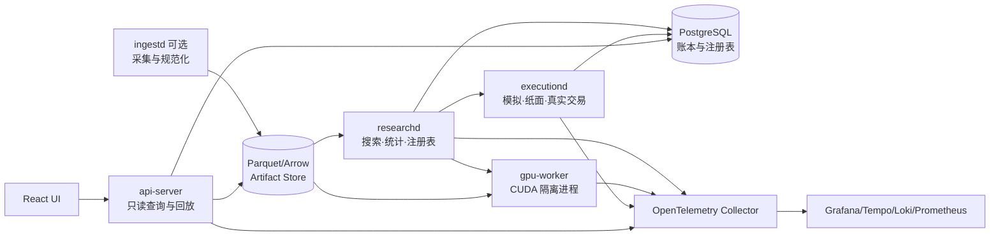
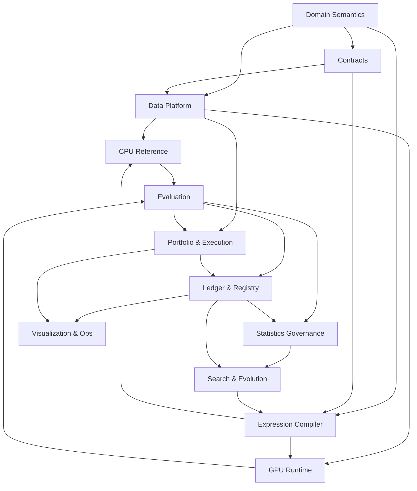

# 01 系统边界、模块切分与依赖规则

版本：1.1-draft  
日期：2026-08-05  
文档性质：规范性  
主责：系统架构负责人  
前置文档：无  
主要消费者：所有工程负责人  

外部依据编号见 `16_references.md`。原始 v1.0 文档为本次重构的需求基线。


## 证据与决策状态

本文档集不把尚未实现或尚未实测的内容伪装成事实。关键结论使用以下状态：

| 标记 | 含义 | 可否直接作为实现事实 |
|---|---|---|
| `VERIFIED-SOURCE` | 已由官方文档、标准或原始论文核验 | 可以，但仍需固定引用版本 |
| `VERIFIED-CALC` | 可由确定性算术、组合数学或数据规模直接推导 | 可以 |
| `DECISION` | 本项目已经选择的架构语义 | 可以，变更须走 ADR |
| `POLICY` | 项目阈值或治理规则，不是普适真理 | 可以配置，不得宣称外部有效性 |
| `TO-BENCHMARK` | 只能在目标 RTX 5070、驱动、CUDA 与操作系统组合上测得 | 不可以预填性能结论 |
| `TO-RESEARCH` | 证据不足或依赖尚未选定的数据源、市场、券商或交易所 | 不可以进入生产默认值 |

出现冲突时，优先级为：正式契约与 ADR > 本文档正文 > 示例代码。外部资料只证明其明确支持的事实，不自动证明本项目的设计阈值。


## 1. 目标与非目标

### 1.1 目标

系统在单张 RTX 5070 上批量搜索类型化符号因子；以 point-in-time 数据、确定性求值、完整试验账本、分级回测、统计校正、组合与执行模拟为基础，形成可审计的因子注册表。

### 1.2 非目标

首版不做：高频做市、端到端深度学习预测、多卡调度、全市场统一实时 OMS、依赖微服务的分布式平台。真实交易接入是独立安全边界，研究系统无权直接绕过 `executiond` 下单。

## 2. 为什么采用模块化单体

`DECISION`：代码使用一个 Rust workspace 和少量受控进程。高内聚、低耦合来自领域所有权和契约，而不是网络数量。

独立进程仅在以下条件成立时设置：

1. 资源故障需要隔离：CUDA 崩溃或 WDDM TDR 不应拖垮研究协调器；
2. 安全权限需要隔离：真实交易密钥只存在于执行进程；
3. 生命周期明显不同：前端查询服务可独立重启；
4. 需要不同语言/运行时：CUDA C++、Rust、Web 前端。

建议进程：



`POLICY`：MVP 可将 `researchd`、`api-server` 与本地 PostgreSQL 部署在一台机器；模块契约不因此改变。

## 3. 一级领域模块

| 模块 | 拥有的核心不变量 | 对外主要输出 | 只允许依赖 | 推荐规模 |
|---|---|---|---|---|
| Domain Semantics | 时间、单位、市场、宇宙、有效性 | 类型与规则 | 无 | M |
| Data Platform | PIT 数据、快照、面板、质量 | `PanelManifest`、`ArtifactRef` | Domain、Contracts | L |
| Expression Compiler | AST、算子语义、身份、计划 | `ExpressionSpec`、`CompiledPlan` | Domain、Contracts | L |
| CPU Reference | 数学基准与测试向量 | Reference result | Data、Compiler | M |
| GPU Runtime | 资源、kernel、显存、确定性 | Stage result artifacts | Data、Compiler、Contracts | XL，内部再拆 |
| Evaluation | F0–F3 指标语义 | `EvaluationResult`、信号制品 | Data、Compiler、GPU、Execution | L |
| Statistics Governance | 选择偏差、稳健性和 OOS 治理 | `StatDecision` | Evaluation、Ledger | L |
| Portfolio & Execution | 目标仓位、订单、成交、会计、TCA | 执行事件与收益 | Domain、Data、Contracts | XL，安全边界 |
| Search & Evolution | 候选生成和选择 | 候选批次 | Compiler、Evaluation、Registry | L |
| Ledger & Registry | 不可变试验事实与因子状态 | 查询视图、血统、版本 | Contracts | M |
| Visualization & Ops | 研究、交易、回放、运行监控 | UI、告警 | Query APIs、Telemetry | L |

规模含义不是工期：`M` 适合一个小组独立拥有；`L` 需要内部组件切分；`XL` 必须有一个稳定外部契约和多个内部子模块，但不自动拆成多个服务。

## 4. XL 模块的内部切分

### 4.1 GPU Runtime

外部仍是一个 `GpuWorker` 契约，内部拆为：

- `planner-adapter`：把 `CompiledPlan` 映射到 kernel stages；
- `memory-manager`：面板、scratch、CSE、微批和 OOM 回退；
- `e0e1-kernels`：逐元素与 O(1) 状态；
- `e2-kernels`：有限窗口统计；
- `e3-kernels`：截面和顺序统计；
- `metric-kernels`：IC、排名、分组和压缩输出；
- `jit-cache`：NVRTC/CUBIN 缓存；
- `benchmark-agent`：资源报告和回归基准。

这些子模块不能直接持有注册表或统计阈值。

### 4.2 Portfolio & Execution

外部是事件化执行契约，内部拆为：

- `portfolio-constructor`：score 到目标权重；
- `pretrade-risk`：约束和否决；
- `order-planner`：目标差额到订单计划；
- `execution-simulator`：B0–B3 回放；
- `algo-engine`：Immediate/TWAP/VWAP/POV 等；
- `venue-adapter`：交易所或券商协议；
- `order-ledger`：事件折叠和幂等；
- `portfolio-accounting`：现金、持仓、费用、资金费率、公司行动；
- `tca`：实施差额和执行质量。

真实 `venue-adapter` 不可链接搜索模块，也不可读取模型私钥之外的研究配置。

## 5. 依赖方向



逻辑反馈环由持久化事实切断：Search 不直接调用 Statistics 内部对象；它读取已版本化的 `SelectionView`。Registry 不负责重新计算任何指标。

## 6. 合理模块大小的判断规则

一个一级模块应同时满足：

1. 只有一个主要领域词汇和一组不变量；
2. 只有一个主责团队；
3. 外部接口族不超过约五类；
4. 可用 fake/mock 在无其他模块进程时验收；
5. 数据模型可单独版本化；
6. 内部变化不会迫使所有消费者重编译或迁移；
7. 不持有另一个模块的数据库表写权限。

需要继续拆分的信号：

- 同一个模块存在两套完全不同的发布节奏；
- 一半测试不需要另一半依赖；
- 同一模块同时处理研究权限和真实下单权限；
- 接口出现双向调用或共享可变状态；
- 单个负责人无法说明该模块唯一不变量。

不应继续拆分的信号：

- 两个组件总在同一事务中变化；
- 分开后只能通过大量细粒度 RPC 完成一次计算；
- 数据搬运成本超过业务计算；
- 只是为了“每个类一个服务”。

## 7. 仓库建议

```text
workspace/
  crates/
    domain/
    contracts/
    data-platform/
    expression-compiler/
    cpu-reference/
    evaluation/
    statistics/
    search/
    registry/
    portfolio-execution/
  gpu/
    worker-host/
    kernels-e0e1/
    kernels-e2/
    kernels-e3/
    kernels-metrics/
  services/
    researchd/
    executiond/
    api-server/
    ingestd/
  web/
    app/
    chart-plugins/
    orderbook-renderer/
  schemas/
  fixtures/
  docs/
```

## 8. 跨模块禁止事项

- GPU kernel 不写数据库；
- 前端不直接读取 Parquet 内部路径，必须通过 `ArtifactRef` 和查询 API；
- 搜索模块不重新定义 Sharpe、IC、换手或统计门槛；
- 执行适配器不接收自由格式策略代码；
- 任何模块不得以 ticker 作为长期 instrument 主键；
- 大数组不得嵌入 Protobuf 控制消息；
- 指标名称、单位和年化时钟不得由 UI 临时推断。

## 9. 契约分层

```text
common.proto    基础值对象与长任务
domain.proto    时间、市场、标的、宇宙、指标定义
research.proto  数据面板、AST 计划、评估和试验
execution.proto 目标、风险、订单、成交、会计和 TCA
registry.proto  裁定、发布、生命周期和选择视图
services.proto  仅限真实进程边界的 RPC
```

一级模块内部使用 Rust trait；只有跨进程、跨团队持久化或长期兼容边界使用 Protobuf。这样避免“所有内部函数都 RPC 化”，同时保证 GPU、执行和前端团队可由 fixture 独立实现。

## 10. 待研究

- `TO-RESEARCH SB-01`：元数据数据库在单机开发使用 SQLite、团队环境使用 PostgreSQL，是否需要双实现；默认规范仍以 PostgreSQL 事务语义定义。
- `TO-RESEARCH SB-02`：GPU worker 与 researchd 最终采用本地 gRPC、Unix/Named Pipe 还是嵌入式调用；IDL 与制品引用不依赖该选择。
- `TO-RESEARCH SB-03`：实时事件总线是否需要 NATS JetStream。首版不引入；只有纸面/真实交易需要跨进程重放时再决策。
