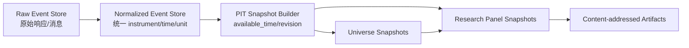

# 03 数据平台、PIT 宇宙与面板契约

版本：1.1-draft  
日期：2026-08-05  
文档性质：规范性  
主责：数据平台负责人  
前置文档：02_domain_semantics.md、contracts/research.proto  
主要消费者：CPU Reference、GPU Runtime、Evaluation、Execution  

外部依据编号见 `16_references.md`。原始 v1.0 文档为本次重构的需求基线。


## 证据与决策状态

本文档集不把尚未实现或尚未实测的内容伪装成事实。关键结论使用以下状态：

| 标记 | 含义 | 可否直接作为实现事实 |
|---|---|---|
| `VERIFIED-SOURCE` | 已由官方文档、标准或原始论文核验 | 可以，但仍需固定引用版本 |
| `VERIFIED-CALC` | 可由确定性算术、组合数学或数据规模直接推导 | 可以 |
| `DECISION` | 本项目已经选择的架构语义 | 可以，变更须走 ADR |
| `POLICY` | 项目阈值或治理规则，不是普适真理 | 可以配置，不得宣称外部有效性 |
| `TO-BENCHMARK` | 只能在目标 RTX 5070、驱动、CUDA 与操作系统组合上测得 | 不可以预填性能结论 |
| `TO-RESEARCH` | 证据不足或依赖尚未选定的数据源、市场、券商或交易所 | 不可以进入生产默认值 |

出现冲突时，优先级为：正式契约与 ADR > 本文档正文 > 示例代码。外部资料只证明其明确支持的事实，不自动证明本项目的设计阈值。


## 1. 数据分层



### Raw Event Store

保留供应商原始载荷、接收时间、请求/流序列号和校验和，不进行覆盖更新。

### Normalized Event Store

统一 instrument ID、单位、时区、事件类型和修订链。任何修订生成新记录。

### PIT Snapshot

按 `available_time` 重建研究者在某一时点实际可见的数据。

### Research Panel

固定面板版本、宇宙、字段、标签、有效位图和派生代码版本。面板创建后不可原地修改。

## 2. 存储格式与分区

`DECISION`：

- 长期列式存储：Parquet；
- 进程内/进程间批数据：Apache Arrow RecordBatch/IPC；
- 元数据与账本：PostgreSQL；
- 大制品：内容寻址文件目录或对象存储。

Arrow C Data Interface 提供稳定的列式内存交换接口；Arrow IPC 可在允许条件下实现零拷贝或内存映射读取。[R-ARROW-CDI][R-ARROW-IPC]

Parquet 推荐物理分区：

```text
venue/product_type/year/month/
```

文件内部按 `instrument_id, event_time` 排序。禁止按 `(日期, 标的)` 产生海量小文件。

## 3. 面板物理布局

GPU 基准使用字段分离的 SoA：

```text
field_buffers[field][time][asset_padded]
```

同一 warp 在同一时间读取同一字段时访问连续标的。默认只常驻时间主序；资产主序仅在目标机基准证明某专用 kernel 受益时派生。

```rust
pub struct PanelManifest {
    pub panel_id: Hash256,
    pub time_count: u32,
    pub decision_count: u32,
    pub asset_count: u32,
    pub padded_asset_count: u32,
    pub fields: Vec<FieldManifest>,
    pub field_artifacts: Vec<ArtifactRef>,
    pub validity_artifacts: Vec<ArtifactRef>,
    pub decision_index: ArtifactRef,
    pub universe_snapshot: ArtifactRef,
    pub label_values: ArtifactRef,
    pub label_order: ArtifactRef,
    pub source_manifest_hash: Hash256,
}
```

## 4. 有效性模型

位图分开保存：

- `observed_valid`：记录是否存在；
- `field_valid[field]`：字段本身是否合法；
- `universe_eligible[d]`；
- `tradable[d]`；
- `shortable[d]`；
- `evaluation_mask`：CPCV、封存或压力场景。

不得用单个 `valid` 位掩盖缺失来源。前向填充只有字段的 `MissingPolicy=AsOfKnownValue` 明确允许时才可发生，并保留原始观测时间。

## 5. 数据质量契约

每个面板发布前执行：

1. 主键唯一与时间单调；
2. `available_time >= event_time` 的异常审查；
3. ticker/instrument 映射区间无重叠；
4. OHLC 关系、负数量、非有限值检查；
5. corporate action、合约迁移和下架链闭合；
6. 交易日历覆盖；
7. 宇宙重建可复现；
8. label entry/exit 均位于合法执行窗口；
9. 文件、schema、代码和源数据校验和完整；
10. 抽样与原始供应商数据比对。

输出 `DataQualityReport`，未通过硬错误不得生成 PanelManifest。

## 6. 数据 API

控制面只传 `PanelManifest` 和 `ArtifactRef`。GPU worker 根据内容哈希本地缓存制品。

```text
BuildPanel(request) -> PanelManifest
GetPanel(panel_id) -> PanelManifest
VerifyPanel(panel_id) -> DataQualityReport
ResolveArtifact(sha256) -> local/mmap handle
```

批量传输不得通过 JSON。浏览器查询由 API server 下采样或返回 Arrow stream。

## 7. 显存基准算术

基准 `T=43,800, N=512, f32=4`：

```text
一个小时字段平面 = 43,800 × 512 × 4
                   = 89,702,400 bytes
8 个字段单布局   = 717,619,200 bytes
```

`VERIFIED-CALC`。标签和成本字段如果是日度，只按 `D≈1,825` 分配，不应扩成 43,800 行。真实显存预算由 `05_gpu_runtime.md` 的运行时 allocator 决定。

## 8. 数据安全与可追溯

- API key 不进入 Parquet 元数据；
- raw store 与研究制品只读挂载给 GPU worker；
- 每个 ArtifactRef 含 SHA-256、size、media type、schema version；
- 删除采用 tombstone 和保留策略，不覆盖审计记录；
- UI 下载必须记录访问者、制品和时间。

## 9. 待研究

- `TO-RESEARCH DP-01`：具体加密货币历史 L2 数据供应商、序列完整性和许可；决定是否可实现 B3。
- `TO-RESEARCH DP-02`：ETF 的退市历史、PCF、iNAV 和借券历史供应商。
- `TO-RESEARCH DP-03`：面板上传 GPU 使用 pageable、pinned、mmap + staging 还是 Arrow C Device Interface；需目标机实测。
- `TO-RESEARCH DP-04`：是否需要 DuckDB/Polars 作为开发查询层；不影响规范性存储。
