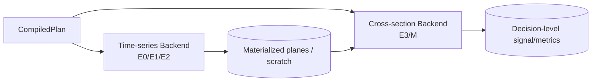

# 05 GPU 运行时、数值规格、显存与目标机基准

版本：1.1-draft  
日期：2026-08-05  
文档性质：规范性  
主责：GPU/CUDA 负责人  
前置文档：03_data_platform.md、04_expression_compiler.md  
主要消费者：Evaluation、Testing、Operations  

外部依据编号见 `16_references.md`。原始 v1.0 文档为本次重构的需求基线。


## 证据与决策状态

本文档集不把尚未实现或尚未实测的内容伪装成事实。关键结论使用以下状态：

| 标记 | 含义 | 可否直接作为实现事实 |
|---|---|---|
| `VERIFIED-SOURCE` | 已由官方文档、标准或原始论文核验 | 可以，但仍需固定引用版本 |
| `VERIFIED-CALC` | 可由确定性算术、组合数学或数据规模直接推导 | 可以 |
| `DECISION` | 本项目已经选择的架构语义 | 可以，变更须走 ADR |
| `POLICY` | 项目阈值或治理规则，不是普适真理 | 可以配置，不得宣称外部有效性 |
| `TO-BENCHMARK` | 只能在目标 RTX 5070、驱动、CUDA 与操作系统组合上测得 | 不可以预填性能结论 |
| `TO-RESEARCH` | 证据不足或依赖尚未选定的数据源、市场、券商或交易所 | 不可以进入生产默认值 |

出现冲突时，优先级为：正式契约与 ADR > 本文档正文 > 示例代码。外部资料只证明其明确支持的事实，不自动证明本项目的设计阈值。


## 1. 已核验硬件边界

`VERIFIED-SOURCE`：RTX 5070 为 48 SM、12GB GDDR7、672 GB/s；Compute Capability 12.x 每 SM 64K 个 32 位寄存器、最多 1536 resident threads、约 100KB shared memory，非 Tensor FP32:FP64 吞吐比为 64:1。[R-NVIDIA-RTX][R-NVIDIA-CC12]

512 线程块下，仅按寄存器理论上限：

```text
3 blocks/SM -> floor(65536 / (512×3)) = 42 registers/thread
2 blocks/SM -> 64 registers/thread
1 block/SM  -> 128 registers/thread
```

`VERIFIED-CALC`。实际占用率还受分配粒度、shared memory、编译器临时量和 block 限制影响。因此 v1.0 的“128 寄存器且 3 块/SM”被删除。

## 2. 双后端执行架构



### Time-series backend

- block 以 128 或 256 资产线程为起点，目标机自动调优；
- grid 维度包含 candidate、asset tile、time chunk；
- E0/E1 优先融合；
- E2 使用显式 global scratch，不依赖编译器 spill。

### Cross-section backend

- 一个 block 处理一个候选、一个决策点的完整横截面；
- 512 线程基准；
- 精确 rank、midrank、Top-K 和截面归约在此完成；
- 标的超过 1024 时使用多阶段排序/选择，不采用普通块间隐式同步。

## 3. 窗口状态

长度 168 的单个 f32 环形值已经超过 512 线程块下每线程 128 寄存器的理论块上限。动态索引数组或溢出寄存器会落入 local memory，而 local memory 位于设备内存。[R-NVIDIA-CC12]

`DECISION`：

```text
[state_node][ring_slot][candidate_in_microbatch][asset]
```

`asset` 为最内层维度，保证 warp 合并访问。原字段 rolling sum 可读取 `x[t-w]`；EMA 只保留 O(1) 状态；未物化派生输入需要环形 scratch。

## 4. 编译后资源闸门

F0 包含两级检查：

### 静态估计

- state/scratch/materialized bytes；
- sort/barrier 数量；
- FP64 密度；
- 预计 kernel stages。

### 实际编译报告

记录：

```text
registers_per_thread
stack_frame_bytes
spill_loads/stores
local_bytes_per_thread
shared_bytes_per_block
active_blocks_per_sm
binary_hash
```

占用率使用 CUDA occupancy API 对实际 kernel 计算。[R-NVIDIA-OCCUPANCY]

规则：E0/E1 非故意 local memory 必须为 0；E2 状态只能来自显式 scratch；任何 spill 都进入账本并触发性能等级变化。

## 5. 数值模式

```rust
pub enum NumericMode {
    SearchFast,
    ValidationExact,
}
```

### SearchFast

- f32 面板；
- 补偿求和或稳定在线算法；
- 周期性整窗重算；
- 禁止未记录的 fast-math；
- 关键边界与 CPU fixture 比较。

### ValidationExact

- CPU f64 参考；
- GPU 关键累计量可使用 f64；
- 最终候选全部重放；
- 记录 abs、relative 和 ULP 误差。

不能统一使用“相对误差 <1e-5”。validity、tie、选中资产、订单计划要求完全一致；数值量按算子定义绝对/相对/ULP 容差。

## 6. 时间分块与 Windows TDR

Windows WDDM 默认 TDR 超时为 2 秒；Microsoft 明确说明 TDR 注册表项面向驱动开发测试，普通应用不应依赖修改它。[R-MS-TDR]

`DECISION`：长扫描按 time chunk 执行，状态通过显式 scratch 延续。内部可设置 `P99 kernel duration < configured safety limit`，但该值是 `POLICY`，必须由目标机测量确定。

## 7. CSE 与 JIT

- 公共节点先由独立 kernel 物化；
- 通过 kernel 边界或 stream event 建立依赖；
- NVRTC 用于精英专用代码生成；NVRTC 可从 CUDA C++ 字符串生成 PTX/CUBIN。[R-NVIDIA-NVRTC]
- JIT key 包含 plan、目标 compute capability、CUDA 版本、编译选项和 numeric mode；
- CUBIN 不跨不兼容驱动盲目复用。

## 8. 运行时显存预算

运行时启动调用 `cudaMemGetInfo()`，预算为：

```text
min(configured_cap, safety_fraction × free_memory_at_start)
```

`safety_fraction` 是 `POLICY`，建议初始 0.80–0.85 后实测。

基准常驻：

- 8 个小时字段单布局：717.6192 MB；
- 日度标签/成本/索引与位图：按 manifest 计算；
- 合成数据不默认复制完整双布局；
- F2 只保存日度小序列；
- F3 score 矩阵按微批生成；
- CSE cache 和 rolling scratch 由 allocator 竞争同一预算。

OOM 回退顺序：减微批 → 逐出 CSE → 减 time chunk → 禁止高成本候选；不得静默降精度或改变算子。

## 9. 目标机微基准

`TO-BENCHMARK`：发布任何候选/秒数字前必须测量：

1. 20 节点 E0；
2. E1 EMA；
3. window 24/168 的 mean/std/corr；
4. 512 元素 exact rank + ties；
5. Top-K 与指标归约；
6. Cross→Rolling 的分阶段表达式；
7. SearchFast 与 ValidationExact；
8. 不同 block size、time chunk 和微批。

记录 Nsight Compute 指标、P50/P95/P99、吞吐、spill、DRAM、L2、barrier stall 和功耗。v1.0 的 1000/300/30 候选每秒全部降级为待基准。

## 10. 正确性工具

CI 与发布候选运行 NVIDIA Compute Sanitizer：memcheck、racecheck、initcheck、synccheck。[R-NVIDIA-SANITIZER]

此外运行：

- device-side assert 的小 fixture；
- 随机 AST differential test；
- chunk boundary test；
- 重复运行位级一致性；
- CUDA error 后进程重启与作业恢复。

## 11. 待研究

- `TO-BENCHMARK GPU-01`：E0/E1 最优 block size；
- `TO-BENCHMARK GPU-02`：精确 rank 采用 bitonic、CUB block primitive 或 radix 路径；
- `TO-BENCHMARK GPU-03`：FP64 锚定频率与误差/吞吐折中；
- `TO-RESEARCH GPU-04`：Linux TCC/独立计算机是否作为长跑推荐环境；Windows 仍需支持开发；
- `TO-RESEARCH GPU-05`：Arrow C Device Interface/CUDA IPC 是否值得引入跨进程零拷贝。
