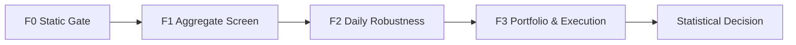

# 06 F0–F3 评估流水线与指标契约

版本：1.1-draft  
日期：2026-08-05  
文档性质：规范性  
主责：评估流水线负责人  
前置文档：02–05 文档、08_portfolio_execution.md  
主要消费者：Statistics、Search、Registry、Visualization  

外部依据编号见 `16_references.md`。原始 v1.0 文档为本次重构的需求基线。


## 证据与决策状态

本文档集不把尚未实现或尚未实测的内容伪装成事实。关键结论使用以下状态：

| 标记 | 含义 | 可否直接作为实现事实 |
|---|---|---|
| `VERIFIED-SOURCE` | 已由官方文档、标准或原始论文核验 | 可以，但仍需固定引用版本 |
| `VERIFIED-CALC` | 可由确定性算术、组合数学或数据规模直接推导 | 可以 |
| `DECISION` | 本项目已经选择的架构语义 | 可以，变更须走 ADR |
| `POLICY` | 项目阈值或治理规则，不是普适真理 | 可以配置，不得宣称外部有效性 |
| `TO-BENCHMARK` | 只能在目标 RTX 5070、驱动、CUDA 与操作系统组合上测得 | 不可以预填性能结论 |
| `TO-RESEARCH` | 证据不足或依赖尚未选定的数据源、市场、券商或交易所 | 不可以进入生产默认值 |

出现冲突时，优先级为：正式契约与 ADR > 本文档正文 > 示例代码。外部资料只证明其明确支持的事实，不自动证明本项目的设计阈值。


## 1. 流水线原则

F1 只做低成本淘汰；F2 才保存完整日度序列；F3 才重建完整标准化 score、目标仓位和执行。任何代理指标必须带 `metric_tier`，不得被 UI 当作最终净收益。



## 2. F0 静态闸门

输入：`ExpressionSpec + CompiledPlan + PanelManifest`。

拒绝：

- 类型/单位/可用时间非法；
- 回看超数据范围；
- canonical duplicate；
- 静态 state/materialization 超预算；
- 编译后 kernel 无法启动或 spill 超政策；
- 未定义算子或不支持的市场字段。

所有候选先登记 `HypothesisTrial`，包括 F0 被拒者；静态重复可记录为 `reused_from`，不重复计新 hypothesis。

## 3. F1 聚合粗筛

默认输出聚合量，不保存 `[candidate][D]`：

```text
valid_count
sum_x, sum_y, sum_x2, sum_y2, sum_xy
Pearson IC summary
linear score-weighted gross return proxy
coverage summary
```

F1 不为所有候选额外计算精确 Spearman 和 Top-K。若表达式 AST 自身含截面秩，则仍执行该节点。

阈值均为 `POLICY`，必须在配置与试验账本中版本化。

## 4. F2 日度稳健性

仅对存活微批输出：

```rust
pub struct F2Series {
    pub ic: ArtifactRef,
    pub rank_ic: ArtifactRef,
    pub gross_signal_return: ArtifactRef,
    pub one_way_turnover: ArtifactRef,
    pub valid_count: ArtifactRef,
}
```

`D≈1,825` 时 256 候选、5 个 f32 序列约 9.344 MB，避免原文 1.8GB 小时级缓冲错误。

F2 可运行内部 CPCV、明确属于 adaptive 的数据扰动和训练期方向拟合。F2 不调用真实下单适配器。

## 5. F3 完整信号与执行

F3 微批重新生成：

```text
raw_score[D,N]
normalized_score[D,N]
target_weight[D,N]
order_intents
fills
positions
cash
cost_breakdown
net_returns
```

结果通过 ArtifactRef 保存。失败候选释放矩阵；入库候选可保存压缩 score 供相关性、半衰期和回放。

## 6. 指标定义

### Pearson IC

在 `common_valid` 上计算横截面 Pearson，保存有效标的数和 invalid reason。

### Spearman IC

对共同有效集合的双方 midrank 做 Pearson；tie 规则见领域语义。

### 换手

同时输出：

```text
gross_traded_notional_ratio = Σ|trade_notional| / NAV_before
one_way_turnover = 0.5 × gross_traded_notional_ratio
```

成本使用前者。

### 信号相关性

```text
signal_corr(a,b) = median_d corr_cs(z_a[d], z_b[d])
pnl_corr(a,b)    = corr(net_return_a, net_return_b)
```

二者分别保存。

### 信号持续性

```text
rho(lag) = median_d corr_cs(z[d], z[d-lag])
```

只有曲线稳定且大致单调时报告首次跌破 0.5 的 lag；否则展示完整曲线和面积。不能从 IC/PnL/turnover 反推。

## 7. 指标制品契约

每个指标包含：

- definition version；
- input evaluation ID；
- sample count；
- unit；
- annualization clock；
- gross/net 标识；
- invalid reason counts；
- exact/approx 算法；
- artifact hash。

## 8. 错误处理

候选失败分类：

```text
INVALID_EXPRESSION
INSUFFICIENT_HISTORY
INSUFFICIENT_CROSS_SECTION
NUMERIC_INVALID
RESOURCE_REJECTED
KERNEL_FAILURE
EXECUTION_INFEASIBLE
DATA_QUALITY_FAILURE
```

失败是账本事实，不得从试验数中无痕删除。

## 9. 待研究

- `TO-RESEARCH EV-01`：F1 线性收益代理与最终 F3 排名的一致性；需离线消融。
- `TO-RESEARCH EV-02`：F2 精确 rank 是否对全部日期计算，或先按固定子样本；不得改变统计定义而不改版本。
- `POLICY EV-03`：F1/F2 存活比例和 coverage 门槛。
- `TO-RESEARCH EV-04`：入库因子 score 压缩格式及其对相关性误差的影响。
