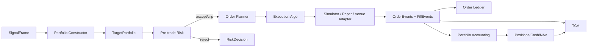
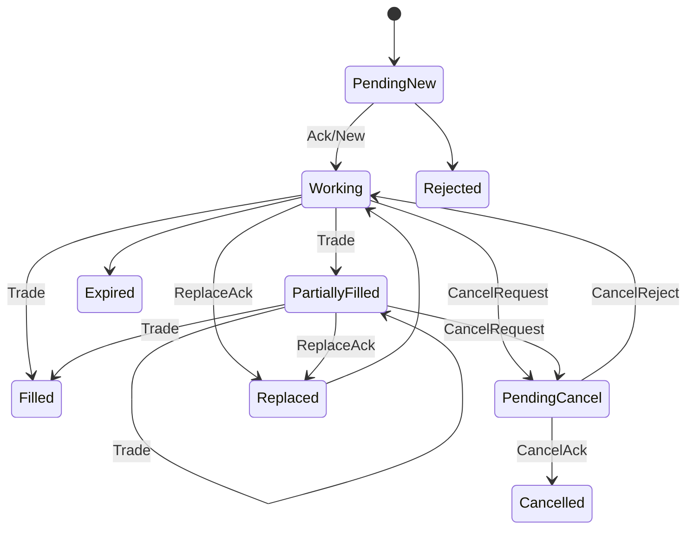

# 08 组合构建、交易执行、会计与 TCA

版本：1.1-draft  
日期：2026-08-05  
文档性质：规范性  
主责：交易系统负责人  
前置文档：02_domain_semantics.md、03_data_platform.md、contracts/execution.proto  
主要消费者：Evaluation、Registry、Visualization、真实交易适配器  

外部依据编号见 `16_references.md`。原始 v1.0 文档为本次重构的需求基线。


## 证据与决策状态

本文档集不把尚未实现或尚未实测的内容伪装成事实。关键结论使用以下状态：

| 标记 | 含义 | 可否直接作为实现事实 |
|---|---|---|
| `VERIFIED-SOURCE` | 已由官方文档、标准或原始论文核验 | 可以，但仍需固定引用版本 |
| `VERIFIED-CALC` | 可由确定性算术、组合数学或数据规模直接推导 | 可以 |
| `DECISION` | 本项目已经选择的架构语义 | 可以，变更须走 ADR |
| `POLICY` | 项目阈值或治理规则，不是普适真理 | 可以配置，不得宣称外部有效性 |
| `TO-BENCHMARK` | 只能在目标 RTX 5070、驱动、CUDA 与操作系统组合上测得 | 不可以预填性能结论 |
| `TO-RESEARCH` | 证据不足或依赖尚未选定的数据源、市场、券商或交易所 | 不可以进入生产默认值 |

出现冲突时，优先级为：正式契约与 ADR > 本文档正文 > 示例代码。外部资料只证明其明确支持的事实，不自动证明本项目的设计阈值。


## 1. 原文缺口结论

原 M8 只有成本公式和“L2 回放”标签，没有定义：目标权重、当前持仓、订单意图、订单状态、部分成交、撤改单、现金/保证金、资金费率、公司行动、成交会计、风险否决、执行算法、适配器、TCA 和纸面/真实边界。因此它不足以产生可验证的净收益，也不足以支持交易可视化。

本域将研究回测与真实执行使用同一事件契约，但实现不同 adapter。

## 2. 执行链



## 3. 组合构建

输入：标准化 score、eligible/shortable mask、当前持仓、NAV、市场 profile。

基准 constructor：

1. 共同有效集合；
2. winsorize/standardize（训练拟合参数版本化）；
3. top/bottom 或连续 score 权重；
4. gross/net、单标的、行业/币种、流动性、做空约束；
5. 目标权重到合法数量的定点量化；
6. 输出未满足约束和裁剪原因。

接口：

```text
ConstructPortfolio(SignalFrame, PortfolioPolicy, PositionSnapshot)
  -> TargetPortfolio + ConstraintReport
```

更复杂风险模型/优化器是插件，不改变目标仓位契约。

## 4. 预交易风险

至少检查：

- 数据新鲜度和市场状态；
- instrument 是否可交易/可做空；
- 最大 gross/net/单名/币种敞口；
- 可用现金、保证金和借券；
- tick、step、min notional；
- 最大参与率和订单名义金额；
- 价格偏离、涨跌停或交易所 band；
- 重复 client order ID；
- 日内亏损、错误率、延迟和 kill switch。

输出 `RiskDecision`，所有 clip/reject 均可审计。

## 5. 订单意图与状态

目标差额先生成 `OrderIntent`，之后才由 adapter 生成交易所命令。订单状态与事件类型分离，遵循 FIX 中 `OrdStatus` 表示当前状态、`ExecType` 表示本次事件的思想。[R-FIX-ORDER-STATE]



Order ledger 只追加事件，当前状态由确定性 fold 得出。`client_order_id`、`event_id` 和 venue sequence 支持幂等与去重。

## 6. 模拟等级

| 等级 | 输入 | 能力 | 不能声称 |
|---|---|---|---|
| B0 Deterministic Window | bar/auction reference price | 无部分成交，固定/规则成本 | 真实成交质量 |
| B1 Volume-limited Bar | OHLCV、spread proxy、lagged ADV/vol | 部分成交、参与率、延迟窗口 | 队列位置与真实 L2 |
| B2 Quote/Trade Replay | BBO/quotes/trades | spread crossing、top-of-book、机会成本 | 完整深度和精确排队 |
| B3 Incremental L2 Replay | 增量簿、成交、撤单、序列号 | 深度消耗、队列近似/重建、订单回放 | 若无自身延迟和 queue 数据，不声称精确实盘 |

“L2 回放”只有在数据包含增量 order book、trades、cancels、sequence 和恢复规则时成立。快照逐层吃单只能称为 snapshot walk-the-book。

## 7. 执行算法

分阶段：

- X0 `ImmediateWindow`：下一合法窗口执行；
- X1 `TWAP`：固定时间切片；
- X2 `VWAP`：使用只基于当时可知的历史/预测曲线；
- X3 `POV`：目标参与率；
- X4 `PassiveActive`：限价等待与超时主动化；
- X5 venue-specific smart routing：远期。

执行算法不得读取完整未来 bar 的成交量来决定当前切片。回测中的预测量必须有自己的 `available_time`。

## 8. 成本与会计

```rust
pub struct CostBreakdown {
    exchange_fee,
    spread_cost,
    impact_cost,
    borrow_cost,
    funding_cost,
    financing_cost,
    fx_cost,
    taxes,
    failed_fill_opportunity_cost,
}
```

会计事件：trade、fee、funding、interest、dividend、split、cash transfer、settlement、mark-to-market。

永续资金费率只在持仓跨越真实 funding event 时入账；interval 可能变化。[R-BINANCE-FUNDING]

ETF 需要分红、拆分、清盘、NAV/iNAV/market price 区分；JPX iNAV 与 NAV 有不同更新频率。[R-JPX-INAV]

## 9. TCA

TCA 使用统一术语和可配置 benchmark，覆盖 pre-trade 到 post-trade；FIX Trading Community 也将其作为标准化领域。[R-FIX-TCA]

至少输出：

```text
arrival_price
decision_price
implementation_shortfall
spread_component
market_impact
market_timing
opportunity_cost
fill_rate
cancel_rate
participation_rate
arrival_to_ack_latency
ack_to_fill_latency
slippage_bps
venue/algo breakdown
```

组合级同时报告 standalone capacity 与净额抵消后的 portfolio capacity。

## 10. 纸面与真实交易边界

`executiond` 三种模式使用同一输入/输出：

```text
SIMULATION
PAPER
LIVE
```

LIVE 额外要求：

- 独立密钥存储；
- 人工 arm/disarm；
- 全局和策略 kill switch；
- cancel-on-disconnect/交易所 dead-man switch（若支持）；
- reconciliation 与 broker/exchange truth；
- 只允许签名后的 FactorVersion 和 PortfolioPolicy；
- UI 无直接交易凭证。

## 11. 市场适配器

每个 adapter 必须实现：

```text
InstrumentRules
MarketCalendar
MarketDataCursor
Submit/Cancel/Replace
OrderEvent stream
Position/Balance reconciliation
Health/status
```

交易所 filter（tickSize、stepSize、minQty、minNotional）来自当时有效的元数据，不硬编码。[R-BINANCE-FILTERS]

## 12. 待研究

- `TO-RESEARCH EX-01`：基准执行窗口和真实可交易的 venue/broker；
- `TO-RESEARCH EX-02`：平方根冲击系数、参与率上限和 spread proxy，只能用实际成交/报价标定；
- `TO-RESEARCH EX-03`：B3 数据是否能重建队列位置；若不能，定义 queue approximation；
- `TO-RESEARCH EX-04`：ETF 借券可得性、费率、税费与结算模型；
- `TO-RESEARCH EX-05`：多因子组合优化器与风险模型；首版可用确定性约束构造；
- `TO-RESEARCH EX-06`：实盘 OMS 对接 FIX、REST/WebSocket 或券商 SDK。
