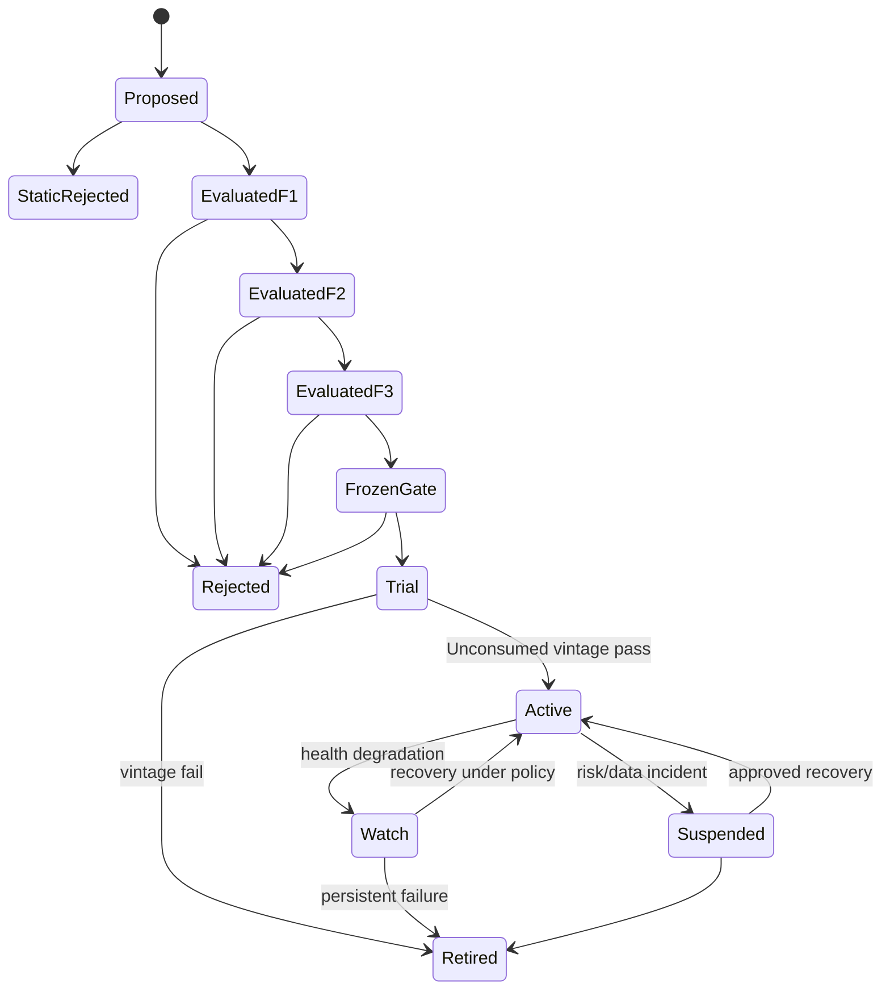

# 10 试验账本、因子注册表与生命周期

版本：1.1-draft  
日期：2026-08-05  
文档性质：规范性  
主责：研究平台负责人  
前置文档：contracts/research.proto、07_statistics_governance.md  
主要消费者：Search、Visualization、Release Review  

外部依据编号见 `16_references.md`。原始 v1.0 文档为本次重构的需求基线。


## 证据与决策状态

本文档集不把尚未实现或尚未实测的内容伪装成事实。关键结论使用以下状态：

| 标记 | 含义 | 可否直接作为实现事实 |
|---|---|---|
| `VERIFIED-SOURCE` | 已由官方文档、标准或原始论文核验 | 可以，但仍需固定引用版本 |
| `VERIFIED-CALC` | 可由确定性算术、组合数学或数据规模直接推导 | 可以 |
| `DECISION` | 本项目已经选择的架构语义 | 可以，变更须走 ADR |
| `POLICY` | 项目阈值或治理规则，不是普适真理 | 可以配置，不得宣称外部有效性 |
| `TO-BENCHMARK` | 只能在目标 RTX 5070、驱动、CUDA 与操作系统组合上测得 | 不可以预填性能结论 |
| `TO-RESEARCH` | 证据不足或依赖尚未选定的数据源、市场、券商或交易所 | 不可以进入生产默认值 |

出现冲突时，优先级为：正式契约与 ADR > 本文档正文 > 示例代码。外部资料只证明其明确支持的事实，不自动证明本项目的设计阈值。


## 1. 两类存储

- Trial Ledger：不可变事实，记录所有尝试、复用、失败、作废和重放；
- Factor Registry：从事实导出的、版本化的因子状态和审批视图。

Registry 不替代 Artifact Store；大序列只保存 ArtifactRef。

## 2. 核心实体

```text
Expression
Candidate
Evaluation
HypothesisTrial
EvaluationReplicate
StatDecision
ExecutionRun
FactorVersion
LineageEdge
VintageConsumption
Review
Artifact
```

ID 定义见 Compiler。所有记录含 schema version、created_at、correlation_id、producer version 和 payload hash。

## 3. 状态机



状态变更必须引用 `DecisionRecord`，不能直接更新字符串。

## 4. 账本写入原则

- append-only；
- 幂等键为 evaluation/trial/event ID；
- F0 拒绝也记录；
- 重放链接原 evaluation；
- 数据或代码缺陷导致结果无效时写 invalidation，不删除；
- UI 只通过 read model 查询。

## 5. 因子发布包

FactorVersion 至少包含：

```text
canonical expression + params
panel/universe/label versions
compiled plan and binary hash
metric definitions and artifacts
statistics decision
execution/cost policy
market scope
logic review
known failure modes
holdout vintage status
owner and approval
```

只有发布包签名后，executiond 才能接收。

## 6. 生命周期监控

健康指标：

- live/paper IC 与收益；
- turnover、capacity、slippage；
- score distribution drift；
- universe coverage；
- correlation drift；
- data freshness；
- execution reject/fill；
- 与预注册失效条件的匹配。

监控触发 Watch/Suspended，不自动修改表达式。

## 7. 查询视图

为 UI 和 Search 提供：

- FactorSummary；
- EvaluationDetail；
- TrialLineage；
- MetricSeriesRef；
- ExecutionRunDetail；
- VintageStatus；
- SelectionView；
- AuditTimeline。

## 8. 保留与删除

试验事实、订单/成交和审批记录遵循最长保留策略；大型临时 scratch 可删除，但 Artifact 表保留 tombstone 和 hash。真实交易记录的法定保留期属于 `TO-RESEARCH`，按司法辖区单独确定。

## 9. 待研究

- `TO-RESEARCH RG-01`：FactorVersion 的签名与密钥管理；
- `TO-RESEARCH RG-02`：长期制品冷热分层和压缩；
- `TO-RESEARCH RG-03`：团队审批/RBAC 模型；
- `TO-RESEARCH RG-04`：法规要求的交易记录保留期。
