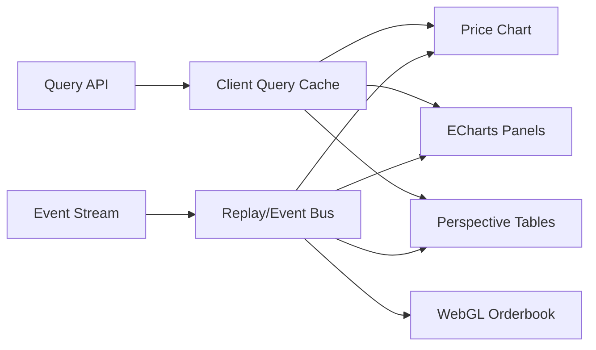

# 11 交易可视化、研究回放与可观测性

版本：1.1-draft  
日期：2026-08-05  
文档性质：规范性  
主责：前端负责人 + SRE/平台负责人  
前置文档：06、08、10 文档和 API 契约  
主要消费者：研究员、交易员、工程运维、审查者  

外部依据编号见 `16_references.md`。原始 v1.0 文档为本次重构的需求基线。


## 证据与决策状态

本文档集不把尚未实现或尚未实测的内容伪装成事实。关键结论使用以下状态：

| 标记 | 含义 | 可否直接作为实现事实 |
|---|---|---|
| `VERIFIED-SOURCE` | 已由官方文档、标准或原始论文核验 | 可以，但仍需固定引用版本 |
| `VERIFIED-CALC` | 可由确定性算术、组合数学或数据规模直接推导 | 可以 |
| `DECISION` | 本项目已经选择的架构语义 | 可以，变更须走 ADR |
| `POLICY` | 项目阈值或治理规则，不是普适真理 | 可以配置，不得宣称外部有效性 |
| `TO-BENCHMARK` | 只能在目标 RTX 5070、驱动、CUDA 与操作系统组合上测得 | 不可以预填性能结论 |
| `TO-RESEARCH` | 证据不足或依赖尚未选定的数据源、市场、券商或交易所 | 不可以进入生产默认值 |

出现冲突时，优先级为：正式契约与 ADR > 本文档正文 > 示例代码。外部资料只证明其明确支持的事实，不自动证明本项目的设计阈值。


## 1. 缺口结论

原文只列出净值、IC、参数热力图、网格和血统图，缺少：

- 价格、信号、目标仓位、订单和成交的时间同步；
- 订单生命周期和风险否决；
- L2/深度及成交方向；
- 实施差额和成本分解；
- 研究试验、数据血统和 GPU 运行链路；
- 可交互回放与故障定位。

因此可视化不是 M10 的附属页面，而是独立域。

## 2. 三个产品面

### Research Explorer

面向因子研究：

- 表达式树、参数、编译 stages 和资源报告；
- IC/Rank IC、decile、score-return scatter；
- gross/net PnL、回撤、滚动 Sharpe；
- regime、coverage、turnover、capacity；
- 参数敏感度、高原、Sobol/Morris；
- signal correlation matrix/graph；
- MAP-Elites 和 lineage；
- CPCV/DSR/null/holdout 证据。

### Execution Console

面向模拟、纸面和真实执行：

- 价格主图：OHLC/BBO、信号、目标/实际仓位、订单、成交、风险事件；
- order blotter：client/venue ID、状态、剩余量、原因；
- lifecycle timeline：New/Ack/Partial/Cancel/Reject；
- target vs actual exposure；
- TCA waterfall 和按 venue/algo/instrument 分解；
- order book heatmap、当前 DOM、成交量点；
- synchronized replay 和逐事件 inspector；
- kill switch 与系统健康状态。

### Operations

- 数据新鲜度、缺口、修订；
- research/gpu/execution/API 延迟和错误；
- GPU 显存、kernel P50/P95/P99、spill、OOM 回退；
- 作业队列、缓存命中、CUBIN 编译；
- order ack/fill/reject、reconciliation 差异；
- trace/log/metric 关联与告警。

## 3. 同步回放模型

所有图共享 `ReplayCursor`：

```text
run_id
cursor_time
sequence
mode: event-step / realtime / accelerated
visible_instruments
normalization_policy
```

后端按同一 cursor 返回：market slice、signal、target、risk decision、order events、fills、positions、TCA 和 telemetry trace IDs。任何图点击事件都可跳转到同一时间和订单。

## 4. 订单簿热力图

编码建议：

- X：事件时间；
- Y：价格或相对 mid 的 bps；
- 颜色强度：`log1p(resting_notional)` 或明确选择的归一化；
- bid/ask 可分层或对称编码；
- BBO/mid 线叠加；
- trades 用气泡，位置为价格和时间，大小为成交量，方向为 aggressor；
- 本系统订单/成交使用独立边框或 glyph；
- 数据缺口使用不可混淆的 hatch/mask。

缩放必须重做 time/price pixel aggregation。默认图例显示绝对/局部归一化模式，禁止无提示自动重标导致同一颜色跨视窗含义改变。

Bookmap 的官方说明将历史/当前 resting liquidity 映射为热力图，并用 volume dots 表示成交量，可作为外部视觉参照和人工回放对照，而不是本系统的可嵌入库。[R-BOOKMAP]

## 5. 推荐技术栈

| 用途 | 推荐 | 依据与边界 |
|---|---|---|
| OHLC、价格、指标 pane、marker | TradingView Lightweight Charts 5.x | 支持多 pane、custom series/primitives；custom renderer 为 Canvas2D，适合交易主图与标注。[R-LWC] |
| 统计热力图、相关矩阵、网络、敏感度、MAP-Elites | Apache ECharts | Canvas/SVG、progressive rendering、stream loading、custom series；适合中高密度分析图。[R-ECHARTS] |
| 超大表格、pivot、streaming blotter | FINOS Perspective | 面向大型/流式数据，WebAssembly/Python、Arrow、virtualized view。[R-PERSPECTIVE] |
| 高频 L2 heatmap 自定义 renderer | PixiJS/WebGL2（WebGPU 可选） | PixiJS 使用 WebGL 并可选 WebGPU；用于纹理化价格×时间矩阵和成交 glyph。[R-PIXI][R-WEBGL2] |
| 运维、告警、trace/log/metric | Grafana + OpenTelemetry | Grafana 查询/可视化/告警 metrics/logs/traces；OTel 统一 traces、metrics、logs。[R-GRAFANA][R-OTEL] |
| 快速 Python 原型 | Plotly Dash | 图表、callbacks、AG Grid，适合研究原型；不作为最终低延迟交易 UI。[R-DASH] |

`DECISION`：生产 UI 为 React/TypeScript。Lightweight Charts 负责价格坐标与常规交易叠加；ECharts 负责分析图；Perspective 负责大表；L2 heatmap 使用独立 GPU canvas。不要试图用一个图库覆盖所有需求。

Lightweight Charts 公开页面要求保留 TradingView attribution，发布前必须满足许可证/NOTICE。[R-LWC-LICENSE]

## 6. 前端架构



前端只保存可丢弃 view state，不保存交易事实。大数据按 viewport 请求；历史 L2 使用分辨率层级/tiles，不一次传输全部事件。

## 7. API 形状

```text
GET /factors/{factor_version}
GET /evaluations/{evaluation_id}/metrics
GET /runs/{run_id}/timeline?from=&to=&resolution=
GET /runs/{run_id}/orders
GET /runs/{run_id}/tca
GET /artifacts/{hash}/arrow
WS  /runs/{run_id}/events
GET /traces/{correlation_id}
```

返回值包含 definition version、unit、timezone、gross/net 和 downsample method。UI 不自行计算最终统计结论。

## 8. 可观测性规范

OpenTelemetry span 示例：

```text
research.generation
gpu.compile
gpu.kernel.stage
evaluation.f2
execution.construct_portfolio
execution.risk
execution.submit_order
execution.fill
registry.transition
```

Metrics 不使用 candidate_id/order_id 作为高基数 label；这些 ID 放入 traces/logs。Grafana 官方文档也警告高基数 series 会压垮指标后端。[R-GRAFANA-CARDINALITY]

核心 metrics：

```text
data_freshness_seconds
gpu_kernel_duration_seconds
gpu_spill_bytes
gpu_memory_bytes
trial_stage_count
order_ack_latency_seconds
fill_slippage_bps
position_reconciliation_diff
execution_reject_total
```

## 9. 视觉正确性

- 图表显示数据时区和执行价格定义；
- gross/net、actual/reference price 明确分开；
- 缺失和无效不是 0；
- 同一色标必须有 legend 和归一化模式；
- downsampling 保存极值/成交事件，不简单均值抹平；
- hover 显示原始值与聚合范围；
- 截图/导出记录 query、版本和时间。

## 10. 待研究

- `TO-BENCHMARK UI-01`：L2 renderer 在目标浏览器/设备上的帧率和最大 tile；
- `TO-RESEARCH UI-02`：WebGPU 是否作为默认，首版以 WebGL2 为基线；
- `TO-RESEARCH UI-03`：是否内嵌 Grafana panel 或只深链；
- `TO-RESEARCH UI-04`：移动端仅做只读监控还是支持交易操作；默认不允许移动端 arm live；
- `TO-RESEARCH UI-05`：Bookmap/第三方平台的导出数据是否可用于自动视觉对照，取决于许可。
