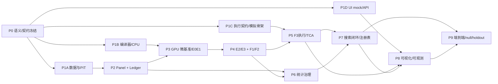

# 13 工程阶段、工作包、分工与集成门

版本：1.1-draft  
日期：2026-08-05  
文档性质：规范性  
主责：工程经理 + 架构负责人  
前置文档：01–12 文档  
主要消费者：所有实施团队  

外部依据编号见 `16_references.md`。原始 v1.0 文档为本次重构的需求基线。


## 证据与决策状态

本文档集不把尚未实现或尚未实测的内容伪装成事实。关键结论使用以下状态：

| 标记 | 含义 | 可否直接作为实现事实 |
|---|---|---|
| `VERIFIED-SOURCE` | 已由官方文档、标准或原始论文核验 | 可以，但仍需固定引用版本 |
| `VERIFIED-CALC` | 可由确定性算术、组合数学或数据规模直接推导 | 可以 |
| `DECISION` | 本项目已经选择的架构语义 | 可以，变更须走 ADR |
| `POLICY` | 项目阈值或治理规则，不是普适真理 | 可以配置，不得宣称外部有效性 |
| `TO-BENCHMARK` | 只能在目标 RTX 5070、驱动、CUDA 与操作系统组合上测得 | 不可以预填性能结论 |
| `TO-RESEARCH` | 证据不足或依赖尚未选定的数据源、市场、券商或交易所 | 不可以进入生产默认值 |

出现冲突时，优先级为：正式契约与 ADR > 本文档正文 > 示例代码。外部资料只证明其明确支持的事实，不自动证明本项目的设计阈值。


## 1. 切分原则

工作包以“独立验收的领域输出”为单位，不按文件或类切分。每个工作包必须有：输入契约、输出契约、fixture、错误模型、性能/正确性门槛和单一 owner。

## 2. 阶段 DAG



## 3. 工作包

### P0 语义与契约冻结

交付：Domain types、六份 Protobuf 契约、service RPC、ADR、golden fixtures、error codes、status tags。  
验收：所有团队可用 mock 独立开发；没有时间/单位/ID 双重定义。  
主责：架构 + 量化 + 数据 + 执行共同签字。

### P1A 数据采集与 PIT

交付：Raw/Normalized/PIT、instrument master、calendar、UniverseSnapshot。  
输入：Domain contracts。  
输出：可重放 normalized fixtures。  
主责：Data Team。

### P1B Expression + CPU Reference

交付：AST、type checker、canonical IDs、bytecode、CPU evaluator。  
输出：CompiledPlan 和 golden result。  
主责：Compiler Team。

### P1C Execution Core Skeleton

交付：PortfolioPolicy、OrderIntent、OrderEvent fold、B0 simulator、accounting invariants。  
可使用合成 SignalFrame，无需等待 GPU。  
主责：Execution Team。

### P1D UI Contract Prototype

交付：静态 mock、ReplayCursor、API shapes、图表组件 spike。  
不连接真实交易。  
主责：Frontend Team。

### P2 Panel Builder + Ledger

交付：PanelManifest、Artifact Store、DataQualityReport、Trial Ledger。  
主责：Data + Platform。

### P3 Target-machine Benchmark + E0/E1

交付：gpu-worker、memory manager、NVRTC spike、resource report、E0/E1 kernels。  
硬门：CPU differential、无意外 local memory、sanitizer。  
主责：GPU Team。

### P4 E2/E3 + F1/F2

交付：window scratch、exact rank、metric kernels、F1 aggregate、F2 daily series。  
主责：GPU + Evaluation。

### P5 F3 Portfolio/Execution/TCA

交付：score→target、B1/B2（按数据可用性）、cost accounting、TCA、capacity。  
主责：Execution + Evaluation。

### P6 Statistics Governance

交付：CPCV、DSR、trial count、sensitivity、stationary bootstrap、null replay harness、vintage manager。  
可用 CPU/fixture 先实现。  
主责：Statistics Team。

### P7 Search + Registry

交付：NSGA-II、MAP-Elites、SelectionView、FactorVersion、lifecycle。  
LLM 是可选子包，不阻塞核心。  
主责：Search + Platform。

### P8 Visualization + Observability

交付：Research Explorer、Execution Console、Operations dashboard、OTel instrumentation、replay。  
主责：Frontend + SRE。

### P9 End-to-end Release

交付：种植信号、null search、holdout enforcement、paper execution soak、性能基线和运行手册。  
主责：跨团队 release group。

## 4. 并行分工建议

P0 后立即并行：Data、Compiler/CPU、Execution Skeleton、UI Mock。GPU 依赖 Panel 和 CompiledPlan，但可用 fixtures 提前做 microbench。Statistics 可对 synthetic return matrix 独立实现。UI 使用 mock API，不等待数据库。

## 5. 团队边界

| Team | 拥有 | 不拥有 |
|---|---|---|
| Domain/Data | instrument/time/PIT/panel | AST、统计、订单 |
| Compiler/CPU | 算子与数学参考 | GPU allocator、搜索策略 |
| GPU | kernel/runtime/resources | 指标定义、数据库 |
| Evaluation/Stats | 指标与统计裁定 | 候选生成、真实订单 |
| Execution | target/order/fill/accounting/TCA | 因子表达式、DSR |
| Search/Registry | generation/selection/state | 指标重新计算 |
| Frontend/SRE | query/replay/telemetry | 交易事实写入 |

## 6. 模块大小控制

每个一级域有一个 owner；XL 域内部可让 2–4 个子组并行，但只公开一套契约。若一个工作包需要跨三个以上一级域同时改 schema，说明 P0 契约不足，应先 ADR，而不是在实现中临时耦合。

建议 PR/交付单位：

- 一个 contract change + compatibility tests；
- 一个可独立运行的 component + fixture；
- 一个端到端 vertical slice；
- 不以“完成整个 GPU 模块”作为单次交付。

## 7. 集成门

```text
Gate A: Domain/Contract freeze
Gate B: CPU/Data golden
Gate C: GPU correctness/resource
Gate D: F1/F2 statistical semantics
Gate E: Execution/accounting invariants
Gate F: Trial counting/holdout enforcement
Gate G: UI/API numeric consistency
Gate H: Paper/null/target-machine release
```

任何 gate 未通过，后续模块可以继续用 mock 开发，但不能宣布集成完成。
